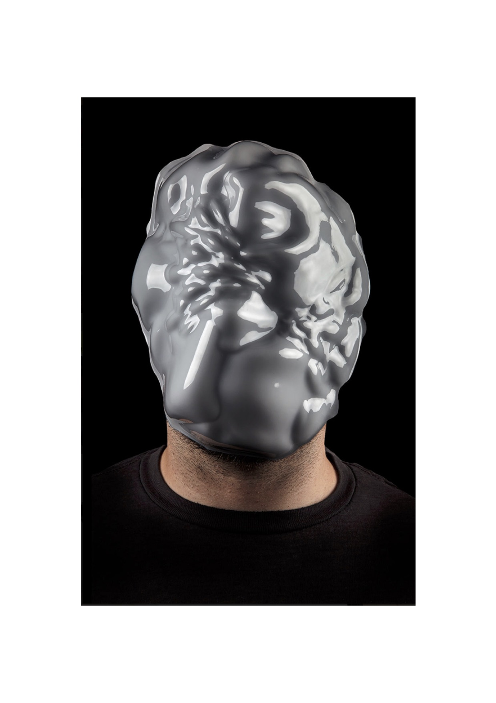
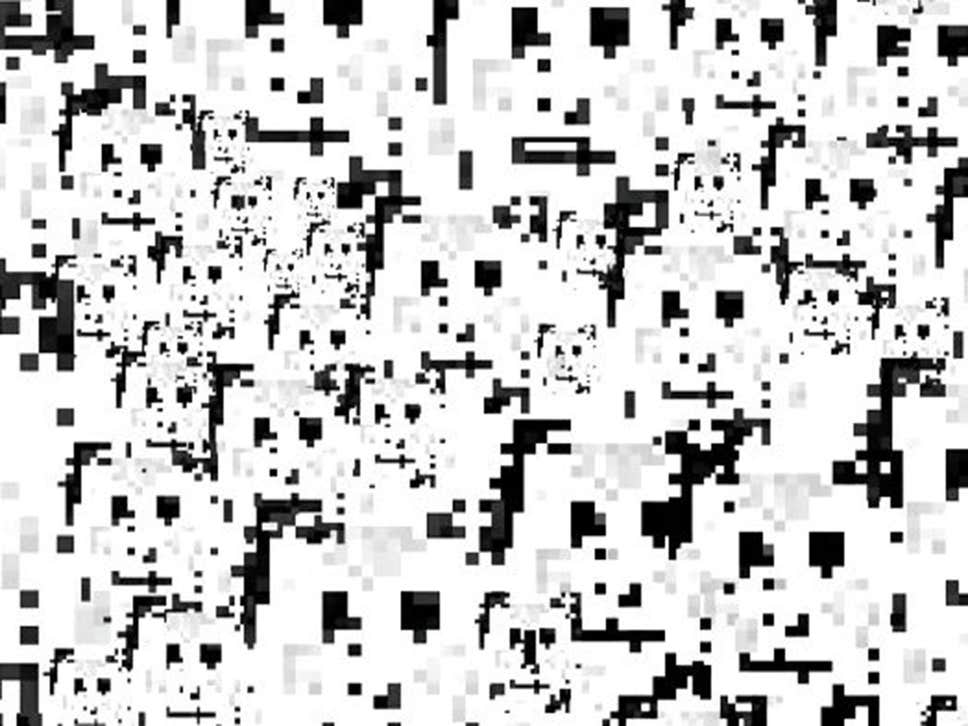

---
Pr-id: Algorithmic Anxiety: A Kierkegaardian Inquiry into the Imaginary of Possibility
P-id: Theory on Demand
A-id: 32
Type: article
Book-type: anthology
Anthology item: article
Item-id: 02
Article-title: chapter 2
Article-status: accepted
Author: Patricia de Vries
Rights: CC BY-NC 4.0
...

# 2. Masked and Camouflaged: Thwarting Off Facial Recognition Algorithms, or The Possibility of Self

> But, of course, \[…\] we do not “own” the facts of our lives at all.
> 
> This ownership passes out of our hands at birth, at the moment we are first observed.
>
> — Janet Malcolm, *The Silent Woman*

## Introduction[^ch02_1]

An ‘anti-facial recognition movement is on the rise’, writes Joseph Cox
for *The Kernel*.[^ch02_2] It is perhaps premature to speak of a ‘movement’,
but indeed a number of artists have expressed anxiety about the alleged
ubiquitous implementation and dissemination of facial and identity
recognition technologies. In particular, masks and camouflage wear have
emerged as a response to facial recognition technology. They are
exhibited in international art shows, both as art and design projects
and as a socio-technical commentary. Some masks and camouflage wear are
also commercially available as gear that provides access to potentially
subversive modalities of being public; they are sold with the promise
that they undercut or confuse facial recognition algorithms online and
offline. In the following, I explore the concept of algorithmic anxiety
through artistic mask and camouflage design.

Masks and stealth wear are popular attempts to avoid algorithmic anxiety
created by facial recognition systems. Masks, umbrellas, goggles, veils,
and balaclavas are common occurrences in exhibitions on algorithmic
culture. Within this imaginary, artists adopt a language and strategies
of field exploration and couple individual rights claims with guerrilla
and ‘reconquistador’ approaches. In this chapter, I will focus on the
ways in which the artists Zach Blas, Adam Harvey, and Sterling Crispin
critique forms of algorithmic governance manifested by facial
recognition technologies. The work of these three artists has been
widely exhibited in museums, galleries, art institutions, and at
festivals and conferences in Europe, the U.S., and the U.K. and each of
these projects have garnered a fair deal of media attention in the
international press and by magazines and blogs that discuss digital
media culture. Each of these projects is specifically aimed at facial
recognition technology — which differs from other mask projects, which
tend to engage with online and offline anonymity, with privacy in
relation to political activism, and/or with data-mining in general.[^ch02_3]
More often than not, the work of these artists is framed as an artistic
response to surveillance — or, as counter-surveillance strategies.

As Alexander Galloway puts it:

> We are witnessing a rise in the politicization of absence- and
> presence-oriented themes such as invisibility, opacity, and anonymity,
> or the relationship between identification and legibility, or the
> tactics of nonexistence and disappearance.[^ch02_4]

Galloway calls this politicization of absence the ‘black-boxing of the
self’.[^ch02_5] In this chapter, however, mask and camouflage projects are
explored as different responses to algorithmic anxiety, exploring the
future self in relation to the dissemination of the algorithmic facial
recognition systems which have become characteristic of algorithmic
culture. Why take the route of concealment strategies? What imperatives
shape and underpin these designs? What forms of relating to facial
recognition technology does this approach privilege? Algorithmic anxiety
in relation to facial recognition technologies revolves around the
position of the self in algorithmic culture and around the face as
understood as an index of humanity. Masks and camouflage art practices
question the affordances of algorithmic governance by way of facial
recognition technologies, focusing on a self who is immersed in a regime
of visibility that itself remains mostly invisible. Questions concerning
the understanding of the self in relation this regime of visibility will
be the focus of this analysis. I propose that a relational assessment of
the concepts of masks and camouflage wear allows for a better
understanding of the algorithmic anxieties around facial recognition
systems.

## Capturing the Face Anxiety

Ever since the portrait photography of Ellis Island immigrants by
Dorothea Lang, Walker Evans, Arthur Rothstein and Gordon Parks, the face
has undeniably become a political landscape in the arts. In a way, the
mask and camouflage projects that form the subject of this chapter
constitute a reversal of the classic artistic tradition of portraiture
and of the latest craze in the selfie culture. It also twists what Mark
B.N. Hansen dubbed the ‘digital-facial-image’ (DFI), with which he
described a trend in contemporary art that focused on the digitally
generated face. Leaning on the work of Félix Guattari and Gilles Deleuze
and their concepts of faciality and the face machine, Hansen proposed
his notion of DFI as ‘a new paradigm’ in contemporary art.[^ch02_6] These
days, it seems, artists and designers are more focused on attempts to
derail the technologies that aim to capture the face by hiding faces,
covering them up, or rendering them unrecognizable to facial recognition
technology. Artists use low-tech, no-tech and various forms of
technological engineering in developing face masks and camouflage wear
both as forms of critique and as responses to the possible effects
facial recognition technologies may have on people and society when
operated by the state or by tech giants. What these different art
projects show is not just that the technology that underpins facial
recognition algorithms is fallible. The different machinations of
faciality outlined below — as a singular, unique, personal and
identifiable security-check, as the imposition of a political norm, as
collective empowerment, as a plural, multiform, malleable and amendable
canvas, as a means to play with identity, similarity and difference, and
as a source of data extraction — indicate that supra-individual cultural
narratives and concerns about policing and governance are braided around
the algorithmic capture of the face.

Examples are numerous. The artist and designer Mark Shepherd developed
*The Sentient City Survival Kit* (2010)*.* The artefacts of this kit
include a CCD-Me-Not umbrella equipped with LED lights that defuses
recognition technology used in CCTV cameras. Two years later, in 2012,
researchers at the National Institute of Informatics in Tokyo presented
what they named privacy goggles. The glasses are fitted out with
infrared light sources that, when on, confuse CCTV cameras equipped with
facial recognition software — reportedly without impairing your vision.
Inspired by these privacy goggles, the artist Ewa Novak designed what
she describes as face jewelry, which won her the Mazda Design Award in
Łódź in 2019. This jewelry is made of brass and looks
like topsy-turvy glasses with brass ovals that hang below the eyes. In
2016, researchers from Carnegie Mellon University presented a pattern
for spectacle frames meant to throw state-of-the-art facial recognition
software off-trail.

Low-tech camouflage gadgets have been taken up too, with the specific
aim of preventing face detection on the streets and online. With
*PIXELHEAD* (2012), the German artist Martin Backes designed a balaclava
in camouflage style. It ‘acts as media camouflage’ and is meant to offer
‘anonymity in the Internet era’ by making facial recognition
impossible.[^ch02_7] On his website, Backes notes that he is worried about
the social consequences of facial recognition technology and, in
particular, that anonymity will lose its meaning on the internet.[^ch02_8]
*Realface Glamouflag*e (2013) is a collection of T-shirts designed by
Simone C. Niquille. The pattern on the shirts is composed of a collage
of celebrity impersonators and pirated portraits used for fake social
media accounts which reportedly confuse facial recognition technology.
Adam Harvey’s *CV Dazzle* (2012) uses camouflage makeup to obstruct
face-detection technology. The term ‘dazzle’ refers to a painting
technique that was used on warships during World War I. The stripes and
bold colors of this technique were designed to disrupt the outline of a
ship. Dazzling made it difficult for an enemy ship to detect a ship's
size, range, and direction at sea. Inspired by this technique, Harvey's
*CV Dazzle* makeup design disrupts detection by facial recognition
algorithms by dazzling facial features. The project is part of his
larger project, *The Privacy Gift Shop* (2012), an e-commerce platform
for counter-surveillance gadgets mainly aimed at subverting national
security technology and meant to ‘minimise or degrade the useful
information received by the observer’.[^ch02_9] He explains in an interview
with the BBC that what motivated this work is that he feels that
somebody is watching him in his day to day activities, ‘that you always
have a chaperone’, someone who looks over your shoulder.[^ch02_10] His
project was featured in *The New York Times* and his dazzling
makeup was applied to visitors of TransCyberian, Parisian hacker-run
noise parties that would also teach visitors about online security.[^ch02_11] [^ch02_12] A comparable anti-facial recognition makeup design was launched in 2017 by Grigory Bakunov, director of technology distribution at Yandex, a
Russian tech giant.

In recent years, a variety of face masks have entered the exhibition
space of museums. An often-exhibited anti-facial recognition mask is
Zach Blas’s *Face Cages* (2013-2016). In this work, Blas fabricated face
masks that resemble iron muzzles based on the shape of biometric
diagrams, evoking resonances with prison bars, the Scold’s Bridle, and
torture devices used during slavery in the U.S. and in the Medieval
period in Europe. His *Face Cages* have been on display throughout
Europe, for example in the two-part exhibition in Vienna and Amsterdam
titled *FACELESS* — which also showed work of Adam Harvey. *FACELESS*
focused on hidden faces in contemporary art since 9/11 and thematized
issues such as ‘privacy, the burka, data-collection, terrorism,
etc.’.[^ch02_13] Furthermore, the past decade witnessed protest movements
whose signature is a face mask used both to avoid face detection
technology and as a way to express collective belonging and
togetherness. Prominent examples include the Guy Fawkes masks used by
Anonymous and worn during public protests by the Occupy Wall Street
movement; the colorful knitted balaclavas of the Russian punk protest
group Pussy Riot; and the black balaclavas of the Zapatista Army of
National Liberation.

That the face, masks and camouflage figure so prominently in exhibitions
is likely because these projects illuminate the ways algorithmic
technologies (re)configure identity and subjectivity. The face plays a
central role in human interaction.[^ch02_14] [^ch02_15] For this reason,
communicative interaction in physical presence is often described as
talking ‘face-to-face’ — a concept extended by platforms such as Skype
and FaceTime. Interaction, as Erving Goffman has famously said, is
always also about avoiding being ‘in wrong face’ or ‘being out of face’,
and about ‘saving face’. What he calls maintenance of face is a
condition of human interaction, and what he terms face work — namely
‘the actions taken by a person to make whatever he is doing consistent
with face’ — is a key part of any interaction.[^ch02_16] Goffman thus uses
‘face’ in a relational sense, defining it as ‘the positive social value
a person effectively claims for himself by the line others assume he has
taken during a particular contact. Face is an image of self delineated
in terms of approved social attributes’.[^ch02_17]

Because of this centrality of the face in interaction, it is at the same
time an ambiguous phenomenon: it is both a screen that permits an
assumed internal state to be seen and a cloak that conceals, as when
secrets are hidden behind a straight face.[^ch02_18] [^ch02_19]

## The Self Entangled with Algorithms 

The face is also vital in Kierkegaard's relational conception of the
self. Kierkegaard's understanding of the face in relation to his notion
of the self as a relational synthesis helps to better understand the
constituents of the anxieties evoked by face recognition technology. In
*The Concept of Anxiety,* he explains that in the experience of anxiety
one becomes aware that one exists in relation: to our body, to our
surroundings, our family, our past and future, the nation we inhabit,
its culture, and the entire history of humankind.[^ch02_20] The self is a
synthesis, Kierkegaard writes, and this synthesis is a relation.[^ch02_21] In
*The Sickness unto Death*, Kierkegaard explains that the self as a
relational synthesis is composed of contrasting elements: temporality
and eternity, freedom and necessity and infinitude and finitude.[^ch02_22]
The task is to think these contrasting elements together, to actualize
them together, in a never-ending process of becoming.

Importantly, what such a relational understanding implies is that the
self is not autonomous. Kierkegaard writes:

> the self is a relation that relates itself to itself or is the
> relation’s relating itself to itself in the relation; the self is not
> the relation but is the relation’s relating itself to itself to and in
> relating itself to itself \[…\] The human self is such derived, established
> relation, a relation that relates itself to itself and in relating to
> itself it relates to another.[^ch02_23]

Again and again, Kierkegaard stresses the importance of the self’s
relation to itself, to its limitations and possibilities. As we are
relational beings, we are not wholly transparent to ourselves, nor to
others, neither are others to us. We always stand in relation to
something “other.” In *Either/Or* he describes this ‘something’ as follows:

> When you look long and attentively at a face, you sometimes discover
> that it is as if there were another face within the one you see. This
> is in general an unmistakable sign that the soul conceals an emigrant
> who has withdrawn from the outside world to watch over a hidden
> treasure, and the direction observation must take is intimated by the
> way one face lies as though inside the other.[^ch02_24]

A face, as Kierkegaard describes here, assumes here ‘an ambiguity’, in that it carries another face.[^ch02_25] A face, understood this way, is always-already masked. According to Kierkegaard,
situations that evoke anxiety are undetermined, vague, and ambiguous.
Thus this ‘otherness within’, this ‘hidden secret’ to which we stand in
relation and of which we have no knowledge, can condition anxiety. The
question, for Kierkegaard, is how one relates to such ambiguities; that
is, the question is how do we relate to being, in part, a stranger to
ourselves. Algorithmic anxiety is more than an experience of uncertainty
and a lack of control in the face of algorithms.[^ch02_26] It seems instead a
more existential anxiety that pertains to the inability to fully
understand or know the self. Algorithmic anxiety flares up when
conceptions of subjectivity are perceived to be challenged by the
capture of the face by facial recognition algorithms. This challenge, it
seems, is posed by the access facial recognition systems are assumed to
have to one's ‘hidden treasure’. Which is to say, it is anxiety
concerning the relations to whom and what subjects constitute
themselves. It concerns who participate and to what extent in crafting
observations, relations, and accounts of the self, and at what
consequences, in terms of the affordances of technologies and the
possibilities of subjectivity it might bring about.

## Algorithmic Anxiety: Anti-Facial Recognition Masks & Camouflage

Recognition algorithms are imagined to ‘do’ something with the ‘self’.
The question is *what* they are presumed to do and *how* they are
imagined to do so. Three prominent and often-exhibited artistic
portrayals of facial recognition algorithms provide a point of entry
into the different ways the relation to facial recognition algorithms
and the anxieties surrounding the possibilities of what these algorithms
might do and what might become of the self are imagined. What is at
stake is an ambiguous relation of the self in relation to itself and to
facial recognition systems.

Artist and scholar Zach Blas’s series of mask projects are designed to
visualize how identity recognition technology analyses human faces
whilst also resisting identity recognition technology by offering an
undetectable face masks. His *Facial Weaponisation Suite* (2012-2014)
comprises a series of amorphous collective masks designed and produced
during community workshops by at LGBTQI+ and minority groups. They are a
form of resistance against facial recognition technologies and the
inequalities these technologies normalize. These masks, by virtue of
their shape and cryptographic material, will not be recognized as a face
by identity recognition software. Identity recognition technology, as
Blas sees it, ‘control\[s\] through an optical logic of making visible’
to ‘police and criminalize populations all over the world’.[^ch02_27] These
technologies, he argues, produce standards ‘to account for human
life’.[^ch02_28] Data-mining algorithms require normalizing techniques for
indexing human activity and identity, which then operate as standard
templates for regulation, management, and governance.[^ch02_29] Models that
account for what is ‘normal’ and what defies ‘the normal’. His masks
represent a resistance to what he calls ‘informatic visibility’, which
he argues is reducing us to mere ‘aggregates of data’.[^ch02_30] Informatic
standardizations, in turn, produce a conception of the human ‘as that
which is fully measurable, quantifiable, and knowable — that is,
informatically visible — an enterprise that undoubtedly accelerates a
neoliberal agenda’.[^ch02_31] One mask in his suite, *Fag Face Mask* responds
to scientific studies that claim to be able to determine sexual
orientation on the basis of facial recognition technologies.[^ch02_32] Blas
is worried about the development and implementation of facial
recognition systems will exacerbate social inequalities, affecting
minority groups in society in particular.

Figure 1: An example of a face mask created
by artist Zach Blas.

Technologist and artist Adam Harvey has a different approach. With
*HyperFace* (2017), he designed camouflage couture which aims to confuse
facial recognition systems. His couture does so by presenting these
systems with countless false positives. *HyperFace* is a textile print
that identity recognition technology detects as a face. The patterns are
based on ideal-type models of algorithmic representations of a human
face. *HyperFace*, he explains, is ‘a new kind of camouflage that aims
to reduce the confidence score of facial detection and recognition by
providing false faces that distract computer vision algorithms’.[^ch02_33] He
continues: ‘\[It\] aims to alter the surrounding area \[and\] offers a
higher confidence score for a false face by exploiting a default in
specific algorithmic systems for the highest confidence score’.[^ch02_34]

*HyperFace* reduces the confidence score of the real face by redirecting
more attention to the nearby false face regions. Harvey states that his
projects are motivated by concerns about how computer vision will be
used ‘to extract knowledge without the cooperation or consent of an
individual’[^ch02_35] and that facial recognition technology specifically
‘poses a significant threat to privacy and liberty, but their
vulnerabilities and imperfections also present a largely unexplored
array of opportunities to reimagine appearance in the age of computer
vision’.[^ch02_36]

Figure 2: An example of a Hyperface pattern, created by artist Adam
Harvey.

The artist and technologist Sterling Crispin is concerned about the
future effects recognition technology may have on humanity as a whole.
He states: ‘I am concerned with the aggressive overdevelopment of
surveillance technology and how this is changing human identity and how
human identity interacts with technology.’[^ch02_37] His *Data-Masks*
(2013-2015) are 3-D printed face masks that visualize what robust,
model-based recognition and detection algorithms recognize and detect as
a face — or what passes as a face. They have been produced by reverse
engineering facial recognition and detection algorithms. In his own
words, ‘they show the machine what it’s looking for’; they hold up a
mirror to the machine.[^ch02_38] His *Data-Masks* are meant to make visible
aspects of what Crispin understands as invisible power structures:
‘*Data-masks* are animistic deities, brought out of the algorithmic
spirit-world of the machine and into our material world, ready to tell
us their secrets or warn us of what's to come.’[^ch02_39] Crispin writes
about how we are ‘always already being seen, watched and analyzed’ by
what he calls a ‘Technological Other, a global living super-organism’
that is ‘peering into our bodies’.[^ch02_40]

Figure 3: An example of a Data-Mask created
by artist Sterling Crispin.

For Blas, facial recognition propagates standardization of behavior and
appearance, which he worries might single out minority and worsen the
position of minority groups in society. Harvey is concerned mostly by
the unknown ends to which recognition systems might be used in the near
future and how this might impinge on hard-won liberties. And Crispin is
anxious about the possible ‘Frankenstein-effect’ he sees facial
recognition systems to be a part of. The implications of facial
recognition technology are by the account of the artists understood in
relation to possible ‘ends’ of privacy, liberty, and humanity. Facial
recognition technology is given significance in relation to these
supposed ends. It is these ends that give meaning to these technologies
as a means in the present. Thinking in terms of ends provides
orientation and direction, like a map: ‘We are here now, we came from
there, and this is where we are going.’ This urge to locate, to position
yourself in relation to a trajectory while simultaneously placing
yourself outside of it or hovering above it, as if perusing a map, can
be understood as the desire to look into the future to know what lies
ahead and see where things are going to, perhaps in an attempt to
deflect anxiety about the future. These masks and camouflage projects
can also be used to re-think the self as a relational synthesis. These
artworks bring the relationally of the self to the fore, and function as
mediation in the relations between the self, the face, data
algorithmically extracted from facial image and more abstract notions
and preoccupations about the future of algorithmic culture for
humankind.

## Camouflage and the Face Mask: Concepts of Relational Entanglement 

Anxiety about the future disposition of the self and humanity in
relation to facial recognition technology is assuaged by becoming
unrecognizable and by concealment, in becoming undetectable and
unidentifiable to identity recognition technology by way of masking and
camouflage. Blas, Harvey, and Crispin maintain that one can undermine
being captured by recognition technology by becoming unrecognizable to
it. This raises the question of what concept of relationality and
entanglement is operative in the deployment of masks and camouflage by
the artists discussed here. To answer that, it's necessary first to
explore how camouflage and masks have historically been one of the
primary media through which subjectivities have been cultivated.

Harvey's *Hyper-Face* plays with the concept of guerrilla-style
camouflage. Camouflage is here not a form of invisibility; it is first
and foremost a way of unrecognizability. Tactics of disappearing from
algorithmic vision are mobilized as a countermeasure to the anxiety
facial recognition algorithms induce. In *Hide and Seek: Camouflage,
Photography, and the Media of Reconnaissance*, Hannah Rose Shell argues
that camouflage is a way of ‘not showing up’, to appear to disappear, to
recede into the background, to become invisible.[^ch02_41] The objective is
to minimize the difference between figure and ground, object and
environment. Camouflage involves both revealing and concealing.[^ch02_42] It
is thus a tactic of invisibility through visibility. This play between
the visible and the invisible in camouflage displays its entanglement
with both art and warfare, as both share the desire to explore the
limits of vision and, importantly, the entanglement of a subject with
its socio-technical environment. Shell recounts how different historical
forms of camouflage were developed in tandem with artists, using
different media from painting to film.[^ch02_43] What all forms of camouflage
have in common is the shared concern with the blurring of boundaries
between self and environment. Likewise, contemporary army uniforms are
camouflaged as to be ‘disruptive’:

> Their \[…\] purpose is to make it difficult for the eye to discern the
> edges and contours of the wearer's form. They are designed not to look
> like bark, grass and leaves which is the paradigm of the old
> camouflage, but rather to dissolve into formless dapples of detritus,
> light and shadow.[^ch02_44]

Thus, both in traditional forms of camouflage and in the contemporary
artistic camouflage forms described here, camouflage is aimed at
blurring boundaries: the point of giving off bark and leaves was always
to blur the boundary between self and environment, to escape from vision
by an adversary or some medium of capture. Camouflage is as much a
concept of entanglement as it is of concealment.

This, too, follows Roger Caillois's classic description of camouflage.
Writing about mimicry and legendary psychasthenia, Caillois discussed
camouflage as the loss of boundaries of the self in terms of natural
phenomena of concealment, noting, in particular, a form of
‘depersonalization’ by assimilation to space.[^ch02_45] Camouflage always
concerns a desire to escape from vision by something or someone, and a
play with relations between self, environment and a medium of
perception. At the same time, as Hannah Rose Shell notes, camouflage is
‘a form of cultivated subjectivity’.[^ch02_46] Seen in this light, Harvey's
*Hyper-Face* depersonalizes the face while it simultaneously cultivates
subjectivity.

Face masks too have historically been among the primary media through
which subjectivities have been cultivated. In fact, the concept of
person comes from the Latin *persona*, denoting a theatrical mask. Less
well known is that *persona* is a more complex concept altogether. It
signifies *movement* and sound, a sounding through the face, literally a
form of *per sonare*. The theatrical concept of the *persona* stands for
both the mask and for the part played, but also for the face. Masks gain
their connotations of ingenuity and antithetical to true, interior
identities from later medieval, interpretations.[^ch02_47] These connotations
can still be found in the English language in expressions like ‘to show
your true face’, ‘put on a brave face’, and in the verb ‘unmask’. In
Greek physical theatre, for example, masks symbolized a particular
character, as masks transfix facial expressions, they divert attention
from the face to the body, to its composure, how it moves around in
space. In physical theatre, where the emphasis is laid on the embodiment
of the narrative and on imagining narrative spaces through the body, the
expressive face is seen as a possible distraction and obstacle to that
end.

Japanese conceptions of masks, known for instance in *No* and *Kabuki*
plays, have been discussed as much more complicated than simply the
concealment of an interior self. Sakabe Megumi has for instance noted
that in Yamato Japanese, the word for mask and for face was one and the
same: *omote*. And, he argues, the related notion of *omo-zashi* (the
features of the face) makes clear that this conception of the face is
always already relational as it involves both that which is seen by the
other and that which sees itself. According to Megumi, ‘*omote* is
evidently the structure of the mask \[…\] but at the same time it is
also the structure of the face. The reason is that the face also is what
is seen by the other, what sees itself, and what sees itself as an
other’.[^ch02_48]

Crucially, *omote* refers to the structure of a surface, but a surface
without an original. Its relationality pertains not to hypostatized
‘personal’ selves, but to a surface play of reflections. Discussing
animal masks among Inuit and Yup'ik people of Alaska, Tim Ingold notes
that ‘there is no face peering out from behind the mask. In effect, the
identity of the human mask-bearer is not so much disguised as displaced
by the mask he carries.’[^ch02_49] Here a synthesis comes into view: the
self-as-other. This self-as-other becomes literal and concrete in
Crispin's *Data-Masks* and Blas's *Facial Weaponization Suite*, as both
their series of masks have been modelled from aggregated facial data.
The pink amorphous blob of his *Facial Weaponisation* series, for
instance, has been generated from the data of the faces of participants
that attended the community workshops that Blas organized and who
self-identified as gay; the black masks by the aggregated data of
participants who self-identified as black. This presenting of the
self-as-other(s) is here a tactic of unrecognizability. It raises the
question: To what power do they desire to become unrecognizable?

## Black Boxing the Self

Kathryn Schulz writes: ‘\[T\]he dream of invisibility is not about
attaining power but escaping it.’[^ch02_50] According to the campaigns of
many social movements of the past sixty years, visibility — in the form
of recognition of identity — is a precondition for emancipation and thus
representation and power. For these artists, however, invisibility is
less of a condition to be overcome — of disempowerment — and more a
precondition of the possibility of empowerment. Where identity and
recognition politics are traditionally about becoming recognized and
visible — as visibility and recognition is the privilege of the white
male and dominant class — here, unrecognizability is regarded as
politically empowering. Obviously, the shapes and patterns that subvert
algorithmic detection through masks and textile are hyper-visible,
making you stand out in a crowd. It then seems ironic that these
hyper-visible camouflage projects are designed by white, Western,
tech-savvy, educated men: an already highly recognized and visible
identity. Within these artworks, however, being visible and recognizable
has to do with automated administration with technological detection,
with being monitored, pinpointed, and identified in the interest of
others. This time it is a strategy of personal control, an attempt to
opt-out of a so-conceived regime of visibility. From what do these
artists imagine to hide?

Algorithmic culture is associated with a police state, with classism and
racism, with a dehumanizing organism, and with being catalogued like a
proprietary object. What evokes anxiety is the possibility of
powerlessness, the possibility of being exposed, identified and
characterized, being surpassed and overpowered by a Technological Other,
being discriminated against and judged on the basis of numbers according
to set standards. Whether it is capitalism, asymmetric power relations,
or technological rationality, all three artists are anxious about
possible future scenarios of algorithmic identity recognition technology
and the disposition of the self therein and all three are interested in
creating ‘spaces’ of invisibility, opacity, or unrecognizability. With
his *Facial Weaponisation* masks, Blas aims to avoid becoming visible to
recognition technology, which he associates with the control and
policing of in particular minority groups. This controlling and
policing, he suggests, happens by way of data aggregation via
recognition technology. Harvey's *HyperFace* garment aims to prevent the
extraction of knowledge by means of recognition technology, which he
associates with a threat to privacy. And Crispin's *Data-Masks* aim to
visualize machine vision, a vision he associates with being ‘seen
through’ by a Technological Other. According to Crispin, ‘we live under
the shadow of a totalitarian police state’.[^ch02_51] He claims we are
‘witnessing the rise of a Globally Networked Technological Organism’
that will ‘exceed the human mind’, and that the ‘human is lost in all
this’.[^ch02_52] For Harvey, the problem is the ‘imbalance of power between
the surveillant and the surveilled \[sic\]’.[^ch02_53] It is the ‘ubiquitous
and unregulated profiling and cataloguing aspect’ of these
identification technologies that he considers a threat to privacy.[^ch02_54]
Blas fears that ‘the global standards’ recognition technology relies on
‘return us to the classist, racist, sexist scientific endeavors of the
nineteenth century’ and lead toward ‘Total Quantification’, annihilating
‘alterity’.[^ch02_55]

What do these zones of unrecognizability provide that otherwise is lost
to facial recognition systems? Harvey's camouflage projects claim to
provide ‘more control over your privacy’ by ‘protecting your data’.[^ch02_56]
Crispin caters to the supposed needs of protestors. His *Data-Masks* are
‘intended for use in acts of protest and civil disobedience’.[^ch02_57] They
are themselves ‘an act of political protest’ by means of ‘giving form to
an otherwise invisible network of control’.[^ch02_58] Blas sees his masks as
a tool in the tradition of collective protest movements like Anonymous,
the Zapatistas and Pussy Riot: ‘\[f\]acelessness and becoming
imperceptible are serious threats to the state and capitalism’, Blas
claims in a video Communiqué.[^ch02_59] He calls for ‘radical exits that open
pathways to self-determination and autonomy’.[^ch02_60] It thus appears that,
to these artists, to be ‘seen’ is to be recognized, to be recognized is
to be analyzed and to be analyzed is to be reduced to information. This
information is, in turn, used by states and corporations as the primary
tool to gain and maintain power. This power is conceived as an influence
over one's decisions and behavior. Facial recognition technology
operated by capitalist and state powers is associated with a form of
mediated and remote influence on one's behavior.[^ch02_61] This
technologically mediated influence is considered a form of direct
interference in and infiltration into the core of what makes for a
person: independent ownership of its decisions and behavior, which have
to be guarded and protected from this kind of meddling. It seems as if
facial recognition technology operated by states and corporations is
associated with having access to Kierkegaard's emigrant who hides in
one's soul. These fears of ‘decision-intrusion’, of being influenced in
one's decision-making by outside forces that operate according to their
own, and seemingly opposed, interests, suggests the susceptibility of
the mind and its dwindling agency in the face of algorithmic capture of
the face.[^ch02_62] This view is not far ahead of positions on algorithms
selves discussed in Chapter 1.

Described in the above are anxieties about the effects of algorithmic
biopolitics, or the disciplinary governing of people by way of an
algorithmic logic of cost-reduction, calculations, measurements,
comparison, and evaluation, which is indicative of a particular
understanding of the self and a specific understanding of facial
recognition algorithms. It is feared that employed in a certain way, the
alleged power of algorithms may nudge people into amiable, docile tools
for those in whose interests recognition technology systems operate. The
biopower ascribed to facial recognition systems flows from its
collecting and using of information to which the captured face gives
access. The form of biopower that information collection exerts is
imagined in different ways. Blas fears an algorithmic culture in which
LGBTQI+ minority groups are targeted, excluded, and treated with
indifference. Harvey fears being itemized, listed, and valued only in
relation to the data that can be extracted and collected from his walks
of life in the interests of profit or power for others. Crispin's fears
the loss of authority, being ineffectual and being objectified by
another organism that has no concern for who he is. He argues that these
networked systems ‘see human beings as abstract things, patterns, and
numbers, not as individual people whose lives matter’.[^ch02_63]

Algorithmic anxiety in relation to facial recognition technology shares
characteristics with dystopian technological narratives. Wendy Chun
observes:

> \[P\]aranoid narratives of Big Brother's all-seeing and all-archiving
> eye are similarly agoraphobic. They too mark as ideal noninvasive,
> happy spaces \[…\] The info-paranoid respond to the current 'public'
> infrastructure \[…\] by creating private (that is, secret) spaces or
> cloaks, within which they hope to be invisible.[^ch02_64]

These artists seem to suggest that to safeguard the self from the
all-seeing and all-archiving eye of algorithmic culture, what is needed
is to thwart facial recognition technology. Indeed, such an imagination,
as Hans Harbers argues in another context, echoes ‘the endemic Romantic
narrative of despair of being overrun by a technological juggernaut,
which is guided only by instrumental values’.[^ch02_65] However, looking at
these works through a Kierkegaardian lens, a different narrative
emerges. It could be argued the despair of the artists lacks
possibility, or that it lacks a sense of the infinite. A person who
grounds itself in finitude, Kierkegaard explains, is overwhelmed by a
daunting sense of constriction and limitation. He writes, ‘the
determinist, the fatalist, is in despair \[...\] because for him
everything has become necessity’.[^ch02_66] A balance needs to be found
between a grounding in necessity and in the desire for
self-transcendence, in possibility. Moreover, the imagination is what
leads a person out into the infinite.[^ch02_67] Algorithmic anxiety is about
the position of the self towards the radical openness and unknowability
of the future and towards the regimes that attempt to close in on,
narrow, and delineate that future, which raises the question: How can we
strike a different balance between necessity and possibility?

## A Relational Choreography of Selves

What is at stake for these artists? Or rather, where lies their despair?
What does their despair lack? For Crispin and Harvey, algorithmic
identification technologies provide an entry point to corrupt and
inhibit what is considered to be a private and independent self, a self
that by way of these technologies risks to become objectified as a means
to unknown ends. Identity, understood as that part of the self where
autonomy and independence reside, is at stake to facial recognition
systems, Crispin and Harvey fear. Blas aims to provide ‘informatic
invisibility’ that aims to ‘open pathways to self-determination and
autonomy’ as ‘a means of resistance against the state and its identity
politics’.[^ch02_68] To resist the identity politics of the state is to defy
its social normalizing techniques for indexing, regulating and managing
human behavior that is ‘predetermined by a multifarious conglomerate of
corporate, military, and state interests’.[^ch02_69] Such a politics of
rubrics and disembodiment, Blas states, ‘always enact a politics of
reduction and exclusion’ and ‘annihilates opacity’.[^ch02_70]

Despair, Kierkegaard teaches us, is about lack and lack is about desire.
As much as these projects are about thwarting facial recognition
technology, they too allude to the desire of being included, valued, and
acknowledged — in short, a longing to be recognized and seen by others.
Algorithmic anxiety about the self is about the thin line between, the
desire to be noticed, to be seen, and the fear to be exposed, judged, or
to fall short. To be seen, as Audrey Lorde explains in a different
context, ‘is always fraught with danger \[…\] of contempt, of censure,
or some judgment, or recognition, of challenge, of annihilation. But
most of all, I think, we fear the visibility without which we cannot
truly live.’[^ch02_71] Lorde emphasizes the inherent vulnerability of the
relational self. Rather than an autonomous, independent, powerful
individual, the self in relation to algorithmic culture is experienced
as relational, dependent, vulnerable, malleable — at risk.

Considering these projects in more detail, tacitly but poignantly,
brings complex connections between software, self and environment to the
surface. These are connections that in a way, could be productively
understood to *remind* liberal subjects, produced under conditions of
the disavowal of their entangled being, of their relationality *and*
what they desire and lack. Through the play with masks and the
dissolving of self and environment, connections are made that mobilize a
critical perception of human and machine relations, opening up an
artistic space which challenges dominant understandings of a self and
allows for a different way of relating to algorithmic culture. Masks and
camouflage, as I argued above, always already presuppose entanglement.
Therefore, as Ingold notes, ‘the mask is not a disguise intended to hide
the identity of the bearer’.[^ch02_72] Rather, practices of masking and
camouflage intervene in the way the self becomes visible in relation to
the self, others, and to its environment in the first place. To avoid
being captured by recognition algorithms, camouflage provides a way to
vanish in the background to non-identity. In the triad between self,
environment and medium of capture, the self merges with its environment
to the effect that it cannot be captured.

The pattern design of *HyperFace* performs this triad on the fabric it
is printed on. The pattern keeps the face of its wearer unrecognizable
by way of modifying the immediate surroundings of the wearer's face. The
print designs flood or overwhelm recognition systems with false
positives, with false faces. Harvey's *HyperFace* could be considered as
a form of ‘depersonalization by assimilation to space’, as we noted
above, and as a way as to vanish in the crowd. Today, it has become
increasingly difficult to hide within the crowd: cityscapes are dotted
with state and corporate ‘gazes’ in the form of CCTV and security
cameras, recognition technologies, sensors, and monitors that assume
constant observation and identification in public space. *HyperFace*
provides its wearer with the condition of possibility to become a crowd.
By sauntering in the city wearing *HyperFace* textiles, it could be
argued Harvey ‘overturns the principle of being a citizen into a being
hiding from itself and losing himself in the crowd’.[^ch02_73] Or in the
words of Brecht: ‘Man does not become man again by stepping forth from
the masses but by sinking deeper into them.’[^ch02_74] For Brecht, an
individual belongs to several collectives and is therefore divisible.
This Brechtian divisibility is made explicit in the work of Harvey. The
individual wearer of Harvey's *HyperFace* couture presents itself to
recognition technologies as a crowd, representing an individual as a
multitude. We are in constantly changing situations in our lives,
Kierkegaard argues, but what does not change is the possibility to
relate to the possible in every situation instead of organising one's
life around a set of preconceived ideas, even when that situation is
limited, and room to maneuver seems nil.

Let us turn to Blas's *Facial Weaponisation* series. The aim of Blas's
masks is to provide ‘opacity’, a concept he derived from the poet
Édouard Glissant.[^ch02_75] Glissant famously asserted ‘the right to
opacity’.[^ch02_76] Here, opacity stands in contradistinction to the West's
‘old obsession’ with ‘discovering what lies at the bottom of natures’
and its ‘requirement for transparency’.[^ch02_77] Glissant contends that
‘opaqueness is to be opposed to any pseudo-humanist attempt to reduce us
to the scale of some universal value, to any imposition of universal
models on singularities’.[^ch02_78] Blas associates the ‘recognizing’ that
algorithmic facial recognition systems do with imposed transparency.
With his series of masks, Blas addresses who is made ‘informatically
visible’, pointing to the uneven rights and advantages enjoyed by some
and lacked by minority groups in society. Some faces cannot disappear in
a crowd; some faces are more vulnerable than others; some faces are
feared, criminalized, and instrumentalized before they are recognized by
algorithms. With this series, he attempts to ‘weaponize’ against imposed
transparency by offering the possibility to equip the face with a way of
opting out and escaping from the logic of the visible.

Blas's face masks represent the desire to ‘let exist as such that which
is immeasurable, unidentifiable nonidentifiable, and unintelligible in
things’.[^ch02_79] This *laissez exister* is imagined as a possibility which
is possible only in safe spaces that are free from intrusive
technologies of informatic visibility, or what he calls ‘autonomous
free-zones’: protected and closed-off areas. The ‘ideal of peace and
quiet’ is here produced by engaging masks as a weapon in combat against
an imagined and externalized influencing machine.[^ch02_80] However, it is by
virtue of this ‘free zone’ between humans and their technological environment
that the synthesis between the two is foregrounded. The possibility of
individual alterity and singularity — externalized and imagined as a
form of negative liberty — appears to stand in direct relation to, even
depends on and is tied to, face capturing technologies of imagined
capitalist and state-sanctioned standardization and universalization.
Any sense of autonomy is here due to others, to the network of people
and technologies we are part of and their dependencies. Kierkegaard
argued that people tend to identify themselves with preconceived ideas
about the self and others. He points to the dangers that lure when one
identifies the self with the idea of the self. The prisons of the mind
have been built by ‘what we think we know and what we think we are’ and
these prisons form an obstacle to freedom and possibility. Blas's
despair lacks infinity; the relationship to infinity has to be repeated
in the finite — by movement on the spot.

The problem of identifying the self with an ideal type of self is
addressed by Kierkegaard in *The Sickness unto Death.* The self is not a
substance, not a container of identity, Kierkegaard warns. He
illustrates his point with a story of a young man who lived by the
slogan ‘either Caesar or nothing’. When the young man doesn't become
Caesar, he is in deep despair. Kierkegaard explains that the boy is not
in despair over the fact that he did not become Caesar. He is in despair
over an idea he has over the self. He despairs himself understood as
*not*-Caesar. Had he not identified himself with this idea of the self —
the self as Caesar — there would be room for other ways to relate to the
self. In other words, the young man lacked necessity. In a similar vein,
it could be argued Crispin's *Data-Masks* are not about despair over an
encroaching Technological Other overriding humanity. Rather, he is in
despair over a certain idea he has of humanity in relation to large
abstractions conceived as not-Humanity, or outside of humanity. If he
did not have this idea — of humanity as severed from technological
others — there would be other ways to relate to the dissemination of
Technological Others aside from black-boxing the self. In a different
reading, his *Data-Masks* could be read as ways to ‘actualize’ the
virtual. His ‘deities’, as Crispin calls them, represent the
(pan)optical logic as a belief in ghosts. The ‘belief’ in recognition
technology and the data it spits out might very well turn out to be the
ghost of the twenty-first century. His *Data-Masks* conceal by way of
mirroring; his masks reflect back and ‘hold a mirror up to the
all-seeing eye of the digital-panopticon’.[^ch02_81] Invisibility understood
as unrecognizability is here achieved by way of swapping one's real face
with a model. What is reflected in the mirror Crispin holds up to
identity recognition technology is not Reality, but the Model. The gap between is reminiscent of Kierkegaard's description of seeing 'another face within the one you see'.

These different takes on facial recognition technology cast doubt on the
indexical relation between face capture and the self. Read along the
lines of Kierkegaard's conception of despair; they point to the burden
of identifying with and having fixed ideas about the self. In other
words, they point to the burden of despair as an imbalance or
mis-relation in the makeup of the self. In a Kierkegaardian sense, masks
and camouflage provide a space for a relational play with the self
between seeing and knowing and between knowledge and power; that space,
however, is not a vacuum, neither a free-zone, but a synthesis of
possibility and necessity. If the task is to think and do necessity and
possibility together, camouflage and masks design help to orient and
heed one's behavior towards possibility within a finite world. In
Kierkegaardian sense, these masks and camouflage projects could be
considered as a move towards possibility.

## Faces of Possibility 

The images we have of facial recognition algorithms and of our relation
to them show the importance of how we think of the self in relation to
broader abstractions. How we imagine the future of algorithmic culture
gives us an idea of how we think of the self. In *Subject Without a
Face*, Marcus Steinweg suggests:

> We need to learn to do without identity. We need to muster the courage
> to exist with more than merely a thousand faces; by comprehending that
> science is not everything. Life does not close in on itself. The
> circle is broken.[^ch02_82]

Instead of understanding the face as a gate-way to identity and identity
as something that we ‘are’, ‘have’, ‘posses’, or ‘own’, Steinweg argues
that we need to:

> \[U\]nderstand the self as a scene of continual self-exceedence \[…\]
> The play with masks, the dance of faces that dissolve into and replace
> each other, it is the movement of life in its opening up to other
> subjects. The face mediated between the Other and me. An excessive
> variety of possibilities.[^ch02_83]

Steinweg proposes an alternative understanding of identity; however, one
that lacks grounding in necessity. The self is not an object for one's
eyes, neither an excessive or fluid variety of limitless possibilities.
It is not merely contingent and inconsistent; it is also defined,
described, and limited. A relational understanding of the self allows
for an understanding of the self neither as a being nor as some fixed
substance. A relational understanding of the self asks not what the self
is, but how it comes to be and what it can do in different contexts and
settings.

Masks and camouflage may be understood as subverting the ‘tyranny’ of a
normative understanding of the self.[^ch02_84] They offer a subversive play
with relations between the public manifestation of the self, the viewing
of the self by the self and by an assumed (algorithmic) Other —
including the power relations in that space — and a relation to the
possible. Each individual self also affects the collective. Power
relations are key here. Although never absolute, the possibilities of
some faces seem limitless while those of others are strictly limited. As
Deleuze and Guattari argued, the face of power absorbs all real faces
and rejects the ones which it cannot assimilate, ordering them by
degrees of difference from the pure, ideal template of the face of
Christ in Western culture. As such, the face is not neutral, nor is it
the representation of the average white man; rather, it is the white man
himself.[^ch02_85] In this context, it includes the white woman, too. One
does not exist in a vacuum but in entanglement with others. Taken
together, Harvey's strategy of the collectivization of the individual,
Blas's facial weaponry which operate as a demonstration of entanglement
with facial recognition technologies, and Crispin's ghost-busting all
de-emphasize the individual symbolized by the face including the
assumptions of origin and instead foreground individuation and our
relational entanglement and alignment with others, our environment, and
with that which established and transcends the self and its environment.
Through these works, the self appears as a dynamic relation in the
synthesis between the virtual and the actual, the social and the
material, possibility and necessity.

Seen this way, the desire to isolate the self, for singularity and
insularity, and to be sealed off from one's surroundings is
co-constituted and inseparable from dependency and existential
uncertainty, it is inseparable from the desire to belong and be
recognized. To state it another way, algorithmic anxiety is a lack of
balance between a desire for autonomy, singularity and controlled
isolation, and a longing for a sense of belonging and existential
certainty, or to immerse oneself in a collective. It is the experience
of entanglement and the simultaneous experience of limited control over
one's future position in relation to algorithmic culture that triggers
anxiety and the desire for a closed-off space, a safe haven, a
demarcated line between ‘inside’ and ‘outside’. Algorithmic anxiety
triggers the desire for ‘an island unto himself; a place where he
controls his own world — a world of \[…\] security, safety and
privacy’.[^ch02_86]

However, emphasizing one side of the synthesis over the other,
emphasizing autonomy, independence and privacy, gives room to
algorithmic anxiety to rise like a wall. Facial recognition anxiety is
partly about stressing one's self as an individual, separate, and
therefore vulnerable entity. A relational understanding brings to the
fore that the self is not something one ‘has’ or ‘possesses’, nor the
sum of its rational decisions. Subjectivity takes place in a larger
whole of relations, immanent and transcendent. And by extension, the
self is not something that can be captured by facial recognition
technologies. The self is a relation of that which establishes relations
of self-relating, over which we and others have no control, but that
affect us nonetheless. The Kierkegaardian task is to think and actualize
together the contrasting elements around which the self coheres. Each
individual is tasked with a balancing act between these opposites, a
continual striving that is subject to constant change. The desire to
overpower facial recognition often conceals the desire to overpower the
self. It often masks the desire to be in possession of oneself and
overemphasizes the relation of the self towards facial recognition
technologies.

Any attempt to ostracize, deny or attempt to ‘plug’ one side of the
opposites that co-constitute the self is bound to end up in despair. In
fact, it is a lack of contingency, randomness, disorder, and blurred
borders that induces despair. Kierkegaard's subject is situated, aware
of its finitude and limited perspective, aware of its task to constantly
maneuver between the opposites that constitute the self, and aware of
the dangers both of uncritically situating itself complacently in a
normative society *and* of speaking above it, of assuming autonomy and
of avoiding responsibility. It is precisely indeterminacy and
uncertainty that allows for possibility, because that what is
ungraspable cannot be grasped or captured or quantified; nevertheless,
we stand in relation to it.

Designed to symbolize protection against and a critique of the perceived
intrusion, policing, and controlling powers of recognition technology,
masks and camouflage wear could be considered as offering an
interventionist play with the desire for a controlled environment, a
transparent space where the individual is in possession of itself and
has the final authority in the situations it is in in a context where
individuals are always already embedded and entangled in relations with
their socio-technical environment. What masks and camouflage wear offer
are an intervention in the form of a kind of re-balancing between
practices that circumscribe, pin down, enclose, and encircle the self
and those that move, open up, change and make fluid. They are about
offering possibilities to rebalance and struggle through the experience
of anxiety invoked by the vulnerability of ‘being seen’, when this is
understood as being seen for what you think you are, a self within the
self or the idea one has of the self, *and* by the notion of the self as
the scene of limitless self-exceeding. The ember of algorithmic anxiety
is stoked when we latch on to the idea that the individual is ‘the
creator of its own fortune, yes, the creator of itself’.[^ch02_87] Such
dwelling in finitude is what causes the self to be in despair, according
to Kierkegaard.

Kierkegaard saw the most significant threat and Achilles' heel in a
society of individuals which has lost the awareness of the limits of the
mind, in a society that declared the unknown dead and put reason on its
throne. Instead of assuming the underside of a dualism, instead of
defending the modernist abstraction of the Autonomous Subject,
camouflage and masking gesture to relations of mutual dependence,
embeddedness, situatedness, and entanglement. It is these inherent
contradictions and instability that gives way to possibility, of
relating otherwise, and of the multiplication of relations. The mask of
anonymity was traditionally used as a criticism of the self or in order
to liberate itself from the idea of the self. However, as Kierkegaard
reminds us, the self exceeds *the idea* of the self. It is by
de-emphasizing autonomy, identity, independence and transparency — and
in extension assumptions of originality — that possibilities of
relationality, collectivity, and collective belonging come into view
that could multiply avenues to work through algorithmic anxiety. The
full potential of the mask as a relational play between self and
environment would allow moving beyond hypostasizing conceptions of self
and technological others towards a ‘stylized repetition of acts’.[^ch02_88]
Repetition, as Kierkegaard conceives it, ‘is an indestructible garment
that fits closely and tenderly, neither binds nor sags \[…\] But whoever
fails to comprehend that life is a repetition, and that this constitutes
its beauty, condemns himself’.[^ch02_89]

Masks and camouflage may free us from algorithmic anxiety conditioned by
living one-sidedly as they allow for the positing of the self as a
synthesis in relation, offering a diffusion of subjectivity that opens
up ways of being, belonging, and aligning in algorithmic culture that is
not wedded to human-machine dualism, to the autonomous subject, or to
the uncritical acceptance of the logic of algorithmic regimes of
visibility. An opening to the possible arises from the realization that
one way to overcome facial recognition anxiety is to merge with others
and to lose the dearly held notion of the individual.

This chapter discussed artistic strategies of invisibility viz-a-viz
facial recognition technology. The next chapter discusses the popular
artistic imaginary of representing trading algorithms as an invisible
black box and the algorithmic anxieties and concomitant artistic
responses this evokes. It then moves to the spectral portrayals of
trading algorithms exemplified by Emma Charles's experimental video
artwork, *Fragments on Machines* (2013), and Femke Herregraven's *Pull
everything, pull everything* (2018). In different ways, Charles and
Herregraven focus on the entanglement of the material and the immaterial
and of past and present in their engagements with trading algorithms.
Doing so, they draw attention to the larger systemic context of risk
exploitation and financialization in which trading algorithms are
embedded and point to possible and unconventional interventions.

[^ch02_1]: This chapter is lightly revised from P. de Vries and W. Schinkel,
    ‘Algorithmic Anxiety: Masks and Camouflage in Artistic Imaginaries
    of Facial Recognition Algorithms’, *Big Data & Society*
    (2019): https://doi.org/10.1177/2053951719851532.

[^ch02_2]: J. Cox, ‘The Rise of the Anti-facial Recognition Movement’, *The
    Kernel*, 14 September 2014,
    http://kernelmag.dailydot.com/issue-sections/features-issue-sections/10247/anti-facial-recognition-movement/.

[^ch02_3]: Such as the hackers collective Anonymous, and the work of artists
    such as Mark Shepherd, Martin Backes, Kiri Dalena, Peter Weibel, and
    Ingrid Burrington, to name but a few.

[^ch02_4]: Galloway, ‘Black Box Black Bloc’, 224.

[^ch02_5]: Galloway, ‘Black Box Black Bloc’, 224.

[^ch02_6]: M.B.N. Hansen, ‘Affect as Medium, or the “Digital Facial Image”’,
    *Journal of Visual Culture* 2.2 (2003), 205.

[^ch02_7]: M. Backes, ‘PIXELHEAD’, clothing, 2012,
    http://www.martinbackes.com/portfolio/pixelhead/.

[^ch02_8]: Backes, ‘PIXELHEAD’.

[^ch02_9]: A. Harvey, ‘Adam Harvey: The Privacy Gift Shop’, in *Faceless:
    Re-inventing Privacy Through Subversive Media Strategies*, edited by
    B. Doringer and B. Felderer, Berlin: De Gruyter, 2018, 130.

[^ch02_10]: A. Harvey, ‘How to Hide from Surveillance’, *BBC*, 2014,
    https://www.bbc.com/news/av/technology-25914731/how-to-hide-from-surveillance.

[^ch02_11]: A. Harvey, ‘Face to Anti-Face’, *New York Times Sunday Review*,
    2013,
    http://www.nytimes.com/interactive/2013/12/14/opinion/sunday/20121215\_ANTIFACE\_OPART.html.

[^ch02_12]: B. Doringer and B. Felderer (eds) *Faceless: Re-inventing Privacy
    Through Subversive Media Strategies*, Berlin: De Gruyter, 2018, 12.

[^ch02_13]: Doringer and Felderer, *Faceless*, 8.

[^ch02_14]: D.A. Napier, *Masks, Transformation, and Paradox*, Berkeley, CA:
    University of California Press, 1986.

[^ch02_15]: T. Ingold, *The Perception of the Environment: Essays on
    Livelihood, Dwelling and Skill,* London: Routledge, 2000.

[^ch02_16]: E. Goffman, *Interaction Ritual: Essays on Face-to-Face
    Behavior,* Harmondsworth: Penguin, 1967, 12.

[^ch02_17]: Goffman, *Interaction Ritual*, 5.

[^ch02_18]: E. Goffman, *Frame Analysis: An Essay on the Organization of
    Experience,* Boston, MA: Northeastern University Press, 1974, 216.

[^ch02_19]: The face has been discussed thoroughly in philosophy, a history
    that I will not repeat here. Suffice to say perspectives vary
    greatly, ranging from the face understood as a repository of one’s
    essence to an ever-changing infinite possibility. As central to the
    encounter with the other, the face has been granted a key role in
    ethics, most famously in the work of Emmanuel Levinas who, like
    Goffman, considers the face not as a part of the body nor even as
    mere physical appearance, but rather as ‘the way in which the other
    presents himself, exceeding *the idea of the other in me*’. (E.
    Levinas, E. *Totality and Infinity: An Essay on Exteriority*,
    Pittsburgh, PA: Duquesne University Press, 1969, 50, italics in
    original.) Judith Butler has called attention to the politics of what
    she calls radical effacement, whereby certain people never appear in
    a normative or political register because they have been effectively
    effaced either through occlusion or through representation, which
    means that their suffering and death therefore become ungrieveable.
    (J. Butler, *Precarious Life: The Powers of Mourning and Violence*,
    London: Verso, 2004.) And Gilles Deleuze and Félix Guattari argue
    that the face, in its normative understanding, is a codified and
    rigid landscape of power whose meaning and subject does not depend
    on the singular faciality traits co-opted by it. The face is the
    constant effort to over-code the uncodeable. (G. Deleuze and F.
    Guattari, *A Thousand Plateaus: Capitalism and Schizophrenia*,
    Minneapolis: University of Minnesota Press, 1987, 186.)

[^ch02_20]: Kierkegaard, *The Concept of Anxiety,* 68.

[^ch02_21]: Kierkegaard, *The Concept of Anxiety,* 88.

[^ch02_22]: Kierkegaard, *The Sickness unto Death,* 30.

[^ch02_23]: Kierkegaard, *The Sickness unto Death,* 13-14.

[^ch02_24]: Kierkegaard, *Either/Or*, 469.

[^ch02_25]: Kierkegaard, *Either/Or,* 469.

[^ch02_26]: As in S. Jhaver, Y. Karpfen, and J. Antin, ‘Algorithmic Anxiety
    and Coping Strategies of Airbnb Hosts’, CHI, 2018,
    https://doi.org/10.1145/3173574.3173995.

[^ch02_27]: Z. Blas, ‘Informatic Opacity’, *The Journal of Aesthetics &
    Protest*, 9 (2014): http://www.joaap.org/issue9/zachblas.html.

[^ch02_28]: Z. Blas, ‘Informatic Opacity’, in *The Black Chamber:
    Surveillance, Paranoia, Invisibility & the Internet*, edited by B.
    Brusadin, E. Mattes, and D. Quaranta, Brescia and Ljubljana: Link
    Editions and Aksioma, 2016, 45.

[^ch02_29]: Blas, ‘Informatic Opacity’, 45.

[^ch02_30]: Blas, ‘Informatic Opacity’.

[^ch02_31]: Blas, ‘Informatic Opacity’, 45.

[^ch02_32]: Blas, ‘Informatic Opacity’.

[^ch02_33]: A. Harvey, ‘HyperFace’, 2017,
    https://ahprojects.com/projects/hyperface/.

[^ch02_34]: Harvey, ‘HyperFace’.

[^ch02_35]: G. Samuels, ‘Anti-surveillance Clothing Unveiled to Combat Facial
    Recognition Technology’, *The Independent*, 5 January 2017,
    http://www.independent.co.uk/news/science/anti-surveillance-clothing-facial-recognition-technology-hyperface-adam-harvey-berlin-facebookapple-a7511631.html.

[^ch02_36]: Harvey, ‘Adam Harvey’, 135.

[^ch02_37]: Crispin, as cited in Doringer and Felderer, *Faceless,* 83.

[^ch02_38]: S. Crispin, ‘Data-Masks: Biometric Surveillance Masks Evolving in
    the Gaze of the Technological Other’, MA Thesis, 2014,
    http://www.sterlingcrispin.com/Sterling\_Crispin\_Datamasks\_MS\_Thesis.pdf.

[^ch02_39]: S. Crispin, ‘Data-Masks’, *Sterling Crispin,* 2013,
    http://www.sterlingcrispin.com/data-masks.html.

[^ch02_40]: Crispin, ‘Data-Masks’.

[^ch02_41]: H.R. Shell, *Hide and Seek: Camouflage, Photography, and the
    Media of Reconnaissance,* New York, NY: Zone Books, 2012, 10.

[^ch02_42]: N. Leach, *Camouflage*, Cambridge, MA: MIT Press, 2006, 244.

[^ch02_43]: Shell, *Hide and Seek.*

[^ch02_44]: J. Swedberg, ‘Hide and seek’, *Industrial Fabric Products
    Review*, 92.9 (2007), 72.

[^ch02_45]: R. Caillois and J. Shepley, ‘Mimicry and Legendary
    Psychasthenia’, *October*, 31 (Winter 1984): 16-32.

[^ch02_46]: Shell, *Hide and Seek,* 19.

[^ch02_47]: Napier, *Masks, Transformation, and Paradox*, 6-9.

[^ch02_48]: S. Megumi, ‘Mask and Shadow in Japanese Culture: Implicit
    Ontology of Japanese Thought’, in *Modern Japanese Aesthetics: A
    Reader*, edited by M. Marra, Honolulu: University of Hawai‘I Press,
    1999, 245.

[^ch02_49]: Ingold, *The Perception of the Environment*, 124.

[^ch02_50]: K. Schulz, ‘Sight Unseen: The Hows and Whys of Invisibility’,
    *The New Yorker,* 13 April 2015,
    http://www.newyorker.com/magazine/2015/04/13/sight-unseen-criticat-large-kathryn-schulz.

[^ch02_51]: Crispin, ‘Data-Masks’.

[^ch02_52]: Crispin, ‘Data-Masks’.

[^ch02_53]: Harvey, ‘Face to Anti-Face’.

[^ch02_54]: Harvey, ‘Face to Anti-Face’.

[^ch02_55]: Blas, ‘Informatic Opacity’.

[^ch02_56]: Harvey, ‘Face to Anti-Face’.

[^ch02_57]: Crispin, ‘Data-Masks’.

[^ch02_58]: Crispin, ‘Data-Masks’.

[^ch02_59]: Blas, as cited in Cox, ‘The Rise of the Anti-facial Recognition
    Movement’.

[^ch02_60]: Blas, Z. ‘Informatic Opacity’, 47.

[^ch02_61]: The notion of dwindling agency as an effect of subliminal
    techniques used by mass media is a well-known trope in media and
    communication history. The myth of an influencing machine, drug or
    technique perfected to implant and remove ideas and feelings
    operated by enemies as instruments of mind-control is a staple in
    histories of the Cold War, and specifically in the infamous history
    of the C.I.A.'s late 1940s and early 1950s mind-control program MK
    ULTRA. The fear of being watched and judged when one assumes no one
    is watching is also a recurring theme in American blockbuster
    movies. E.g. C.R. Acland, *Swift Viewing: The Popular Life of
    Subliminal Influence,* Durham & London: Duke University Press, 2012;
    C. Turner, ‘The Influencing Machine’, *Cabinet Magazine*, 14 (2004):
    http://www.cabinetmagazine.org/issues/14/turner.php/cabinet-the-influencing-machine?;
    S. Kinzer, *Poisoner in Chief: Sidney Gottlieb and the CIA Search
    for Mind Control*, New York, NY: Henry Holt & Company, 2019.

[^ch02_62]: Acland, *Swift Viewing.*

[^ch02_63]: Crispin, ‘Data-Masks’.

[^ch02_64]: W.H.K. Chun, *Control and Freedom: Power and Paranoia in the Age
    of Fiber Optics*, Cambridge, MA: The MIT Press, 2006, 255.

[^ch02_65]: H. Harbers, *Inside the Politics of Technology: Agency and
    Normativity in the Co-Production of Technology and Society*,
    Amsterdam: Amsterdam University Press, 2005, 12.

[^ch02_66]: Kierkegaard, *The Sickness unto Death,* 40.

[^ch02_67]: Kierkegaard, *The Sickness unto Death,* 31.

[^ch02_68]: Blas, ‘Informatic Opacity’, 46-47.

[^ch02_69]: Blas, ‘Informatic Opacity’, 45.

[^ch02_70]: Blas, ‘Informatic Opacity’, 48.

[^ch02_71]: A. Lorde, *Sister Outsider: Essays and Speeches by Audre Lorde,*
    Berkely: Crossing Press, 1984, 42.

[^ch02_72]: Ingold, *The Perception of the Environment*, 123.

[^ch02_73]: E.F. Isin, *Being Political: Genealogies of Citizenship*,
    Minneapolis: University of Minnesota Press, 2002, 224.

[^ch02_74]: Brecht, as cited in S. Jonsson, *Crowds and Democracy: The Idea
    and Image of the Masses from Revolution to Fascism*, New York, NY:
    Columbia University Press, 2013, 160.

[^ch02_75]: Blas, ‘Informatic Opacity’.

[^ch02_76]: E. Glissant, *Poetics of Relations,* Ann Arbor: The University of
    Michigan Press, 2010, 189.

[^ch02_77]: Glissant, *Poetics of Relations*, 190.

[^ch02_78]: Glissant, *Poetics of Relations*, 191.

[^ch02_79]: Blas, ‘Informatic Opacity’, 48.

[^ch02_80]: B. Colomina, ‘Domesticity at War’, *Discourse*, 14.1 (1991-1992),
    7.

[^ch02_81]: Crispin, ‘Data-Masks’.

[^ch02_82]: M. Steinweg, ‘Subject Without a Face’, in *Opaque Presence:
    Manual of Latent Invisibilities*, edited by A. Broeckmann and
    Knowbotic Research, Zürich and Berlin: diaphanes and Jardin les
    Pilotes, 2010.

[^ch02_83]: Steinweg, ‘Subject Without a Face’.

[^ch02_84]: S. Pearl, *Face/On: Face Transplants and the Ethics of the
    Other,* Chicago: Chicago University Press, 2017, 160.

[^ch02_85]: Deleuze and Guattari, *A Thousand Plateaus*, 176.

[^ch02_86]: Colomina, ‘Domesticity at War’, 7.

[^ch02_87]: Kierkegaard, *Either/Or*, 393.

[^ch02_88]: J. Butler, *Gender Trouble: Feminism and the Subversion of
    Identity*, New York: Routledge, 1999, 197.

[^ch02_89]: Kierkegaard, *Repetition*, 132.
