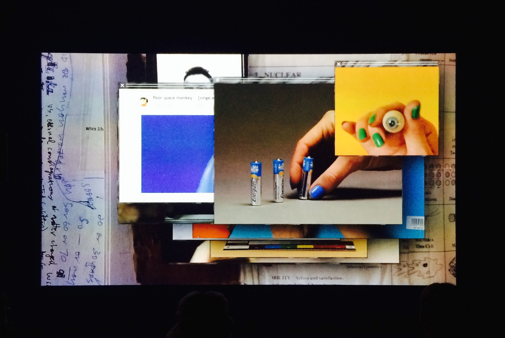
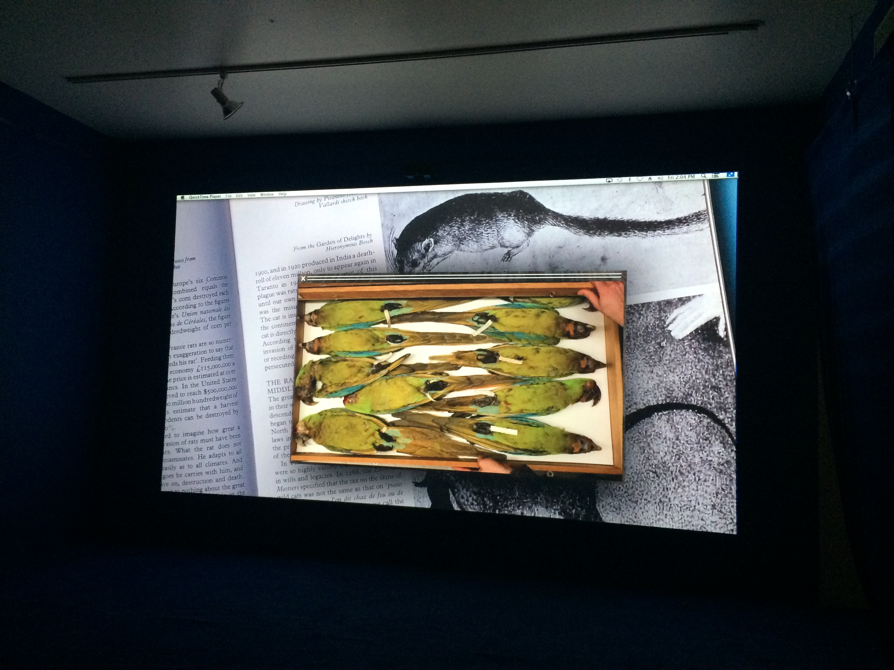
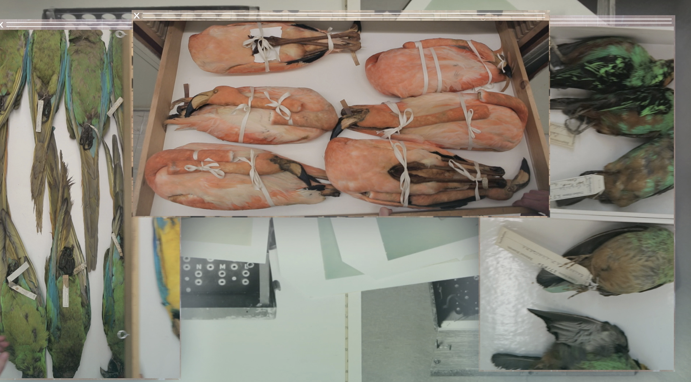

---
Pr-id: Algorithmic Anxiety: A Kierkegaardian Inquiry into the Imaginary of Possibility
P-id: Theory on Demand
A-id: 32
Type: article
Book-type: anthology
Anthology item: article
Item-id: 02
Article-title: chapter 4
Article-status: accepted
Author: Patricia de Vries
Rights: CC BY-NC 4.0
...

# 4. Walking in Circles in the Search Engine, or Collecting the Possible

> We will wander, improvise, fall short and move in circles
>
> — J. Halberstam, *The Queer Art of Failure*

## Introduction

Thirty years ago, some hoped that the internet would weaken information
monopolies by offering inclusive access to information on the web.
Things turned out differently. Elizabeth Kolbert observes: ‘Thirty years
ago, almost no one used the internet for anything. Today, just about
everybody \[in the West\] uses it for everything.’[^ch04_1] Managing the
complex information infrastructures of the internet has come with user
reliance on search engines. Search engines form a key part of the
infrastructure of online information. Or rather and more to the point,
‘surfing the web’ in the West has come with reliance on Google’s search
engine. In popular perception, and absent strong competition, Google is
perceived as *the* archive of the web, and even as *the web* — and
‘googling’ has become close to synonymous with a web search. Its engine
is assumed to comprise all existing information available on the
internet and offers many other related information products through
services such as: YouTube, Google Library, Google Scholar, Google Earth,
Google Drive, Google Calendar, Google Phone, Google Maps, Google Video,
Google Image, Google Analytics, Google Docs, Google Chat, Waze, DropCam,
Nightcorn, AppBridge, Senosis, Polar, Cronologics, and Google Home, to
name but a few. All you need to do is type in your query and Google's
engine will find it for you and deliver it in a neatly ranked list on
your screen. The company is also one of the largest computer
manufacturers in the world. To service its users, it makes use of
massive storage and computing power it manufactures itself. Google's
competitive advantage is further reflected in the Oxford English
Dictionary. ‘To google’ was added as a verb to the OED in 2006, meaning
to ‘search for information about (someone or something) on the internet
using the search engine Google’.[^ch04_2] The verb's common currency reflects
Google's stable market share of over 90%.[^ch04_3] It also reflects its
commercially and technically centralized position. How is this reliance
on Google’s information infrastructure perceived and what anxieties are
braided around Google’s centralized position?

I begin this chapter with a more general discussion of the nexus of
concerns revolving around Google’s search engine and web search.
Google’s monopoly position is a cause of anxiety for both artists and
academics. Considering the work done in academia and the arts, a number
of issues emerge. Much academic work is dedicated to showing how web
search mediated by Google is imbricated in a system that thinks merely
in terms of profits and what the implications are thereof. Here, issues
arise that have to do with the use of personal data, the for-profit
logic behind search algorithms, and the power imbalance therein, whilst
artistic strategies tend to focus on specific algorithmic features that
are part of the infrastructure of a web search. The use of Google's
search engines and algorithms in art comes in many guises. From iconic
fictional browser narratives (Olia Lialina), a live stream of an
artist’s personal browser in real-time (Jonas Lund), a play with bots
used to identify pornography on the internet (Jake Elwes), epistolary
art about the influence of the internet on people's lives (Jeroen van
Loon), subversive play in the form of Google browser extensions
(RedNoise), tinkering with Google's ad algorithms (Alessandro Ludovico),
with its image search algorithms (Rebecca Lieberman), or with Google
Chrome plug-ins (Rafaël Roozendaal), to a physical theatrical
performance piece in which a group of people enact a search engine
(Christophe Bruno). In addition, a variety of artists engage with
‘digging down’ practices and aim to expose the hidden materiality and
centralisation of search engine infrastructure by focusing on internet
cables, data centers, servers, and stacks of hard drives (Timo Arnall,
Jeroen van Loon, Ingrid Burrington).[^ch04_4]

This chapter focuses on a concept only a few artists have engaged with,
but that nonetheless helps in understanding the anxieties around web
search: collecting. Take, for instance, the conceptual documentary
photography of Philippe Braquenier. With *Palimpsest* (2012-present), he
presents a series of photographs of major libraries, archives, and data
centers in Western Europe and the East Coast of the United States. In
Braquenier's own words, his project ‘bears witness to the
infrastructures of information repositories’.[^ch04_5] These repositories
include images of databases, amongst which Google's Data Center in
Belgium, which is hidden from view by artificial dunes. His work points
to different times and scales of collection: the time of library and
archival collections and the time and scale of data centers. In a
different vein, Richard Vijgen created *Deleted Cities* (2011), a work
that could be described as a digital excavation site. It plays with the
notion of GeoCities as an excavated conglomerate of cities in relation
to which *Deleted Cities* could be seen as a collection of relics taken
from the excavation site. GeoCities was a free web-hosting service that
ran from 1995-2009. It was used by many early internet users to build
their homepages, which were modelled after a user’s city of choice,
including neighborhoods, streets and squares. At its peak, in 1999,
GeoCities hosted over 1 million websites. After the arrival of Web 2.0.
and with the growing popularity of Facebook and Twitter, the
announcement came in 2009 that GeoCities would be taken offline and
deleted. Archive Team, a collective of digital archivists, then decided
to make a back-up of ‘approximately 650 gigabytes worth of digital,
cultural heritage created by the Web's earliest citizens, or
“netizens”’.[^ch04_6] The cities, neighborhoods, and their inhabitants
(called homesteaders) of GeoCities are no longer on the web, but there
are numerous fan-fiction websites dedicated to GeoCities as well as web
archive projects that give access to a part of the GeoCities webpages
that have been recovered and archived. Vijgen’s *Deleted Cities* is an
interactive visualization of parts of the back-up made by the Archive
Team in 2009 *and* an attempt to collect and preserve a part of the
web’s cultural heritage.

The most intriguing artwork on search anxiety, I think, has been
conducted by Camille Henrot. In her work she reflects on the ‘searching
condition’ of humans, the different modalities in which the quest for
answers takes place and what underpins the quest for knowledge. Further,
it reflects on what happens when this seemingly eternal search for
answers is delegated to proprietary algorithms run by companies whose
operations are based on the quest for profit. In Henrot’s experimental
video *Grosse Fatigue* (2013), the emphasis goes to searching as an act
of collecting and it addresses the question of what constitutes a web
search and why this is a cause of anxiety.[^ch04_7] In an attempt to answer
this question, the artist explores a long tradition of philosophical
reflections on the will to know, zooming in on collecting as an activity
that gives form to this desire. The second half of this chapter focuses
on how *Grosse Fatigue* imagines search anxiety and how searching as
collecting and the searcher as collector open out onto the dimension of
the possible in relation to the will to know. What anxieties underlie
web search? What is the connection between collecting and search
anxiety? I will argue that *Grosse Fatigue* tacitly links Kierkegaard’s
conception of objective uncertainty to Walter Benjamin’s notion of the
collector. Doing so, the film hints to the *possible* as part of the act
of collecting and links the act of collecting to a web search. By
connecting the work of Kierkegaard and Henrot to that of Benjamin, the
latter's conception of the collector offers a way of living with and
through search anxiety. I will demonstrate how Henrot’s notions of
searching as collecting and the searcher as collector open out onto
possible alternative spaces on and off the World Wide Web. I start this
chapter by introducing the subject of search anxiety as it is discussed
in the academic literature from media studies, sociology, Science and
Technology Studies, and communication and computing studies, before
moving on to explain how search anxiety is imagined in contemporary art.

## Search Anxiety: Google Slaves, Bias, For Profit Indexes, and the Politics of Web Search

Various scholars from a variety of disciplines have expressed concern in
particular about the monopolization of Google search and on the
capitalist rationality behind Google's search engine.[^ch04_8] Astrid Mager,
for example, has written about how the algorithms behind search engines
are shaped by their for-profit target-advertising business-models and
advance a capitalist logic and ideology.[^ch04_9] Wendy Chun argues that
software and hardware are ‘ideology machines’.[^ch04_10] Further, issues
pertaining to globalization and localization of web browser used in
different fields and geolocations have flourished too, as well as
reflections on past and present search technologies and their
implementations.[^ch04_11] [^ch04_12] Significant work has been done on the
political and cultural bias reflected in search results.[^ch04_13] Safiya
Umoja Noble shows in *Algorithms of Oppression*: *How Search Engines
Reinforce Racism* (2018) how Google’s search engine ‘reflects the
political, social, and cultural values of the society that search
engines operate within’, including the racist and sexist beliefs of the
society.[^ch04_14] Research on the legal implications of search engines has
grown too.[^ch04_15]

Google’s search engine provides vital access points to the world wide
web, as one of its core functions is the algorithmic channeling of
information by inclusion, exclusion, localization, personalization, and
hierarchization. Importantly, the algorithms operating Google’s search
engine are part of its business model. The majority of Google’s profits
comes from targeted ads. Which is to say, some companies benefit
financially from other people’s search queries in Google’s search bar.
Features like localization and personalization — also known as averaging
— have effects on the list of search results and so do matching and
ranking algorithms.[^ch04_16] Your search keys are linked to and across all
the devices on which you use Google search and its other applications.
Google stores that information to target you with personalized ads, one
of its main sources of income. Together they are used to analyze
patterns in people's queries and churn out lists of results based on,
amongst other things, popularity. Up to this day, Google tracks the
geolocations of millions of phones worldwide, and all Android devices
come with ad viewing behavior trackers such as scripts and cookies. As a
consequence of Google’s high search volume and market share, an industry
of marketeers continually tries to manipulate Google’s algorithms to
improve their ranking in Google’s search engine. These factors amount to
the self-referential, recursive, for-profit, financialized, proprietary
monopolization of web access. Google is self-referential, as it brings
you what it has already found and indexed. Moreover, its search results
are ranked according to popularity as measured by its own algorithms,
and it has incentives to direct searchers to its content. Google’s
search engine is also recursive. It takes input from its users and
continually reuses that data to refine search results for its users and
for the delivery of ads. Google's for-profit and proprietary search
engine is integrated into browser extensions, GPS systems and numerous
web applications on tablets such as smartphones and iPads.

Google's self-referential, recursive, financialized, and proprietary
monopolization of web access shapes what information we come across
online. Search algorithms, Taina Bucher states, ‘hint at the fundamental
question of who or what has the power to set the conditions for what can
be seen and known with whatever possible effects’.[^ch04_17] This power
derives in part from its index. When one uses Google's web browser, one
does not search the world wide web. When we search, Google's algorithms
select, sort and rank documents that it has saved in its search engine
index, a local copy of web documents that it has indexed. In *Why We
Need an Independent Index of the Web* (2014), Dirk Lewandowski explains
how Google’s web search functions. On the one hand, there is the
worldwide web, which contains billions of documents. On the other, there
are for-profit web indexers, such as Google, whose web crawlers attain a
small portion of the available data on the web that is then held on a
local unit of storage. Finally, this local copy of the web is indexed by
Google so as to make it searchable. This indexed part of the web is
called the surface web and contains web documents that can be found
through Google’s search engine.

According to Lewandowski, the search engine index is therefore the
foundation of the search engine.[^ch04_18] Users type a query into Google’s
search bar and get a list of ranked pages in return. Meanwhile, the
broader web comprises billions of documents that change all the time:
new pages are added, others deleted, and changes are made on existing
pages. This requires the constant updating of the local copy of the
surface web and its index. Yet, as Lewandowski explains: ‘It is
impossible to maintain a perfectly complete and current index.’[^ch04_19] He
goes on: ‘The pool of data changes thousands of times each second. No
search engine can keep up with this rapid pace of change. The local copy
of the web can thus be viewed as the Holy Grail of web indexing at
best.’[^ch04_20]

This Grail, the copy of a website in the index, can lag behind for days.
Not to mention, search engines do not merely capture and store documents
they find on the web; instead, Lewandowski explains that they generate
replicas of documents.[^ch04_21] These replicas contain information extracted
from the document (source, title, length, date of creation, keywords and
the like), information on the popularity of the document (measured by
the number of times it was accessed and how many links to the document
exist on the web, among other measures), and an alternative, text-based
version of the document comprising the anchor texts from other
documents.[^ch04_22] Different types of algorithms decide what parts of the
web one sees — this can be a single page on a blog that has not been
indexed, content on Facebook, information behind paywalls, or any other
content that is not indexed or cannot be found through a standard search
engine. Considering the market share of Google’s search engine in Europe
— a solid 90% — users rely on Google’s method of indexing and ordering
results. They are ‘confined by the limitations of Google’s collection of
data. If Google has not seen it — and indexed it — or kept it
up-to-date, it can't be found with a search query.’[^ch04_23] Seen this way,
Google’s search results form a collection within a collection.

In light of this, to search the web is political ‘in the sense that it
is ordered, governed, shaped’.[^ch04_24] Indeed, search anxiety stretches
beyond Google's search engine. In her popular and widely circulated
polemic piece *Google as a Fortune Teller: The Secrets of Surveillance
Capitalism*, Shoshanna Zuboff even warns of a possible assault by
Google.[^ch04_25] With the data we feed it, Google is selling ‘access to the
real-time flow of your daily life — your reality — in order to directly
influence and modify your behavior for profit,’ she argues.[^ch04_26] This,
she explains, threatens ‘the existential and political canon of the
modern liberal order’.[^ch04_27] Zuboff fears a future in which we all become
‘information slaves’ of Google. ‘We are the native people now,’ she
writes.[^ch04_28]

The consequences of the web’s centralization and monetization are a
concern for artists, who provide us with means of grappling with these
processes by taking position in relation to the centralization and
monetization of web search. A number of artists express concern about
the use of aggregated and interconnected search data. One canonical work
is *I LOVE ALASKA* (2009), a 50-minute documentary video by Lernert
Engelberts and Sander Plug. On August 4, 2006, the personal — and, it
can be assumed, private — search queries of close to 650.000 America
Online (AOL) users, the then-largest internet provider in the U.S., were
accidentally published as a text file on AOL’s public website. The file
consisted of three months’ worth of users’ search keywords. AOL pulled
the data from public access on August 7, 2006. However, by then it had
been copied and disseminated on the internet — the file can still be
found on mirror sites accessible through the internet archive Wayback
Machine. *I LOVE ALASKA* consists of a selection of the search queries
of AOL user \#711391. The queries are read aloud as a voiceover by a
female with a southern drawl and in chronological order, as indicated by
the insert of a timestamp in the left corner of the screen preceding
each query. The narration of the search queries is accompanied by static
shots of different, barren, presumably Alaskan, landscapes, such as a
snow-capped mountain range, a sunset, a log cabin, windy dunes and a
highway.

The selection from the search queries read:

> cannot sleep with snoring husband;
>
> Jackie zeman nude;
>
> reverend harry meyers;
>
> How to kill mockingbirds;
>
> how to kill annoying birds in your yards;
>
> God will fulfil your hearts desires;
>
> online friendships can be very special;
>
> People are not always how they seem over the internet;
>
> can liver problems cause you to lose your hair;
>
> gay churches in Houston tx;
>
> are growths on the face always cancer;
>
> cooking channel;
>
> how can I tell if spouses spy on me while I’m online;
>
> married but in love with an other;
>
> back pain;
>
> Is George Clooney gay;
>
> how to make good impression first time meeting an online friend;
>
> Ticketservice;
>
> How can I be a good example to an unsaved friend;
>
> I love Alaska;
>
> treating computer addiction

A sense of voyeurism and secrecy arises in the interplay between the
voiceover, the time stamps and the images, which I LOVE ALASKA presents
from the search queries of user \#711391. The queries invite the viewer
to make up a story, to fill in the gaps. Nate Anderson describes I LOVE
ALASKA as:

> \[…\] real pain, stripped of a human face \[…\] Puzzling out the
> person presented eventually gives way to thinking about our own search
> and browser histories, the trail of cybercrumbs leading through the
> forests of the internet on paths that our own friends and even spouses
> may not know we tread.[^ch04_29]

User \#711391 seems to be a woman of faith from Houston, Texas, in a
relationship with a snoring husband, apparently has met someone online,
has anxiety about diseases, shows an interest in Alaska and in same-sex.

Anxiety about the possible future use of individual and aggregated
search data is a recurring topic of concern both in art and in academia.
Anja Groten developed the *Machina Recordatio* (2013)*,* an alternative
search engine where you can browse for specific topics and keywords
relating to existential issues and romantic problems you may not want to
share with Google. The search ‘results’ have the form of voice
recordings of elderly people giving life advice to searchers who want to
keep their private lives somewhat private. Relatedly, Harlo Holmes and
Camille Henrot created an offline *I Ching*-like search application
named *Desktopmance* (2015), which algorithmically answers a user's
personal questions about life decisions and the future with a poetic
response based on a selection of poems liked by Holmes and Henrot,
combined with images randomly selected from the files stored on the
user’s desktop.

As a form of artistic resistance to Google’s monopoly position, the
financialization of its search results, and the anxieties about the
possible use of aggregated search data, artists such as Anja Groten,
Taryn Simon and Aaron Swartz, Phil Jones, and Aharon Amir have created
alternative search engines. With their alternative search engines, they
each tackle different aspects of search anxiety. *Image Atlas* (2012),
made by Taryn Simon in collaboration with Aaron Swartz, responds to
anxiety about filter bubbles. The two developed a search engine that
compares the top image results for search terms across localized engine
settings of 57 countries around the world. Users of the *Image Atlas*
can play with these settings and refine or expand location settings to
compare the given image results. *Image Atlas*, in the artists’ own
words, ‘questions the supposed innocence and neutrality of the
algorithms upon which search engines rely’.[^ch04_30]

Relatedly, Renée Ridgway’s *Re:Search* (2016) also offers a view of the
powerful forces at play in the back-end of the web search. Her works
focus on the centralization of power in the political economy of search
engines. Through data visualizations and an interactive touch screen,
*Re:Search* shows the value of key words as measured through the lens of
‘personalized’ and ‘anonymized’ search results. The work consists of two
tablets that show two interactive data visualizations of the search
queries and results. One shows the results of Google Search in a Firefox
browser on a personalized Apple (signed in to Gmail account, no
ad-blocking plug-ins). The other shows the results of a
‘hacker-approved’ clean Lenovo PC with a Tor browser. In the exhibition
view, the two tablets were complemented with a paper print out with long
lists of the different URLs of the search results of both engines.
*Re:Search* is an investigation into the ‘personalization’ feature of
the Google search and alternative methods of querying the web, such as
with the onion browser on Tor. To counter the self-referentiality of
Google's search results, Phil Jones and Aharon Amir created the
*Narcissus Search Engine for N.E.W.S.* (2009). Like Google’s engine,
*Narcissus* searches a database of documents for matching keywords,
keeping tabs on when searchers click through to see the results.
Contrary to Google’s engine, however, it favors the less popular or
unpopular over the popular. It does so by downplaying popular sites by
pushing a popular result site down in its ranking. If a popular site
continues to be clicked on despite these efforts, it will no longer
appear in the list of results.

Other artists have engaged with the recursive aspects of Google’s engine
and the use and financialization of user data. Erica Scourti’s *Life in
AdWords* (2012–2013) stages a personal interaction with Google’s AdWords
algorithm. At least until 2017, AdWords algorithms would sift through
user’s Gmail accounts and chat history, analyze topics of possible
interest and use this data to target its users with personalized ads
that would appear in their inbox and on the result pages of Google
search. Google claims that since 2017, it scans Gmail data only with the
consent of its user. Starting in 2012, for nearly a year, Scourti logged
into her Google email account and emailed her diary to herself. In *Life
in AdWords* she performs, to a webcam, the list of keywords that turned
up in her inbox as a result.

Of course, the revenue model and data exploitation of Google’s search
engine is not the only issues with web search — though they seem the
more pronounced causes of anxiety both in academia and in the arts.
While artistic and academic projects pick up on different issues, a
shared focus is to expound on the conditions of centralization,
localization, and financialization of Google’s search engine in order to
critically rethink the ‘results’ of the search engine. That is, most
academics and artists tend to ‘stand back’ and focus on Google’s search
algorithms and results, reflecting upon its revenue model and the power
dynamic between searchers and the profit-driven corporate mediators that
administer Google’s engine and aggregate its data. Web search, however,
is not a matter of political economy alone. It is also a matter of
collecting. It is this act of collecting and the relation between the
collector and the collected, which forms the central concern of Camille
Henrot’s experiential video work *Grosse Fatigue* to which I turn in the
following section.

## The Searching Condition in *Grosse Fatigue* 

Henrot’s *Grosse Fatigue* can be described as a Kierkegaardian
reflection on a web search. The film could, to an extent, be read as
performing a synthesis between faith and knowledge as it loosely links
religion and science and world-building to Google's search engine.
Moreover, the artistic enactment of the act of collecting presented in
*Grosse Fatigue* shows a way to work with and through the
self-referentiality and recursiveness of Google’s search engine. *Grosse
Fatigue* carries its viewers through the realms of epistemology,
taxonomy, theology, and technology, offering reflections on the act of
collecting on the one hand and an artistic imaginary of the underlying
moods and shapes of the quest for knowledge on the other.

Set entirely on a desktop computer, *Grosse Fatigue* begins with a
window popping up on a desktop with the query ‘the history of the
universe’ being typed into the Google search bar. From there, the film
takes its viewers on an audiovisual *tour de force* along with numerous
creation stories, down the rabbit hole of Google's web browser, and
through the collections of the Smithsonian Institute in Washington, D.C.
In 13 minutes, the film covers millions of years in the history of the
universe, crossing numerous disciplines, methods of research, and fields
of expertise. *Grosse Fatigue* was made during Henrot’s stint as a
research fellow at the Smithsonian Institute in Washington D.C. — the
world’s largest conglomerate of museums and research centers, which is
administered by the US government and holds over 137 million artworks,
objects, and specimens in its collection. Her book, *Elephant Child*
(2016), expands on some of the formative ideas for *Grosse Fatigue.
Elephant Child* is in part a collection of the research material and
thinking that informed *Grosse Fatigue* and offers images of the
artworks and quotes of thinkers that have shaped Henrot's ideas.

Furthermore, Henrot connects the quotidian practice of web browsing to
the eternal question of life on earth and the moods and shapes
underlying the mystery of life on planet earth. Spirals and rectangles,
hands, turtles, and globes reappear throughout the film as it draws in
on the concepts of recursion and self-similarity. To trace the
connection between these concepts is to discern Henrot’s understanding
of what it is we do when we search.

*Grosse Fatigue* invites viewers to rethink the idea of a web search as
broadly situated in the history of how knowledge is conceived,
narrativized, preserved, distributed, and, importantly, *collected*. The
footage of *Grosse Fatigue* consists of film images taken at the
Smithsonian Institution combined with images and clips taken from Google
Image and Google search results. The Smithsonian Institution is not
modest about its ambitions. Its mission is to ‘unlock the mysteries of
the universe’ and to continue to take the ‘lead in the quest to
understand the fundamental nature of the cosmos, using next-generation
technologies to explore our own solar system, meteorites, the Earth’s
geological past and present, and the paleontological record of our
planet’.[^ch04_31]

Google has parallel ambitions in the digital realm by, as one example,
allowing its users to navigate the earth. Through Google Earth, one can
traverse oceans and mountains or zoom in and zoom out of cities. With
Google Books, one can leaf through any of the books it has digitized,
while Google Scholar provides access to the digital archives of museums
and institutions, amongst other things. With its combined services and
products, the company aims to ‘organize the world’s information and make
it universally accessible and useful’.[^ch04_32] In this sense, the
Smithsonian Institute and the Google search engine would seem to be good
places for starting a query on the history of the universe. That said,
queries into Google's vast database or the Smithsonian collection are
mediated and governed queries. What Google's search algorithms and the
Smithsonian have in common are their attempts to organize disorder.

The opening scene of *Grosse Fatigue* starts with an image of a laptop
screen with a desktop image of the milky way. A Final Cut Pro-file is
opened, and two windows pop onto the desktop. Each show what appears to
be the same art catalogue against a yellow background. In one window,
the book opens on a page with a centerfold portrait picture of native
tribespeople. In the other window, the art catalogue is leafed through
by a woman's carefully manicured hands. The two windows cut to
superimposed clips of a young woman opening a locker in the sterile grey
corridor of what seems to be an archive. These images are then paired
with another window in the top right of the screen showing a Google
search bar. The words ‘the history of the universe’ are being typed in
the bar. What follows is a torrent of quickly-paced edited shots of
Google's search images mixed with short video clips of quotidian moments
as well as images and clips of artefacts, taxidermic flora and fauna,
and a plethora of objects that form part of the vast collection of the
Smithsonian Institution.

*Grosse Fatigue* enacts the phenomenon of the web search by way of
overtaxing its viewers with sound and images taken from different
internet sources, archival research and personal files of the artist.
Different file systems and internet interfaces fill the screen — the
desktop, the screensaver, folders, windows opening and closing. These
are visually linked with images of files, cabinets, boxes, and drawers
in which the Smithsonian Institution preserves its collections. The
rhythm and movement of the film’s montage is synched to the punches of a
kick-drum. A deep and warm voiceover begins to read a poem:

> In the beginning there was no earth, no water – nothing.
>
> There was a single hill called Nunne Chaha.
>
> In the beginning everything was dead.
>
> In the beginning there was nothing, nothing at all.
>
> No light, no life, no movement, no breath.
>
> In the beginning there was an immense unit of energy.
>
> In the beginning there was nothing but shadow and only
>
> darkness and water and the great god of Bumba.
>
> In the beginning there were quantum fluctuations.
>
> In the beginning, the universe was a black egg where
>
> heaven and earth were mixed together.
>
> In the beginning there was an explosion.
>
> In the beginning, a dark ocean waged on the shores
>
> of nothingness and licked the edges of Night.
>
> In the beginning was the eternal night Han.
>
> In the beginning, before all things, there was
>
> Amma, and he rested upon nothing.
>
> In the beginning, Ptah the demiurge born from the essential ocean.
>
> In the beginning, the fabric of space-time unfurled, it inflated.
>
> In the beginning, atoms were formed.
>
> In the beginning a giant cobra floated on the waters.
>
> In the beginning everything was still, there was no beginning.
>
> In the beginning, and in the Void, the Oldest of Old
>
> Gods was formed, the world had no time, no shape,
>
> and no life, except in the mind of the Creator.
>
> In the beginning the Word already was.[^ch04_33]

The editing and the drum rhythm are seamlessly synched with the flow of
the spoken word poem that forms the backbone of *Grosse Fatigue*.

Henrot mentions in her book *Elephant Child* that the poem lines mix
creation stories from various religious traditions (Hindu, Buddhist,
Jewish, Christian, Islamic), hermetic traditions (kabbalah, freemasonry)
and oral traditions (Dogon, Sioux, Shinto, Inuit, Navajo). In poetic
recital, we hear:

> Then the Gods split humans in two, making them each search for their
> lost half
>
> Then some degree of sperm competition took place
>
> Then Eve of the rib was adorned in jewellery
>
> Then a brother and sister were locked in a yellow wooden drum
>
> Then the milky way took form
>
> Then there was no need for light on Dzambu Ling,
>
> For the god emitted a pure light from their own bodies,
>
> Then the creator was in the form of a man without bones,
>
> Then the gravity of galaxies slowed the expansion of the universe,
>
> Then there were units of matter,
>
> Then Ogo introduced disorder into the world by
>
> committing incest with his Mother Earth,
>
> There was no world then, only the white, yellow, blue,
>
> black, silver and red mist floating in the air.
>
> In the beginning was only the sky above,
>
> And water and marshland below.
>
> In the beginning was nucleosynthesis.[^ch04_34]

Henrot has a knack for image matching and juxtaposition, sound-image
choreography and color composition. Using these techniques, she forms a
mesmerizing dance of spoken word, drums, images, colors and movements.
With this dance she attempts to tell the story of the universe’s
history.

Figure 9: Exhibition view of *Grosse Fatigue* by artist Camille Henrot.

Kierkegaard would have argued that *Grosse Fatigue*’s searcher knowingly
sets itself up for failure. He would have dismissed the suggestion that
reconstructing the history of the universe helps to understand the
meaning of existence. As existence is not a mere object or question of
knowledge, it cannot be answered by scientific pursuit. Kierkegaard
further explains this by way of dancing:

> If someone who wanted to learn to dance were to say: For centuries,
> one generation after the other has learned the positions, and it is
> high time that I take advantage of this and promptly begin with the
> quadrille — people would presumably laugh a little at him.[^ch04_35]

Just like a dancer has to learn, retrace and rehearse the basic
positions, again and again and again, the meaning of existence lies in
existing, as a verb. It requires commitment and constant and often
thankless effort. Which does not mean that nothing is edifying about
reading about dance or watching others dance; it is to say, rather, that
questions regarding the meaning of existence cannot be answered by
science alone.[^ch04_36]

However, the searcher of *Grosse Fatigue* does not search for answers
within the walls of the Smithsonian Institution alone. Superimposed
pop-up windows open to short video clips, web texts, and web images
taken from a variety of digital platforms and sources. The viewer
encounters: drawers full of dead tropical birds; YouTube videos; a clip
of a woman masturbating; Wikipedia lemmas; home videos; marbles; a
*SkyMall* magazine; a toned male torso showering; a world map
visualizing occurrences of bipolar disorder; an orange rolling; a soaped
naked female torso; turtles eating; a turtle hedging eggs; a frog
sitting on a smartphone; flora and fauna from across cultures; as well
as numerous other objects that first fill, and then flood, the screen.
Henrot weaves together objects and aesthetics of oral and digital
culture, natural science and theology, mixing the seemingly trivial and
personal with the monumental collections of the Smithsonian Institute.
Meanwhile, the spoken word poem recited in the voiceover jumbles various
creation myths, moving chronologically from the beginning of creation to
the end. The voiceover’s tone tightens, he sounds anxious, and his
breathing becomes more and more pronounced while he’s heard saying:

> The Creating Power then took many animals and birds from
>
> His great pipe bag and spread them across the earth.
>
> First came self-promoting chemicals and then fat formed membranes
>
> And then came the green algae colonies in the sea,
>
> And then the oxygen, oxygen.
>
> Eight faced air, air to make winds and breezes,
>
> Air filled with sounds, air carrying oceans
>
> And then came the vertebrates, the jawless fish
>
> And then came the nautiloids in the Devonian ages of fishes,
>
> And then came amphibians from the coelacanth,
>
> And then came the birds from the coelacanth,
>
> And after the flowering plants came the bees,
>
> And after the bees came the snakes,
>
> And after the snakes came the ants,
>
> And after the creodonts came the primates,
>
> And after the primates came the song birds,
>
> The parrots, the loons, the swifts
>
> And then came the butterflies and moths,
>
> And came the grasses
>
> And came the marsupials
>
> And came the pigs and cats from the coelacanth,
>
> and came the deer,
>
> After the deer came the zebras, elephants and then the dogs
>
> And came the hyenas, the bears, the giraffes,
>
> And came the three sloths, the hippopotami,
>
> the zebras, the elephants, the lions, the dogs,
>
> And then came the mammoths from which came nothing at all.[^ch04_37]

At the end, the narrator gasps for air.

*Grosse Fatigue* hurries through aeon and aeon. In 13 minutes, art and
culture, science, extinction, Jackson Pollock, Charles Darwin, Pantone
colors are all there, as are drawings, notes, and numerous browser
windows. Henrot draws no boundaries between one category and another,
mashing up science, myth and the creation stories of the world; making
associative leaps of imagination between objects and images of eggs,
planets, marbles, a fox, and flexing biceps, spume and turtles. In doing
so, she synthesizes disciplines and values: science and religion, words
and images, epistemology and ontology. *Grosse Fatigue* seems to refuse
to dualisms. Who says *this* is spirituality and *that* philosophy? Who
says this is *subjective* and that is *objective*? Henrot explains in an
interview: ‘It was my aim for the film to reflect the anxiety generated
by the open nature of the world and its excessive dimension’.[^ch04_38]
Referring to anxiety like that which underwrites the search for
knowledge — be that through quests within an archive or queries on the
web — Henrot echoes Kierkegaard. In *Elephant Child,* one can read
another Kierkegaardian echo. Henrot writes: ‘when you try to grasp
universal questions, or questions that are too big, you need to draw
into yourself, to use intimacy and subjectivity as a means of accessing
something beyond the self’.[^ch04_39] In Kierkegaardian fashion, Henrot
synthesizes faith and knowledge. Like love, dancing, and exiting, knowledge is not act, not a thing, that happens in relation.

## Frames, Windows, Boxes & Other Rectangular Encounters

As noted earlier, what Google’s search engine, the Smithsonian
collections, and creation stories have in common are their attempts to
organize disorder. They attempt to organize the Great Chain of Being and
the World Wide Web. Every part gets its allotted position in the whole
of the natural/digital world. *Grosse Fatigue* could be seen as an
enactment of the operations and mechanisms of search algorithms.

In the voiceover we hear:

> And language was used to praise Heart-of-Sky rightly
>
> And mankind discovered the knowledge of history and nature
>
> Of minerals and vegetables, animals and elements
>
> The knowledge of logic and the art of thinking
>
> The sciences of gratification and those of utility,
>
> The art of remembering and pure mathematics,
>
> The science of physics, the science of medicine,
>
> The science of botany, the science of chemistry,
>
> The knowledge of politics, the knowledge of alphabets,
>
> The knowledge of magic and the science of God,
>
> The knowledge of virtue and the mechanics of poetry,
>
> The science of laws and the science of commerce,
>
> The metaphysics of bodies and the transcendental geometry,
>
> The dynamics, the hydraulics, the optics, the dioptrics,
>
> The acoustics and grammar, music, cosmology, geography,
>
> Orthography, chronology, zoology, physiology,
>
> arthology, astrology, aerology, and more.
>
> Then there was promiscuity, monogamy and polygamy.[^ch04_40]

When the narrator says, ‘first there was nothing, and then, an
explosion’, we see footage of marbles spreading out and rolling on a
tabletop. When he says, ‘primates’, a YouTube clip of the meme ‘poor
space monkey’ pops up. When he says, ‘\[t\]hen the Gods split humans in
two, making them each search for their lost half’, we see hands placing
two small and identical figurines on a blue surface. When we hear,
‘\[w\]ho can understand the loneliness of Gods?’, we see a tidy row of
taxidermy birds in a Smithsonian file drawer. With the pronunciation of
each *logos,* a window pops up that is superimposed by the next window
popping open, forming a sequence of ever-smaller rectangles within
rectangles. When the narrator says ‘music’, we are shown an image of a
cassette-deck player. When he says ‘cosmology’, we see a turtle crawling
through sand. We hear ‘geography’ and see images of a typewriter’s text.
‘Orthography’ is linked to a nest of turtle eggs in the sand.
‘Chronology’ is linked to a picture of an analogue calculator. ‘Zoology’
is connected to a blue bucket full of tiny turtles; ‘physiology’ to a
laptop keyboard; ‘pathology’ to a short clip of a large number of
turtles crawling over sand; ‘astrology’ to a clip of text displayed on a
light-box and turtles running on sand. ‘Polygamy’ is linked to a clip of
a chameleon being stroked by a female hand with brightly colored
polished nails. The rhythmic popping open of windows presents a
succession of images shot at the Smithsonian: corridors with file
cabinets and drawers full of neatly ordered macaws, toucans, penguins,
and insects are visually linked to a collection of ancient fertility
statues, to X-rays of fish and seahorses. These are combined with video
clips of turtles burrowing into sand, ostrich eggs being peeled, a man
looking at the inside of what appears to be a nuclear bomb, a photograph
of the universe, a glass eye, eyedrops falling onto a blinking eyeball,
seashells, dried tree leaves, an iguana, the back of a bald head, a
zebra, a boulder, pictures of bees, paintings of fish, a collection of
insects, a drawer filled with taxidermized penguins, a clip of a
mosquito hovering over a glass plate, an inflatable globe, a woman
sitting on the subway, and framed insects. The viewer is never informed
about what kind or sort of animals, objects or rituals they are looking
at, where the snippets of the footage come from or what the structure of
image forms and associative ideas is supposed to convey.

Figure 10: Exhibition view *Grosse Fatigue* by artist Camille Henrot.

Each image or clip is framed by a file window. Taken together, the
different fields of study and concepts listed by the narrator are
visually represented as part of a larger whole made up of other
disciplines that are similar to it. In *Grosse Fatigue,* all the
different parts are represented by rectangles. Henrot calls these
‘reciprocal inclusions’, and they are formally represented on screen as
a stack of superimposed windows diminishing in size.[^ch04_41] Like envelopes
like envelopes like envelopes like. This visual play with patterns of
rectangles is repeated throughout the film, like a Fibonacci sequence.
In doing so, *Grosse Fatigue* stages a mesmerizing audio and visual
*mise en abyme* of the ‘different systems of belief — the different
strategies used by humankind — used to synthesise human history which is
also kind of a history of the universe’.[^ch04_42] That is, Henrot imagines
the styles and forms of what humans consider forms of knowledge and
ideas as an endless recursion of squares within squares. The search
engine is yet another square within a square within another square — in
an infinitely recurring sequence of squares within squares.

Figure 11: Video still from *Grosse Fatigue* by artist Camille Henrot.

‘Knowledge is made for cutting’, Foucault once famously asserted.[^ch04_43]
In other words, in an attempt to understand the whole, parts are formed.
In *Grosse Fatigue,* this cutting of knowledge is represented by file
systems: storages boxes, file drawers, the folders of computer files,
and Google’s search bar. These are all composed in rectangular shapes
that crop, frame, set limits. Pop-up window upon pop-up window is
interspersed with footage of the neatly-ordered archival facilities of
the Smithsonian, suggesting a link between the different ways in which
knowledge is cut out, shaped. The rectangle signifies order that results
from human intervention.

In *How to Live Together: Novelistic Simulations of Some Everyday
Spaces,* Roland Barthes points to the 90- and 180-degree angles of the
majority of the livings spaces we create: houses, apartment buildings,
doors, windows, roofs. ‘It’s all rectangular ≠ nature: no rectangles
\[…\] Rectangle: as the basic shape of power.’[^ch04_44] The rectangle it is
‘the mark of the division between man and nature’, Henrot claims.[^ch04_45]
Rectangles shape the interfaces through which we navigate spaces of
human dominion: databases, archives, maps, contractual papers, field
guides, screens, books, and documents. Rectangles separate order from
chaos. Rectangles mark off territory and separate inside from outside,
what belongs, and what cannot belong, what fits and what does not fit
within the four straight lines of its shape. ‘Conquest begins with
mapmaking.’[^ch04_46] Henrot visually emphasizes the imposition of the
rectangle by browser windows, folders, and files, the square vignettes
and storage rooms and cabinets, boxes — the shape of order — and by
juxtaposing them to spiraling objects such as shells — the shape of
limitless infinitude.

The final scene of *Grosse Fatigue* shows windows opened to Wikipedia’s
lemma of a world map of bipolar disorder and schizophrenia and images of
caged animals. Here, the maddening quest for understanding life on earth
is linked to contained wilderness and psychiatric disorders with
symptoms of disorganized thinking and delusion. The experience of
psychiatric disorder is presented in the form of a lemma; the ‘wildness’
of the world is mediated through the rectangular form and straight lines
of a cage. *Grosse Fatigue* associates the process of ‘rectangling’ with
the caging of animals. A pen is a closed space. Caging an animal is a
safety measure. A cage reigns in the unpredictable, and tames it,
domesticates it. In imposing clear boundaries, a pen makes the
unpredictable, to a degree, predictable. By entering a rectangle, by
putting things within a rectangle — also achieved through the
preservation of objects within the rectangular spaces of an institution
— a closed space is created, a space of finitude, to preserve and hold
on to for eternity. Like a wild animal in a cage, the archive and the
search engine contain disorder by enclosing it in a rectangle and by
rendering it into an ordered list of ‘results’ and a neat line of
taxidermy animals.

The rectangle is also a key characteristic of another Google feature,
the so-called Knowledge Graph. When users query a well-known person,
event, place or thing, they encounter a square panel atop the search
results, on mobile phone devices, or to the right of the top results, on
most other devices. Google's knowledge graph feature was added to its
search engine in 2012. Say you type in ‘Mae C. Jemison’, the graph shows
her full name, five portraits and headshot pictures — some older and
some more recent — that are captioned ‘American Engineer’. A short text
below states: ‘Mae Carol Jemison is an American engineer, physician and
NASA astronaut. She became the first African American woman to travel in
space when she went into orbit aboard the Space Shuttle Endeavor on
September 12, 1992.’[^ch04_47]

Also included is an additional link to her Wikipedia lemma. In addition,
it mentions her date of birth, the space mission she was on, where she
went to school, awards received, and the names of her siblings.
Reportedly, the information is taken from a variety of sources; however,
the information provided is frequently unattributed. In October 2016,
Google's CEO, Sundar Pichai, claimed that Google's Knowledge Graph
‘encompasses 70 billion facts’.[^ch04_48] That is, 70 billion search queries
spawned answer boxes atop search results. Knowledge graphs also appear
on contentious topics like ‘capital of Israel’, to which Google's
Knowledge Graph answers: ‘Jerusalem’.[^ch04_49] Query ‘best book of 2018’ and
it gives you a list of 53 books. Apart Chennapragada, Google’s director
of product management states: ‘So the knowledge graph is Google’s
understanding of the world and all the things in it.’[^ch04_50] This comment
suggests the world is a container of things. Its reconstruction of the
world is one in which every question yields neatly ordered and boxed
results. Of course, not everything can find its place in the limited
coordinates of a rectangle.

The imposition of rectangles can have deadly consequences. *Grosse
Fatigue* refers to ideas in Jacques Derrida’s *Archive Fever: A Freudian
Impression*. Derrida explores the subject of the archive from a Freudian
perspective and examines the archival desire to collect and preserve in
relation to what Freud called the death drive. Derrida draws attention
to what remains outside of the archive, to its ‘forgetfulness, amnesia,
the annihilation of memory’ and asserts that there is ‘no archive
without \[an\] outside’ of that which is not preserved, or, by virtue of
the archive, destroyed.[^ch04_51] Henrot reflects on this paradox: ‘This is
how the collection of endangered species ends up precipitating the
complete extinction of certain species, and how some inter-categorical
species cannot be named, such as certain invertebrates that are not
invertebrate.’[^ch04_52]

No archival drive exists without a destruction drive, claims Derrida.
Death haunts the Smithsonian in a literal sense. The Smithsonian's
Department of Anthropology, to which Henrot had full access, was created
and expanded rapidly in the context of the end of the American Indian
War. As Henrot comments: ‘The first collection contributed in an
exponential way to the Smithsonian’s collections was the collection of
American Indian artefacts.’[^ch04_53] The Department of Anthropology has the
largest collection in the world of American Indian artefacts. The
collection illustrates the historical nexus of power and knowledge.
Henrot suggests that the genocide that gave impetus to the collection of
the Smithsonian is now dressed up in scientific form masking the
violence that fueled the foundation of the Institution. Indeed, Walter
Benjamin claims that ‘\[t\]here is no document of culture which is not
at the same time a document of barbarism’.[^ch04_54] To collect is to cage.
To cage is to create a closed space. A closed space is to divide. To
divide is to set limits. To set limits is to separate; like a zoo, it
provides a way to engage with what is by virtue of the separation
considered the wild, the unknown, the other.

The rules of a collection involve classification (be it emblematic,
didactic, encyclopedic, or otherwise). Classification has difficulty
with what defies classification, with the extra-orderly: cross-links,
diversions, hybrids, in-between bodies, monstrosities, the nebulous,
imponderables, and other unstable categories. Jack Halberstam observes
that in societies focused on classification, counter-archives exist ‘of
bodies and modes of being that fall out of the definitional systems
produced to describe them’.[^ch04_55] Any system of order needs an exception
and exclusions to be validated. As noted in the previous chapter, when
an object, animal or person does not fit the rules of classification, it
becomes dangerous, with the potential to bring down curses on those who
have disturbed the order of things. To maintain an ordered system always
involves violence, partiality and politics. Like politics, you need to
know the rules of the game to play the game. And like a game, systems of
classification contain, bound, and are rule-based. To create an ordered
system always involves violence. To create an ordered system is an
interruptive act, which still, necessarily and inevitably, involves
prejudice, predilection, and preference. No method of ordering exists
without dissymmetry, without exclusions, without some quality of
violence, skewing in certain directions and not others.[^ch04_56] The work of
sorting, classifying, ordering, and ranking is outsourced by Google to
its algorithms. This is how Google’s index is formed. To be part of its
index rules are established. Rules not only point to what is allowed and
what not — to what is indexed and what not — but also to who sets the
rules and who owns the index. An index, as is well known, is a tool of
arrangement. Google’s index is a means to create a system of order in
what would otherwise be perceived as a chaotic multitude. To index is to
practice exclusions. Exclusions generate a list of results with a top and bottom. Without cutting, discarding, and excluding, there can be no
index and no ranked results. An index makes available and unavailable,
connects and disconnects, and interconnects, recognises, misrecognizes,
and unrecognizes. What is considered part of its index is therefore
subjective, contingent, and self-referential.

The moving in circles within rectangles of self-similarity give the
narrator of *Grosse Fatigue* much anxiety. While we hear heavy
breathing, the voiceover continues in a mournful tone:

> And Bumba vomited up the sun, and the sun dried
>
> up some water, leaving land,
>
> and when the earth was to be made, it fell down from the sky.
>
> Earth, hills and stones, all fell down from the sky,
>
> and the Earth rose up like a mountain
>
> And the King above the Sky said, “Punch holes in the Earth,
>
> The water will drain away”
>
> Woman Who Fell From the Sky rested on turtle’s back
>
> God blessed the seventh day and sanctioned it,
>
> Because that in it He had rested from all his work.
>
> The arrow of time points to the heath death of the universe.
>
> And Pan Gu felt lonely
>
> And Heart-of-Sky felt lonely with the loneliness that ends
>
> the worlds.
>
> Who can understand the loneliness of Gods?
>
> Yaweh was lonely
>
> And Ogo was lonely
>
> Lonely like Wak and lonely like Allah.
>
> The whole earth was heavy and then Yahweh rested.
>
> \[…\] resting, Pan Gu laid down
>
> and resting, he died.[^ch04_57]

The inherent subjectivity and self-referentiality of human knowledge or,
differently put, the inaccessibility of earthlings to a view from
nowhere — to objective knowledge — is expressed in *Grosse Fatigue* by
way of emphasizing the loneliness of the Gods in creation stories.
Further, the unknown is rendered as both an ontological and
epistemological problem. Not knowing the full story, not being able ‘to
make sense’ out of a vast and chaotic multitude, is associated with
losing one’s mind — in the form of images of a Wikipedia lemma about
schizophrenia and bipolar disorder — and with death. The point *Grosse
Fatigue* seems to make is that some things cannot be detached from
subjectivity. Queries into Google’s vast database or into the
Smithsonian’s collection are mediated and governed queries that happen
within the bounded space of the web and the archive, which are limited
spaces and bounded by time. By overestimating what Google, the
Smithsonian and creation stories can provide, *Grosse Fatigue*'s searcher
is seized by anxiety. Questions regarding existence cannot be answered
by data or documents alone. Further, many things in human existence
cannot be documented, transfixed, factually accounted for, indexed or
datafied, or reduced to facts.[^ch04_58]

## Between Fact and Faith: Searching as Collecting 

Collections depend on systems of ordering. Ordering systems represent,
to use Tara McPherson’s words, ‘a logic of the fragment or the chunk, a
way of seeing the world as discrete modules or nodes, a mode that
suppresses relation and context’.[^ch04_59] In his work, Kierkegaard suggests
that the anxiety the limits of knowledge leads to can be taken up ‘by a
passionate mentality devoted, paradoxically, to overcoming the ultimate
limitation of her own understanding’.[^ch04_60] Or in Kierkegaard's own
words, one must ‘infinitely passionately relate himself to the
indefiniteness of the definiteness’.[^ch04_61] How this must be done remains
unclear in Kierkegaard writings, but Walter Benjamin's conception of the
collector demonstrates one way to leap into objective uncertainty
passionately. His notion of collecting as a redemptive activity, ‘a box
in the theatre of the world’ as he describes it, offers a way to live
with subjective truth and within the limits of knowledge.

In the essay *Unpacking my Library*, Walter Benjamin writes: ‘There is
in the life of a collector a dialectical tension between the poles of
disorder and order.’[^ch04_62] Another dialectical tension he points to in
*The Arcades Project* is between the collector and the allegorist, when
he writes: ‘In every collector hides an allegorist, and in every
allegorist a collector.’[^ch04_63] In *Grosse Fatigue,* the dialectical play
between order and disorder and between the collector and allegorist
resembles a Google search engine on high-speed. The loose associations
between words and images are immediately followed by additional image
associations or juxtapositions that, in turn, are supported by other
quick associative links made between images and between image and spoken
word and within images.

Further, the editing of *Grosse Fatigue* resembles a synthesis between
the finite and the infinite and between order and disorder. Images of
spiraling objects reoccur in *Grosse Fatigue*. The spiral, as is well
known, is the structure of the infinite, the unlimited and the endless —
it represents chaos. Kristina Scepanski, one of the editors of *Elephant
Child*, describes it as follows:

> Camille Henrot deliberately sets out to overwhelm the viewer. The
> sheer number of objects, the concentration of the stories behind them,
> the splicing of different disciplines from diverse fields of
> knowledge, competing principles of classification and, not least, the
> sensory experience within endlessly looped soundtrack coalesce en
> masse to demonstrate the excesses of an unbridled urge to collect and
> hoard, an excessive almost pathological compulsive desire for order,
> which ultimately is condemned to spill over once more to create its
> own disorder.[^ch04_64]

Henrot represents order by way of desktop folders, browser windows,
archival storage facilities and other ordering systems. These are
interspersed with clips and images taken at the Smithsonian of lockers
being opened or closed and panned images of its endless corridors filled
with file cabinets and boxes. These rectangles and practices of order
find their spiral counterparts in the next scene. A small file window
hovers over others at the center of the desktop screen. In this window,
we see a video of a laptop playing a film. The film shows a man
stumbling down a tungsten-lit institutional hallway. He falls against
one wall, then against the other, trying to maintain some balance to
then quickly topple and fall to the ground. The film is a clip from
Rainer Werner Fassbinder’s *World on a Wire* (1973), a German science
fiction TV series that plays on the possibility that the world exists
entirely inside another world. Fred Stiller, the series’ protagonist,
struggles to keep his sanity in this web of worlds within worlds in
which the lines between simulation, representation and the real are
blurred. *Grosse Fatigue* seems to suggest that when searching for
answers about the history of the cosmos, we are all Fred Stiller,
thereby linking search engine anxiety to the limits of knowledge. The
whole escapes our grasp, ‘\[w\]e will wander, improvise, fall short and
move in circles’.[^ch04_65]

Figure 12: Video still *Grosse Fatigue* by artist Camille Henrot.

Images of globes reappear in *Grosse Fatigue*: an inflatable globe, a
picture of the earth from space, the cover of the Whole Earth Catalogue,
a desk globe and a button with the text: ‘Why haven't we seen a
photograph of the whole earth yet?’ Globes, and by extension images of
globes, imitate the perspective of Panoptes, the all-seeing. A globe
offers a ‘model of totalizing vision’.[^ch04_66] Globes also provide an image
of the world as an object. Importantly, globes place the one looking at
the globe outside of it. It suggests the gaze of an all-seeing outsider.
In looking at a globe, one takes the gaze and the position of someone
who no longer inhabits the world, but holds it before their eyes, from a
distance — like a lonely God. Henrot writes:

> The \[Smithsonian Natural History Museum\] is like a neurosis \[…\]
> Everything must enter the museum: everything living, dying, or
> deceiving; all the fish in the sea, all the birds in the sky, all the
> animals of the forest. The aim of the Smithsonian’s Natural History
> Museum—to be a museum of everything—is an irrational project that is
> driven by the wish, the ambition, to reconstitute a world.[^ch04_67]

This reconstituted world, in the form of a collection, becomes an object
under one's power and control. Benjamin repeatedly speaks of properties
*in the hands* of the collector and to ‘the *tactical sphere*’ of
collecting.[^ch04_68] In *Grosse Fatigue,* feminine hands regularly appear:
rolling an orange, throwing marbles, grasping eggs and a sea sponge.
Emphasis is also given to the manual act of scrolling, leafing,
touching, clicking, and grasping. Another pattern of the manual labor
conducted: browser windows being minimized, maximized, overlapped, moved
and dragged. Subjective and bodily presence is here presented as forming
an essential part of collecting, selecting, and rejecting. Henrot writes
that ‘as individuals, we understand an object by holding it in our hand
\[…\] The word comprehend derives from the Latin *comprehendre*: *“*com”
meaning together, and “prehendere” to grasp’.[^ch04_69]

What connects the Smithsonian Institution and Google is their shared
desire to gather all within a demarcated space. In *Elephant Child,*
Henrot associates this desire to own everything, to have the complete
set without anything missing, and to hold on to it for eternity with the
narcissism of a child, ‘\[t\]he hungry hoarding child who wants
everything’.[^ch04_70] In a similar vein, Benjamin writes about the collector
in *The Arcades Project*:

> What is decisive in collecting is that the object is detached from all
> its original functions in order to enter into the closest conceivable
> relation to things of the same kind \[…\] It is the deepest enchantment of
> the collector to enclose the particular item within a magic circle,
> where, as a last shudder runs through it (the shudder of being
> acquired), it turns to stone. Everything remembered, everything
> thought, everything conscious becomes socle, frame, pedestal, seal of
> his possession.[^ch04_71]

Possession, Benjamin adds, is the most intimate relation a collector can
have to their objects.[^ch04_72] What is the power of the circle of
possession? What you can collect you can hold, and what you can hold you
can control and protect. In *The Arcades Project,* a book that is also a
collection of quotations, Benjamin associates the collector’s
accumulation of possessions with a struggle against time — against
linear and progressive time and, ultimately, the end of time. The
possessive relation between the collector and its objects is
characterized by their fate, Benjamin states. ‘\[T\]he need to
accumulate is one of the signs of approaching death.’[^ch04_73] However, when
entering a collection, that fate changes: *it turns to stone*.[^ch04_74] To
collect is to synthesize the eternal and the temporal.[^ch04_75] Or phrased
in Benjamin’s terms, the collection, a circle of possession that
encircles the collected, forms a dialectical image at standstill. In a
collection, past, present, and future converge into a single
materialization of what Benjamin called now-time. Benjamin’s conception
of the collection also offers an opening to Kierkegaard’s notion of the
possible.

Figure 13: Video still *Grosse Fatigue* by artist Camille Henrot.

In her reminiscence *Walter Benjamin: 1892-1940*, Hannah Arendt writes
about the primacy of collecting in Benjamin’s philosophy. She identifies
a redemptive quality central to his understanding of collecting. It is
this redemptive quality that further connects the work of Benjamin and
Kierkegaard. Arendt comments:

> And inasmuch as collecting can fasten on any category of objects (not
> just art objects, which are in any case removed from the everyday
> world of use objects because they are ‘good’ for nothing) and thus, as
> it were, redeem the object as a thing since it now is no longer a
> means to an end but has intrinsic worth, Benjamin could understand the
> collector’s passion as an attitude akin to the revolutionary, the
> collector “dreams his way not only into a remote or bygone world, but
> at the same time into a better one…” Collecting is the redemption of
> things which is to complement the redemption of man.[^ch04_76]

When mapped onto Kierkegaard’s notion of the possible, the ‘redemptive’
in Benjamin’s understanding of the collection provides an opening to
Kierkegaard’s concept of the possible within the rectangular spaces of
knowledge that have made the narrator of *Grosse Fatigue* gasp for air.

Ownership, Benjamin writes about the collector’s object, is ‘the asylum’
where objects ‘take refuge’.[^ch04_77] He explains this in a way reminiscent
of Kierkegaard’s relational synthesis of the self: ‘The collector
delights in evoking a world that is not just distant and long gone but
also better.’[^ch04_78] It is the interior home of the collector, the
dwelling space, that forms the asylum, not just of the collector’s
collected objects, but also of:

> The private individual, who in the office has to deal with realities,
> needs the domestic interior to sustain him in his illusions. \[The
> interior\] represents the universe. In the interior, he brings
> together remote locales and memories of the past. His living room is a
> box in the theatre of the world.[^ch04_79]

The collector gathers fragments from a world outside of their control to
rebuild a world within their confines and control. The collector
restores a fragmented world within the world — a box within a box.
Benjamin relates this redemptive act of collecting to the attempt to
reconstitute God, on a human scale.[^ch04_80] A collection gives collectors
the possibility to surround themselves with their belongings, to dwell
in them, live in and with them, and to *redeem* them for the
present.[^ch04_81] A collection saves an object from the ‘drudgery of being
useful’ by making it a material manifestation of an eternal value frozen
in time that, hence, cannot die.[^ch04_82]

*Grosse Fatigue* is the result of Henrot’s collection of a collection
curated by people at the Smithsonian’s Institution and by Google’s
algorithms. What is the function of the collection for Henrot? In
*Elephant Child,* Henrot argues that collecting is a defense mechanism:
‘The desire to gather everything together always arises in response to a
stress: it is a defense mechanism.’[^ch04_83] The collection re-fabricates an
encompassing whole, oneness. It re-creates completeness, she
argues.[^ch04_84] Here, Henrot echoes Benjamin who writes: ‘For the
collector, the world is present, and indeed ordered, in each of his
objects. Ordered, however, according to a surprising and, for the
profane understanding, incomprehensible connection.’[^ch04_85]

According to Benjamin, ‘the collector lives in a piece of dream
life’.[^ch04_86] The collector arranges a miniature of the universe — a globe
within a globe.[^ch04_87] The collector’s ‘deepest desire’ is to ‘renew the
old world’, Benjamin writes.[^ch04_88] As Henrot elaborates, this desire
involves a restorative impulse: ‘The aim of exhaustiveness, the desire
of the complete collection, or the total history of the universe: each
desire to collect is a desire to collect fragments that aims to effect a
kind of symbolic restoration.’[^ch04_89] Restoration implies origins and
loss, the restoring to a former condition, the replacement of what is
considered lost, dispersed. *Grosse Fatigue* represents the collections
of the Smithsonian archives and Google’s index as fueled by the age-old
desire to repair and make whole again, to reconstitute the exterior
within a demarcated space of the interiors of the archive and the
database — imagined completeness as a defense mechanism against linear
and progressive time. To collect is to re-create a world cleansed of
frustration, like a miniature world — a box in the theatre of the world.
In a box, things have their designated place, things considered to
belong together are kept together and shielded from the outside. A
collection is a box in a world. Henrot: ‘When the facts of life are
painful, building a world of knowledge and ideas offers a shelter.’[^ch04_90]
‘The accumulation of objects is a way to build walls around a space, to
create a world within a world \[…\] The return to the womb, an autarkic
space protected from what it fears.’[^ch04_91] To collect is to synthesize
the temporal and the eternal. How does a collection relate to the
infinite?

## Searchers as Collectors of Possibility in Structures of Faith and Knowledge

Collections make connections to forces, intensities, and capacities that
roam inside and outside the dwelling spaces of the collector. The
reappearance of hands that click, double-click, reject and select in
*Grosse Fatigue* emphasize the ability to ‘edit’ a story, as well as the
ability to become a creator of those stories. Considered this way,
*Grosse Fatigue* is a collection within a collection within a
collection. The Smithsonian collection, it could be argued, is a
creation story in reverse order. It attempts to make a whole out of
fragments. By contrast, the list of URL results Google’s search engine
offers moves from link to link and makes connections that could be seen
as selecting fragments from the whole. Collections make connections;
they have a fictional quality; they tell a story. What does
narrativization offer? A narrative provides linear structure, a before
and an after, and causation within a limited space. Creation stories are
linear stories of classification. They are often represented as
following a linear, progressive structure, that clusters and organizes
events around a continuum — *and then came the vertebrates, the jawless
fish. And then came the nautiloids in the Devonian ages of fishes*.
Stories also offer a sense of location and direction. This is how it
began, we are *here *now, and *this* is how it ends — *and on the
Seventh Day…* Like a narrative, science organizes its forms and contents
into a series of events and gives them meaning. Every collection creates
a story, re-tells a creation story, and collects stories within stories.
By arranging objects, a collector produces a narrative. By making
different selections or using the same objects but order them
differently, different stories can be told. A collection forms part of
an infinite spiral of possible stories in a finite and bounded space. A
synthesis between the finite and the infinite emerges. Collecting has
infinite components, yet it involves plain and straightforward work:
seeking, assembling, scavenging, perusing, gathering, purchasing —
making all the necessary rounds, doing often thankless tasks, and having
patience. Searching-as-collecting and the searcher-as-collector offers a
relational play with components and connections between faith and
knowledge, fact and fiction, and the finite and the infinite.

To search is to collect, and to collect is to create a dwelling space.
Dwelling is an embodied activity that takes place in the thresholds
between finitude and infinitude, the temporal and eternal. Camille
Henrot’s *Grosse Fatigue* represents a web search as an activity filled
with contradictions. It enacts web search as the result of a continuous
exchange between two opposites that influence each other: the analogue
and the digital, the historical and the contemporary, the factual and
the fictional, faith and reason. Quests for knowledge are about thinking
*and* being. Kierkegaard writes in *Concluding Unscientific Postscript*: ‘thinking and being signify
one and the same’.[^ch04_92] Kierkegaard would insist that these dwelling
spaces of collectors are not autarchic spaces; they are never cleansed
of frustration nor rinsed clear of uncertainties. Likewise, search
queries are always haunted by the limits of knowledge, by dispersion, by
disorder, which stains the neat list of result offered to the searcher.
Paradoxically, the very ordering and sorting operations of search
algorithms invoke uncertainty and anxiety. Acknowledging this and
reckoning with these limits is as close as one can get to faith and as
close as one can get to the possible. Seen this way, collecting is a
reminder of the synthesis between faith and knowledge and the
collector’s relation to the infinite, as well as a way to move in and
out of a world without permanent certainties.

In the previous chapters, I sketched out the concept of algorithmic
anxiety through a close reading of a range of prominent contemporary
artworks that address concerns about facial recognition algorithms
(Chapter 2), trading algorithms (Chapter 3), and, in this chapter,
search algorithms (Chapter 4). In the next and concluding chapter, I
synthesize the main ideas of the previous chapters that together affirm
the importance of an aesthetics of possibility in relation to
algorithmic anxiety.

[^ch04_1]: E. Kolbert, ‘Who Owns the Internet?’, *The New Yorker*, 21 August
    2017,
    https://www.newyorker.com/magazine/2017/08/28/who-owns-the-internet.

[^ch04_2]: Google Search, ‘How Search Works: Our Mission’, *Google,* 2019,
    https://www.google.com/search/howsearchworks/mission/.

[^ch04_3]: In Europe, the market of search engine technology and database
    infrastructures is dominated by Google. See, for example,
    StatCounter: http://gs.statcounter.com/search-engine-market-share.

[^ch04_4]: In various ways artists such as Femke Herrengraven, Jeroen van
    Loon, Timo Arnall, Emma Charles, James Bridle, Jan Robert Leegte,
    Barrett Lyon, Adam Harvey, Ingrid Burrington, Clement Valla, Jonas
    Lund, Paolo Cirio, and Evan Roth, visualize the seeming
    ‘immateriality’ of aspects of the web search and search
    infrastructures in their work. With *Internet Landscapes* (2016)
    Evan Roth presents a series of landscape photography. For this
    series he travelled to parts of the world where submarine internet
    cables arrive on land. The work *Internet Machine* (2014) by Timo
    Arnall, aims to reveal the hidden materiality of the data that makes
    up the internet. Using a wide-angle lens and slow-motion his
    multi-screen film installation depicts the inside and outside of one
    of the largest data centres in the world. And in her multi-screen
    film installation *White Mountain*, Emma Charles draws in on the
    Pionen Data Center, buried under granite in Stockholm. The data
    centre is embedded in a former Cold War-era nuclear defence bunker,
    buried 30 meters underground beneath a rocky granite mountain of the
    Vita Bergen Park in Stockholm. By focusing on the
    spatial-architectural features of search engines, Charles develops
    conceptual associations between a web search and the vast and remote
    data centre, as well as, its server stacks.

[^ch04_5]: P. Braquenier, ‘Palimpsest‘, *Philippe Braquenier*, 2012,
    https://philippebraquenier.com/palimpsest.

[^ch04_6]: Counter Map Collection, ‘The Deleted City’, *Counter Map
    Collection*, May 2019,
    http://countermapcollection.org/collection/deleted-city/.

[^ch04_7]: For *Grosse Fatigue*, Henrot was awarded the Silver Lion at the
    55th Venice Biennale. Her work has been shown at numerous museums,
    art institutions and biennale, including at Chisenhale Gallery,
    London; Kunsthal Charlottenburg, Copenhagen; Bétonsalon, Paris;
    Westfällischer Kunstverein, Munster; Palais de Tokyo, Paris; Hammer
    Museum, Los Angeles; Fondazione Memmo, Rome; the New Museum, New
    York; Schinkel Pavillon, Berlin; New Orleans Museum of Art, New
    Orleans; Musée du Jeu de Paume, Paris; MoMA, New York; Centre
    Pompidou, Paris; Astrup Fearnley Museet, Oslo; Stedelijk Museum,
    Amsterdam; SculptureCenter, New York; as well as the 2015 Lyon
    Biennial and the 2016 Berlin Biennial.

[^ch04_8]: E.g. T. Jordan, *Information Politics: Liberation and Exploitation
    in the Digital Society,* London: Pluto Press, 2015; N. Couldry,
    *Media, Society, World: Social Theory and Digital Media Practice*,
    Cambridge: Polity Press, 2012; C. Fuchs, ‘Google Capitalism’,
    *TripleC - Cognition, Communication, Co-operation*, 10.1 (2012):
    42-48; R.W. Gehl, *Reverse Engineering Social Media: Software,
    Culture, and Political Economy in New Media Capitalism*,
    Philadelphia: Temple University Press, 2014; R. Epstein, ‘To Break
    Google’s Monopoly on Search, Make its Index Public’, *Bloomberg
    Businessweek*, 15 July 2019,
    https://www.bloomberg.com/news/articles/2019-07-15/to-break-google-s-monopoly-on-search-make-its-index-public;
    A. Mager, ‘Algorithmic Ideology: How Capitalist Society Shapes
    Search Engines’, *Information, Communication & Society*, 15.5
    (2012): 769-787; D. Lewandowski, ‘Why We Need an Independent Index
    of the Web’, in *Society of the Query Reader: Reflections on Web
    Search*, edited by R. König and M. Rasch, Amsterdam: Institute of
    Network Cultures, 2014; V. Campanelli, ‘Frictionless Sharing: The
    Rise of Automatic Criticism’, in *Society of the Query Reader:
    Reflections on Web Search*, edited by R. König and M. Rasch,
    Amsterdam: Institute of Network Cultures, 2014; K. Jarrett, ‘A
    Database of Intention’, in *Society of the Query Reader: Reflections
    on Web Search*, edited by R. König and M. Rasch, Amsterdam:
    Institute of Network Cultures, 2014.

[^ch04_9]: Mager, ‘Algorithmic Ideology’.

[^ch04_10]: Chun, *Control and Freedom,* 19.

[^ch04_11]: Min Jiang conducted a comparative study of Baidu’s and Google’s
    search results in China. Based on the search results of 316 popular
    Chinese news events Min Jiang found in the top 10 search results of
    Baidu and Google an overlap of less than 7%. M. Jiang, ‘The Business
    and Politics of Search Engines: A Comparative Study of Baidu’s and
    Google’s Search Results of Internet Events in China’, *New Media &
    Society*, 2013, https://doi.org/10.1177/1461444813481196.

[^ch04_12]: E.g. A. Jobin and O. Glassey, ‘“I Am not a Web Search Result! I
    Am a Free Word”: The Categorization and Commodification of
    “Switzerland” by Google’, on *Society of the Query Reader:
    Reflections on Web Search*, edited by R. König and M. Rasch,
    Amsterdam: Institute of Network Cultures, 2014; S. Vaidhyanathan,
    *The Googlization of Everything: (And Why We Should Worry)*,
    Oakland, CA: University of California Press, 2011; Petzold, ‘The
    Merkel Algorithm’; E. Pariser, *The Filter Bubble: How the New
    Personalized Web is Changing What We Think and How We Read,* London:
    Penguin Books, 2011; S. Knight and N. Mercer, ‘The Role of
    Exploratory Talk in Classroom Search Engine Tasks’, *Technology,
    Pedagogy and Education*, 24.3 (2015): 309-319; Ørmen, ‘Googling the
    News’.

[^ch04_13]: E.g. W.H. Dutton, B. Reisdorf, E. Dubois, and G. Blank, ‘Search
    and Politics: The Uses and Impacts of Search in Britain, France,
    Germany, Italy, Poland, Spain, and the United States’, *SSRN*
    (2017): http://dx.doi.org/10.2139/ssrn.2960697; R. Epstein and R.E.
    Robertson, ‘The Search Engine Manipulation Effect (SEME) and its
    Possible Impact on the Outcomes of Elections’, *PNAS*, 112.33
    (2015): https://doi.org/10.1073/pnas.1419828112; A.L. Hoffmann,
    ‘Where Fairness Fails: Data, Algorithms, and the Limits of
    Antidiscrimination Discourse’, *Information, Communication &
    Society*, 22.7 (2019): 900-915.

[^ch04_14]: S. Noble, *Algorithms of Oppression*, New York, NY: New York
    University Press, 2018, 148.

[^ch04_15]: K. Becker and F. Stadler, *Deep Search: The Politics of Search
    beyond Google,* Vienna: Studien Verlag, 2010.

[^ch04_16]: E.g. Pariser, *The Filter Bubble*; Borra and König, ‘The Filter
    Bubble Show’.

[^ch04_17]: Bucher, *If... Then,* 3-4.

[^ch04_18]: Lewandowski, ‘Why We Need an Independent Index of the Web’, 49.

[^ch04_19]: Lewandowski, ‘Why We Need an Independent Index of the Web’, 50.

[^ch04_20]: Lewandowski, ‘Why We Need an Independent Index of the Web’, 50.

[^ch04_21]: Lewandowski, ‘Why We Need an Independent Index of the Web’,
    50-51.

[^ch04_22]: Lewandowski, ‘Why We Need an Independent Index of the Web’,
    50-51.

[^ch04_23]: Lewandowski, ‘Why We Need an Independent Index of the Web’, 51.

[^ch04_24]: Bucher, *If... Then*, 8.

[^ch04_25]: Zuboff, ‘Google as a Fortune Teller’.

[^ch04_26]: Zuboff, ‘Google as a Fortune Teller’.

[^ch04_27]: Zuboff, ‘Google as a Fortune Teller’.

[^ch04_28]: Zuboff, ‘Google as a Fortune Teller’.

[^ch04_29]: N. Anderson, ‘2006 AOL Search Data Snafu Spawns “I Love Alaska”
    short films’, *ArsTechnica*, 1 January 2009,
    https://arstechnica.com/information-technology/2009/01/aol-search-data-spawns-i-love-alaska-short-films/.

[^ch04_30]: Simon, ‘Image Atlas’.

[^ch04_31]: Smithsonian Institution, ‘Smithsonian Purpose and Vision’,
    https://www.si.edu/about/mission.

[^ch04_32]: Google Search, ‘How Search Works: Our Mission’, *Google,* 2019,
    https://www.google.com/search/howsearchworks/mission/.

[^ch04_33]: C. Henrot, ‘Grosse Fatigue’, video, 13 min., 2013, exhibited at
    *GLOBALE: Exo-Evolution*, ZKM, Karlsruhe, 2015.

[^ch04_34]: Henrot, ‘Grosse Fatigue’.

[^ch04_35]: Kierkegaard, *Fear and Trembling*, 46.

[^ch04_36]: In *Fear and Trembling*, Kierkegaard uses the example of love.
    All of us have to learn what it means, experientially, to love.
    Sure, poetry, films, novels, and songs, as well as stories from
    experienced people, can help us form a conception of what love is.
    However, each one of us needs to struggle with it ourselves and to
    proceed to understand it experientially. There are no short-cuts or
    substitutes for that. We cannot learn what love is by merely
    listening to love songs nor reading all the books that have been
    written about it.

[^ch04_37]: Henrot, ‘Grosse Fatigue’.

[^ch04_38]: C. Henrot as cited in A. Picard, ‘Camille Henrot: A
    Hunter-Gatherer During a Time of Collective “Grosse Fatigue”’,
    *Cinema Scope*, 56 (2013):
    http://cinema-scope.com/columns/tiff-2013-preview-grosse-fatigue-camille-henrot-franceusa/.

[^ch04_39]: Henrot, *Elephant Child*, 184.

[^ch04_40]: Henrot, ‘Grosse Fatigue’.

[^ch04_41]: Henrot, *Elephant Child*, 28.

[^ch04_42]: Henrot, *Elephant Child*, 182.

[^ch04_43]: M. Foucault, ‘Nietzsche, Genealogy, History’ in *The Foucault
    Reader*, edited by P. Rabinov, New York: Pantheon, 1984, 88.

[^ch04_44]: R. Barthes as cited in Henrot, *Elephant Child*, 54. A classic
    example is the powerful effect of the shiny black rectangular
    monolith in Stanley Kubrick’s *2001: A Space Odyssey*.

[^ch04_45]: Henrot, *Elephant Child*, 54.

[^ch04_46]: Henrot, *Elephant Child*, 141.

[^ch04_47]: This is the result of the search query ‘Mae C Jemison’ of
    November 19, 2018. The content of the Knowledge Graph is subject to
    change.

[^ch04_48]: S. Pichai as cited in J. Vincent, ‘Apple Boasts About Sales:
    Google Boasts About How Good Its AI Is’, *The Verge*, 4 October
    2016,
    https://www.theverge.com/2016/10/4/13122406/google-phone-event-stats.

[^ch04_49]: This is the result of the search query ‘Jerusalem’ of November
    19, 2018. The content of the Knowledge Graph is subject to change.

[^ch04_50]: A. Chennapragada as cited in J. Slegg, ‘Google Has Over 1 Billion
    Knowledge Graph Entities in Search Results’, *The Sem Post*, 29 May
    2015,
    http://www.thesempost.com/google-1-billion-knowledge-graph-search-results/.

[^ch04_51]: J. Derrida, ‘Archive Fever’, in *The Archive: Documents of
    Contemporary Art*, edited by C. Merewether, London: Whitechapel,
    2006, 78.

[^ch04_52]: Henrot, *Elephant Child*, 99.

[^ch04_53]: C. Henrot, ‘Table Ronde: Le Musee des Choses: Autour de “Grosse
    Fatigue”’, *l'Amphithéâtre d’Honneur de l’École Nationale Supérieure
    des Beaux-Arts*, Paris, France, 12 February 2014,
    https://vimeo.com/88138929.

[^ch04_54]: W. Benjamin, ‘On the Concept of History’, in W. Benjamin,
    *Selected Writings: Volume 4*, Cambridge: The Belknap Press of
    Harvard University Press, 2003(1938-1940), 392.

[^ch04_55]: J. Halberstam as cited in D.R. Young, ‘Public Thinker: Jack
    Halberstam on Wildness, Anarchy and Growing up Punk’, *Public
    Books*, March 26 2019,
    https://www.publicbooks.org/public-thinker-jack-halberstam-on-wildness-anarchy-and-growing-up-punk/.

[^ch04_56]: J. Derrida, ‘Force of Law: The Mystical Foundation of Authority’
    in *Deconstruction and the Possibility of Justice*, edited by D.
    Cornell, M. Rosenfeld, and D.G. Carlson, New York, NY: Routledge,
    1992.

[^ch04_57]: Henrot, ‘Grosse Fatigue’.

[^ch04_58]: Take the story of Hans Christian Andersen’s *Thumbalina* (1835).
    The facts are straightforward: a tiny girl is kidnapped by a toad
    who wants to marry her off to her son. The girl is held captive by
    the toad on a lily pad deep in the woods. Some wood creatures –
    fish, butterflies, and birds — come to her rescue. A swallow drops
    her off at a meadow where she meets a fairy prince, and they fall in
    love. These facts tell us nothing about the charm, warmth and wit of
    the characters, the poetics of the story, the allegorical style, nor
    of the contradictory and diverging meanings attributed to the tale.
    In other words, life refuses to be entirely factual. In *Concluding
    Unscientific Postscript,* Kierkegaard puts it thus: ‘Even if a man
    his whole life through occupies himself exclusively with logic, he
    still does not become logic; he himself therefore exists in other
    categories.’ Kierkegaard*, Concluding Unscientific Postscript*, 185.

[^ch04_59]: McPherson, ‘Why Are the Digital Humanities So White?’, 144.

[^ch04_60]: Cake, ‘Thinking the Unknown’.

[^ch04_61]: Kierkegaard*, Concluding Unscientific Postscript*, 372.

[^ch04_62]: W. Benjamin, ‘Unpacking My Library’, in *Illuminations,* edited
    by Arendt, London: Pimlico, 1999, 60.

[^ch04_63]: W. Benjamin, *The Arcades Project,* translated by E. Howard and
    K. McLaughlin, Cambridge: Harvard University Press, 2002, 211.

[^ch04_64]: K. Scepanski, ‘Introduction’, in *Elephant Child*, edited by C.
    Meister, M. Connor, J. Bromberg, and K. Scepanski, New York:
    Inventory Press & London: Koenig Books, 2016, 8.

[^ch04_65]: J. Halberstam, *The Queer Art of Failure*, Durham and London:
    Duke University Press, 2011, 25.

[^ch04_66]: Henrot, *Elephant Child*, 138.

[^ch04_67]: Henrot, *Elephant Child*, 80.

[^ch04_68]: Benjamin, ‘Unpacking My Library’, 63, italics mine.

[^ch04_69]: Henrot, *Elephant Child*, 150.

[^ch04_70]: Henrot, *Elephant Child*, 59.

[^ch04_71]: Benjamin, *The Arcades Project*, 204-205, italics mine.

[^ch04_72]: Benjamin, ‘Unpacking My Library’, 67.

[^ch04_73]: Benjamin, *The Arcades Project*, 208.

[^ch04_74]: Benjamin, *The Arcades Project*, 205.

[^ch04_75]: *The Arcades Project* contains a number of quotations from the
    work of Kierkegaard, specifically from *Either/Or* in which
    Kierkegaard discusses the synthesis between history and memory, past
    and present, and exterior and interior history. Benjamin’s concept
    of history does away with history as a *narrative* and transforms
    the concept of history into an *image*. His account of the
    dialectical image offers a starting point for a materialist history
    as an encounter between the past and the present that is articulated
    as a rapidly emergent image — a flash. This transduction of images
    for narratives constitutes his immanent critique of the concept of
    progress. As he explains in *The Arcades Project*: ‘Not that what is
    past casts its light on what is present, or what is present its
    light on what is past; rather, *image* is that wherein what has been
    comes together in a flash with the now to form a constellation. In
    other words, image is dialectics at a *standstill.* Benjamin, *The
    Arcades Project*, 462. There are more links to be made between
    Benjamin and Kierkegaard. Both emphasise interruptions and
    transformative events. Rupture permits an opening through which the
    eternal and infinite can be allowed a place in the present.
    Benjamin's emphasis on ‘flashes’, ‘moments’, ‘suddenness’, as well
    as Kierkegaard’s stress on the ‘sudden’, ‘the possible’, ‘singular’,
    and ‘seizing’ counters with conventional modernist philosophies of
    continuity and progress. When Benjamin looks back at history, he
    sees not laws or systems of development but contradictory forces and
    a dialectical process in which impacts of the past play an
    important, yet often suppressed, part in the present. When
    Kierkegaard looks at human existence, he sees calculation, laws, and
    rules, but also contradiction, paradox, and absurdity. For
    Kierkegaard, heterogeneity and syntheses signify the non-opposition
    of opposites. For Benjamin, dialectical images signify the
    non-opposition of the what-has-been and the now. And for both,
    change must come from within. Alas, a more substantive comparative
    analysis of the central concepts and ideas of these two thinkers
    falls beyond the scope of this book.

[^ch04_76]: H. Arendt, ‘Walter Benjamin: 1892-1940’, in *Illuminations,*
    edited by H. Arendt, London: Pimlico, 1999, 46.

[^ch04_77]: Benjamin, *The Arcades Project*, 19.

[^ch04_78]: Benjamin, *The Arcades Project*, 19.

[^ch04_79]: Benjamin, *The Arcades Project*, 19, italics mine.

[^ch04_80]: As Daston and Park have documented in *Wonders and the Order of
    Nature*, in medieval Western Europe writers of encyclopaedias were
    often monastic Christians that studied God’s creation in order to
    come closer to Him. Encyclopaedias often followed the structure of
    the days of creation by God. Likewise, John Prest argues in *The
    Garden of Eden* (1981) that sixteenth-century botanical gardens were
    not merely a collection of plants, they were considered re-creations
    of the garden of Eden. J. Prest as cited in C. Kwa, *De ontdekking
    van het weten: De andere geschiedenis van de wetenschap*, Amsterdam:
    Boom Uitgevers Amsterdam, 2009, 277.

[^ch04_81]: Benjamin, ‘Unpacking My Library’, 67.

[^ch04_82]: Benjamin, *The Arcades Project*, 209.

[^ch04_83]: Henrot, *Elephant Child*, 84.

[^ch04_84]: Henrot, *Elephant Child*, 48.

[^ch04_85]: Benjamin, *The Arcades Project,* 207.

[^ch04_86]: Benjamin, *The Arcades Project,* 205.

[^ch04_87]: Benjamin, *The Arcades Project,* 208.

[^ch04_88]: Benjamin, ‘Unpacking My Library’, 61.

[^ch04_89]: Henrot, *Elephant Child*, 59.

[^ch04_90]: Henrot, *Elephant Child*, 102.

[^ch04_91]: Henrot, *Elephant Child*, 48.

[^ch04_92]: Kierkegaard, *Concluding Unscientific Postscript*, 407.
