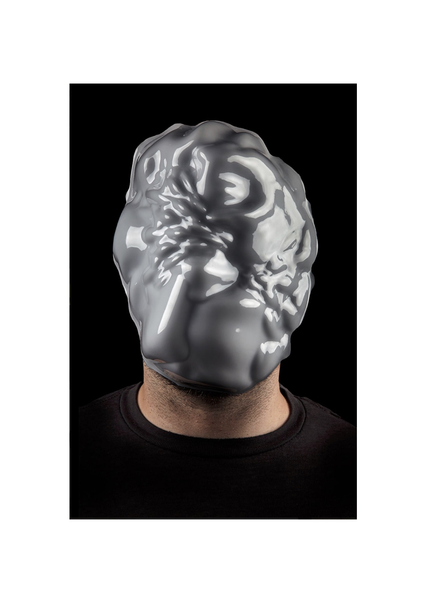
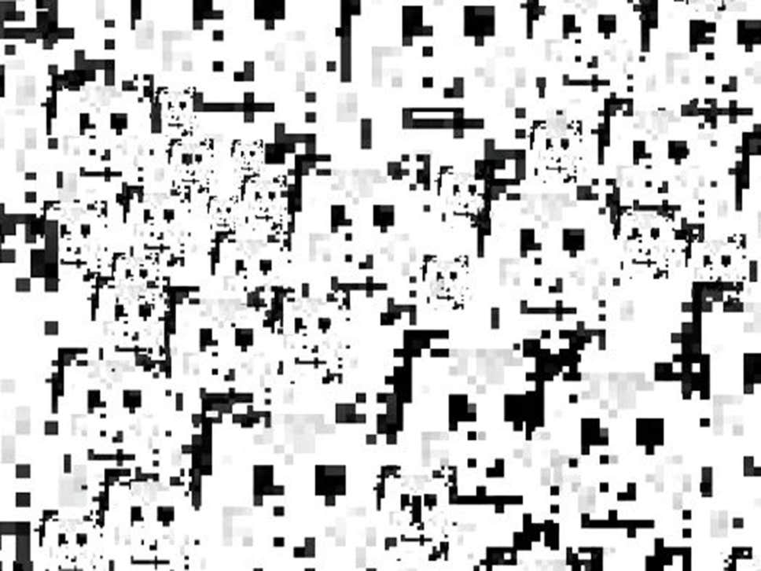

# Algorithmic Anxiety in Contemporary Art: A Kierkegaardian Inquiry into the Imaginary of Possibility

# Colophon

Theory on Demand #34
 **Algorithmic Anxiety: A Kierkegaardian Inquiry into the Imaginary of Possibility**

Author: Patricia de Vries
 
 Editing: Scott Wark
 Production: Sepp Eckenhaussen
 Cover design: Katja van Stiphout
 
 Supported by the Amsterdam University of Applied Sciences, Faculty of Digital Media and Creative Industries.
 
 Published by the Institute of Network Cultures, Amsterdam, 2019
 ISBN

**Contact**
 Institute of Network Cultures
 Phone: +3120 5951865
 Email: info@networkcultures.org
 Web: http://www.networkcultures.org

This publication is published under the Creative Commons
Attribution-NonCommercial-NoDerrivatives 4.0 International (CC BY-NC-SA
4.0) licence.

This publication may be ordered through various print-on-demand-services
or freely downloaded from http://www.networkcultures.org/publications.

# Contents

<a href="ch004.xhtml">Introduction: From Algorithms to Algorithmic Culture</a>

<a href="ch005.xhtml">1\.  From Algorithmic Culture to Algorithmic Anxiety</a>

<a href="ch006.xhtml">2\. Masked and Camouflaged: Thwarting Off FacialRecognition Algorithms, or The Possibility of Self</a>

<a href="ch007.xhtml">3\. A Specter, a Deity and a Flood in the Black Box of Finance, or the Possible in the Actual</a>

<a href="ch008.xhtml">4\. Walking in Circles in the Search Engine, or Collecting the Possible</a>

<a href="ch009.xhtml">Conclusion: From Algorithmic Anxiety to Algorithmic Possibility, or Movement at the Spot</a>

<a href="ch010.xhtml">Bibliography</a>

<a href="ch011.xhtml">Acknowledgments</a>

<a href="ch011.xhtml">About the Author</a>

# Introduction: From Algorithms to Algorithmic Culture

For a long time, artistic engagement with algorithms was marginal in
contemporary art.

Over the past eight years, however, a growing number of artists and
critical practitioners have become engaged with algorithms, resulting in
algorithmic theatre, bot art, and algorithmic media and performance art
of various kinds, which thematize the dissemination and deployment of
algorithms in everyday life. The numerous art exhibitions that have been
curated over the past years in art institutions, at festivals, in
galleries and at conferences — both large and small — in Europe, the
Americas, Canada, and in China, reflect this rising prominence of
algorithmic art. These exhibitions aim at imagining, representing and
narrativizing aspects of what is called algorithmic culture: for
instance, in exhibitions that address the modulation of behavior and
algorithmic governance; shows on algorithmic capitalism and data
surveillance; shows on self-quantification; as well as shows on
information technology and cybernetic culture and human and machine
relations in general. Indeed, one might say, in the spirit of Langdon
Winner, that ‘algorithm’ is a word whose time has come. If theorists
of media and technology are to be believed, we live in an ‘algorithmic
culture’.[^intro_1] [^intro_2] [^intro_3]

Algorithms sort, search, recommend, filter, recognize, prioritize,
predict and decide on matters in a range of fields. They are embedded in
high-frequency trading in the financial markets and in predicting crime
rates through data profiling, for instance. They are deployed to analyze
traffic, to detect autoimmune diseases, to recognize faces, and to
detect copyright infringements. Mundane aspects of our lives, such as
work, travel, play, consumption, dating, friendships, and shopping are
also, in part, delegated to algorithms; they've come to play a role in
the production of knowledge, in security systems, in the partners we
choose, the news and information we receive (or not), the politicians we
vote for, the jobs we get (or not). They also help automate routine
jobs, and they are used in drone warfare, education evaluations, social
services, and in numerous other fields. A time of ubiquitous algorithmic
computing is ‘firmly established’, writes Rob Kitchin.[^intro_4]

Ted Striphas describes this developing algorithmic culture as a ‘shift’
which first began 30 years ago, as humans increasingly started to
delegate ‘the work of culture – the sorting, classifying and
hierarchizing of people, places, objects and ideas – to computational
processes’.[^intro_5] Aspects of everyday life are increasingly delegated to
algorithms and accompanied by an algorithmic type of rationality.[^intro_6]
‘The algorithmic’, Paul Dourish observes, has become incorporated into
broader and ongoing conversations about how our lives are shaped and
organized.[^intro_7] Algorithms are part of mechanisms that privilege
quantification, proceduralization and automation in human endeavors,
Tarleton Gillespie argues.[^intro_8] Further, Taina Bucher contends that as
everyday life increasingly takes place in and through an algorithmic
media landscape, algorithms co-produce social life and political
practices.[^intro_9] ‘In ranking, classifying, sorting, predicting, and
processing data, algorithms are political in that they help to make the
world appear in certain ways rather than others’.[^intro_10] They do so, to an
extent, in ways that are invisible to the human eye — an effect of,
amongst other things, proprietary laws and regulations, computational
scale, speed and complexity. This is why Gillespie argues algorithms
remain outside human grasp, that there is something ‘impenetrable’ about
their performance.[^intro_11] Their pervasiveness, the claim that algorithms
shape our socio-technical world, the alleged ‘merging of algorithms into
the everyday’, and the notion that they are ‘taking decisions out of the
hands of human actors’ are all taken to be indicative of the ways
algorithms have become a critical infrastructural element of
contemporary life.[^intro_12] Like infrastructure, algorithms have become a
key site and gatekeepers of power and power relations.[^intro_13]

Altogether, this has made for an intriguing art object — invisible yet
omnipresent, proprietary yet pervasive, and with assumed socio-political
powers that co-produce our lives — and a burgeoning field in
contemporary art. The claim that algorithms shape, organize and
co-produce everyday life, in ways that vary from the seemingly quotidian
to the heavily politicized, has not only inspired artists, it has also
given impetus to anxieties about the present and future of algorithmic
culture in light of these developments. It seems ‘the algorithmic’ and
‘algorithmic culture’ have become shorthand for a nexus of concerns
about the entanglement of the social and the algorithmic. Having visited
numerous exhibitions thematizing algorithmic culture, what I have found
striking is the high volume of artistic engagements with facial
recognition algorithms, trading algorithms and search engine algorithms.
It seems these types of algorithms have garnered more artistic responses
than other types of algorithms. What is more, a limited number of
artworks that engage explicitly with these three types of algorithms
have been circulating widely; they have been included again and again
and again in a wide range of thematized group exhibitions on different
aspects of algorithmic culture throughout Europe, Canada, and the
Americas. Some of the artists of these works received a great deal of
attention in the international press and have given numerous lectures at
international art and digital culture conferences, festivals, and other
public events. This attention on facial recognition algorithms, trading
algorithms and search engine algorithms might not be surprising. After
all, facial recognition algorithms, trading algorithms and search engine
algorithms are associated with a range of concerns and uncertainties
about the deployment, future developments, and possible implications of
algorithms. Facial recognition algorithms are associated with repressive
political regimes, with influencing people’s personal decisions, with
amplifying racism, sexism and homophobia, with deep fake videos, and
with preempting political dissent. Trading algorithms are linked to the
global financial crisis, volatility on the financial markets, and are
said to undermine open societies and markets. Search algorithms are
blamed for filter bubbles, the spread of fake news, and the
corporatization of online information. Taken together, these three types
of algorithms address significant supra-individual anxieties of this
decade: socio-political uncertainty, the global economic crisis and
ongoing recession, the centralization and financialization of access to
online information, and political polarization and instability.

However, what *underpins* of these anxieties and why these three types
of algorithms form the subject of critique is rarely interrogated, less
so when this criticism takes the form of artistic portrayals. This is
one issue that I wish to address.

This renewed artistic attention to algorithms in general — and facial
recognition algorithms, trading algorithms and search engine algorithms
in particular — would not have surprised Marshall McLuhan, who wrote in
*Understanding Media: The Extensions of Man* that reflections on new
media technologies require the artistic eye: ‘The serious artist is the
only person able to encounter technology with impunity, just because he
is an expert aware of the changes in sense perception’.[^intro_14] Such a
statement might ring too Romantic for our time. I do not agree with his
notion that *only* artists can understand the days and age we live in.
However, there is a shortage of scholarship that relates algorithms to
the broader artistic and cultural contexts in which they are embedded.
Reflections on algorithmic culture require materializing what is,
mostly, invisible, and this is done, *in part*, by artists from various
perspectives and disciplines. What is lacking is an analysis of how the
algorithm is *imagined*, represented, and narrativized by artists, which
can also be understood as an effect of algorithms in and of itself.
Artworks are sites of meaning on which ideas and stories about
algorithms are circulated, stretched, organized, and shaped. Therefore,
I use prominent artistic representations of facial recognition
algorithms, trading algorithms and search algorithms as the entry point
into an exploration of the constituents of the anxieties braided around
these algorithms.

Focusing on the artistic portrayals of algorithmic entanglements takes
us away from questions revolving around what, when, and where algorithms
*are*. While acknowledging that technical details about algorithms are
important, I aim to respond to the idea that algorithms ‘do’ things
beyond their technical capabilities. There is nothing novel about
algorithms — depending on one's definition, they can be traced back to
Babylonian times. The question we must therefore ask is why algorithms
arise *now* as objects of concern, not just for artists but for
academics and numerous commentators in a variety of fields. Should we
see them as synonymous with the anxieties about Big Tech? What is the
object of concern, the input or the output of algorithms? And which came
first: the data or the algorithm? If data and algorithms are mutually
dependent, can we analyze them separately? Should we perhaps write a
typology of all existing types of algorithms, down to the technical
minutiae of lines of computer code? Do we need to study their formal
automation structures, or rather the mathematical formulae with which
they calculate? Should we instead study the instructions for navigation,
the parameters, the encoded procedures that transform input data into
output data? Or should we study the entire software ecology that
supports them? Should we historicize the algorithm and situate it within
the persistent modernist desire for mechanization and automation? Are
algorithms agents, objects or artefacts, or merely automated statistics?
Particular algorithms often operate as part of a collection of
algorithms that are part of networked systems, which raises the
question: *Where* is ‘the algorithm’? Plus, algorithms are constantly
tweaked and honed, and thus constantly change. Thus: *When* is ‘the
algorithm’? Put simply: ‘the algorithm’ is more than the sum of its
parts, it stands for more than its technical capabilities. As David Beer
puts it:

> The algorithm is now a cultural presence, perhaps even an iconic
> cultural presence, not just because of what they can do but also
> because of what the notion of the algorithm is used to project. \[W\]e
> need to develop an analysis of the cultural prominence of the notion
> of the algorithm, what this stands for.[^intro_15]

These questions inform the investigation of algorithms in this book.
Nevertheless, the approach to algorithms it will take is slightly
different or perhaps even unexpected.

Outstanding work on aspects of algorithmic culture has been done over
the years. Drawing on software studies, philosophy of technology,
ethics, media studies, race and gender studies, decolonial studies, STS,
and social sciences, thorough critical research has been conducted on
algorithmic culture from a wide variety of disciplines.[^intro_16] However,
one crucial aspect of algorithmic culture that has yet to be studied by
scholars working in these fields is the anxieties that underpin the
cultural prominence of algorithms. This aspect of the algorithm is a
recurrent theme of commentary on these computational processes. It is
also central to our experience of algorithmic culture. It therefore
merits closer reading. My investigation of the algorithm will focus on
the anxieties that undergird our relation to them. To analyze the
anxieties that surround algorithms, I propose that the work of Søren
Kierkegaard — one of the first theorists of anxiety — can help us to
investigate and to analyze different anxieties about algorithmic culture
critically. Much has been written on Kierkegaard's conception of
anxiety, but it has not been applied to anxieties around algorithmic
culture. Doing so obviously brings his work into a context that it could
not have anticipated, yet one in which it will be useful nonetheless.

In *The Concept of Anxiety*, Kierkegaard argues that anxiety, different
from fear, has no object and no determinate character.[^intro_17] When one
feels anxious, one’s anxiety is caused by nothing in particular or a
‘not-yet’ of unknown character. Anxiety is a term for a concept, an
experience and a response to events and phenomena that are not knowable,
not fully graspable, ambiguous or vague. One is not anxious about
‘persons’ or ‘finitudes’, Kierkegaard explains.[^intro_18] One is also not
anxious about yesterday either because anxiety is future-oriented.
Though it may be felt in the here and now, in your body, anxiety points
to the future, to the not yet and the yonder. We are anxious about
possible future events and phenomena that we cannot anticipate, know, or
predict. It is the radical openness of the future or, put another way,
the inability to fully comprehend or know the future, which conditions
anxiety.

This radical openness of the future is what Kierkegaard calls
possibility or the possible. Kierkegaard writes that when anxiety
seizes, one is seized by the possible. The possible is about future
possibility — a condition that is not. Therefore, he argues, possibility
— and, counterintuitively, not *im*possibility — ‘is the most difficult
of all categories’.[^intro_19] He writes: ‘In possibility all things are
equally possible and anyone truly brought up by possibility has grasped
the terrifying just as well as the smiling.’[^intro_20] Everything is possible
within the possible, and ‘everything’ includes the unthinkable,
unknowable and unimaginable. If everything were not possible, there
would be no possibility, and the future would then be to a great extent
calculable, predictable, probable, which does not mean that people do
not try to predict the future or aim to reduce risks with the help of
calculations and probabilities. However, that does not change anything
about the fundamental openness of the future, according to Kierkegaard,
as ‘\[a\]nxiety is freedom’s possibility’.[^intro_21] Without possibility
there would be no anxiety, because ‘anxiety is freedom's actuality as
the possibility of possibility’.[^intro_22] Anxiety is about what is possible,
and what is possible is fundamentally unknown to mortals. Further,
‘learning to be anxious’ means to not avoid it altogether nor being
ruined by it, but to learn to ‘live through’ it.[^intro_23] Importantly, it
entails being aware ‘that absolutely nothing can be demanded of life,
and that horror, perdition, and annihilation live next door to every
human being’.[^intro_24] It has to do with the vague awareness that sudden
‘cataclysmic events’ are as much a part of life as the moments of
serenity and joy.[^intro_25]

Further, for Kierkegaard anxiety is both an ontological and
epistemological concept. In *The Concept of Anxiety*, he argues that all
epistemology is rooted in anxiety and those moments of anxiety are
fundamental to human existence. Importantly, anxiety is not merely a
personal feeling; it is grounded in the social, Kierkegaard explains in
*The Present Age: On the Death of Rebellion*.[^intro_26] Referring to
Kierkegaard, and writing on anxiety, Sianne Ngai explains this
connection between anxiety, ontology and epistemology in *Ugly Feelings*
as follows:

> \[T\]here is an indissociable relation between affect and concept in
> which every cognitive structure is said to presuppose a mood — so much
> so that an error in the modulation becomes just as disturbing as an
> error in the development of thought.[^intro_27]

Anxiety is also a social emotion. Ngai explains:

> \[F\]eelings are fundamentally ‘social’ as the institutions and
> collective practices that have been the more traditional objects of
> criticism (as Raymond Williams was perhaps the earliest to argue in
> his analyses of ‘structures of feelings’) \[…\] and “infrastructural”
> in its effects.[^intro_28]

Understood this way, anxiety gives shape to the ways in which the
entanglement of the social and the algorithmic is conceived, while this
entanglement also harbors beliefs and structures of feeling and
understanding. It pertains to possible future forms of being, presence
and knowledge in entanglement with algorithms that are uncertain or
unknown to us. The prominent artistic engagements I focus on are
emblematic of ways of perceiving the entanglement with algorithms that
can be described as structured by anxiety. What I will call ‘algorithmic
anxiety’ refers to the ways in which anxiety — as both an ontological
and epistemic concept — is shaped by anxieties about the future of
algorithmic culture, which shapes perceptions of algorithms in the
present and which, in turn, is reflected in prominent contemporary
artworks that address specific practices of facial recognition, trading
algorithms and search algorithms.

Of course, one might argue that the anxiety around algorithms, in
general, is the umpteenth version of the age-old trope of the fear of
what Langdon Winner called autonomous technology. Another might claim
that algorithmic anxiety is nothing more than a reassertion of a type of
Romantic humanism which arises as a result of socio-technical
developments that put pressure on the boundaries of a particular
symbolic order. Indeed, anxiety about algorithms seems to be synonymous
with the anxiety about the totality of information technology, with
networks of ultra-speed data travelling and the management of its
protocols by state institutions and for-profit corporations. Some could
argue that anxiety around algorithms is part of the anxiety about the
‘societies of control’[^intro_29] or ‘control societies’[^intro_30]. Furthermore,
others might say algorithms are imbued in histories of war-time
machinery and colonialism, which intersect with mechanisms of
bureaucratization and the management and control of human endeavors, as
well as with the long histories of statistics, accounting, and
quantification. This might be true, in part or in whole; I do not mean
to argue against this. However, to acknowledge these claims does not
address the question of why specific aspects and implementations of
algorithms are at the forefront of critique rather than others. More
specifically, it leaves open how specific algorithms are imagined such
that they are generative of different anxieties that seem to reach far
beyond their specific and respective technological capabilities. Facial
recognition algorithms trigger different anxieties than search
algorithms, which trigger different anxieties than trading algorithms,
which trigger different anxieties than facial recognition and search
algorithms.

This leads me to the central question that structures this book: What
anxieties are interwoven with algorithms as represented within prominent
art practices and how is the possible constituted therein?

The concept of algorithmic anxiety will be developed in the following
chapters. To flesh out this concept, I use what is called a
‘concept-based methodology’ to read prominent artistic engagements with
facial recognition, trading algorithms and search algorithms alongside
Kierkegaard’s conception of anxiety.[^intro_31] Algorithmic anxiety builds on
Kierkegaard’s conception of anxiety, yet, by using it to think
contemporary algorithmic culture, inevitably also moves beyond it. I do
not use Kierkegaard’s conception of anxiety as a looking glass through
which artworks are analyzed or explained. Rather than presupposing what
algorithmic anxiety might be, I will develop a concept of algorithmic
anxiety through its engagements with artworks that engage with
algorithms and the interplay between these artworks and Kierkegaard's
conception of anxiety. In order to think further about its implications
in today’s algorithmic culture, concepts from the fields of philosophy,
science and technology studies, algorithmic studies, comparative
literature, as well as from cultural studies and media studies, will be
put into dialogue with concepts and motifs present in the artworks. This
concept-based method helps to understand why specific types of
algorithms inspire anxiety more than others, and how algorithms gain
meaning beyond their input and output, the code they run on, the data
they process, or the specific corporate and technical infrastructural
contexts in which they operate. I aim to contribute to discussions about
how the entanglement of the social and the algorithmic is perceived, in
different instances and from different perspectives, such that it evokes
anxiety.

Chapter 1 comprises the conceptual framework of this book. I first
introduce key anxieties discussed in academic studies on the
entanglement of humans with facial recognition, trading algorithms and
search algorithms. I then move on to Kierkegaard's conception of
anxiety. Since I aim to contribute to a better understanding of the
underpinning of the anxieties about specific types of algorithms, the
first question I want to raise is: What does it mean to speak of anxiety
in Kierkegaard's conception of the term? Chapter 1 provides an outline
of Kierkegaard's account of anxiety and, specifically, how it is
conceptualized in relation to his other vital concepts that inform his
work on anxiety: the self, faith, knowledge and the possible. Chapter 1
closes with a preliminary sketch of the concept of algorithmic anxiety.

After this preliminary sketch of some of the critical constituents of
algorithmic anxiety, the subsequent Chapters 2, 3 and 4 are each
organized around an artistic portrayal of a particular algorithmic
process: facial recognition, trading and search algorithms,
respectively. Algorithmic anxiety in contemporary art takes different
forms. In one more dominant trend, artists reflect on how algorithmic
culture affects conceptions of self and values like freedom,
transparency, autonomy, or objectivity. Other artists seek to
materialize the alleged immateriality of trading algorithms. Some mock
the trust in algorithmic computing; others soak it up. Yet others deploy
algorithms to specific political ends to criticize the rationality
behind some of their features. Each of these artistic portrayals of
algorithms performs and produces different anxieties. Each of these
chapters is framed by a close reading of a number of these artworks. I
develop the concept of algorithmic anxiety through a close reading of
the recurring motifs and concepts in particular artistic imaginaries,
drawing on masks and camouflage (Chapter 2); hybrids and specters
(Chapter 3); and collectors and collections (Chapter 4). Artists design
face masks and camouflage wear, evoke specters and hybrids, and imagine
infinite collections to narrativize and imagine the evolving and
ambiguous phenomena of ‘the algorithmic’. The inherent ambiguity of the
range of concepts and motifs that I engage with is part of the dynamic
of algorithmic anxiety that I will contextualize and conceptualize.

It has to be noted that the artworks I have selected for analysis are
preponderantly made by Western artists who have received a great deal of
critical attention and who have been exhibited repeatedly in art
exhibitions about algorithmic culture primarily — but not exclusively —
in Western Europe and the U.S. This focus on Western artists in Western
exhibitions is for reasons of access: over the past seven years, I have
visited numerous exhibitions on algorithmic culture, mainly in Western
Europe and in the U.S., that reflected an anxiety that one could also
find in popular and mainstream Western media reports — written in
languages I can read — on the developments of algorithmic culture. That
said, the examples covered provide a thorough cross-section of
contemporary art about algorithms.

Chapter 2 explores mask and camouflage wear designed by artists in an
attempt to thwart off and criticize facial recognition algorithms. It
focuses on Zach Blas’s *Facial Weaponization Suite* (2012), Adam
Harvey’s *HyperFace* (2017), and Sterling Crispin’s *Data-Masks* (2014),
offering a reading of these prominent artworks in relation to
Kierkegaard’s conception of the self as a synthesis between the finite
and the infinite. The algorithmic capture of the face causes anxiety
partly because of the powerful capabilities with which facial
recognition technology is associated. In this chapter, I explore how the
self is performed in these mask and camouflage works and how a
Kierkegaardian conception of the self presents a play with relations
between self, environment and the algorithmic medium of capture.
Combined with a Kierkegaardian notion of the self as a relational
synthesis, masks and camouflage show the possibilities inherent in
emphasizing different forms of being and relating — such as
interdependency, community, collaboration, and collectivity — which may
defy anxieties evoked by facial recognition technology.

Chapter 3 centers on the close reading of prominent artworks that engage
with trading algorithms. Algorithmic trading causes anxiety in part
because the infrastructure of trading algorithms is conceived as an
invisible and impenetrable black box, impervious to change. This chapter
uses Rita Felski’s concepts of ‘digging down’ and ‘standing back’ to
distinguish between two popular artistic approaches to trading
algorithms. Artists that ‘stand back’ visualize aspects of the
infrastructure of the black box of finance, such as server racks, cables
of different kinds, and market index graphs. This rendering visible of
supposedly invisible aspects of the black box of finance is perceived as
a key to grasp and open it. The second approach is characterized by
artists that in various ways tinker with or reenact the inner workings
of aspects algorithmic trading. Both tend to focus on, and add emphasis
to, a limited set of infrastructural aspects of algorithmic trading.
This is followed by an analysis of a third approach which focuses on a
spectral imaginary of trading algorithms, exemplified in this chapter by
Emma Charles’ experimental video artwork, *Fragments on Machines*
(2013), and Femke Herregraven’s work *Pull everything, pull everything*
(2018). Their spectral imaginary of trading algorithms focuses on the
broader relational context within which algorithmic trading is embedded.
What is more, their spectral representations allude to subversive and
possibly catastrophic events under which change becomes possible. To
unpack the relation between catastrophe and change, I read these
artworks alongside Kierkegaard’s notion of the possible.

Chapter 4 engages with the anxieties that Google's search engine evokes.
This chapter focuses on Google primarily because it is the most used
search engine, at least in Europe and the U.S.: this service evokes
anxiety about the abuse of aggregated data and the for-profit logic
behind the algorithmically ranking and listing of search results. In
response, artists have created alternative search engines, or perform or
ridicule specific features of Google’s search engine. Another recurring
motif in artistic representations of web searches is the act of
collecting or the formation of a collection. Camille Henrot’s
experimental film *Grosse Fatigue* (2013) frames web search as a form of
collecting and refers to Walter Benjamin's conceptualization of the
collector. When read alongside Kierkegaard’s notion of the relation
between faith and knowledge, I argue that *Grosse Fatigue* offers a
repositioning, a different relation, to the pervading discourse on the
centralised, monetized and monopolized structures of Google's search
engine. Further, by adopting a Kierkegaardian understanding of the act
of collecting as a passionate act, I argue that we can develop a way out
of search anxiety by moving towards what exceeds it.

In the final chapter I draw the preceding analyses together. I offer
explanations as to why specific algorithms trigger algorithmic anxiety,
and it provides reflections on how to live through it. The central
Kierkegaardian concept of this chapter, which ties together the concepts
discussed in the previous chapters, is ‘movement at the spot’. Movement
at the spot is a way to relate to possibility, and it will be framed as
a productive form of living through algorithmic anxiety. To move at the
spot is to make room for alternative imaginations and possibilities in
order to live with and through algorithmic anxiety. In this chapter, the
alternative imaginations of masks and camouflage (Chapter 2), hybrids
and specters (Chapter 3), collectors and collections (Chapter 4) will be
framed as figures of movement at the spot. These figures of motion show
that the algorithmic structures we inhabit and that inhibit us can be
opened by moving beyond the limitations detected by algorithms. They
point to the many contradictory relations within algorithmic culture and
represent different ways to relate to possibility, in order to live
through algorithmic anxiety.

[^intro_1]: A. Galloway, *Gaming: Essays on Algorithmic Culture*, Minnesota:
    Minnesota University Press, 2006.

[^intro_2]: T. Striphas, ‘Algorithmic Culture’, *European Journal of Cultural
    Studies*, 18.4-5 (2015): 395-412.

[^intro_3]: P. Dourish, ‘Algorithms and Their Others: Algorithmic Culture in
    Context’, *Big Data & Society* (2016):
    https://doi.org/10.1177/2053951716665128.

[^intro_4]: R. Kitchin, ‘Thinking Critically About and Researching
    Algorithms’, *Information, Communication & Society*, 1 (2016), 14.

[^intro_5]: Striphas, ‘Algorithmic Culture’, p. 395.

[^intro_6]: E.g. O. Halpern, *Beautiful Data: A History of Vision and Reason
    Since 1945*, London: Duke Press, 2014

[^intro_7]: Dourish, ‘Algorithms and Their Others’, 1.

[^intro_8]: Dourish, ‘Algorithms and Their Others’, 27.

[^intro_9]: T. Bucher, *If... Then: Algorithmic Power and Politics,* Oxford:
    Oxford University Press, 2018.

[^intro_10]: Bucher, *If... Then*, 3.

[^intro_11]: T. Gillespie, ‘Algorithm’, in *Digital Keywords: A Vocabulary of
    Information Society and Culture*, edited by B. Peters, Princeton:
    Princeton University Press, 2016, 26.

[^intro_12]: D. Beer, ‘The Social Power of Algorithms’, *Information,
    Communication & Society*, 1.20 (2017), 5.

[^intro_13]: E.g. Bucher, *If… Then*; J. Cheney-Lippold, *We Are Data:
    Algorithms and the Making of Our Digital Selves,* New York, NY: New
    York University Press, 2017; Kitchin, ‘Thinking Critically About and
    Researching Algorithms’; C. O’Neil, *Weapons of Math Destruction:
    How Big Data Increases Inequality and Threatens Democracy,* Largo:
    Crown Books, 2016; N. Diakopolous, *Algorithmic Accountability
    Reporting: On the Investigation of Black Boxes*, New York, NY:
    Columbia Journalism School, Tow Center for Digital Journalism, 2014;
    M. Lenglet, ‘Conflicting Codes and Codings: How Algorithmic Trading
    Is Reshaping Financial Regulation’, *Theory, Culture &
    Society*, 28.6 (2011): 44-66; D. Beer, ‘Power Through the Algorithm?
    Participatory Web Cultures and the Technological Unconscious’, *New
    Media & Society*, 11.6 (2009): 985–1002.

[^intro_14]: M. McLuhan, *Understanding Media: The Extensions of Man,* edited
    by W. Terrence Gordon, Berkeley: Gingko Press, 2003, 31.

[^intro_15]: Beer, ‘The Social Power of Algorithms’, 11.

[^intro_16]: E.g. A. MacKenzie, *Cutting Code: Software and Sociality*, New
    York: Peter Lang, 2006; L. Nakamura, ‘The Socioalgorithmics of Race:
    Sorting It Out in Jihad Worlds’, *The New Media of Surveillance*,
    edited by Kelly Gates and Shoshana Magnet, New York, NY: Routledge,
    2009; S. Browne, ‘Digital Epidermalization: Race, Identity and
    Biometrics’, *Critical Sociology,* 36.1 (2010); Diakopoulos,
    ‘Algorithmic Accountability Reporting’; M.B.N. Hansen,
    *Feed-Forward: On the Future of Twenty-First-Century Media*,
    Chicago: University of Chicago Press, 2015; Kitchin, ‘Thinking
    Critically About and Researching Algorithms’; O'Neil, *Weapons of
    Math Destruction*; Cheney-Lippold, *We Are Data*; R. Richardson, J.
    Schultz, and K. Crawford, ‘Dirty Data, Bad Predictions: How Civil
    Rights Violations Impact Police Data, Predictive Policing Systems,
    and Justice’, *New York University Law Review Online*, 2019,
    https://www.nyulawreview.org/online-features/dirty-data-bad-predictions-how-civil-rights-violations-impact-police-data-predictive-policing-systems-and-justice/.

[^intro_17]: S. Kierkegaard, *The Concept of Anxiety: A Simple Psychologically
    Oriented Deliberation in View of The Dogmatic Problem of Hereditary
    Sin*, edited and translated by A. Hannay, New York, NY: Liveright
    Publishing Company, 2014(1844).

[^intro_18]: S. Kierkegaard, *The Concept of Anxiety*, 259.

[^intro_19]: S. Kierkegaard, *The Concept of Anxiety*, 257.

[^intro_20]: S. Kierkegaard, *The Concept of Anxiety*, 257.

[^intro_21]: S. Kierkegaard, *The Concept of Anxiety*, 256.

[^intro_22]: S. Kierkegaard, *The Concept of Anxiety*, 86.

[^intro_23]: S. Kierkegaard, *The Concept of Anxiety*, 255.

[^intro_24]: S. Kierkegaard, *The Concept of Anxiety*, 257. Kierkegaard
    experienced much suffering. By the time he was 21 years of age, he
    had lost his mother and five of his six siblings. His father would
    die a few years later. He also suffered from a spinal disease,
    epilepsy, and from what was then called melancholia.

[^intro_25]: M. Ruefle, *Madness, Rack, and Honey,* Seattle and New York: Wave
    Books, 2012, 112.

[^intro_26]: S. Kierkegaard, *The Present Age: On the Death of Rebellion*,
    translated by A. Dru, New York and London: Harper Perennial,
    2010(1846).

[^intro_27]: S. Ngai, *Ugly Feelings,* Cambridge: Harvard University Press,
    2005, 228.

[^intro_28]: Ngai, *Ugly Feelings*, 25.

[^intro_29]: G. Deleuze, ‘Postscript on the Societies of Control’, *October*,
    59 (1992): 3-7.

[^intro_30]: A. Galloway, *Protocol: How Control Exists After
    Decentralization*, Cambridge, MA: The MIT Press, 2004.

[^intro_31]: M. Bal, *Travelling Concepts in the Humanities: A Rough Guide,*
    Toronto: University of Toronto Press, 2002.

# 1. From Algorithmic Culture to Algorithmic Anxiety 

> We would rather be ruined than changed
> 
> We would rather die in our dread
> 
> Than climb the cross of the moment
> 
> And let our illusions die.
>
> — W.H. Auden, *The Age of Anxiety*

The point of departure of this chapter is the observation that facial
recognition algorithms, trading algorithms and search algorithms have
become addressees of anxiety in public debate, in academic disciplines,
and contemporary art. The entanglement of human beings in algorithmic
networks has become a cause of concern for artists and critics alike.
The anxiety evoked by algorithms is not a sentimental subjectivity or a
personal pathology related to one's feelings regarding algorithms. What
artists and academics share are worries about the possible effects
caused by the developing entwinement of humans with algorithms on
societies and the people living in them. This has created a fervor
around the supposed corresponding loss of certain aspects of the self,
of what constitutes visible reality, and of the possible affordances of
algorithmically produced information on socio-political relations.

As mentioned in the introduction, I am not primarily concerned about the
computational, mathematic or technical aspects of algorithms — what they
are or what they do. Neither do I seek to find one underlying and
comprehensive cause for a multitude of anxieties, as that would not do
justice to the different concerns algorithms raise and also runs the
risks of falling in the trap of generalization. The different anxieties
conditioned by different types of entanglements reveal a more
complicated image. Therefore, the following chapters are structured
around specific types of algorithms and the different anxieties they
inspire.

To start this chapter, I briefly introduce the main focus points of
concern in the academic literature about the close-knit relationship of
humans to algorithms — namely, what I describe as algorithmic
governance, algorithmic selves, algorithmic opacity, and algorithmic
replacement. In the second part of this chapter, I present an outline of
the central concepts and dynamics that structures Kierkegaard's
conception of anxiety — the self as a synthesis, the limits of
knowledge, and the possible. Anxiety concerns the possibility of the
possible. The possible exceeds the self and defies rationalization,
systematization, prediction, and calculation. After sketching out the
major constituents of Kierkegaard’s account of anxiety, I move to and
close this chapter with a first rough sketch of the concept of
algorithmic anxiety, which will be further developed in the chapters
that follow this one.

## Algorithmic Governance

Concerns about the dynamics and mechanics between algorithmic systems
and human actors and between the facial recognition algorithms, trading
algorithms and search algorithms and the social seem to be widely shared
amongst a growing group of academics. Algorithms, in general, are
associated with having and exerting commanding powers. The nature and
extent of these powers are based on the different ideas critics have of
how algorithms organise, produce, order or impede socio-political life.
Nicholas Diakopoulos, for instance, sees algorithms as powerful
wire-pullers. He writes: ‘We're living in a world now where algorithms
adjudicate more and more consequential decisions in our lives.
Algorithms, driven by vast troves of data, are the new power brokers in
society’.[^ch01_1] In *Weapons of Math Destruction: How Big Data Increases
Inequality and Threatens Democracy,* Cathy O’Neil writes that decisions
such as whether someone gets a job, gets into a particular college, gets
sentenced to jail, gets a loan or is considered a possible fraud, is
increasingly controlled by algorithmic routines.[^ch01_2] What she calls
‘weapons of math destruction’ are ‘churning away in every conceivable
industry’.[^ch01_3] This situation ‘slams doors in the face of millions of
people, often for the flimsiest of reasons, and offer no appeal’, she
argues.[^ch01_4] Antoinette Rouvroy and Thomas Berns speak of ‘algorithmic
governmentality’.[^ch01_5] They argue that the ubiquity and trust in
algorithms and the logic of numbers on which they are centered mark a
‘transition from statistical governance to algorithmic governance’ and
that this algorithmic governmentally can be described as ‘a type of
rationality founded on the automated collection, aggregation and
analysis of big data so as to model, anticipate and pre-emptively affect
possible behaviours’.[^ch01_6] Algorithmic governance is self-referential,
they contend. ‘\[A\]lgorithmic governance “creates” a reality at least
as much as it records it.’[^ch01_7] Referring to Rouvroy and Berns in his
book *We Are Data: Algorithms and the Making of our Digital Selves*,
John Cheney-Lippold claims that ‘when our embodied individualities get
ignored, we increasingly lose control not just over life but over how
life itself is defined’.[^ch01_8] Matteo Pasquinelli would likely agree. He
makes a similar point when he contends that algorithms operate as an
automated bureaucracy that silently reinforces dominant patterns of
behavior, where the norm of what counts as dominant behavior is
standardized by algorithms.[^ch01_9] Tarleton Gillespie follows a similar
line. He argues that algorithms are part of mechanisms that privilege
quantification, proceduralization and automation in human
endeavors.[^ch01_10] I will discuss concerns about the algorithmic governance
of socio-political life, specifically in relation to facial recognition
algorithms in Chapter 2, and also in Chapter 3. Chapter 2 focuses on
masks and camouflage wear as artistic responses to facial recognition
algorithms, and Chapter 3 explores the spectral imaginary of trading
algorithms.

## Algorithmic Selves

As algorithms are deployed by the governments, institutions and
corporations that impact on individual lives, there is concern amongst
artists and critics about the social implications of these often
invisible and secretive algorithmic practices, specifically in relation
to the way individuals are perceived and treated. Cheney-Lippold argues,
‘who we are in the face of algorithmic interpretation is who we are
computationally calculated to be’.[^ch01_11] Who you are, he writes, is
decided by advertisers, marketeers, and governments’ their secretive,
proprietary algorithmic scripts, recasting identity ‘into the exclusive,
private parlance of capital or state power’.[^ch01_12] Data analytics firms
may mark an employee as ‘high cost’ or as ‘unreliable worker’ without
their knowledge or participation.[^ch01_13] Stefania Milan puts it thus:
‘creators, owners and exploiters of algorithms control much of our
digital life’ and ‘deeply influence our ways of making sense of
interpersonal and spatial interactions \[…\] altering our perception of
self and our relational being-in-the-world’.[^ch01_14] ‘\[I\]ndividuals,’ she
fears, ‘become merely a pile of data’.[^ch01_15] Adam Morris argues that
people are treated ‘as a conduit of wealth’ and ‘a mine of data’ to the
twin imperatives of marketing and surveillance.[^ch01_16] He associates data
mining and data profiling by companies and governments as a form of
exposure. These practices ‘give transparency to the fundamental opacity
of the population’, he argues.[^ch01_17] Finally, Tarleton Gillespie is
worried about the ways algorithms influence our notions of ourselves. He
is specifically concerned about search engine algorithms. Search
algorithms shape ways of relating to the self, Gillespie argues. He
explains how search engine algorithms self-referentially present publics
back to themselves and in doing so ‘shape a public's sense of itself’
and generate a ‘calculated publics’.[^ch01_18]

Algorithms also shape our social life. Stephanie Hankey and Marek
Tuszynski argue in *Nervous Systems* that every individual, locked
inside algorithmic filter bubbles, ‘becomes a digit, a dot, a
self-entered data point’.[^ch01_19] Our social life is ‘filtered into
patterns’, Hankey and Tuszynski claim, and in this process, subjectivity
changes fundamentally while normative patterns are reinforced,
‘flattening and smoothing out our lifeworlds and singling out any form
of dissent’.[^ch01_20] In this context, Pasquinelli writes about an
‘epistemic revolution comparable to previous paradigm shifts, displacing
the centrality of the human’.[^ch01_21] I will discuss algorithmic anxiety
about rigid algorithmic regimes that conscript the self and its
lifeworld further in Chapter 2, as part of the artistic portrayals of
facial recognition algorithms. I will also further analyze the
self-referential filter bubbles that search algorithms produce in
Chapter 4, as part of the assessment of artistic representations of
Google’s search engine algorithms.

## Algorithmic Opacity

The opacity of algorithms is another dominant concern among artists and
critics. Again and again, in art and academia, algorithms are invoked as
omnipresent yet invisible, powerful yet elusive, inscrutable yet
invasive, and shaping social worlds and the people living in them. I
address anxiety as a response to the opacity and unknowability of
algorithms repeatedly in artistic portrayals of trading algorithms and
search algorithms in, respectively, Chapters 3 and 4. For context, we
can identify several reasons for this response.

For one, algorithms' operational mechanisms cannot be observed at work.
Algorithmic routines are mostly invisible, not in the least because of
the secrecy surrounding algorithms used by tech giants, for-profit
corporations and on financial markets. ‘Many of the algorithms we
encounter daily are proprietarily owned — and thus opaque and
inaccessible to outside critique’, Michele Willson explains.[^ch01_22]
Trade-secret protection governs many of the algorithms that are used
daily, notably on the financial markets and in search engines. The
opacity surrounding algorithms has led Frank Pasquale to contend that we
live in a black box society, or a society in which ‘decisions that used
to be made by humans are now made by algorithms of which we know little
to nothing’.[^ch01_23] Pasquale calls for transparency and intelligibility of
these systems and the possibility of auditing algorithms. As regards to
search algorithms, he argues that ‘without knowing what Google actually
does when it ranks sites, we cannot assess when it is acting in good
faith to help users, and when it is biasing results to favour its own
commercial interests’.[^ch01_24] The encoded rules of algorithms, which he
calls ‘enigmatic technologies’[^ch01_25] and their concomitant values, biases
and prerogatives, are well-hidden and guarded secrets that must be
opened to inspection, according to Pasquale, because they ‘undermine the
openness of our society and the fairness of our markets’.[^ch01_26]

Secondly, according to Jenna Burrell, the opaqueness of algorithmic
systems is not limited to corporate secrecy and hence cannot be
countered by inspection. Algorithmic opacity stems from the level of
technical complexity and the expertise required to understand the entire
structure of the software algorithms are embedded in.[^ch01_27] Algorithmic
opacity also relates to the techniques used in algorithms and the
complexity of and the scale distinctive to algorithmic systems.[^ch01_28]
Machine learning algorithms, for example, are deployed in areas where
they augment or replace white-collar labor and in ‘consequential
\[classification\] processes that were previously human-determined’ —
such as credit evaluation and insurance or loan qualification, but also
in search engines, spam filters and for marketing purposes.[^ch01_29]
However, the high speed at which these algorithms calculate billions of
data examples and tens of thousands of features of data in a matter of
microseconds makes them opaque and illegible to humans. Their internal
decision logic, Burrell points out, ‘is altered as it “learns” on
training data. \[…\] While datasets may be extremely large but possible
to comprehend, and code may be written with clarity, the interplay
between the two in the mechanism of the algorithm is what yields the
complexity (and thus opacity)’.[^ch01_30] The artistic responses to the
different forms of opacity and incomprehensibility of algorithms will be
discussed predominantly in Chapter 3.

## Algorithmic Replacement

Future scenarios of human displacement or replacement by algorithms are
a topic of concern amongst critics of algorithmic culture. Anxieties
about the future self are widespread in the work of critics of
algorithmic culture. They range from scenarios of automated societies in
which fascism reigns with the helping hand of a small elite running
algorithmic systems, or — and worse — scenarios in which humans live in
the service of self-operating algorithms, that may, at some point in the
future, turn against humans when their services are no longer needed. In
his often-cited book *Automate This: How Algorithms Came to Rule Our
World* (2012), Christopher Steiner concedes, ‘the bounds of algorithms
get pushed further each day’.[^ch01_31] He argues that algorithms have
augmented and displaced human labor in a growing number of industries:
‘They’re faster than us, they’re cheaper than us, and, when things work
as they should, they make far fewer mistakes than we do.[^ch01_32] This gives
reason to pause, according to Steiner. He claims that algorithms can
evolve: ‘They observe, experiment, and learn — all independently of
their human creators.’[^ch01_33] Algorithms can create improved algorithms,
Steiner cautions. Worrying about these developments and what it means
for human agency, Steiner contends: ‘As our world shifts from one where
humans have made all of the important decisions to one in which we share
that role with algorithms, the value of superior intellect has increased
at a compounding rate.’[^ch01_34]

On the dark side of replacement theories, being outsmarted by algorithms
is taken as a warning sign for the future of human labor. In part, this
is because intelligence has been used (and is still used) as a ‘fig-leaf
to justify domination and destruction’, Stephen Cave explains in his
essay on the dark history of the concept of intelligence.[^ch01_35] Cave
argues that intelligence is a political concept with a long history as
the rationale for domination. He traces this political conception of
intelligence to Plato's *The Republic*, early Greek experiments with
democracy, and Aristotle’s *Politics*. Not inherited elites — neither
those with the strongest army, nor those who were said to have received
divine instruction — should rule, but the cleverest of men should rule
over the rest. Lest one forgets, to be counted as a citizen of the Greek
polis one had to be a European, educated, *male* citizen. Cave: ‘What
marked the ruler was his command of reason and rationality which both
justified and naturalised his rule over those deemed less intelligent,
irrational, emotional and so forth.’[^ch01_36]

According to Cave, as Westerners have justified their positions of power
and repression of others by virtue of their supposed superior
intelligence, this makes algorithms that outsmart and outperform
Westerners a possible deadly threat.[^ch01_37] Anxieties about human
replacement or displacement have found its way into prominent artworks
that engage with facial recognition algorithms, trading algorithms, and
search algorithms, to which I return in Chapters 2, 3, and 4.

## Kierkegaard’s Concept of Anxiety

In the following section, I provide an outline of the central concepts
and dynamics that structure Kierkegaard’s conception of anxiety — the
self as a synthesis and the self in despair, faith and the limits of
knowledge, and the synthesis between possibility and necessity. But to
start, a few words on Kierkegaard the author, philosopher, theologian,
Socratic ironist, humorist, and novelist.

## A few words on Kierkegaard

Most of Kierkegaard’s philosophical writings do not bear his name; they
were written pseudonymously, though some carry his name as the editor of
the book. A pseudonym makes a point of separating the author from its
written words, acting as a form of indirect communication. In the case
of Kierkegaard, it was not a strategy to protect his anonymity. Multiple
pseudonyms are used by him, creating novel-like characters; these
pseudonyms say different things and reappear in other books, for example
*Stages on Life’s Way* (1845) and *Either/Or*: *A Fragment of Life*
(1843). These pseudonyms represent different personas. In *Either/Or,*
there are multiple personas in the same book with different points of
view, each representing different philosophic standpoints. Yet, they are
all too often (self-)contradictory, too; they are divided by opposing
thoughts or reflect on the contingency of their own deliberations.
Obviously, then, one cannot understand Kierkegaard's philosophy by
reading only one book. However, reading all of his work does not give
its reader a clear and ordered idea of his thinking either. And this is
the point.

Kierkegaard opposed the way philosophy was taught at his time — which
was much dominated by Hegelians. While his contemporaries focused on
over-arching systems of thought and theories of everything, Kierkegaard
opposed this kind of philosophy by *performing* anti-systemic thinking
in his writing, by contradicting himself, taking different positions in
and within his different books, as well as by writing in different
styles and adopting a range of genres. With these different pseudonyms,
styles, genres and positions his oeuvre takes the form of one of his
central concepts, movement at the spot – that I discuss in more detail
below – as well as his conviction that one has to synthesize thinking
and being. One’s thinking ‘should bear on a person’s existence, it
should bear on how life is lived’.[^ch01_38] With the constant play of
positions and stances, he also disorients his readers in order to help
them to remain open to other perspectives and different ways of
understanding being and thinking.

Some of his books — *The Sickness unto Death* (1849)*, Repetition*
(1843) and *Either/Or* among others — are set up as a dialectical
movement between a philosophical and religious approach. But there is
also a dialectic at work within his books. A reader may find shifts in
position, from the particular to the transcendental, from unity to
multiplicity, and from interiority and exteriority — and the reverse.
Further, *The Sickness unto Death* and *The Concept of Anxiety,* the two
works in which he writes about anxiety in relation to conceptions of
self and knowledge, seem thematically related, yet differ in approach,
whilst *Philosophical Fragments* (1844) and *The Sickness unto Death*,
two works in which he writes much about the self and knowledge, seem to
form each other’s counterparts.

Kierkegaard also has a knack for turning phrases and does so throughout
many of his books. For example, subjective truth is described as an
objective uncertainty. Anxiety is described as an antipathetic sympathy.
And 'authenticity' \[*autenticitet*\], which is qualitatively different
from the notion of being ‘genuine’ or a ‘true self’, is described as
stepping into character — ‘*traadt i Charakteer’.*[^ch01_39] The meaning of
the major concepts in his work is never straight forward, and he refuses
to provide a conclusive answer to what the major concepts in his work
mean. Adding to this, Kierkegaard's oeuvre consists of journals,
letters, sermons, poetry, literature, and philosophical tractates, and
all written in diverse styles, tones, formats, and lengths. He mixes
irony with devotional comments on Biblical history, polemics with dense
philosophical writing, and epistolary writings, that at times approach
kitsch, with lyrical tales.

The pseudonyms, the shifting positions, the self-contradiction, the
rhetorical devices, the mockery, the puns, they are not made in jest,
but stress his conviction that we lack a ‘timeless’, ‘impersonal’, or
‘objective’ view from which the world can be understood. His philosophy
is not one of finding *the* truth, but one of questioning what you
thought you knew to be the truth and then questioning *that* truth, too.
Kierkegaard does not want to add to the pile of all-explaining theories,
but rather to unscrew these theories and give them a good kick.
Altogether, this makes his writings bristling with problems of
interpretation and signification. It has resulted in a notoriously
difficult body of work that is resistant to definitions and also to
citation and paraphrase because of its density, complexity and
idiosyncratic style and because of the endless winding on of conflicting
views with no clear resolution. ‘What are we to make of his conception
and your interpretation of anxiety, then?’, you may rightfully ask.
‘That it is embodied, embedded, partial, subject to interpretation, and
time-bound’, is my answer. As Kierkegaard scholar C. Stephen Evans
argues, many of Kierkegaard's ideas are inextricably intertwined, and
the best remedy to this is to sketch key related ideas — which I will
try to do in the following sections.[^ch01_40]

## The Self as a Relational Synthesis 

Kierkegaard links anxiety to forms of being, presence and knowledge.
Kierkegaard’s conception of the self differs from that which is dominant
in western philosophy, which typically views the self as private
conscience, a type of substance, an autonomous entity, or as a subject
of knowledge. In contrast, Kierkegaard rethinks the self as a relational
synthesis. In an often-cited paragraph from SUD, he explains in turgid
prose his notion of the self as a synthesis:

> But what is the self? The self is a relation that relates itself to
> itself or is the relation’s relating itself to itself in the relation…
> A human being is a synthesis of the infinite and the finite, of the
> temporal and the eternal, of freedom and necessity, in short, a
> synthesis.[^ch01_41]

The self is relational, a synthesis of contrasting elements and this
synthesis must relate to itself (become self-aware), and it must relate
to something outside of itself. To say that the self is merely a finite
being is to emphasize one side of this synthesis. It is to emphasize
gender, ethnicity, geographic location, abilities, and weaknesses and
aspects of one's social, political, and cultural habitat, which are
indeed finite. They matter to how one appears to the world, how one
appears to oneself, and how the world appears to this self, even though
it is not all that one is and no one can be reduced to these finite
aspects. Many of these things are not up to us to begin with. We cannot
freely choose our gender, ethnicity, the family we are born in, our
place of birth, or numerous other things. We are inseparable from, but
cannot be reduced to, our finitudes. We cannot be reduced to finitudes
as the self is always grounded in something other and something larger
than its finitudes. The self is both individual and social and also
exceeds the individual and the social. Kierkegaard further explains this
in *The Sickness unto Death*. He writes: ‘For the self is the synthesis
of which the finite is the limiting and the infinite the extending
constituent.’[^ch01_42] One does not *have* a self; the self is not a
substance, not a unit or a thing somewhere inside the self.
Kierkegaard's point is, I would argue, that the self is not the sum of
its finite parts but is open to the dimension of the infinite. Thus, a
human being is a synthesis of (f)actual and concrete existence and
abstract infinitude.

With his conception of the self as a relational synthesis, Kierkegaard
rejects what he calls the ‘standard of his age’ which holds the
individual responsible for their own life, without further ado. The
illusion that the individual is the creator of their own life
‘\[leaves\] the individual entirely to himself so that in a stricter
sense he becomes his own creator’.[^ch01_43] That is, within such an
understanding, the individual likens with God. Kierkegaard: ‘It leads
you to think this must be a kingdom of gods, this generation in which I
too have the honour to live. However, that is by no means the
case.’[^ch01_44] In *Either/Or,* he calls the notion of the autonomous self
‘ridiculous’.[^ch01_45] It is ridiculous because any such attempt denies the
existence of God.[^ch01_46] This is not to say that the individual has no
responsibility whatsoever, it is to say that ‘\[e\]very individual,
however original, is still a child of God, of his age, of his nation, of
his family, of his friends. Only thus does he have his truth.’[^ch01_47] It
is to say that a self is inevitably grounded, embedded and situated in
sociality, but also composed of extending constituents that transcend
other people and society. There is a constant tension between what *is*
and what *ought* to be, between necessity and possibility. In
*Concluding Unscientific Postscript*, Kierkegaard describes this dynamic
as if ‘a Pegasus and an old nag were hitched to a carriage’.[^ch01_48] The
self is the dynamic relationship between what has shaped you, or your
historicity of which you are intimately familiar, *and* infinitude and
possibility.

There is the self that is self-aware (aware of its self as a self);
there is the self that is constituted by an unchangeable past and
limited by finitudes and necessities (the self embedded and situated in
a social order with the ideals expressed by the state); and there is the
self that is constituted by possibility and infinity of (the self before
God, or the possible self.[^ch01_49] As the human self exists in relation, we
are not autonomous, and neither are we transparent to ourselves or
others, nor are others transparent to us; there is always something that
slips out of our grasp. One exists in relation, Kierkegaard explains, to
our body, to our abilities and inabilities, to the cognitive skills we
have and lack, to our surroundings, our family, our past and future, the
nation we inhabit, its culture, *and* to the extending constituents of
the infinite, the possible — to God.[^ch01_50] Human existence is the
never-ending attempt to synthesize these limiting and extending aspects,
Kierkegaard explains in *The Sickness unto Death*. It is never-ending
because this attempt to synthesis is never fully realized and, although
some people are more successful than others, tension, contradiction, and
mishap remain. ‘Through being a synthesis the human being can be made
anxious’, he writes.[^ch01_51] Which is to say, because the self is a
relational synthesis of opposites – necessity and possibility, the
temporary and the eternal and finitude and infinity – it experiences
anxiety. Anxiety follows from this delicate and wobbly synthesis that is
the self. He describes the never-ending attempt to synthesis as a
process of becoming in *Concluding Unscientific Postscript*: ‘The
process of becoming is the thinker's very existence’.[^ch01_52] This process
of becoming has no endpoint or resolution; it is a constant striving.
‘How far the subjective thinker might be along that road, whether a long
way or a short, makes no essential difference (it is, after all, just a
finitely relative comparison); as long as he is existing, he is in the
process of becoming’.[^ch01_53] Thus, although this continual striving
directed toward the infinite, the infinite remains unreachable, which
makes existence ‘as pathos-filled as it is comic’.[^ch01_54] As well as
filled with anxiety.

## Anxiety and Despair

Anxiety and despair, two connected concepts in the work of Kierkegaard,
are not personal pathologies. Kierkegaard discusses these concepts
primarily in *The Concept of Anxiety* and *The Sickness unto
Death*. Howard V. Hong argues that the two books ‘might be regarded as a
two-stage explication. Both are based on the concept of man as a
synthesis of the finite and infinite, the temporal and the
eternal’.[^ch01_55] Gregory Beabout explains in *Kierkegaard on Anxiety and
Despair* (1988) that ‘anxiety is the condition for despair’.[^ch01_56] It is
the radical openness of the possible which conditions anxiety.
Kierkegaard understands anxiety as a form of *angst* related to the
unknowability of future possibilities. Anxiety pertains to the
possibility of the possible, to possible events that are unknown and
unknowable and thus cannot be anticipated. He writes: ‘Anyone formed by
anxiety is shaped by possibility.’[^ch01_57] Anxiety seizes when one is
confronted with possibility, at a moment of possible change and the
endless possibilities of that possible change. Anxiety is undetermined
(time), vague and unstilted (ambiguous). Kierkegaard describes anxiety
as an ambiguous power, which both attracts and frightens us and demands
each one of us to relate to it.[^ch01_58] The question is how one relates to
it, how one positions itself in relation to it.

His concept of despair is mapped onto the self as a relational
synthesis. Despair, he explains in *The Sickness unto Death*, is a
mis-relationship between the relations that constitute the self, between
finitude and necessity *and* infinitude and possibility. Despair happens
when the relational synthesis is skewed to one side. In such a
mis-relationship, one side of the relation is emphasized over the other;
one side is overdeveloped, the other underdeveloped. In *The Sickness
unto Death,* Kierkegaard distinguishes different forms of despair by
reflecting upon what each form of despair lacks. Thus, when an
individual tends to infinitude, the despair they feel is caused by a
lack of finitude. Similarly, the despair of finitude lacks infinitude;
the despair of possibility lacks necessity, and the despair of necessity
lacks possibility.[^ch01_59] A person who grounds themselves merely in
infinitude is a person who gets carried away by its daydreams and
fantasies. What is missing in such a situation is ‘to submit to the
necessity in one’s life, to what may be called one’s limitations’.[^ch01_60]
And the other way around: when focused merely on one’s limitation, one
can get lost in determinism, fatalism, nihilism. What is missing then is
a sense of possibility. Despair is conditioned by a lack of balance
between the finite and infinite, necessity and possibility.

Most adults, Kierkegaard writes, are good at keeping themselves in the
dark or prefer not to relate to their despair.[^ch01_61] And there are many
ways to do so, Kierkegaard explains. Through diversions, through work
and busyness, by latching on to certainties, conventions, convictions,
traditions. Or by living ordinary lives, and by externalizing
discomfort, rationalizing feelings of unrest.[^ch01_62] In *The Present Age*,
he argues that his time is an age of anticipators and the risk-averse,
everyone is given rules and calculators to aid one's thinking.[^ch01_63] In
an attempt to escape their despair, many people try to find safety and
security in living by the numbers. This is futile, Kierkegaard argues.
This philistine-bourgeois mentality thinks that it controls possibility,
that it has tricked this prodigious elasticity into the trap or madhouse
of probability, thinks that it holds its prisoner; it leads possibility
around imprisoned in the cage of probability, exhibits it, imagines
itself to be the master, does not perceive that precisely thereby it has
imprisoned itself in the thralldom of spiritlessness and is the most
wretched of all.[^ch01_64] Those who claim never to be anxious are
earthbound. Despite necessity, despite finitude, despite the
delimitations around living as gendered bodies, of a particular ethnic
and religious descent, within certain social-economic groups, within a
specific nation and at a certain time, and despite all the precautions
taken for safety and security, there remains the possible. I will return
to Kierkegaard’s understanding of the possible below.

In the next chapter, Chapter 2, I flesh out the concept of the
relational self and how it manifests into artistic masks and camouflage
wear. Algorithmic anxiety caused by facial recognition algorithms is
about both the radical openness toward the unknown and about algorithmic
regimes that attempt to ensnare this openness. The algorithmic capture
of the face conditions despair in part because the desire for
sovereignty, autonomy, and self-transparency is perceived as being
tarnished and inhibited by the capacities with which facial recognition
technology is associated. What is missing is a sense of possibility.
However, a Kierkegaardian reframing of the meaning of the mask and
camouflage might offer a response to what seems to be a lack of
possibility.

## Faith as the Limit of Knowledge 

Another central concept of anxiety has to do with Kierkegaard's distinct
understanding of the synthesis between faith and knowledge. Kierkegaard
critiques a kind of philosophy that extends its limits. For philosophy
to be faithful to its aim requires it to be aware of its limits. In *The
Concept of Anxiety,* Kierkegaard insists that a total system of
knowledge is impossible; one has to live on the basis of faith.[^ch01_65]
Philosophy can do no more than form conceptions of faith, but is not
equipped to understand or explain it fully, Kierkegaard insists.

To start with Kierkegaard's take on knowledge: central to his argument
is that we live our lives in relationship to things that we cannot ever
be knowledgeable about. A prime villain in Kierkegaard's writings is
all-embracing and all-explaining systems of thought and the arrogance of
a way of thinking that presumes any topic can be ‘grasped’ or ‘captured’
or ‘covered’ by knowledge. He rejects a kind of thinking that assumes
knowledge is cumulative or universal or that one can throw a great book
at any given problem or dilemma.[^ch01_66] It is not for him to reject
notions of objective knowledge wholesale. It may exist, but it is not
within reach of mortals. ‘There is a knowledge in the external world’,
he writes in *Fear and Trembling*, ‘that believes it is enough to know
what is great — no other work is needed. But for this reason it does not
get bread, it perishes while everything changes to gold’.[^ch01_67] According
to Kierkegaard, knowledge is of limited use when it comes to existence.
He insists that existence cannot be reduced to systematic explanations
or rationalizations; it cannot be explained or explained away. He
laments that people are enchanted by knowledge for the sake of
knowledge. They are immersed by facts, engrossed in books, contemplating
in abstraction, without relating this knowledge to themselves, to their
relation to others, or to the spiritual world, the unknown.

One thing we cannot be knowledgeable about is God. As mentioned earlier,
according to Kierkegaard we exist in relation to God. Kierkegaard’s God
is Christian. However, it is not some entity or bearded man somewhere up
on a cloud, nor is it an all-seeing judge. In his work, Kierkegaard uses
different terms to write about God, including (but not limited to)
‘absolute freedom’, ‘possibility’, ‘spirit’, ‘the god’, ‘faith’, and
‘the unknown’. One of his more devout Christian pseudonymous personas
might be Vigilius Haufniensis in *The Concept of Anxiety,* or
Anti-Climacus in *The Sickness unto Death.* While one of his most
semi-religious pseudonymous personas might be Johannes Climacus, the
author of *Philosophical Fragments*. In discussing the unknown he
writes, ‘the ultimate paradox of thought: to want to discover something
that thought itself cannot think’.[^ch01_68] This is similar to his writings
on faith and the possible, to which I will return below. Kierkegaard
continues:

> But what is this unknown against which the understanding in its
> paradoxical passion collides and which even disturbs man and his
> self-knowledge? It is the unknown. But it is not a human being,
> insofar as he knows man, or anything else that he knows. Therefore,
> let us call this unknown the god. It is only a name we give to
> it.[^ch01_69]

It is clear that Kierkegaard’s conception of the unknown, of the limits
of knowledge, is different from a normative understanding of the unknown
as that which is ‘not known’, a ‘known negative’, a ‘known unknown’ or a
case of ‘insufficient knowledge’. A.D.C. Cake explains that the unknown
as Kierkegaard conceives it ‘cannot fall under the auspices of
understanding’.[^ch01_70] The unknown forms the incentive and torment of
understanding as it forms the frontier, the boundary of human knowledge
— of thought itself. The unknown, as Kierkegaard conceptualizes it,
cannot ever be known or grasped, as understanding cannot transcend
itself. As Cake puts it:

> \[T\]he understanding and the unknown are at odds in such a way that
> where the understanding advances, the unknown recedes; as the
> understanding seeks to subject the unknown to its established
> categories, the unknown remains indefinable. \[…\] The understanding’s
> paradoxical passion is thus the irresistible urge to subject the
> unknown to its own standard of truth, which is impossible.[^ch01_71]

One cannot describe in human terms what transcends the earthly,
Kierkegaard argues. Before continuing, I want to propose an agnostic
reading of Kierkegaard's Christian god and interpret the unknown as
unknowable abstractions to which we stand in relation but do not have
access to or knowledge of. From an agnostic perspective, what we stand
in relation to cannot fully be covered by knowledge. Sure, we are
grounded in and limited by necessity, determined by all kinds of social
forces, and yes there is causality, but there might be dimensions that
defy determinism and causation and that nonetheless affect us, perhaps
even fundamentally.

For Kierkegaard, the limits of knowledge are formed by what transcends
the earthly, which is faith. To live with faith is to open up to the
presence of things outside of the thinkable, a relating to what
transcends the earthly and the self, but what is nonetheless fundamental
to human existence.[^ch01_72] To live with faith requires to give up on the
pretense that science can explain everything.[^ch01_73] Faith is not a
theoretical construct. It is not something that can be understood by
intellectual pursuit. Importantly, neither is it the result of carefully
followed Biblical instructions or saying grace on Sunday visits to some
church. In *Fear and Trembling,* Kierkegaard writes about the relation
between faith and knowledge. Faith, he argues, flourishes in the impasse
of not-knowing. To have faith requires the ability to relate to that
which the eye cannot see and reason and logic cannot fathom. In *The
Concept of Anxiety*, Kierkegaard describes faith as that ‘which no
science has explained and which no science can explain’.[^ch01_74] When it
comes to understanding existence, we depend on faith, Kierkegaard
argues. Importantly, faith conditions the possible, without faith no
possibility. I will return this in the next section.

‘What does this synthesis of faith and knowledge mean for Truth?’, you
may ask. It would be hyperbolic to say this comes down to relativism or
subjectivism or skepticism. The truth may not be attainable, but what
Kierkegaard offers in return is subjective truth, a truth that is true
for you, or what he describes as ‘the truth of appropriation’.[^ch01_75]
Subjective truth is an idea or value you should be willing to commit
your life to. Thus, subjective truth does not preclude strong,
passionate convictions. However, subjective truth is haunted by its own
limits, by uncertainty and the unknown. Subjective truth will always
remain an ‘objective uncertainty’ as it is never granted that status of
a fact or Truth. Therefore, to choose to commit to a subjective truth is
a risky business, giving rise to anxiety, and takes courage,
perseverance, and imagination. Kierkegaard:

> Without risk, no faith… If I am able to apprehend God objectively, I
> do not have faith; but because I cannot do this, I must have faith. If
> I want to keep myself in faith, I must continually see to it that I
> hold fast the objective uncertainty, see to it that in the objective
> uncertainty I am “out on 70,000 fathoms of water” and still have
> faith.[^ch01_76]

Chapter 3 zooms in on artistic representations of algorithmic trading on
the financial markets. Engagements with trading algorithms, broadly
speaking, fall into two categories. In the first, trading algorithms are
imagined as ungraspable structures with divine-like foreknowledge and
power, inaccessible to mortals and human understanding. Algorithmic
anxiety in relation to such an understanding of trading algorithms is
similar to fears of God's wrath. In the second, the emphasis is given to
the limits of algorithmic knowledge production and focus shifts to that
which cannot be calculated, predicted or anticipated. In Chapter 3, I
discuss different artworks that explore what may become possible when
one lives in relationship to things that we cannot gain knowledge of.

Finally, Chapter 4 engages with algorithmic anxiety in relation to
search engine algorithms. Anxieties of this kind are conditioned by an
awareness of the limits of knowledge. The chapter primarily focuses on
one artist whose work could be regarded as a contemporary response to
living with faith, more generally; and to how the commitment to a
subjective truth might take shape in relation to algorithmic knowledge
production, more specifically.

## The Possible as Movement, as the Antidote to Anxiety and Stand-still

Perhaps the red thread in Kierkegaard's conception of anxiety and, by
extension, in his conception of the self as a relational being and his
conception of faith, is a profound reflection on the conditions — and
importantly *not the causes* — under which change becomes possible. That
is the conditions under which the possible becomes possible. The concept
of the possible — and other terms with which Kierkegaard refers to it,
‘absolute freedom’, ‘God’, ‘infinity’ — is central to his conception of
anxiety and is interlinked with his epistemology of the self and his
ontology of knowledge. In *The Concept of Anxiety,* Kierkegaard
describes the possible as an event, an unexpected moment, and he
associates it in *Fear and Trembling* with the ‘absurd’[^ch01_77] and in *The
Concept of Anxiety* with ‘the suddenness of the enigmatic’.[^ch01_78]

However, although everything is possible in the possible, not everyone
is aware of it. In *The Sickness unto Death,* Kierkegaard assumes that
fatalists, determinists and those who he calls ‘philistine-bourgeois’
lack awareness of possibility. For these people everything has become
necessary and trivial, which means they live in deeply sunk in
finitude.[^ch01_79] As mentioned earlier, the self, as a process of becoming,
is a synthesis of possibility and necessity, the finite and the
infinite.[^ch01_80] Kierkegaard likens this synthesis to breathing. You need
to both inhale and exhale to stay alive. The fatalist, determinist, or
the philistine, he argues, cannot breathe, ‘for it is impossible to
breathe necessity exclusively, because that would utterly suffocate a
person’s self. \[P\]ossibility is for the self what oxygen is for
breathing’.[^ch01_81] And just as inhaling alone or exhaling alone cannot be
the condition for breathing, so too possibility alone or necessity alone
can no more be the condition for existing. The possible needs to be
grounded in necessity. The possible is about thinking possibility and
necessity at the same time; it is about thinking and doing the actual
and the virtual at once.

This is not an easy task. It is a process of ‘continual movement on the
spot’, to use Kierkegaard’s phrase. The outcome of this process is
uncertain, as the possible defies laws of calculation and causation. It
is not something that can be produced, mobilized, or spoken into
existence. In *Fear and Trembling* he writes:

> From the external and visible work there comes as old adage: “Only one
> who works gets bread”. Oddly enough, the adage does not fit the world
> in which it is most at home, for imperfection is the fundamental law
> of the external world, and here it happens again and again that he who
> does not work does get bread, and he who sleeps gets even more
> abundantly than he who works.[^ch01_82]

The idea that if you do good, the good of the possible will come to you
is a falsity, according to Kierkegaard. Some people work their socks
off, are exploited, and have no bread to eat. Others do not do a stroke
of work and have their bellies full of bread. For the possible
everything is equally possible, which is why the possible inspires
anxiety. Anxiety concerns the possible of the possible.

To explain the possible, in *Fear and Trembling* Kierkegaard
metaphorically stages a ballet dancer. He says: ‘\[I\]t is supposed to
be the most difficult feat for a ballet dancer to leap into a specific
posture in such a way that he never once strains for the posture but in
the very leap assumes the posture’.[^ch01_83] By assuming the posture he
never once strained for, the dancer makes ‘the movement of faith’.[^ch01_84]
The idea is that one orients one’s thinking, being and acting to an
ideal, even though this ideal may very well be unreachable. To relate to
the possible is a recognition of how things are *and* a recognition that
things could be and should be otherwise, even if they won't be
otherwise. The ideal ought to be realizable, but may not be realizable;
by assuming it, one resigns to its possibility. This happens ‘by virtue
of the absurd, for human calculation is out of the question’,
Kierkegaard insists.[^ch01_85] By calling such an event absurd, he emphasizes
that it is qualitatively different from knowledge and that it is not
identical with the improbable, the unexpected, or the unforeseen.[^ch01_86]
It also stresses his point that there is *no causality* between really
wanting something and working your fingers to your bones and achieving
what you want. A similar logic of can be found in his writings about the
exception. The exception, Kierkegaard writes in *Repetition* (1843),
cannot bypass the universal but ‘battles through it’.[^ch01_87] It is an
absurd and paradoxical simultaneity of the universal and the particular,
of the immanent in the transcendent — a movement of infinity in a finite
world.

Movement is central to Kierkegaard's conception of the possible and to
his thinking in general. In Kierkegaard's work, movement is often
expressed with notions such as ‘the leap of faith’, the ‘movement of
infinity’, ‘battling through’ and the ‘step into’. It is not a linear or
progressive movement he has in mind. Movement, as he understands it,
does not have an address or destination. Movement at the spot,
Kierkegaard explains, ‘neither moves from the place where it is nor
arrives anywhere’.[^ch01_88]

In *The Concept of Anxiety,* Kierkegaard describes this synthesis as
follows:

> The eternal is \[…\] the present. \[The eternal\] is a going on that
> never moves from the spot, since for our powers of representation, the
> eternal is the infinitely contentful present. In the eternal, there is
> again no division to be found into past and future, because the
> present is posited as the annulled succession.[^ch01_89]

His idiosyncratic conception of movement at the spot is not, of course,
merely a theoretical construct. Moving, or walking to be more precise,
was essential to the way he *lived* his philosophy, too, both as a
tribute to his great inspiration, Socrates, and crucially as a way to
avoid stagnation or paralysis in his thinking-as-being. In a letter to
his deeply depressed sister-in-law he writes: ‘Above all, do not lose
your desire to walk \[…\] Every day I walk myself into a state of
well-being and walk away from every illness; I have walked myself into
my best thoughts, and I know of no thought so burdensome that one cannot
walk away from it.’[^ch01_90]

Kierkegaard associates movement with passion, with becoming inspired, or
with being motivated. With passion, with inspiration and elation, an
opening may occur, an opening to the possible. To an extent, movement at
the spot is a principle against succumbing to necessity — and for living
with possibility. It is what keeps the endless human endeavor going on.
In the final chapter, Chapter 5, movement at the spot will be reframed
as a creative and productive form of living through algorithmic anxiety.
In that chapter, the central motifs and concepts of the artistic
representations discussed in the previous chapters — masks and
camouflage (Chapter 2); hybrids and specters (Chapter 3); collectors and
collections (Chapter 4) — will be interpreted as figures of movement at
the spot that represent a synthesis between possibility and necessity
and that each in their own way present different ways to relate to the
possible in order to live through algorithmic anxiety.

## Towards a Conception of Algorithmic Anxiety as a Relation to the Possible

We might be entangled with, but we are not tied to algorithms. Artistic
engagements with algorithms have often been interpreted as expressions
of concerns about algorithmic governance, algorithmic opacity, and
algorithmic selves. Algorithmic anxiety should be understood as a lack
of movement, a dwelling in and an overemphasis of one side of the
relation between the finite and the infinite and possibility and
necessity. It is about the possible of algorithmic culture; what
algorithms might do, what they might become, and the position the self
occupies in relation. However, algorithmic anxiety is not a sentimental
subjectivity, nor a personal pathology related to one’s feelings
regarding algorithms. It concerns the possible of the entanglement
between the social and algorithmic technologies. Despair about the
future possibilities of algorithmic culture arises predominantly when
the narrow and converging aspects of algorithmic culture are
over-emphasized, and this happens when the possible self is perceived to
be circumscribed, bounded, and governed by algorithmic regimes. The
finite aspects of algorithmic culture are then over-coded and the
relations around which the self, the structures of actuality, and the
production of knowledge cohere and are then imagined to be predominantly
produced and constrained by the algorithmic. Despair about the future of
the self in algorithmic culture may also be conditioned by the
over-emphasizing and over-coding of the infinite and the possible, up to
the point that is has lost its footing in necessity. This happens, for
example, with a type of thinking in which the algorithmic technologies
of advanced capitalism are mystified, depoliticized, and imagined as
having infinite powers.

The starting point for the development of the concept of algorithmic
anxiety is the suggestion that anxiety about algorithms lacks grounding
in either possibility or necessity and requires imagination. Imagination
is key here. Imagination does not preclude reason, logic, or the finite,
but it may break open algorithmic determinism, fatalism, cynicism, and
nihilism, opening up to possibility. Imagination, as Kierkegaard puts
it, ‘is not a capacity, as are the others — if one wishes to speak in
those terms, it is the capacity *instar omnium* \[for all
capacities\]’.[^ch01_91] As such, algorithmic anxiety also provides the
opportunity to open up to alternative imaginations. And imagination can
take many forms — such as faith, passion, and movement at the spot,
which all condition the possible. It is not about *this* or *that*
utopian vision of the future of algorithmic culture. Instead, it is
about imagining the conditions for change, imagining movement in a
situation of experienced stand-still and constriction. Imagination as
the condition for movement at the spot is here understood as relying on
a sense of possibility, beyond what is given in the algorithmic present.
It is about extending the present.

Which is to say, the Achilles’ heel of algorithmic anxiety is not ‘the
algorithm’ per se, but the ‘finitizing’ of the infinite. Algorithmic
anxiety requires a response and this response signals one’s relationship
to the extending constituents of the self, actuality and knowledge — to
the possible. This is the paradox of algorithmic anxiety: it is the
*un*-algorithmic which conditions possibility within the algorithmic.
The task is to engage with what conditions the possible, but in relation
to and grounded in necessity. The possible is conditioned by imagining
‘movement in that place’, and ‘that place’ is algorithmic culture.[^ch01_92]

A few intriguing contemporary artworks that underline the interrelation
and overlap between the confining and extending aspects of the self,
actuality and knowledge emblematize this kind of ‘movement’ in
algorithmic culture. In these artworks, an articulation of movement at
the spot arises in the form of masks and camouflage (Chapter 2), of
specters and deities (Chapter 3), and collectors and collections
(Chapter 4). This articulation shows practices that are conducive to
living with algorithmic anxiety. These works take different positions in
relation, on the one hand, to the radical openness of the self,
knowledge and actuality; *and,* on the other, to the rigid algorithmic
regimes that attempt to circumscribe this openness in the interest of
profit and control. These different stances are not fixed nor given, but
dynamic, relational, uneven, interdependent and context-dependent,
pointing to the many contradictory relations within algorithmic culture
and opening it up to alternative imaginations that move towards
algorithmic possibility.

[^ch01_1]: Diakopolous, *Algorithmic Accountability Reporting*, 2.

[^ch01_2]: O'Neil, *Weapons of Math Destruction,* 13.

[^ch01_3]: O'Neil, *Weapons of Math Destruction,* 11.

[^ch01_4]: O'Neil, *Weapons of Math Destruction,* 31.

[^ch01_5]: A. Rouvroy, and T. Berns, ‘Algorithmic Governmentality and
    Prospects of Emancipation: Disparateness as a precondition for
    individuation through relationships?’, translated by E. Libbrecht,
    2013,
    https://www.cairn-int.info/article-E\_RES\_177\_0163--algorithmic-governmentality-and-prospect.htm,
    10.

[^ch01_6]: Rouvroy and Berns, ‘Algorithmic Governmentality and Prospects of
    Emancipation, 10.

[^ch01_7]: Rouvroy and Berns, ‘Algorithmic Governmentality and Prospects of
    Emancipation, 25.

[^ch01_8]: Cheney-Lippold, *We are Data,* 5.

[^ch01_9]: M. Pasquinelli, ‘The Spike: On the Growth and Form of Pattern
    Police’, in *Nervous Systems: Quantified Life and the Social
    Question*, edited by A. Franke, S. Hankey, and M. Tuszynski,
    Leipzig: Specter Books, 2016, 288)

[^ch01_10]: T. Gillespie, ‘Algorithm’, in *Digital Keywords: A Vocabulary of
    Information Society and Culture*, edited by B. Peters, Princeton:
    Princeton University Press, 2016, 27.

[^ch01_11]: Cheney-Lippold, *We are Data,* 6.

[^ch01_12]: Cheney-Lippold, *We are Data,* 6.

[^ch01_13]: Cheney-Lippold, *We are Data,* 4.

[^ch01_14]: S. Milan, ‘\#hackeverything: Everyday Life and Politics in the
    Computational Theocracy’, in *Hacking Habitat: Art of Control: Arts
    Technology and Social Change,* edited by I. Gevers, Rotterdam:
    NAI010 Publishers, 2015, 22.

[^ch01_15]: Milan, ‘\#hackeverything’, 22.

[^ch01_16]: A. Morris, ‘Whoever, Whatever: On Anonymity as Resistance to
    Empire’, *Parallax*, 18.4 (2012), 107.

[^ch01_17]: Morris, ‘Whoever, Whatever’, 107.

[^ch01_18]: T. Gillespie, ‘The Relevance of Algorithms’ in *Media
    Technologies: Essays on Communication, Materiality, and Society*,
    edited by T. Gillespie, P.J. Boczkowski and A.K. Foot, Cambridge:
    the MIT Press, 2014,
    http://www.tarletongillespie.org/essays/Gillespie%20-%20The%20Relevance%20of%20Algorithms.pdf.

[^ch01_19]: A. Franke, S. Hankey, and M. Tuszynski (eds) *Nervous Systems:
    Quantified Life and the Social Question*, Leipzig: Specter Books,
    2016, 14-22.

[^ch01_20]: Franke, Hankey, and Tuszynski, *Nervous Systems*, 11-13.

[^ch01_21]: Pasquinelli, ‘The Spike’, 281.

[^ch01_22]: M. Willson, ‘Algorithms (and the) Everyday’, *Information,
    Communication & Society*, 20.1 (2016), 140.

[^ch01_23]: F. Pasquale, *The Black Box Society: The Secret Algorithms that
    Control Money and Information,* London and Cambridge: Harvard
    University Press, 2015, 83.

[^ch01_24]: F. Pasquale, *The Black Box Society: The Secret Algorithms that
    Control Money and Information,* London and Cambridge: Harvard
    University Press, 2015, 9.

[^ch01_25]: Pasquale, *The Black Box Society,* 141.

[^ch01_26]: Pasquale, *The Black Box Society,* 5.

[^ch01_27]: J. Burrell, ‘How the Machine “Thinks”: Understanding Opacity in
    Machine Learning Algorithms’, *Big Data & Society* (2016), 4.

[^ch01_28]: Burrell, ‘How the Machine “Thinks”’, 5.

[^ch01_29]: Burrell, ‘How the Machine “Thinks”’, 2.

[^ch01_30]: Burrell, ‘How the Machine “Thinks”’, 5. That is to say, models
    for machine learning are developed in line with how algorithms
    process data, without regard for human comprehension. They are not
    legible to humans as the scale required to apply them makes them
    illegible to humans. On June 15, 2017, *The Atlantic* published an
    article titled ‘An Artificial Intelligence Developed Its Own
    Non-Human Language’. The piece reports about a paper, published by
    researchers at Facebook Artificial Intelligence Research Lab, on an
    experiment it ran to train chatbots to negotiate with one another.
    The researchers at Facebook used a large dataset of human-human
    negotiations that ran on machine learning algorithms used to train
    chat-bots with the communication and reasoning skills required to
    negotiate with other chat-bots. Over time, however, the bots started
    to negotiate with each other, but they did so in a language
    incomprehensible to the researchers involved. The article went
    viral.

[^ch01_31]: C. Steiner, *Automate This: How Algorithms Came to Rule Our
    World*, New York, NY: Penguin Group, 2012, 18.

[^ch01_32]: Steiner, *Automate This*, 18.

[^ch01_33]: Steiner, *Automate This*, 19.

[^ch01_34]: Steiner, *Automate This*, 419.

[^ch01_35]: S. Cave, ‘Intelligence: A History’*, Aeon*, 2017,
    https://aeon.co/essays/on-the-dark-history-of-intelligence-as-domination.

[^ch01_36]: Cave, ‘Intelligence: A History’.

[^ch01_37]: Admittedly, not all scholars consider algorithmic culture to be a
    cause of concern. Some academics muse optimistically about the
    algorithmic replacement of human labour and envision scenarios of
    happy post-work co-existence. On this end of the spectrum, we find
    the work of, amongst others, Pedro Domingos. In his *The Master
    Algorithm: How the Quest for the Ultimate Learning Machine Will
    Remake our World* (2015), Domingos foreshadows that the line between
    ‘automatable and non-automatable jobs’ will drastically change. (p.
    278). He assumes that soon there will be a robot in every household,
    running all quotidian chores, perhaps even looking after children
    and pets while you are seeking self-actualisation in a post-work
    world. How soon this will happen ‘depends on how hard finding the
    Master Algorithm turns out to be’, he writes (p. 42). Domingos: ‘For
    those of us not working, life will not be meaningless \[…\] People
    will seek meaning in human relationships, self-actualization, and
    spirituality, much as they do now. The need to earn a living will be
    a distant memory, another piece of humanity's barbaric past that we
    rose above.’ (p. 279)

[^ch01_38]: C.S. Evans, *Kierkegaard: An Introduction*, Cambridge: Cambridge
    University Press, 2009, 30.

[^ch01_39]: Translated by Kierkegaard scholar Bruce Kirmmse as ‘step into
    character’. Kierkegaard's oeuvre could be considered a series of
    steps into different characters; each pseudonym takes on a different
    character that relates in its own way to the central concepts in his
    work. Thus, there is no conclusive answer to what these concepts
    mean because they are thought out and acted out in different and
    often contradictory ways and fail to provide closure.

[^ch01_40]: Evans, *Kierkegaard*, 29.

[^ch01_41]: S. Kierkegaard, *The Sickness unto Death: A Christian
    Psychological Exposition for Upbuilding and Awakening*, translated
    and edited by H.V. Hong and E.H. Hong, Princeton, NJ: Princeton
    University Press, 1983(1849), 13.

[^ch01_42]: Kierkegaard, *The Sickness unto Death*, 29-30.

[^ch01_43]: S. Kierkegaard, *Either/Or: A Fragment of Life*, translated by A.
    Hannay, edited by V. Eremita, New York: Penguin Books, 2004(1843),
    404.

[^ch01_44]: Kierkegaard, *Either/Or*, 392.

[^ch01_45]: Kierkegaard, *Either/Or*, 393.

[^ch01_46]: Kierkegaard, *Either/Or*, 392.

[^ch01_47]: Kierkegaard, *Either/Or*, 393.

[^ch01_48]: S. Kierkegaard, *Concluding Unscientific Postscript to
    Philosophical Fragments,* Vol. 1, edited and translated by H.V. Hong
    and E.H. Hong, Princeton, NJ: Princeton University Press,
    1992(1846), 680.

[^ch01_49]: Evans, *Kierkegaard*, 48-50.

[^ch01_50]: S. Kierkegaard, *The Concept of Anxiety: A Simple Psychologically
    Oriented Deliberation in View of The Dogmatic Problem of Hereditary
    Sin*, edited and translated by A. Hannay, New York, NY: Liveright
    Publishing Company, 2014(1844), 68-69.

[^ch01_51]: Kierkegaard, *The Concept of Anxiety,* 256.

[^ch01_52]: Kierkegaard, *Concluding Unscientific Postscript,* 182.

[^ch01_53]: Kierkegaard, *Concluding Unscientific Postscript,* 182.

[^ch01_54]: Kierkegaard, *Concluding Unscientific Postscript,* 182.

[^ch01_55]: Howard, as cited in G.R. Beabout, *Kierkegaard on Anxiety and
    Despair: An analysis of The Concept of Anxiety and The Sickness unto
    Death,* Ph.D. Thesis., Ann Arbor: Marquette University, 1988,
    https://philpapers.org/rec/BEAKOA.

[^ch01_56]: Beabout, *Kierkegaard on Anxiety and Despair.*

[^ch01_57]: Kierkegaard, *The Concept of Anxiety,* 257.

[^ch01_58]: Kierkegaard, *The Concept of Anxiety,* 94-96.

[^ch01_59]: Kierkegaard, *The Sickness unto Death*, 30-42.

[^ch01_60]: Kierkegaard, *The Sickness unto Death*, 36.

[^ch01_61]: Kierkegaard, *The Sickness unto Death*, 48.

[^ch01_62]: Kierkegaard, *The Sickness unto Death*, 48.

[^ch01_63]: Kierkegaard, *The Present Age,* 33-35.

[^ch01_64]: Kierkegaard, *The Sickness unto Death*, 41-42.

[^ch01_65]: Kierkegaard, *The Concept of Anxiety,* 176.

[^ch01_66]: Kierkegaard argues in *Concluding Unscientific Postscript*:
    ‘Knowledge \[of the historical\] merely assists one into an illusion
    that is infatuated with the palpably material. What is that which I
    know historically? It is the palpably material. Ideality I know by
    myself, and if I do not know it by myself, then I do not know it at
    all, and all the historical knowledge does not help. Ideality is not
    a chattel that can be transferred from one person to another, or
    something thrown in to boot when the purchase is a large one. If I
    know that Caesar was great, then I know what the great is, and this
    is what I see — otherwise I do not know that Caesar was great.
    History’s account — that reliable men assure us of it, that there is
    no risk involved in accepting this opinion since it must be obvious
    that he was a great man, that the outcome demonstrates it — does not
    help at all. To believe the ideality on the word of another is like
    laughing at a joke not because one has understood it but because
    someone else said that it was funny’ Kierkegaard, *The Concept of
    Anxiety,* 706-707.

[^ch01_67]: S. Kierkegaard, *Fear and Trembling/Repetition*, translated and
    edited by H.V. Hong and E.H. Hong, Princeton, NJ: Princeton
    University Press, 1983(1843), 27-28.

[^ch01_68]: S. Kierkegaard, *Philosophical Fragments,* translated and edited
    by H.V. Hong and E.H. Hong,Princeton, NJ: Princeton University
    Press, 1985(1844), 106.

[^ch01_69]: Kierkegaard, *Philosophical Fragments*, 107, italics in original.

[^ch01_70]: A.D.C. Cake, ‘Thinking the Unknown: Kierkegaard’s Climacus and
    the Absolute Paradox of Understanding’, *Analecta Hermeneutica*, 2
    (2010):
    https://journals.library.mun.ca/ojs/index.php/analecta/article/view/162/105.

[^ch01_71]: Cake, ‘Thinking the Unknown’.

[^ch01_72]: Kierkegaard, *The Sickness unto Death,* 38.

[^ch01_73]: Kierkegaard, *The Sickness unto Death,* 38.

[^ch01_74]: Kierkegaard, *The Concept of Anxiety,* 116.

[^ch01_75]: Kierkegaard, *Concluding Unscientific Postscript,* 41.

[^ch01_76]: Kierkegaard, *Concluding Unscientific Postscript,* 435.

[^ch01_77]: Kierkegaard, *Fear and Trembling,* 46.

[^ch01_78]: Kierkegaard, *The Concept of Anxiety,* 71.

[^ch01_79]: Kierkegaard, *The Sickness unto Death*, 40.

[^ch01_80]: Kierkegaard, *The Sickness unto Death*, 40.

[^ch01_81]: Kierkegaard, *The Sickness unto Death*, 40.

[^ch01_82]: Kierkegaard, *Fear and Trembling,* 27.

[^ch01_83]: Kierkegaard, *Fear and Trembling,* 41.

[^ch01_84]: Kierkegaard, *Fear and Trembling,* 34.

[^ch01_85]: Kierkegaard, *Fear and Trembling,* 46.

[^ch01_86]: Kierkegaard, *Fear and Trembling,* 47.

[^ch01_87]: S. Kierkegaard, *Fear and Trembling/Repetition*, translated and
    edited by H.V. Hong and E.H. Hong, Princeton, NJ: Princeton
    University Press, 1983(1843), 226.

[^ch01_88]: Kierkegaard, *The Sickness unto Death*, 36.

[^ch01_89]: Kierkegaard, *The Concept of Anxiety,* 152, italics mine.

[^ch01_90]: Kierkegaard as cited in B.H. Kirmmse, ‘Introduction: Letting
    Nature Point beyond Nature’, in S. Kierkegaard*, The Lily of the
    Field and the Bird of the Air: Three Godly Discourses*, Princeton,
    NJ: Princeton University Press, 2018, xvii-xviii.

[^ch01_91]: Kierkegaard, *The Sickness unto Death*, 30-31.

[^ch01_92]: Kierkegaard, *The Sickness unto Death,* 36.

# 2. Masked and Camouflaged: Thwarting Off Facial Recognition Algorithms, or The Possibility of Self

> But, of course, \[…\] we do not “own” the facts of our lives at all.
> 
> This ownership passes out of our hands at birth, at the moment we are first observed.
>
> – Janet Malcolm

## Introduction[^ch02_1]

An ‘anti-facial recognition movement is on the rise’, writes Joseph Cox
for *The Kernel*.[^ch02_2] It is perhaps premature to speak of a ‘movement’,
but indeed a number of artists have expressed anxiety about the alleged
ubiquitous implementation and dissemination of facial and identity
recognition technologies. In particular, masks and camouflage wear have
emerged as a response to facial recognition technology. They are
exhibited in international art shows, both as art and design projects
and as a socio-technical commentary. Some masks and camouflage wear are
also commercially available as gear that provides access to potentially
subversive modalities of being public; they are sold with the promise
that they undercut or confuse facial recognition algorithms online and
offline. In the following, I explore the concept of algorithmic anxiety
through artistic mask and camouflage design.

Masks and stealth wear are popular attempts to avoid algorithmic anxiety
created by facial recognition systems. Masks, umbrellas, goggles, veils,
and balaclavas are common occurrences in exhibitions on algorithmic
culture. Within this imaginary, artists adopt a language and strategies
of field exploration and couple individual rights claims with guerrilla
and ‘reconquistador’ approaches. In this chapter, I will focus on the
ways in which the artists Zach Blas, Adam Harvey, and Sterling Crispin
critique forms of algorithmic governance manifested by facial
recognition technologies. The work of these three artists has been
widely exhibited in museums, galleries, art institutions, and at
festivals and conferences in Europe, the U.S., and the U.K. and each of
these projects have garnered a fair deal of media attention in the
international press and by magazines and blogs that discuss digital
media culture. Each of these projects is specifically aimed at facial
recognition technology — which differs from other mask projects, which
tend to engage with online and offline anonymity, with privacy in
relation to political activism, and/or with data-mining in general.[^ch02_3]
More often than not, the work of these artists is framed as an artistic
response to surveillance — or, as counter-surveillance strategies.

As Alexander Galloway puts it:

> We are witnessing a rise in the politicization of absence- and
> presence-oriented themes such as invisibility, opacity, and anonymity,
> or the relationship between identification and legibility, or the
> tactics of nonexistence and disappearance.[^ch02_4]

Galloway calls this politicization of absence the ‘black-boxing of the
self’.[^ch02_5] In this chapter, however, mask and camouflage projects are
explored as different responses to algorithmic anxiety, exploring the
future self in relation to the dissemination of the algorithmic facial
recognition systems which have become characteristic of algorithmic
culture. Why take the route of concealment strategies? What imperatives
shape and underpin these designs? What forms of relating to facial
recognition technology does this approach privilege? Algorithmic anxiety
in relation to facial recognition technologies revolves around the
position of the self in algorithmic culture and around the face as
understood as an index of humanity. Masks and camouflage art practices
question the affordances of algorithmic governance by way of facial
recognition technologies, focusing on a self who is immersed in a regime
of visibility that itself remains mostly invisible. Questions concerning
the understanding of the self in relation this regime of visibility will
be the focus of this analysis. I propose that a relational assessment of
the concepts of masks and camouflage wear allows for a better
understanding of the algorithmic anxieties around facial recognition
systems.

## Capturing the Face Anxiety

Ever since the portrait photography of Ellis Island immigrants by
Dorothea Lang, Walker Evans, Arthur Rothstein and Gordon Parks, the face
has undeniably become a political landscape in the arts. In a way, the
mask and camouflage projects that form the subject of this chapter
constitute a reversal of the classic artistic tradition of portraiture
and of the latest craze in the selfie culture. It also twists what Mark
B.N. Hansen dubbed the ‘digital-facial-image’ (DFI), with which he
described a trend in contemporary art that focused on the digitally
generated face. Leaning on the work of Félix Guattari and Gilles Deleuze
and their concepts of faciality and the face machine, Hansen proposed
his notion of DFI as ‘a new paradigm’ in contemporary art.[^ch02_6] These
days, it seems, artists and designers are more focused on attempts to
derail the technologies that aim to capture the face by hiding faces,
covering them up, or rendering them unrecognizable to facial recognition
technology. Artists use low-tech, no-tech and various forms of
technological engineering in developing face masks and camouflage wear
both as forms of critique and as responses to the possible effects
facial recognition technologies may have on people and society when
operated by the state or by tech giants. What these different art
projects show is not just that the technology that underpins facial
recognition algorithms is fallible. The different machinations of
faciality outlined below — as a singular, unique, personal and
identifiable security-check, as the imposition of a political norm, as
collective empowerment, as a plural, multiform, malleable and amendable
canvas, as a means to play with identity, similarity and difference, and
as a source of data extraction — indicate that supra-individual cultural
narratives and concerns about policing and governance are braided around
the algorithmic capture of the face.

Examples are numerous. The artist and designer Mark Shepherd developed
*The Sentient City Survival Kit* (2010)*.* The artefacts of this kit
include a CCD-Me-Not umbrella equipped with LED lights that defuses
recognition technology used in CCTV cameras. Two years later, in 2012,
researchers at the National Institute of Informatics in Tokyo presented
what they named privacy goggles. The glasses are fitted out with
infrared light sources that, when on, confuse CCTV cameras equipped with
facial recognition software — reportedly without impairing your vision.
Inspired by these privacy goggles, the artist Ewa Novak designed what
she describes as face jewelry, which won her the Mazda Design Award in
Łódź in 2019. This jewelry is made of brass and looks
like topsy-turvy glasses with brass ovals that hang below the eyes. In
2016, researchers from Carnegie Mellon University presented a pattern
for spectacle frames meant to throw state-of-the-art facial recognition
software off-trail.

Low-tech camouflage gadgets have been taken up too, with the specific
aim of preventing face detection on the streets and online. With
*PIXELHEAD* (2012), the German artist Martin Backes designed a balaclava
in camouflage style. It ‘acts as media camouflage’ and is meant to offer
‘anonymity in the Internet era’ by making facial recognition
impossible.[^ch02_7] On his website, Backes notes that he is worried about
the social consequences of facial recognition technology and, in
particular, that anonymity will lose its meaning on the internet.[^ch02_8]
*Realface Glamouflag*e (2013) is a collection of T-shirts designed by
Simone C. Niquille. The pattern on the shirts is composed of a collage
of celebrity impersonators and pirated portraits used for fake social
media accounts which reportedly confuse facial recognition technology.
Adam Harvey’s *CV Dazzle* (2012) uses camouflage makeup to obstruct
face-detection technology. The term ‘dazzle’ refers to a painting
technique that was used on warships during World War I. The stripes and
bold colors of this technique were designed to disrupt the outline of a
ship. Dazzling made it difficult for an enemy ship to detect a ship's
size, range, and direction at sea. Inspired by this technique, Harvey's
*CV Dazzle* makeup design disrupts detection by facial recognition
algorithms by dazzling facial features. The project is part of his
larger project, *The Privacy Gift Shop* (2012), an e-commerce platform
for counter-surveillance gadgets mainly aimed at subverting national
security technology and meant to ‘minimise or degrade the useful
information received by the observer’.[^ch02_9] He explains in an interview
with the BBC that what motivated this work is that he feels that
somebody is watching him in his day to day activities, ‘that you always
have a chaperone’, someone who looks over your shoulder.[^ch02_10] His
project was featured in *The New York Times* and his dazzling
makeup was applied to visitors of TransCyberian, Parisian hacker-run
noise parties that would also teach visitors about online security.[^ch02_11] [^ch02_12] A comparable anti-facial recognition makeup design was launched in 2017 by Grigory Bakunov, director of technology distribution at Yandex, a
Russian tech giant.

In recent years, a variety of face masks have entered the exhibition
space of museums. An often-exhibited anti-facial recognition mask is
Zach Blas’s *Face Cages* (2013-2016). In this work, Blas fabricated face
masks that resemble iron muzzles based on the shape of biometric
diagrams, evoking resonances with prison bars, the Scold’s Bridle, and
torture devices used during slavery in the U.S. and in the Medieval
period in Europe. His *Face Cages* have been on display throughout
Europe, for example in the two-part exhibition in Vienna and Amsterdam
titled *FACELESS* — which also showed work of Adam Harvey. *FACELESS*
focused on hidden faces in contemporary art since 9/11 and thematized
issues such as ‘privacy, the burka, data-collection, terrorism,
etc.’.[^ch02_13] Furthermore, the past decade witnessed protest movements
whose signature is a face mask used both to avoid face detection
technology and as a way to express collective belonging and
togetherness. Prominent examples include the Guy Fawkes masks used by
Anonymous and worn during public protests by the Occupy Wall Street
movement; the colorful knitted balaclavas of the Russian punk protest
group Pussy Riot; and the black balaclavas of the Zapatista Army of
National Liberation.

That the face, masks and camouflage figure so prominently in exhibitions
is likely because these projects illuminate the ways algorithmic
technologies (re)configure identity and subjectivity. The face plays a
central role in human interaction.[^ch02_14] [^ch02_15] For this reason,
communicative interaction in physical presence is often described as
talking ‘face-to-face’ — a concept extended by platforms such as Skype
and FaceTime. Interaction, as Erving Goffman has famously said, is
always also about avoiding being ‘in wrong face’ or ‘being out of face’,
and about ‘saving face’. What he calls maintenance of face is a
condition of human interaction, and what he terms face work — namely
‘the actions taken by a person to make whatever he is doing consistent
with face’ — is a key part of any interaction.[^ch02_16] Goffman thus uses
‘face’ in a relational sense, defining it as ‘the positive social value
a person effectively claims for himself by the line others assume he has
taken during a particular contact. Face is an image of self delineated
in terms of approved social attributes’.[^ch02_17]

Because of this centrality of the face in interaction, it is at the same
time an ambiguous phenomenon: it is both a screen that permits an
assumed internal state to be seen and a cloak that conceals, as when
secrets are hidden behind a straight face.[^ch02_18] [^ch02_19]

## The Self Entangled with Algorithms 

The face is also vital in Kierkegaard's relational conception of the
self. Kierkegaard's understanding of the face in relation to his notion
of the self as a relational synthesis helps to better understand the
constituents of the anxieties evoked by face recognition technology. In
*The Concept of Anxiety,* he explains that in the experience of anxiety
one becomes aware that one exists in relation: to our body, to our
surroundings, our family, our past and future, the nation we inhabit,
its culture, and the entire history of humankind.[^ch02_20] The self is a
synthesis, Kierkegaard writes, and this synthesis is a relation.[^ch02_21] In
*The Sickness unto Death*, Kierkegaard explains that the self as a
relational synthesis is composed of contrasting elements: temporality
and eternity, freedom and necessity and infinitude and finitude.[^ch02_22]
The task is to think these contrasting elements together, to actualize
them together, in a never-ending process of becoming.

Importantly, what such a relational understanding implies is that the
self is not autonomous. Kierkegaard writes:

> the self is a relation that relates itself to itself or is the
> relation’s relating itself to itself in the relation; the self is not
> the relation but is the relation’s relating itself to itself to and in
> relating itself to itself… The human self is such derived, established
> relation, a relation that relates itself to itself and in relating to
> itself it relates to another.[^ch02_23]

Again and again, Kierkegaard stresses the importance of the self’s
relation to itself, to its limitations and possibilities. As we are
relational beings, we are not wholly transparent to ourselves, nor to
others, neither are others to us. We always stand in relation to
something “other.” In *Either/Or* he describes this ‘something’ as follows:

> When you look long and attentively at a face, you sometimes discover
> that it is as if there were another face within the one you see. This
> is in general an unmistakable sign that the soul conceals an emigrant
> who has withdrawn from the outside world to watch over a hidden
> treasure, and the direction observation must take is intimated by the
> way one face lies as though inside the other.[^ch02_24]

The face assumes here ‘an ambiguity’.[^ch02_25] According to Kierkegaard,
situations that evoke anxiety are undetermined, vague, and ambiguous.
Thus this ‘otherness within’, this ‘hidden secret’ to which we stand in
relation and of which we have no knowledge, can condition anxiety. The
question, for Kierkegaard, is how one relates to such ambiguities; that
is, the question is how do we relate to being, in part, a stranger to
ourselves. Algorithmic anxiety is more than an experience of uncertainty
and a lack of control in the face of algorithms.[^ch02_26] It seems instead a
more existential anxiety that pertains to the inability to fully
understand or know the self. Algorithmic anxiety flares up when
conceptions of subjectivity are perceived to be challenged by the
capture of the face by facial recognition algorithms. This challenge, it
seems, is posed by the access facial recognition systems are assumed to
have to one's ‘hidden treasure’. Which is to say, it is anxiety
concerning the relations to whom and what subjects constitute
themselves. It concerns who participate and to what extent in crafting
observations, relations, and accounts of the self, and at what
consequences, in terms of the affordances of technologies and the
possibilities of subjectivity it might bring about.

## Algorithmic Anxiety: Anti-Facial Recognition Masks & Camouflage

Recognition algorithms are imagined to ‘do’ something with the ‘self’.
The question is *what* they are presumed to do and *how* they are
imagined to do so. Three prominent and often-exhibited artistic
portrayals of facial recognition algorithms provide a point of entry
into the different ways the relation to facial recognition algorithms
and the anxieties surrounding the possibilities of what these algorithms
might do and what might become of the self are imagined. What is at
stake is an ambiguous relation of the self in relation to itself and to
facial recognition systems.

Artist and scholar Zach Blas’s series of mask projects are designed to
visualize how identity recognition technology analyses human faces
whilst also resisting identity recognition technology by offering an
undetectable face masks. His *Facial Weaponisation Suite* (2012-2014)
comprises a series of amorphous collective masks designed and produced
during community workshops by at LGBTI+ and minority groups. They are a
form of resistance against facial recognition technologies and the
inequalities these technologies normalize. These masks, by virtue of
their shape and cryptographic material, will not be recognized as a face
by identity recognition software. Identity recognition technology, as
Blas sees it, ‘control\[s\] through an optical logic of making visible’
to ‘police and criminalize populations all over the world’.[^ch02_27] These
technologies, he argues, produce standards ‘to account for human
life’.[^ch02_28] Data-mining algorithms require normalizing techniques for
indexing human activity and identity, which then operate as standard
templates for regulation, management, and governance.[^ch02_29] Models that
account for what is ‘normal’ and what defies ‘the normal’. His masks
represent a resistance to what he calls ‘informatic visibility’, which
he argues is reducing us to mere ‘aggregates of data’.[^ch02_30] Informatic
standardizations, in turn, produce a conception of the human ‘as that
which is fully measurable, quantifiable, and knowable — that is,
informatically visible — an enterprise that undoubtedly accelerates a
neoliberal agenda’.[^ch02_31] One mask in his suite, *Fag Face Mask* responds
to scientific studies that claim to be able to determine sexual
orientation on the basis of facial recognition technologies.[^ch02_32] Blas
is worried about the development and implementation of facial
recognition systems will exacerbate social inequalities, affecting
minority groups in society in particular.

Figure 1: An example of a face mask created
by artist Zach Blas.

Technologist and artist Adam Harvey has a different approach. With
*HyperFace* (2017), he designed camouflage couture which aims to confuse
facial recognition systems. His couture does so by presenting these
systems with countless false positives. *HyperFace* is a textile print
that identity recognition technology detects as a face. The patterns are
based on ideal-type models of algorithmic representations of a human
face. *HyperFace*, he explains, is ‘a new kind of camouflage that aims
to reduce the confidence score of facial detection and recognition by
providing false faces that distract computer vision algorithms’.[^ch02_33] He
continues: ‘\[It\] aims to alter the surrounding area \[and\] offers a
higher confidence score for a false face by exploiting a default in
specific algorithmic systems for the highest confidence score’.[^ch02_34]

*HyperFace* reduces the confidence score of the real face by redirecting
more attention to the nearby false face regions. Harvey states that his
projects are motivated by concerns about how computer vision will be
used ‘to extract knowledge without the cooperation or consent of an
individual’[^ch02_35] and that facial recognition technology specifically
‘poses a significant threat to privacy and liberty, but their
vulnerabilities and imperfections also present a largely unexplored
array of opportunities to reimagine appearance in the age of computer
vision’.[^ch02_36]

Figure 2: An example of a Hyperface pattern, created by artist Adam
Harvey.

The artist and technologist Sterling Crispin is concerned about the
future effects recognition technology may have on humanity as a whole.
He states: ‘I am concerned with the aggressive overdevelopment of
surveillance technology and how this is changing human identity and how
human identity interacts with technology.’[^ch02_37] His *Data-Masks*
(2013-2015) are 3-D printed face masks that visualize what robust,
model-based recognition and detection algorithms recognize and detect as
a face — or what passes as a face. They have been produced by reverse
engineering facial recognition and detection algorithms. In his own
words, ‘they show the machine what it’s looking for’; they hold up a
mirror to the machine.[^ch02_38] His *Data-Masks* are meant to make visible
aspects of what Crispin understands as invisible power structures:
‘*Data-masks* are animistic deities, brought out of the algorithmic
spirit-world of the machine and into our material world, ready to tell
us their secrets or warn us of what's to come.’[^ch02_39] Crispin writes
about how we are ‘always already being seen, watched and analyzed’ by
what he calls a ‘Technological Other, a global living super-organism’
that is ‘peering into our bodies’.[^ch02_40]

Figure 3: An example of a Data-Mask created
by artist Sterling Crispin.

For Blas, facial recognition propagates standardization of behavior and
appearance, which he worries might single out minority and worsen the
position of minority groups in society. Harvey is concerned mostly by
the unknown ends to which recognition systems might be used in the near
future and how this might impinge on hard-won liberties. And Crispin is
anxious about the possible ‘Frankenstein-effect’ he sees facial
recognition systems to be a part of. The implications of facial
recognition technology are by the account of the artists understood in
relation to possible ‘ends’ of privacy, liberty, and humanity. Facial
recognition technology is given significance in relation to these
supposed ends. It is these ends that give meaning to these technologies
as a means in the present. Thinking in terms of ends provides
orientation and direction, like a map: ‘We are here now, we came from
there, and this is where we are going.’ This urge to locate, to position
yourself in relation to a trajectory while simultaneously placing
yourself outside of it or hovering above it, as if perusing a map, can
be understood as the desire to look into the future to know what lies
ahead and see where things are going to, perhaps in an attempt to
deflect anxiety about the future. These masks and camouflage projects
can also be used to re-think the self as a relational synthesis. These
artworks bring the relationally of the self to the fore, and function as
mediation in the relations between the self, the face, data
algorithmically extracted from facial image and more abstract notions
and preoccupations about the future of algorithmic culture for
humankind.

## Camouflage and the Face Mask: Concepts of Relational Entanglement 

Anxiety about the future disposition of the self and humanity in
relation to facial recognition technology is assuaged by becoming
unrecognizable and by concealment, in becoming undetectable and
unidentifiable to identity recognition technology by way of masking and
camouflage. Blas, Harvey, and Crispin maintain that one can undermine
being captured by recognition technology by becoming unrecognizable to
it. This raises the question of what concept of relationality and
entanglement is operative in the deployment of masks and camouflage by
the artists discussed here. To answer that, it's necessary first to
explore how camouflage and masks have historically been one of the
primary media through which subjectivities have been cultivated.

Harvey's *Hyper-Face* plays with the concept of guerrilla-style
camouflage. Camouflage is here not a form of invisibility; it is first
and foremost a way of unrecognizability. Tactics of disappearing from
algorithmic vision are mobilized as a countermeasure to the anxiety
facial recognition algorithms induce. In *Hide and Seek: Camouflage,
Photography, and the Media of Reconnaissance*, Hannah Rose Shell argues
that camouflage is a way of ‘not showing up’, to appear to disappear, to
recede into the background, to become invisible.[^ch02_41] The objective is
to minimize the difference between figure and ground, object and
environment. Camouflage involves both revealing and concealing.[^ch02_42] It
is thus a tactic of invisibility through visibility. This play between
the visible and the invisible in camouflage displays its entanglement
with both art and warfare, as both share the desire to explore the
limits of vision and, importantly, the entanglement of a subject with
its socio-technical environment. Shell recounts how different historical
forms of camouflage were developed in tandem with artists, using
different media from painting to film.[^ch02_43] What all forms of camouflage
have in common is the shared concern with the blurring of boundaries
between self and environment. Likewise, contemporary army uniforms are
camouflaged as to be ‘disruptive’:

> Their \[…\] purpose is to make it difficult for the eye to discern the
> edges and contours of the wearer's form. They are designed not to look
> like bark, grass and leaves which is the paradigm of the old
> camouflage, but rather to dissolve into formless dapples of detritus,
> light and shadow.[^ch02_44]

Thus, both in traditional forms of camouflage and in the contemporary
artistic camouflage forms described here, camouflage is aimed at
blurring boundaries: the point of giving off bark and leaves was always
to blur the boundary between self and environment, to escape from vision
by an adversary or some medium of capture. Camouflage is as much a
concept of entanglement as it is of concealment.

This, too, follows Roger Caillois's classic description of camouflage.
Writing about mimicry and legendary psychasthenia, Caillois discussed
camouflage as the loss of boundaries of the self in terms of natural
phenomena of concealment, noting, in particular, a form of
‘depersonalization’ by assimilation to space.[^ch02_45] Camouflage always
concerns a desire to escape from vision by something or someone, and a
play with relations between self, environment and a medium of
perception. At the same time, as Hannah Rose Shell notes, camouflage is
‘a form of cultivated subjectivity’.[^ch02_46] Seen in this light, Harvey's
*Hyper-Face* depersonalizes the face while it simultaneously cultivates
subjectivity.

Face masks too have historically been among the primary media through
which subjectivities have been cultivated. In fact, the concept of
person comes from the Latin *persona*, denoting a theatrical mask. Less
well known is that *persona* is a more complex concept altogether. It
signifies *movement* and sound, a sounding through the face, literally a
form of *per sonare*. The theatrical concept of the *persona* stands for
both the mask and for the part played, but also for the face. Masks gain
their connotations of ingenuity and antithetical to true, interior
identities from later medieval, interpretations.[^ch02_47] These connotations
can still be found in the English language in expressions like ‘to show
your true face’, ‘put on a brave face’, and in the verb ‘unmask’. In
Greek physical theatre, for example, masks symbolized a particular
character, as masks transfix facial expressions, they divert attention
from the face to the body, to its composure, how it moves around in
space. In physical theatre, where the emphasis is laid on the embodiment
of the narrative and on imagining narrative spaces through the body, the
expressive face is seen as a possible distraction and obstacle to that
end.

Japanese conceptions of masks, known for instance in *No* and *Kabuki*
plays, have been discussed as much more complicated than simply the
concealment of an interior self. Sakabe Megumi has for instance noted
that in Yamato Japanese, the word for mask and for face was one and the
same: *omote*. And, he argues, the related notion of *omo-zashi* (the
features of the face) makes clear that this conception of the face is
always already relational as it involves both that which is seen by the
other and that which sees itself. According to Megumi, ‘*omote* is
evidently the structure of the mask \[…\] but at the same time it is
also the structure of the face. The reason is that the face also is what
is seen by the other, what sees itself, and what sees itself as an
other’.[^ch02_48]

Crucially, *omote* refers to the structure of a surface, but a surface
without an original. Its relationality pertains not to hypostatized
‘personal’ selves, but to a surface play of reflections. Discussing
animal masks among Inuit and Yup'ik people of Alaska, Tim Ingold notes
that ‘there is no face peering out from behind the mask. In effect, the
identity of the human mask-bearer is not so much disguised as displaced
by the mask he carries.’[^ch02_49] Here a synthesis comes into view: the
self-as-other. This self-as-other becomes literal and concrete in
Crispin's *Data-Masks* and Blas's *Facial Weaponization Suite*, as both
their series of masks have been modelled from aggregated facial data.
The pink amorphous blob of his *Facial Weaponisation* series, for
instance, has been generated from the data of the faces of participants
that attended the community workshops that Blas organized and who
self-identified as gay; the black masks by the aggregated data of
participants who self-identified as black. This presenting of the
self-as-other(s) is here a tactic of unrecognizability. It raises the
question: To what power do they desire to become unrecognizable?

## Black Boxing the Self

Kathryn Schulz writes: ‘\[T\]he dream of invisibility is not about
attaining power but escaping it.’[^ch02_50] According to the campaigns of
many social movements of the past sixty years, visibility — in the form
of recognition of identity — is a precondition for emancipation and thus
representation and power. For these artists, however, invisibility is
less of a condition to be overcome — of disempowerment — and more a
precondition of the possibility of empowerment. Where identity and
recognition politics are traditionally about becoming recognized and
visible — as visibility and recognition is the privilege of the white
male and dominant class — here, unrecognizability is regarded as
politically empowering. Obviously, the shapes and patterns that subvert
algorithmic detection through masks and textile are hyper-visible,
making you stand out in a crowd. It then seems ironic that these
hyper-visible camouflage projects are designed by white, Western,
tech-savvy, educated men: an already highly recognized and visible
identity. Within these artworks, however, being visible and recognizable
has to do with automated administration with technological detection,
with being monitored, pinpointed, and identified in the interest of
others. This time it is a strategy of personal control, an attempt to
opt-out of a so-conceived regime of visibility. From what do these
artists imagine to hide?

Algorithmic culture is associated with a police state, with classism and
racism, with a dehumanizing organism, and with being catalogued like a
proprietary object. What evokes anxiety is the possibility of
powerlessness, the possibility of being exposed, identified and
characterized, being surpassed and overpowered by a Technological Other,
being discriminated against and judged on the basis of numbers according
to set standards. Whether it is capitalism, asymmetric power relations,
or technological rationality, all three artists are anxious about
possible future scenarios of algorithmic identity recognition technology
and the disposition of the self therein and all three are interested in
creating ‘spaces’ of invisibility, opacity, or unrecognizability. With
his *Facial Weaponisation* masks, Blas aims to avoid becoming visible to
recognition technology, which he associates with the control and
policing of in particular minority groups. This controlling and
policing, he suggests, happens by way of data aggregation via
recognition technology. Harvey's *HyperFace* garment aims to prevent the
extraction of knowledge by means of recognition technology, which he
associates with a threat to privacy. And Crispin's *Data-Masks* aim to
visualize machine vision, a vision he associates with being ‘seen
through’ by a Technological Other. According to Crispin, ‘we live under
the shadow of a totalitarian police state’.[^ch02_51] He claims we are
‘witnessing the rise of a Globally Networked Technological Organism’
that will ‘exceed the human mind’, and that the ‘human is lost in all
this’.[^ch02_52] For Harvey, the problem is the ‘imbalance of power between
the surveillant and the surveilled \[sic\]’.[^ch02_53] It is the ‘ubiquitous
and unregulated profiling and cataloguing aspect’ of these
identification technologies that he considers a threat to privacy.[^ch02_54]
Blas fears that ‘the global standards’ recognition technology relies on
‘return us to the classist, racist, sexist scientific endeavors of the
nineteenth century’ and lead toward ‘Total Quantification’, annihilating
‘alterity’.[^ch02_55]

What do these zones of unrecognizability provide that otherwise is lost
to facial recognition systems? Harvey's camouflage projects claim to
provide ‘more control over your privacy’ by ‘protecting your data’.[^ch02_56]
Crispin caters to the supposed needs of protestors. His *Data-Masks* are
‘intended for use in acts of protest and civil disobedience’.[^ch02_57] They
are themselves ‘an act of political protest’ by means of ‘giving form to
an otherwise invisible network of control’.[^ch02_58] Blas sees his masks as
a tool in the tradition of collective protest movements like Anonymous,
the Zapatistas and Pussy Riot: ‘\[f\]acelessness and becoming
imperceptible are serious threats to the state and capitalism’, Blas
claims in a video Communiqué.[^ch02_59] He calls for ‘radical exits that open
pathways to self-determination and autonomy’.[^ch02_60] It thus appears that,
to these artists, to be ‘seen’ is to be recognized, to be recognized is
to be analyzed and to be analyzed is to be reduced to information. This
information is, in turn, used by states and corporations as the primary
tool to gain and maintain power. This power is conceived as an influence
over one's decisions and behavior. Facial recognition technology
operated by capitalist and state powers is associated with a form of
mediated and remote influence on one's behavior.[^ch02_61] This
technologically mediated influence is considered a form of direct
interference in and infiltration into the core of what makes for a
person: independent ownership of its decisions and behavior, which have
to be guarded and protected from this kind of meddling. It seems as if
facial recognition technology operated by states and corporations is
associated with having access to Kierkegaard's emigrant who hides in
one's soul. These fears of ‘decision-intrusion’, of being influenced in
one's decision-making by outside forces that operate according to their
own, and seemingly opposed, interests, suggests the susceptibility of
the mind and its dwindling agency in the face of algorithmic capture of
the face.[^ch02_62] This view is not far ahead of positions on algorithms
selves discussed in Chapter 1.

Described in the above are anxieties about the effects of algorithmic
biopolitics, or the disciplinary governing of people by way of an
algorithmic logic of cost-reduction, calculations, measurements,
comparison, and evaluation, which is indicative of a particular
understanding of the self and a specific understanding of facial
recognition algorithms. It is feared that employed in a certain way, the
alleged power of algorithms may nudge people into amiable, docile tools
for those in whose interests recognition technology systems operate. The
biopower ascribed to facial recognition systems flows from its
collecting and using of information to which the captured face gives
access. The form of biopower that information collection exerts is
imagined in different ways. Blas fears an algorithmic culture in which
LGBTI+ minority groups are targeted, excluded, and treated with
indifference. Harvey fears being itemized, listed, and valued only in
relation to the data that can be extracted and collected from his walks
of life in the interests of profit or power for others. Crispin's fears
the loss of authority, being ineffectual and being objectified by
another organism that has no concern for who he is. He argues that these
networked systems ‘see human beings as abstract things, patterns, and
numbers, not as individual people whose lives matter’.[^ch02_63]

Algorithmic anxiety in relation to facial recognition technology shares
characteristics with dystopian technological narratives. Wendy Chun
observes:

> \[P\]aranoid narratives of Big Brother's all-seeing and all-archiving
> eye are similarly agoraphobic. They too mark as ideal noninvasive,
> happy spaces … The info-paranoid respond to the current 'public'
> infrastructure …by creating private (that is, secret) spaces or
> cloaks, within which they hope to be invisible.[^ch02_64]

These artists seem to suggest that to safeguard the self from the
all-seeing and all-archiving eye of algorithmic culture, what is needed
is to thwart facial recognition technology. Indeed, such an imagination,
as Hans Harbers argues in another context, echoes ‘the endemic Romantic
narrative of despair of being overrun by a technological juggernaut,
which is guided only by instrumental values’.[^ch02_65] However, looking at
these works through a Kierkegaardian lens, a different narrative
emerges. It could be argued the despair of the artists lacks
possibility, or that it lacks a sense of the infinite. A person who
grounds itself in finitude, Kierkegaard explains, is overwhelmed by a
daunting sense of constriction and limitation. He writes, ‘the
determinist, the fatalist, is in despair \[...\] because for him
everything has become necessity’.[^ch02_66] A balance needs to be found
between a grounding in necessity and in the desire for
self-transcendence, in possibility. Moreover, the imagination is what
leads a person out into the infinite.[^ch02_67] Algorithmic anxiety is about
the position of the self towards the radical openness and unknowability
of the future and towards the regimes that attempt to close in on,
narrow, and delineate that future, which raises the question: How can we
strike a different balance between necessity and possibility?

## A Relational Choreography of Selves

What is at stake for these artists? Or rather, where lies their despair?
What does their despair lack? For Crispin and Harvey, algorithmic
identification technologies provide an entry point to corrupt and
inhibit what is considered to be a private and independent self, a self
that by way of these technologies risks to become objectified as a means
to unknown ends. Identity, understood as that part of the self where
autonomy and independence reside, is at stake to facial recognition
systems, Crispin and Harvey fear. Blas aims to provide ‘informatic
invisibility’ that aims to ‘open pathways to self-determination and
autonomy’ as ‘a means of resistance against the state and its identity
politics’.[^ch02_68] To resist the identity politics of the state is to defy
its social normalizing techniques for indexing, regulating and managing
human behavior that is ‘predetermined by a multifarious conglomerate of
corporate, military, and state interests’.[^ch02_69] Such a politics of
rubrics and disembodiment, Blas states, ‘always enact a politics of
reduction and exclusion’ and ‘annihilates opacity’.[^ch02_70]

Despair, Kierkegaard teaches us, is about lack and lack is about desire.
As much as these projects are about thwarting facial recognition
technology, they too allude to the desire of being included, valued, and
acknowledged — in short, a longing to be recognized and seen by others.
Algorithmic anxiety about the self is about the thin line between, the
desire to be noticed, to be seen, and the fear to be exposed, judged, or
to fall short. To be seen, as Audrey Lorde explains in a different
context, ‘is always fraught with danger \[…\] of contempt, of censure,
or some judgment, or recognition, of challenge, of annihilation. But
most of all, I think, we fear the visibility without which we cannot
truly live.’[^ch02_71] Lorde emphasizes the inherent vulnerability of the
relational self. Rather than an autonomous, independent, powerful
individual, the self in relation to algorithmic culture is experienced
as relational, dependent, vulnerable, malleable — at risk.

Considering these projects in more detail, tacitly but poignantly,
brings complex connections between software, self and environment to the
surface. These are connections that in a way, could be productively
understood to *remind* liberal subjects, produced under conditions of
the disavowal of their entangled being, of their relationality *and*
what they desire and lack. Through the play with masks and the
dissolving of self and environment, connections are made that mobilize a
critical perception of human and machine relations, opening up an
artistic space which challenges dominant understandings of a self and
allows for a different way of relating to algorithmic culture. Masks and
camouflage, as I argued above, always already presuppose entanglement.
Therefore, as Ingold notes, ‘the mask is not a disguise intended to hide
the identity of the bearer’.[^ch02_72] Rather, practices of masking and
camouflage intervene in the way the self becomes visible in relation to
the self, others, and to its environment in the first place. To avoid
being captured by recognition algorithms, camouflage provides a way to
vanish in the background to non-identity. In the triad between self,
environment and medium of capture, the self merges with its environment
to the effect that it cannot be captured.

The pattern design of *HyperFace* performs this triad on the fabric it
is printed on. The pattern keeps the face of its wearer unrecognizable
by way of modifying the immediate surroundings of the wearer's face. The
print designs flood or overwhelm recognition systems with false
positives, with false faces. Harvey's *HyperFace* could be considered as
a form of ‘depersonalization by assimilation to space’, as we noted
above, and as a way as to vanish in the crowd. Today, it has become
increasingly difficult to hide within the crowd: cityscapes are dotted
with state and corporate ‘gazes’ in the form of CCTV and security
cameras, recognition technologies, sensors, and monitors that assume
constant observation and identification in public space. *HyperFace*
provides its wearer with the condition of possibility to become a crowd.
By sauntering in the city wearing *HyperFace* textiles, it could be
argued Harvey ‘overturns the principle of being a citizen into a being
hiding from itself and losing himself in the crowd’.[^ch02_73] Or in the
words of Brecht: ‘Man does not become man again by stepping forth from
the masses but by sinking deeper into them.’[^ch02_74] For Brecht, an
individual belongs to several collectives and is therefore divisible.
This Brechtian divisibility is made explicit in the work of Harvey. The
individual wearer of Harvey's *HyperFace* couture presents itself to
recognition technologies as a crowd, representing an individual as a
multitude. We are in constantly changing situations in our lives,
Kierkegaard argues, but what does not change is the possibility to
relate to the possible in every situation instead of organising one's
life around a set of preconceived ideas, even when that situation is
limited, and room to maneuver seems nil.

Let us turn to Blas's *Facial Weaponisation* series. The aim of Blas's
masks is to provide ‘opacity’, a concept he derived from the poet
Édouard Glissant.[^ch02_75] Glissant famously asserted ‘the right to
opacity’.[^ch02_76] Here, opacity stands in contradistinction to the West's
‘old obsession’ with ‘discovering what lies at the bottom of natures’
and its ‘requirement for transparency’.[^ch02_77] Glissant contends that
‘opaqueness is to be opposed to any pseudo-humanist attempt to reduce us
to the scale of some universal value, to any imposition of universal
models on singularities’.[^ch02_78] Blas associates the ‘recognizing’ that
algorithmic facial recognition systems do with imposed transparency.
With his series of masks, Blas addresses who is made ‘informatically
visible’, pointing to the uneven rights and advantages enjoyed by some
and lacked by minority groups in society. Some faces cannot disappear in
a crowd; some faces are more vulnerable than others; some faces are
feared, criminalized, and instrumentalized before they are recognized by
algorithms. With this series, he attempts to ‘weaponize’ against imposed
transparency by offering the possibility to equip the face with a way of
opting out and escaping from the logic of the visible.

Blas's face masks represent the desire to ‘let exist as such that which
is immeasurable, unidentifiable nonidentifiable, and unintelligible in
things’.[^ch02_79] This *laissez exister* is imagined as a possibility which
is possible only in safe spaces that are free from intrusive
technologies of informatic visibility, or what he calls ‘autonomous
free-zones’: protected and closed-off areas. The ‘ideal of peace and
quiet’ is here produced by engaging masks as a weapon in combat against
an imagined and externalized influencing machine.[^ch02_80] However, it is by
virtue of this ‘free zone’ between human and technological environment
that the synthesis between the two is foregrounded. The possibility of
individual alterity and singularity — externalized and imagined as a
form of negative liberty — appears to stand in direct relation to, even
depends on and is tied to, face capturing technologies of imagined
capitalist and state-sanctioned standardization and universalization.
Any sense of autonomy is here due to others, to the network of people
and technologies we are part of and their dependencies. Kierkegaard
argued that people tend to identify themselves with preconceived ideas
about the self and others. He points to the dangers that lure when one
identifies the self with the idea of the self. The prisons of the mind
have been built by ‘what we think we know and what we think we are’ and
these prisons form an obstacle to freedom and possibility. Blas's
despair lacks infinity; the relationship to infinity has to be repeated
in the finite — by movement on the spot.

The problem of identifying the self with an ideal type of self is
addressed by Kierkegaard in *The Sickness unto Death.* The self is not a
substance, not a container of identity, Kierkegaard warns. He
illustrates his point with a story of a young man who lived by the
slogan ‘either Caesar or nothing’. When the young man doesn't become
Caesar, he is in deep despair. Kierkegaard explains that the boy is not
in despair over the fact that he did not become Caesar. He is in despair
over an idea he has over the self. He despairs himself understood as
*not*-Caesar. Had he not identified himself with this idea of the self —
the self as Caesar — there would be room for other ways to relate to the
self. In other words, the young man lacked necessity. In a similar vein,
it could be argued Crispin's *Data-Masks* are not about despair over an
encroaching Technological Other overriding humanity. Rather, he is in
despair over a certain idea he has of humanity in relation to large
abstractions conceived as not-Humanity, or outside of humanity. If he
did not have this idea — of humanity as severed from technological
others — there would be other ways to relate to the dissemination of
Technological Others aside from black-boxing the self. In a different
reading, his *Data-Masks* could be read as ways to ‘actualize’ the
virtual. His ‘deities’, as Crispin calls them, represent the
(pan)optical logic as a belief in ghosts. The ‘belief’ in recognition
technology and the data it spits out might very well turn out to be the
ghost of the twenty-first century. His *Data-Masks* conceal by way of
mirroring; his masks reflect back and ‘hold a mirror up to the
all-seeing eye of the digital-panopticon’.[^ch02_81] Invisibility understood
as unrecognizability is here achieved by way of swapping one's real face
with a model. What is reflected in the mirror Crispin holds up to
identity recognition technology is not Reality, but the Model. Identity
recognition technology is represented as a dog chasing its own tail.

These different takes on facial recognition technology cast doubt on the
indexical relation between face capture and the self. Read along the
lines of Kierkegaard's conception of despair; they point to the burden
of identifying with and having fixed ideas about the self. In other
words, they point to the burden of despair as an imbalance or
mis-relation in the makeup of the self. In a Kierkegaardian sense, masks
and camouflage provide a space for a relational play with the self
between seeing and knowing and between knowledge and power; that space,
however, is not a vacuum, neither a free-zone, but a synthesis of
possibility and necessity. If the task is to think and do necessity and
possibility together, camouflage and masks design help to orient and
heed one's behavior towards possibility within a finite world. In
Kierkegaardian sense, these masks and camouflage projects could be
considered as a move towards possibility.

## Faces of Possibility 

The images we have of facial recognition algorithms and of our relation
to them show the importance of how we think of the self in relation to
broader abstractions. How we imagine the future of algorithmic culture
gives us an idea of how we think of the self. In *Subject Without a
Face*, Marcus Steinweg suggests:

> We need to learn to do without identity. We need to muster the courage
> to exist with more than merely a thousand faces; by comprehending that
> science is not everything. Life does not close in on itself. The
> circle is broken.[^ch02_82]

Instead of understanding the face as a gate-way to identity and identity
as something that we ‘are’, ‘have’, ‘posses’, or ‘own’, Steinweg argues
that we need to:

> \[U\]nderstand the self as a scene of continual self-exceedence \[…\]
> The play with masks, the dance of faces that dissolve into and replace
> each other, it is the movement of life in its opening up to other
> subjects. The face mediated between the Other and me. An excessive
> variety of possibilities.[^ch02_83]

Steinweg proposes an alternative understanding of identity; however, one
that lacks grounding in necessity. The self is not an object for one's
eyes, neither an excessive or fluid variety of limitless possibilities.
It is not merely contingent and inconsistent; it is also defined,
described, and limited. A relational understanding of the self allows
for an understanding of the self neither as a being nor as some fixed
substance. A relational understanding of the self asks not what the self
is, but how it comes to be and what it can do in different contexts and
settings.

Masks and camouflage may be understood as subverting the ‘tyranny’ of a
normative understanding of the self.[^ch02_84] They offer a subversive play
with relations between the public manifestation of the self, the viewing
of the self by the self and by an assumed (algorithmic) Other —
including the power relations in that space — and a relation to the
possible. Each individual self also affects the collective. Power
relations are key here. Although never absolute, the possibilities of
some faces seem limitless while those of others are strictly limited. As
Deleuze and Guattari argued, the face of power absorbs all real faces
and rejects the ones which it cannot assimilate, ordering them by
degrees of difference from the pure, ideal template of the face of
Christ in Western culture. As such, the face is not neutral, nor is it
the representation of the average white man; rather, it is the white man
himself.[^ch02_85] In this context, it includes the white woman, too. One
does not exist in a vacuum but in entanglement with others. Taken
together, Harvey's strategy of the collectivization of the individual,
Blas's facial weaponry which operate as a demonstration of entanglement
with facial recognition technologies, and Crispin's ghost-busting all
de-emphasize the individual symbolized by the face including the
assumptions of origin and instead foreground individuation and our
relational entanglement and alignment with others, our environment, and
with that which established and transcends the self and its environment.
Through these works, the self appears as a dynamic relation in the
synthesis between the virtual and the actual, the social and the
material, possibility and necessity.

Seen this way, the desire to isolate the self, for singularity and
insularity, and to be sealed off from one's surroundings is
co-constituted and inseparable from dependency and existential
uncertainty, it is inseparable from the desire to belong and be
recognized. To state it another way, algorithmic anxiety is a lack of
balance between a desire for autonomy, singularity and controlled
isolation, and a longing for a sense of belonging and existential
certainty, or to immerse oneself in a collective. It is the experience
of entanglement and the simultaneous experience of limited control over
one's future position in relation to algorithmic culture that triggers
anxiety and the desire for a closed-off space, a safe haven, a
demarcated line between ‘inside’ and ‘outside’. Algorithmic anxiety
triggers the desire for ‘an island unto himself; a place where he
controls his own world — a world of \[…\] security, safety and
privacy’.[^ch02_86]

However, emphasizing one side of the synthesis over the other,
emphasizing autonomy, independence and privacy, gives room to
algorithmic anxiety to rise like a wall. Facial recognition anxiety is
partly about stressing one's self as an individual, separate, and
therefore vulnerable entity. A relational understanding brings to the
fore that the self is not something one ‘has’ or ‘possesses’, nor the
sum of its rational decisions. Subjectivity takes place in a larger
whole of relations, immanent and transcendent. And by extension, the
self is not something that can be captured by facial recognition
technologies. The self is a relation of that which establishes relations
of self-relating, over which we and others have no control, but that
affect us nonetheless. The Kierkegaardian task is to think and actualize
together the contrasting elements around which the self coheres. Each
individual is tasked with a balancing act between these opposites, a
continual striving that is subject to constant change. The desire to
overpower facial recognition often conceals the desire to overpower the
self. It often masks the desire to be in possession of oneself and
overemphasizes the relation of the self towards facial recognition
technologies.

Any attempt to ostracize, deny or attempt to ‘plug’ one side of the
opposites that co-constitute the self is bound to end up in despair. In
fact, it is a lack of contingency, randomness, disorder, and blurred
borders that induces despair. Kierkegaard's subject is situated, aware
of its finitude and limited perspective, aware of its task to constantly
maneuver between the opposites that constitute the self, and aware of
the dangers both of uncritically situating itself complacently in a
normative society *and* of speaking above it, of assuming autonomy and
of avoiding responsibility. It is precisely indeterminacy and
uncertainty that allows for possibility, because that what is
ungraspable cannot be grasped or captured or quantified; nevertheless,
we stand in relation to it.

Designed to symbolize protection against and a critique of the perceived
intrusion, policing, and controlling powers of recognition technology,
masks and camouflage wear could be considered as offering an
interventionist play with the desire for a controlled environment, a
transparent space where the individual is in possession of itself and
has the final authority in the situations it is in in a context where
individuals are always already embedded and entangled in relations with
their socio-technical environment. What masks and camouflage wear offer
are an intervention in the form of a kind of re-balancing between
practices that circumscribe, pin down, enclose, and encircle the self
and those that move, open up, change and make fluid. They are about
offering possibilities to rebalance and struggle through the experience
of anxiety invoked by the vulnerability of ‘being seen’, when this is
understood as being seen for what you think you are, a self within the
self or the idea one has of the self, *and* by the notion of the self as
the scene of limitless self-exceeding. The ember of algorithmic anxiety
is stoked when we latch on to the idea that the individual is ‘the
creator of its own fortune, yes, the creator of itself’.[^ch02_87] Such
dwelling in finitude is what causes the self to be in despair, according
to Kierkegaard.

Kierkegaard saw the most significant threat and Achilles' heel in a
society of individuals which has lost the awareness of the limits of the
mind, in a society that declared the unknown dead and put reason on its
throne. Instead of assuming the underside of a dualism, instead of
defending the modernist abstraction of the Autonomous Subject,
camouflage and masking gesture to relations of mutual dependence,
embeddedness, situatedness, and entanglement. It is these inherent
contradictions and instability that gives way to possibility, of
relating otherwise, and of the multiplication of relations. The mask of
anonymity was traditionally used as a criticism of the self or in order
to liberate itself from the idea of the self. However, as Kierkegaard
reminds us, the self exceeds *the idea* of the self. It is by
de-emphasizing autonomy, identity, independence and transparency — and
in extension assumptions of originality — that possibilities of
relationality, collectivity, and collective belonging come into view
that could multiply avenues to work through algorithmic anxiety. The
full potential of the mask as a relational play between self and
environment would allow moving beyond hypostasizing conceptions of self
and technological others towards a ‘stylized repetition of acts’.[^ch02_88]
Repetition, as Kierkegaard conceives it, ‘is an indestructible garment
that fits closely and tenderly, neither binds nor sags \[…\] But whoever
fails to comprehend that life is a repetition, and that this constitutes
its beauty, condemns himself’.[^ch02_89]

Masks and camouflage may free us from algorithmic anxiety conditioned by
living one-sidedly as they allow for the positing of the self as a
synthesis in relation, offering a diffusion of subjectivity that opens
up ways of being, belonging, and aligning in algorithmic culture that is
not wedded to human-machine dualism, to the autonomous subject, or to
the uncritical acceptance of the logic of algorithmic regimes of
visibility. An opening to the possible arises from the realization that
one way to overcome facial recognition anxiety is to merge with others
and to lose the dearly held notion of the individual.

This chapter discussed artistic strategies of invisibility viz-a-viz
facial recognition technology. The next chapter discusses the popular
artistic imaginary of representing trading algorithms as an invisible
black box and the algorithmic anxieties and concomitant artistic
responses this evokes. It then moves to the spectral portrayals of
trading algorithms exemplified by Emma Charles's experimental video
artwork, *Fragments on Machines* (2013), and Femke Herregraven's *Pull
everything, pull everything* (2018). In different ways, Charles and
Herregraven focus on the entanglement of the material and the immaterial
and of past and present in their engagements with trading algorithms.
Doing so, they draw attention to the larger systemic context of risk
exploitation and financialization in which trading algorithms are
embedded and point to possible and unconventional interventions.

[^ch02_1]: This chapter is lightly revised from P. de Vries and W. Schinkel,
    ‘Algorithmic Anxiety: Masks and Camouflage in Artistic Imaginaries
    of Facial Recognition Algorithms’, *Big Data & Society*
    (2019): https://doi.org/10.1177/2053951719851532.

[^ch02_2]: J. Cox, ‘The Rise of the Anti-facial Recognition Movement’, *The
    Kernel*, 14 September 2014,
    http://kernelmag.dailydot.com/issue-sections/features-issue-sections/10247/anti-facial-recognition-movement/.

[^ch02_3]: Such as the hackers collective Anonymous, and the work of artists
    such as Mark Shepherd, Martin Backes, Kiri Dalena, Peter Weibel, and
    Ingrid Burrington, to name but a few.

[^ch02_4]: Galloway, ‘Black Box Black Bloc’, 224.

[^ch02_5]: Galloway, ‘Black Box Black Bloc’, 224.

[^ch02_6]: M.B.N. Hansen, ‘Affect as Medium, or the “Digital Facial Image”’,
    *Journal of Visual Culture* 2.2 (2003), 205.

[^ch02_7]: M. Backes, ‘PIXELHEAD’, clothing, 2012,
    http://www.martinbackes.com/portfolio/pixelhead/.

[^ch02_8]: Backes, ‘PIXELHEAD’.

[^ch02_9]: A. Harvey, ‘Adam Harvey: The Privacy Gift Shop’, in *Faceless:
    Re-inventing Privacy Through Subversive Media Strategies*, edited by
    B. Doringer and B. Felderer, Berlin: De Gruyter, 2018, 130.

[^ch02_10]: A. Harvey, ‘How to Hide from Surveillance’, *BBC*, 2014,
    https://www.bbc.com/news/av/technology-25914731/how-to-hide-from-surveillance.

[^ch02_11]: A. Harvey, ‘Face to Anti-Face’, *New York Times Sunday Review*,
    2013,
    http://www.nytimes.com/interactive/2013/12/14/opinion/sunday/20121215\_ANTIFACE\_OPART.html.

[^ch02_12]: B. Doringer and B. Felderer (eds) *Faceless: Re-inventing Privacy
    Through Subversive Media Strategies*, Berlin: De Gruyter, 2018, 12.

[^ch02_13]: Doringer and Felderer, *Faceless*, 8.

[^ch02_14]: D.A. Napier, *Masks, Transformation, and Paradox*, Berkeley, CA:
    University of California Press, 1986.

[^ch02_15]: T. Ingold, *The Perception of the Environment: Essays on
    Livelihood, Dwelling and Skill,* London: Routledge, 2000.

[^ch02_16]: E. Goffman, *Interaction Ritual: Essays on Face-to-Face
    Behavior,* Harmondsworth: Penguin, 1967, 12.

[^ch02_17]: Goffman, *Interaction Ritual*, 5.

[^ch02_18]: E. Goffman, *Frame Analysis: An Essay on the Organization of
    Experience,* Boston, MA: Northeastern University Press, 1974, 216.

[^ch02_19]: The face has been discussed thoroughly in philosophy, a history
    that I will not repeat here. Suffice to say perspectives vary
    greatly, ranging from the face understood as a repository of one’s
    essence to an ever-changing infinite possibility. As central to the
    encounter with the other, the face has been granted a key role in
    ethics, most famously in the work of Emmanuel Levinas who, like
    Goffman, considers the face not as a part of the body nor even as
    mere physical appearance, but rather as ‘the way in which the other
    presents himself, exceeding *the idea of the other in me*’. E.
    Levinas, E. *Totality and Infinity: An Essay on Exteriority*,
    Pittsburgh, PA: Duquesne University Press, 1969, 50, italics in
    original. Judith Butler has called attention to the politics of what
    she calls radical effacement, whereby certain people never appear in
    a normative or political register because they have been effectively
    effaced either through occlusion or through representation, which
    means that their suffering and death therefore become ungrieveable.
    J. Butler, *Precarious Life: The Powers of Mourning and Violence*,
    London: Verso, 2004. And Gilles Deleuze and Félix Guattari argue
    that the face, in its normative understanding, is a codified and
    rigid landscape of power whose meaning and subject does not depend
    on the singular faciality traits co-opted by it. The face is the
    constant effort to over-code the uncodeable. G. Deleuze and F.
    Guattari, *A Thousand Plateaus: Capitalism and Schizophrenia*,
    Minneapolis: University of Minnesota Press, 1987, 186.

[^ch02_20]: Kierkegaard, *The Concept of Anxiety,* 68.

[^ch02_21]: Kierkegaard, *The Concept of Anxiety,* 88.

[^ch02_22]: Kierkegaard, *The Sickness unto Death,* 30.

[^ch02_23]: Kierkegaard, *The Sickness unto Death,* 13-14.

[^ch02_24]: Kierkegaard, *Either/Or*, 469.

[^ch02_25]: Kierkegaard, *Either/Or,* 469.

[^ch02_26]: As in S. Jhaver, Y. Karpfen, and J. Antin, ‘Algorithmic Anxiety
    and Coping Strategies of Airbnb Hosts’, CHI, 2018,
    https://doi.org/10.1145/3173574.3173995.

[^ch02_27]: Z. Blas, ‘Informatic Opacity’, *The Journal of Aesthetics &
    Protest*, 9 (2014): http://www.joaap.org/issue9/zachblas.html.

[^ch02_28]: Z. Blas, ‘Informatic Opacity’, in *The Black Chamber:
    Surveillance, Paranoia, Invisibility & the Internet*, edited by B.
    Brusadin, E. Mattes, and D. Quaranta, Brescia and Ljubljana: Link
    Editions and Aksioma, 2016, 45.

[^ch02_29]: Blas, ‘Informatic Opacity’, 45.

[^ch02_30]: Blas, ‘Informatic Opacity’.

[^ch02_31]: Blas, ‘Informatic Opacity’, 45.

[^ch02_32]: Blas, ‘Informatic Opacity’.

[^ch02_33]: A. Harvey, ‘HyperFace’, 2017,
    https://ahprojects.com/projects/hyperface/.

[^ch02_34]: Harvey, ‘HyperFace’.

[^ch02_35]: G. Samuels, ‘Anti-surveillance Clothing Unveiled to Combat Facial
    Recognition Technology’, *The Independent*, 5 January 2017,
    http://www.independent.co.uk/news/science/anti-surveillance-clothing-facial-recognition-technology-hyperface-adam-harvey-berlin-facebookapple-a7511631.html.

[^ch02_36]: Harvey, ‘Adam Harvey’, 135.

[^ch02_37]: Crispin, as cited in Doringer and Felderer, *Faceless,* 83.

[^ch02_38]: S. Crispin, ‘Data-masks: Biometric Surveillance Masks Evolving in
    the Gaze of the Technological Other’, MA Thesis, 2014,
    http://www.sterlingcrispin.com/Sterling\_Crispin\_Datamasks\_MS\_Thesis.pdf.

[^ch02_39]: S. Crispin, ‘Data-masks’, *Sterling Crispin,* 2013,
    http://www.sterlingcrispin.com/data-masks.html.

[^ch02_40]: Crispin, ‘Data-masks’.

[^ch02_41]: H.R. Shell, *Hide and Seek: Camouflage, Photography, and the
    Media of Reconnaissance,* New York, NY: Zone Books, 2012, 10.

[^ch02_42]: N. Leach, *Camouflage*, Cambridge, MA: MIT Press, 2006, 244.

[^ch02_43]: Shell, *Hide and Seek.*

[^ch02_44]: J. Swedberg, ‘Hide and seek’, *Industrial Fabric Products
    Review*, 92.9 (2007), 72.

[^ch02_45]: R. Caillois and J. Shepley, ‘Mimicry and Legendary
    Psychasthenia’, *October*, 31 (Winter 1984): 16-32.

[^ch02_46]: Shell, *Hide and Seek,* 19.

[^ch02_47]: Napier, *Masks, Transformation, and Paradox*, 6-9.

[^ch02_48]: S. Megumi, ‘Mask and Shadow in Japanese Culture: Implicit
    Ontology of Japanese Thought’, in *Modern Japanese Aesthetics: A
    Reader*, edited by M. Marra, Honolulu: University of Hawai‘I Press,
    1999, 245.

[^ch02_49]: Ingold, *The Perception of the Environment*, 124.

[^ch02_50]: K. Schulz, ‘Sight Unseen: The Hows and Whys of Invisibility’,
    *The New Yorker,* 13 April 2015,
    http://www.newyorker.com/magazine/2015/04/13/sight-unseen-criticat-large-kathryn-schulz.

[^ch02_51]: Crispin, ‘Data-masks’.

[^ch02_52]: Crispin, ‘Data-masks’.

[^ch02_53]: Harvey, ‘Face to Anti-Face’.

[^ch02_54]: Harvey, ‘Face to Anti-Face’.

[^ch02_55]: Blas, ‘Informatic Opacity’.

[^ch02_56]: Harvey, ‘Face to Anti-Face’.

[^ch02_57]: Crispin, ‘Data-masks’.

[^ch02_58]: Crispin, ‘Data-masks’.

[^ch02_59]: Blas, as cited in Cox, ‘The Rise of the Anti-facial Recognition
    Movement’.

[^ch02_60]: Blas, Z. ‘Informatic Opacity’, 47.

[^ch02_61]: The notion of dwindling agency as an effect of subliminal
    techniques used by mass media is a well-known trope in media and
    communication history. The myth of an influencing machine, drug or
    technique perfected to implant and remove ideas and feelings
    operated by enemies as instruments of mind-control is a staple in
    histories of the Cold War, and specifically in the infamous history
    of the C.I.A.'s late 1940s and early 1950s mind-control program MK
    ULTRA. The fear of being watched and judged when one assumes no one
    is watching is also a recurring theme in American blockbuster
    movies. E.g. C.R. Acland, *Swift Viewing: The Popular Life of
    Subliminal Influence,* Durham & London: Duke University Press, 2012;
    C. Turner, ‘The Influencing Machine’, *Cabinet Magazine*, 14 (2004):
    http://www.cabinetmagazine.org/issues/14/turner.php/cabinet-the-influencing-machine?;
    S. Kinzer, *Poisoner in Chief: Sidney Gottlieb and the CIA Search
    for Mind Control*, New York, NY: Henry Holt & Company, 2019.

[^ch02_62]: Acland, *Swift Viewing.*

[^ch02_63]: Crispin, ‘Data-masks’.

[^ch02_64]: W.H.K. Chun, *Control and Freedom: Power and Paranoia in the Age
    of Fiber Optics*, Cambridge, MA: The MIT Press, 2006, 255.

[^ch02_65]: H. Harbers, *Inside the Politics of Technology: Agency and
    Normativity in the Co-Production of Technology and Society*,
    Amsterdam: Amsterdam University Press, 2005, 12.

[^ch02_66]: Kierkegaard, *The Sickness unto Death,* 40.

[^ch02_67]: Kierkegaard, *The Sickness unto Death,* 31.

[^ch02_68]: Blas, ‘Informatic Opacity’, 46-47.

[^ch02_69]: Blas, ‘Informatic Opacity’, 45.

[^ch02_70]: Blas, ‘Informatic Opacity’, 48.

[^ch02_71]: A. Lorde, *Sister Outsider: Essays and Speeches by Audre Lorde,*
    Berkely: Crossing Press, 1984, 42.

[^ch02_72]: Ingold, *The Perception of the Environment*, 123.

[^ch02_73]: E.F. Isin, *Being Political: Genealogies of Citizenship*,
    Minneapolis: University of Minnesota Press, 2002, 224.

[^ch02_74]: Brecht, as cited in S. Jonsson, *Crowds and Democracy: The Idea
    and Image of the Masses from Revolution to Fascism*, New York, NY:
    Columbia University Press, 2013, 160.

[^ch02_75]: Blas, ‘Informatic Opacity’.

[^ch02_76]: E. Glissant, *Poetics of Relations,* Ann Arbor: The University of
    Michigan Press, 2010, 189.

[^ch02_77]: Glissant, *Poetics of Relations*, 190.

[^ch02_78]: Glissant, *Poetics of Relations*, 191.

[^ch02_79]: Blas, ‘Informatic Opacity’, 48.

[^ch02_80]: B. Colomina, ‘Domesticity at War’, *Discourse*, 14.1 (1991-1992),
    7.

[^ch02_81]: Crispin, ‘Data-masks’.

[^ch02_82]: M. Steinweg, ‘Subject Without a Face’, in *Opaque Presence:
    Manual of Latent Invisibilities*, edited by A. Broeckmann and
    Knowbotic Research, Zürich and Berlin: diaphanes and Jardin les
    Pilotes, 2010.

[^ch02_83]: Steinweg, ‘Subject Without a Face’.

[^ch02_84]: S. Pearl, *Face/On: Face Transplants and the Ethics of the
    Other,* Chicago: Chicago University Press, 2017, 160.

[^ch02_85]: Deleuze and Guattari, *A Thousand Plateaus*, 176.

[^ch02_86]: Colomina, ‘Domesticity at War’, 7.

[^ch02_87]: Kierkegaard, *Either/Or*, 393.

[^ch02_88]: J. Butler, *Gender Trouble: Feminism and the Subversion of
    Identity*, New York: Routledge, 1999, 197.

[^ch02_89]: Kierkegaard, *Repetition*, 132.

# 3. A Specter, a Deity and a Flood in the Black Box of Finance, or the Possible in the Actual 

> The whole terrible fight occurred in the area of imagination. That is
> the precise location of our battlefield. It is there that we
> experience our victories and our defeats.
>
> — Haruki Murakami, *After the Quake*

## Introduction[^ch03_1]

Remember the trading floor of the New York and other major Stock
Exchanges of the 1990s? Today, the stock exchanges look little like the
days of yore. Gone is the noise and smell coming from rowdy men dressed
in suits with the occasional color-coded overcoats, milling around stock
booths, tensely looking at screens with graphs and numbers on them,
while shouting into telephones, gesticulating and making hand signs.
Robots took their jobs. Or rather, today, an estimated 75% of the buying
and selling of stock is done by high-frequency trading (HFT) algorithms
that automatically issue orders, in milliseconds, and respond to one
another and to shifting market conditions.[^ch03_2] These developments,
combined with the rise of trades in rather complex financial instruments
and the global financial crisis that started in 2008, strengthened the
image of the financial markets as unpredictable and turbulent.[^ch03_3]

The Flash Crash of May 2010 showed what possible effects this
unpredictability and turbulence could have. On Thursday, May 6, 2010,
at 3.42 PM, something extraordinary happened on the New York Stock
Exchange. The stock market index tracker of the United States, the Dow
Jones Industrial Average, which comprises 30 of the biggest U.S.
corporations and is regarded as representative of the performance of
U.S. financial markets, made the deepest plunge in its 114-year-old
existence. In a few minutes, the Index dropped nearly a thousand
points and \$700 billion evaporated. Shortly after the market bounced
back, Lazarus-like, and after 36 minutes, prices returned to normal,
as if nothing had happened. On May 6, 2010, the Flash Crash, as this
event had been coined, became world news and became a concept.

There are different explanations as to what caused the Flash Crash.
Some claim it was due to glitches.[^ch03_4] It has also been suggested that
a system-wide failure occurred when certain HFT algorithms interacted
in unexpected and frantic ways.[^ch03_5] Others blame a little-known rogue
trader, operating with the firm name Milking Markets from his parents’
house in the suburbs of London, who allegedly used an illegal
algorithmic trading strategy — spoofing — that created what is called
‘order unbalance’ on the markets.[^ch03_6] An independent committee of
American regulators, the SEC, in collaboration with the Commodity
Futures Trading Commission (CFTC), published a report, the result of
their joint investigation into the causes of the Crash, that warned of
serious future harm and mischief caused by algorithmic trading when
not monitored, regulated, and scrutinized with parameters and
procedures.[^ch03_7] Their report further emphasizes ‘the importance of
data in today’s world of fully-automated trading strategies and
systems’.[^ch03_8] The SEC wrote that it would work closely with market
centers ‘to help ensure the integrity and reliability of data
processing’.[^ch03_9] The report states that the behavior or a specific
sell algorithm from a ‘large fundamental trader’, later identified as
American asset management company Waddell & Reed, was a major cause in
the chain of events of May 6, 2010.[^ch03_10] Another report, published by
Nanex, a U.S. based financial market data analyst company disputes
this view.^ch03_⁠^ch03_[^ch03_11] Nanex states that without access to the data
accounts of specific traders and brokers, to which neither Nanex nor
the SEC has access, no final answer as to what the leading causes of
the crash can be given. Since 2010, at least five such Flash Crashes
have occurred. In addition, according to a report of a group of
researchers from the University of Florida from 2011, nearly 19,000
mini flash crashes took place between 2006 and 2011.

There seems to be a correlation between a series of events in the
financial markets and the growing number of contemporary artists
critically engaging with algorithmic trading. These events start in 2008
and include the Flash Crash of 2010, and worldwide stock market plunges,
interbank market freezing, nationalization of international banks by
national governments, the bankruptcy of Lehman Brothers, the
near-collapse and bailout of the American International Group, and a
subprime mortgage crisis followed by foreclosures. As these events
unfolded in the context of a global recession, the notion of financial
markets as a cybernetic, self-correcting, and mathematical machine
eroded. As the recession placed the biggest burden on people with lower
incomes and didn’t leave middle-income earners unscathed, many people
lost their sense of security and trust in banks, the housing market,
retirement funds, job security, and in governments’ abilities to manage
the financial markets. With the aid of bailouts and backstops by
governments, quantitative easing by central banks, and regressive risk
transfer in the form of austerity programs, repressed wages, mortgage
bearing, debt loading, precarious employment, and rising asset prices,
the financial markets keep on keeping on. For some, however, cracks were
exposed in the financial markets’ foundations. Once seen, these cracks
could not be unseen. These events brought to view the ostensible blurry
line between financial operators and governance, where the failure of a
financial institution creates ripple effects and takes down wider
financial structures, bringing to its knees not just ‘the financial
markets’ but also the savings of many. This has played into major
anxieties entwined around algorithmic high-frequency trading.

This chapter looks at how artist grapple with the algorithmic automation
of the financial markets. More specifically, it looks at how artists
imagine and represent algorithmic high-frequency trading on financial
markets to trace the outlines of the major anxieties braided around
algorithmic high-frequency trading and gestures towards ways around
them. The chapter is divided into four sections. The first section,
‘Black Box Anxiety’, explains the concept and the common reference point
of the ‘black box’ as it developed from a cybernetic concept to how it
is used in present-day academic discourse in relation to the inner
workings of and the dynamic between trading algorithms and social
reality. The second section, ‘Imagining the Black Box of Finance:
Digging Down and Standing Back’, sketches dominant modes of
representation of trading algorithms by conducting a close reading of
prominent artworks that have been exhibited in Europe, the Americas and
China in renowned galleries, museums and art institutions. In this
section, I distinguish between two predominant ways of representing
algorithmic trading by building on what Rita Felski describes in *The
Limits of Critique* (2015) as ‘digging down’ and ‘standing back’. The
primary aim of digging down is to probe below the surface and to enter
and penetrate meanings hidden from sight.[^ch03_12] Artists that ‘dig down’
visualize supposedly invisible aspects of algorithmic trading. This
approach indicates that what largely remains out of sight and
un-accessed forms a fundamental part of algorithmic trading.[^ch03_13]

Standing back, as a second popular approach, aims to demystify
algorithmic trading. By demystifying it attempts to ‘denaturalise — to
show there is nothing self-evident about its form or content. Whatever
is the case is radically contingent and could be otherwise.’[^ch03_14] It is
‘weaned to Foucault’ and offers a view ‘of systems of discourse and
grids of power’.[^ch03_15] The section ‘Re-Imagining the Black Box of
Finance’ explores a relational view on algorithmic trading conveyed in
the works of two artists: Emma Charles and Femke Herregraven. In their
work algorithmic trading appears not as a substance but as a relation.
Both artists conjure up invisible powers to which algorithmic trading
stands in relation. Combined, their works can be considered as artistic
reminders of what Kierkegaard had in mind with his conception of the
possible. In the last section of this chapter, ‘Spectral Interventions
in the Black Box of Finance’, describes what this spectral relation
entails.

## Black Box Anxiety

One of the major anxieties braided around high-frequency trading has to
do with a persistent idea, both in contemporary art and in academia,
that suggests that algorithmic trading is like a black box whose
operations are increasingly invisible, unimaginable and unmanageable,
yet can have catastrophic effects. The concept originates from the
discipline of cybernetics. Ross Ashby described black boxes in his
*Introduction to Cybernetics*:

> The child who tries to open a door has to manipulate the handle (the
> input) so as to produce the desired movement at the latch (the
> output), and he has to learn how to control the one by the other
> without being able to see the internal mechanism that links them.[^ch03_16]

According to this cybernetic view, all self-regulating systems are such
a black box. They are systems in which the input (the stimulus) differs
from the output (the response). A relationship between the two is
assumed whereby the stimulus is adjusted on the basis of the response —
a control system. Broadly understood, the concept of the black box
refers to systems that involve a largely controllable input and a
verifiable output, but the internal process that effects the
transformation of input to output is opaque and mostly unknown —
enclosed in a black box.

The concept has travelled. Within cybernetics, it was developed as a
model to study systems whose internal mechanisms are not open to
inspection. Later, in the nineties, the concept of the black box became
a central term in science and technology studies, as it was changed into
a verb by Bruno Latour to describe ‘\[t\]he way scientific and technical
work is made invisible by its own success’.[^ch03_17] [^ch03_18] [^ch03_19] That is,
when technology runs smoothly, its internal complexity is often no
longer a matter of concern. ‘Thus, paradoxically, the more science and
technology succeed, the more opaque and obscure they become’, Latour
argued.[^ch03_20]

These days, publications such as Basil J. Moore’s *Unpacking the Post
Keynesian Black Box* (2015), Frank Pasquale’s *The Black Box Society:
The Secret Algorithms that Control Money and Information* (2012), and
Donald McKenzie’s *Opening the Black Boxes of Global Finance* (2005)
demonstrate that the black box is a customarily-referenced concept in
theories of finance. In the context of trade on the financial markets,
the black box symbolizes an obstacle to an understanding of and control
of finance. The black box often evokes mystic metaphors to articulate
obscure, opaque and incomprehensible market dynamics, both to artists
and academics. In *Making Money: The Philosophy of Crisis Capitalism,*
Ole Berg describes trading algorithms as ‘dirty’ philosophical objects
that are ‘fundamentally unknowable’.[^ch03_21] Adrian Mackenzie claims
trading algorithms as ‘characterised by unpredictable slippages’ that
cannot be isolated as an object.[^ch03_22] Arne de Boever observes in
*Finance Fictions: Realism and Psychosis in Time of Economic Crisis*
that on today’s financial market algorithms trade at frequencies ‘too
high for human beings or even computers to observe’.[^ch03_23] And in *The
Black Box Society: The Secret Algorithms that Control Money and
Information*, Frank Pasquale quotes Alan Greenspan to argue that today’s
markets are ‘unredeemably opaque’ and ‘no one (including regulators) can
ever get more than a glimpse at the internal workings of modern
financial systems’.[^ch03_24]

Pasquale contends that the opacity of the black box is due to
proprietary algorithms that analyze and process data and make critical
decisions, yet remain inaccessible to outsiders and immune from
scrutiny. The proprietary algorithms used in finance are based on
complex and secret calculations and those models are in turn based on at
times faulty, incomplete, or fraudulent data, with instability as a
result.[^ch03_25] What makes the black box ‘black’, according to Pasquale, is
‘obfuscation in the service of illegality, and opacity resulting from
complexity’.[^ch03_26] Understanding algorithms is limited by their black-box
nature, Pasquale argues. He is concerned about algorithms that might
‘take on a life of their own’.[^ch03_27] Algorithmic trading, he warns, can
cause extraordinary instability and frozen markets when algorithms
interact in unexpected ways, which may result in ‘dangerous feedback
loops’.[^ch03_28] The contemporary world, Pasquale argues, resembles a
one-way mirror; public powers and corporate actors have unparalleled
knowledge of our daily lives, while we know next to nothing about how
this knowledge is used to influence our decisions.[^ch03_29]

Yuk Hui is also concerned about the possible havoc algorithms may wreck
by virtue of their unknowability. In *Algorithmic Catastrophe: The
Revenge of Contingency* (2015), Hui relates the black box to
catastrophe. Algorithms, Hui argues, aim to overcome contingency but
also generate contingency. He distinguishes between two forms of
algorithmic contingency. The first, contingency as necessity, results
from the internal dynamics of automation as a probability within itself
and can be reasoned, determined and anticipated by thought — think of
bugs, error reports, flaws in a model, miscalculations, 404s, and the
like. The second, contingency as possibility, cannot be predicted,
determined by reason, nor anticipated and happens outside the probable.
The first type is generated and anticipated by the machine’s operations
— a necessity from within. The second is generated by the machine’s own
unanticipated and unknowable operations — a possibility from within or
outside.[^ch03_30] Hui claims that with the increasing implementation of
algorithmic automation we are witnessing the emergence of algorithmic
catastrophe of the latter type, ‘the control of which is increasingly
beyond the capacity of human beings’.[^ch03_31] Confronted with such
unexpected events that we don’t even know we should know about, ‘the
unknown and the black box become the sole explanations’.[^ch03_32]

The black box has become a metaphor for the unknown, the hidden, and for
the conviction that what is unseen and unknown is more dangerous,
powerful and profound than what is manifest and visible. In artistic
portrayals of algorithmic trading, the black box is a common source of
anxiety. The anxieties it evokes are often laid onto trading algorithms,
specifically, and on the perceived invisibility of the infrastructural
and technical components of algorithmic trading more generally.

## Imagining the Black Box of Finance: Digging Down and Standing Back

In the following section, I discuss two major artistic approaches to
representing the black box of finance: digging down and standing back.
The difficulties of imagining and expressing what is considered to be an
abstract and immaterial market that appears to "happen" inside a black
box, and out of sight of human inspection, is a recurring theme in
digging down representations of algorithmic trading. The second
approach, standing back, is characterized by artists that re-enact or
mimic the inner workings of algorithmic trading. These works often
foreground their political agenda and take an often performative,
satirical approach. Both approaches tend to focus on and add emphasis to
a limited set of infrastructural aspects of algorithmic trading.

## The Aesthetics of the Outside of the Black Box: Digging Down

There is a shared urge among artists to probe algorithmic high-frequency
trading from the outside, focusing on the inputs and outputs. Similar to
masking and camouflage strategies discussed in Chapter 2, this approach
gives shape to representations of what is considered to be an
intangible, invisible and immaterial infrastructure. Yet, different from
masking and camouflage practices, which aim to recede into the
background and become unrecognizable from the background, these artworks
presuppose an artistic subject as a kind of field guide cum
documentarist, present in space as a point of reference, and posit the
black box of finance as an invisible object that, in turn, is made
visible and materialized by virtue of the artist ‘s position as field
guide cum documentarist.

Take, for instance, Mark Curran’s *The Market* (2010 - ongoing), an
artistic research project that covers specific sites in Dublin, London,
Frankfurt, Addis Abeba and Amsterdam. Curran:

> I became aware of the central role of technology, specifically what we
> may define as algorithmic machinery… within a decade there will be no
> human traders, having been largely replaced by these systems. …And
> this is where it can become rather dystopian.[^ch03_33]

Visitors of an exhibition view of *The Market* are shown a quote written
on a wall of the exhibition space and ascribed to an anonymous trader
from London City. It is a snippet from a phone conversation the artists
had with the trader in 2013: ‘What people don’t understand is that what
happens in the market is pivotal to their lives \[…\] not on the
periphery \[…\] but slap, bang, in the middle’. In his work, Curran
turns to the institutional infrastructures of algorithmic high-frequency
trading and the people working within them.[^ch03_34] *The Market* consists
of photographs portraying the office buildings of financial
institutions, housed at one of the five financial capitals; portrait
photography of individuals working on the financial markets at said
locations; transcripts of interviews conducted with traders and bankers
working at these sites; research documents; and a soundscape.

The photographs form a central part of *The Market.* Their aesthetics
mode might be described as documentary, given their somewhat ‘straight
up’ style and their neutral, descriptive caption that reinforces a
feeling of time and space. Exemplary is his photograph of a trader in
The City. A young white man in a suit looks directly and deliberately at
the camera, while he stands in front of corporate architecture gated by
a contemporary London-style metal fence. The caption reads: ‘Antony,
Analyst, The City, London England, May 2013’. Another documentary-style
photo is focused on the trunk of a tree standing on a well-kept lawn, on
what appears to be a drab winter day. In the background, behind the tree
and out of focus, we see an office building. The caption reads: ‘JP
Morgan (formerly Lehman Brothers), Canary Wharf, London, February 2013’.
Another shows a beige-greyish stone staircase, the straight and square
lines seem indicative of a postmodernist style. The light fall indicates
the picture was taken outside. The caption reads: ‘Credit Suisse (Access
Denied), Canary Wharf, London England, March 2013’. Another
image-document, framed and on the wall, is a print out of an email sent
by Curran to the Deutsche Börse. The redacted mail is a response from
Curran to the bank’s negative reply to his request to access to record
audio and visual material from its office in Ireland. A sense of reveal
arises out of the interplay between the captions the documents and
images on display. By emphasizing the sites and institutions he has not
been granted access to, such as Credit Suisse, Deutsche Börse, and J.P.
Morgan, institutions that he describes on his blog as ‘where literally
and metaphorically, futures are speculated upon’, *The Market* seems to
foreground the inaccessibility and impenetrability of the black box of
finance while simultaneously creating a sense of secrecy.[^ch03_35]

Another example of digging down comes from Eline Benjaminsen’s *Where
Money Is Made: Surfaces of Algorithmic Capital* (2017- ongoing), which
won her the Steenbergen Stipend and the second prize in the Canon
Zilveren Camera Competition in 2017. *Where Money is Made* ‘aims to
bring this invisible and obscure economic power to light by tracing
lines of algorithmic capital to the places where some of the greatest
profits are made today’.[^ch03_36] Benjaminsen attempts to do so by way of a
series of documentary photographs, a short publication designed as a
miniature *Financial Times* newspaper on the research done for this
project, and a drone-video depicting from bird’s-eye perspective parts
of a German landscape where the trade routes of high-frequency trading,
laid below the surface by fiber optic cable lines on the straightest
path allowed by law, connect major stock exchanges. In the words of
Benjaminsen, the drone video shows ‘the physical landscapes of an
immaterial market’.[^ch03_37] Where *The Market* focusses on the brick and
mortar of financial institutions and the people working inside them,
*Where Money Is Made* centers on the lines of connection by fiber optic
cable between financial institutions.

Yet others attempt to probe below the surface in an attempt to find
objects of meaning hidden from sight. Take, for example, *75.000
Futures* (2013), a 240-page picture book of colorful charts and graphs
on a white background made by the artists Gunnar Green and Bernhard
Hopfengärtner. The 75,000 futures of the title are a reference to the
Flash Crash of May 2010. It refers to the rapid and unexpected
algorithmic sale of 75.000 eMini Futures that, reportedly, contributed
to the crash. The ‘world of trade algorithms’, in the words of Green and
Hopfengärtner, is both inaccessible and incomprehensible.[^ch03_38] On the
left of each page in this picture book is a noun or word combination, on
each right page a set of colorful geometric shapes that show the
familiar contours of a graph. Examples, like The Bird, Low Tide, Broken
Sky, The Monster, The Blue Pig and Red Sky at Night, The Flood, When the
Levee Breaks, and Good Luck Human, use words that clash with the thin,
clean lines, the sharp angles, and the colorful diagrams. The collection
of 240 diagrams consisting of rectangles, prisms, squares, and triangles
with sharp edges work as representations of split-second moments in
financial trade history. Each graph outlines the calculation and
decision sequence of a trading algorithm.

In addition to the graphs, the name of each of these algorithms is
mentioned. With these graphs, the Flash Crash appears as a collection of
strictly framed and ordered collection of figures, that, lacking in
explanation and context, are just that: a collection of colorful
rectangles, squares, straight lines, triangles with sharp edges, and
rectangular prisms. The graphs ‘are just a product of our perception and
our desire to understand’, Green and Hopfengärtner write.[^ch03_39] With what
seems to be a mixture of fear and fascination, the artists state: ‘We
look at the graphs and don’t understand them. \[…\] What they show will
trigger more events. But we cannot know how they will occur, what or
whom they will befall, where or when they will take place.’[^ch03_40] What is
striking is the focus in particular on high-frequency trading algorithms
as causing unpredictable movements and sudden collapses. High-frequency
trading is associated with sublime power, unpredictability, and a form
of automated yet animated life. Anxiety is laid onto the unknowability
of trading algorithms, on its whims and loopholes. Although the causes
of the Flash Crash are manifold and difficult to pin down, the behavior
of trading algorithms is referenced as a significant cause of future
concern.

The recurrence of black-box-related aspects — such as opacity and
unknowability — in these portrayals of algorithmic trading is striking.
In these thematically different approaches, algorithmic trading is
associated with immateriality, opacity, and secrecy, which are
considered to be caused due to a lack of access, transparency, and a
lack of — tangible — information and documentation. The artists aim to
engage with the immaterial, hidden, and obscure spaces of the black box
of finance, which results in documentation of what is considered to be
immaterial, invisible, and obscure, at least from the outside. The
practices begin with the notion of the black box of finance as an
obscure, impenetrable, and inaccessible space and end, metaphorically,
with a black box as an impenetrable enclosed space. Nothing happens
where it supposedly happens: the black box is imagined, represented, and
narrativized as an incomprehensible, bounded, and impenetrable space.
The urge to dig down to ‘where finance happens’, to localize ‘finance’,
to grasp it, is a recurring feature of algorithmic trading portrayals
and has been picked up by numerous artists.[^ch03_41] Such digging down
practices represent algorithmic trading as a series of images, objects,
and documents that form part of an otherwise obscure, invisible, and
evasive realm. The desire to collect, to locate, map, objectify, and
document these locations could be understood as an attempt to grasp and
relate to algorithmic trading as an object and seems to come from a
place of discomfort in relation to the markets perceived subjectivity
whose effects are ‘slap, bang, in the middle’.

Features of digging down include images of transmission towers,
documentary images of data-centers and data-farms, visualizations of the
‘swoosh’ and speed of data traffic represented as colorful light strokes
and bolts, major and minor data transmission cables and towers, and the
strict framing of facades of buildings in which financial institutions
are housed — a visual language of exploration and transparency. In a
sense, these artworks position themselves as a source of visual
knowledge, a witness to the hidden-from-view and difficult to access
locations where algorithmic trading ‘happens’. Artists locate and enter
a hard-to-perceive world and grapple with this invisibility by way of
placing it in a specific light, which is characterized by making its
vast terrain and secluded locations visible and known in a predominantly
materialist and documentary style. This approach runs the risk of
creating a skewed picture of the black box of finance, skewed to
reproduce and perform its perceived opacity, invisibility, and
unknowability. It suggests that by collecting, documenting, and
visualizing parts of the hidden socio-technical and architectural
infrastructures, we could obtain a better grasp of algorithmic trading.
Algorithmic anxiety is here triggered by algorithms that are perceived
to defy the limits of vision. It is this invisibility that triggers
anxiety, as this lack is associated with the unknown and the
uncontrollable. Digging down assumes that when rendered visible, the
black box of finance can become known and reigned in. To make visible is
to know, and to know is to control. ‘Axiomatic value is given to
increased information. \[…\] As if there were a kernel of truth just
waiting to be revealed’, which is to say, digging down associates
visibility with intelligibility and control.[^ch03_42] It assumes that only
under conditions of transparency, visibility, and access can the black
box of finance come within our grasp.

This too suggests that what is latent or what cannot be perceived is of
greater importance than what is manifest. Digging down is skewed to the
Enlightenment conviction that what is obscured by vision forms a problem
of knowledge, and hence an issue of control. It suggests that the black
box requires to be accessed, to be opened, so that what is hidden in the
dark inside can be brought to light, explored, known and, ultimately,
controlled, which also conjures up the spirits of truth-bearing
institutions that were involved in unveiling, discovering and exploring
assumed ‘dark continents’.[^ch03_43] At the same time, digging down creates a
sense of revelation by its failure to reveal; it delivers by failing to
deliver. The question remains what the long corridors with server racks,
the architecture of databases, the documentary photographs, the
trajectory of cables, the ominous sounds, the graphs, the charts, and
bricks and mortar are meant to help reveal about algorithmic trading.

## The Aesthetics of the Inside of the Box: Standing Back

Another dominant imaginary of algorithmic trading takes a different
tack: it stands back. Standing back consists of practices that put the
knowledge of the ‘innards’ of algorithms to use. For example, aspects of
the technical inner-workings of financial trading technology are
enacted, mimicked, or mocked. Or, artists develop these technologies
proper and design prototypes of speculative designs of algorithmic
trading.

Artists taking up this approach aim to deconstruct conventional views on
algorithmic trading by imagining trading algorithms as a means to
altogether different socio-political ends.[^ch03_44] They ‘stand back’ from
algorithmic trading in order to ‘position them within larger structures
of power’.[^ch03_45] Attention shifts to the discursive and epistemic
conditions of algorithmic trading and whose interest it serves. As such,
the operations of the black box of finance are imagined as
historically-contingent and changeable, suggesting that the financial
systems of today could be different when the operations of the black box
of finance are relayed and stamped by different power relations.
Standing back as an approach imagines algorithmic trading as a dynamic
of speculation, valorization, and distribution geared to and steered by
major players on the market. Artists who employ this strategy find the
heart of the problem to be with the power relations in which they are
embedded.

Three canonical artworks illustrate standing back as an approach to
algorithmic trading: *The Parasite* (2014), a project of Robin Hood
Minor Asset Management (RHMAM); RYBN’s *The Algorithmic Trading Freak
Show*; and *Black Shoals; Dark Matter* by the artist duo Lisa Autogena
and Joshua Portway. With *The Parasite* project, RHMAM — a Deleuzian
hedge fund — designed an algorithm and named it Parasite.[^ch03_46] The
algorithm analyses and tracked transactions in U.S. stock markets and
mimics the behavior of successful traders. Like a parasite, it feeds off
its host; in this context, it feeds off trading strategies. Yet, like
Robin Hood and unlike a parasite, it redistributes the surplus profits
it generates. The RHMAM invests its received profits in its own
‘activist hedge fund’ and donates it to activist groups in society. *The
Parasite*, RHMAM claims, bends the financialization of the economy for
the benefit of those who are not the financial elite.[^ch03_47] *The
Parasite* cultivates ambiguity: it seems like a fraudulent scheme; it
could be a hoax, a start-up investment fund created by socially engaged
traders, just another art project, or none or all of the above. And that
is, in part, the point: *The Parasite* project raises ethical and
technological questions about what algorithmic trading is, what it does,
and who benefits. It intervenes in the black box of finance by way of
piggy-backing inside the box and employs and re-directs the benefits of
high-frequency trading algorithms to different beneficiaries and
political agendas.

Another form of standing back is exemplified by *The Algorithmic Trading
Freak Show* (2013), a project by the art collective RYBN. Displayed as a
cabinet of curiosities of algorithmic financial practices, the *Freak
Show* offers a collection of financial trading algorithms. RYBN
researched the history of trading algorithms from the early 1970s up to
today and ploughed through hundreds of scientific research papers, press
reports, graphs, and documentation on automated trading. The resulting
*Freak Show* is a trove of information about the inner workings of
speculative trading algorithms whose pre-programmed instructions proved
to be unprofitable, obsolete, and inoperable. Numerous algorithmic
experiments have been documented by RYBN, ranging from experiments to
explore the esoteric correlation of price variation with astrology,
meteorology, numerology, and zoology. One such experiment, conducted in
1998 by journalists of *The Wall Street Journal*, involved a blindfolded
monkey throwing darts at pages of *The Wall Street Journal*. The *Freak
Show* aims to ‘unveil the esoteric side of finance, to unravel the myths
from the facts and the constant competition leading to algorithmic
warfare which in turn causes instability, on the markets and in our
societies’.[^ch03_48]

The various documents, research papers, and graphs on display in the
exhibition view of *The Algorithmic Trading Freak Show* mimic a
*Wunderkammer*, in the style of cabinets of wondrous specimens found by
natural scientists or part of a natural history museum’s collection of
whimsical and extinct species. Seen in this light, *The Freak Show*
could be considered an archaeological taxonomic project *avant la
lettre* that belongs to a history of technology museum that exhibits
obsolete and failed future-predicting practices of the twenty-first
century.

A last canonical example of standing back is *Black Shoals; Dark Matter*
by the artist duo Lisa Autogena and Joshua Portway. This work emulates
the effects of financial market abstractions and mystifications and ties
algorithmic trading models to astrology, which is framed as another
model with which humans aim to transcend time and space but have failed
to do so. Their installation piece is a visualization of the stock
markets that takes the form of a planetarium. The installation,
commissioned for Tate Britain in the same year of the dot com bust,
consists of a 5-metre-diameter domed ceiling onto which a computer
display is projected showing tiny blinking and glimmering stars. Each
star represents a trading company and each blink a trade in shares,
resulting in a dreamy, twinkling night sky. And when a stock crashes,
the stars fall from the sky and disappear from view, leaving black
holes.

The ‘Black Shoals’ of the title is a reference to the mathematical
Black-Scholes model, a formula based on the work of, amongst others,
mathematicians Fischer Black and Myron Scholes. This formula attempts to
calculate the value of a share option in order to lower the risk
involved in investing. Two of its developers set up a hedge fund, Long
Term Capital Management, which made impressive profits and became a
major player on the financial market — until it wasn’t. Suddenly, over
the course of a few turbulent days on the market in the year 1998, the
company nearly collapsed when an unexpected and unprecedented crash
occurred, losing an estimated couple of billion dollars in two days.
What is more, to stall a domino-effect, sixteen financial institutions
agreed to a back-stop to bail out Capital Management under the auspices
of the Federal Reserve. The title of the artwork tacitly but poignantly
points to both to large-scale epistemic failures of trading algorithms
as well as to the messy power relations operative in algorithmic
trading: regulators and Central Banks are deeply involved in the very
same operations they are tasked to regulate and manage. The artists
understand the sudden collapse of Long Term Capital Management, a
company that seemed too big to fail until it failed, also ‘as a kind of
Icarus parable for those attempting to control complex systems’.[^ch03_49]
‘*Black Shoals* was designed as a kind of parody of the trading desk of
the übermensch — the Mount Olympus from which they would survey their
creation.’[^ch03_50] Seen in this light, the dome is a jab at human attempts
to reach a view from nowhere and have bearing on the cosmos — on
prediction as divination. By enacting these metaphors and, hence, the
world called into being with these metaphors, *Black Shoals; Dark
Matter* emulates what a certain mode of thought *does,* whilst subtly
nodding to the politics that result from it. It critiques by mimicking,
replicating, and emulating finance as a depoliticized divine force of
nature which is therefore out of human’s reach or control; a
materialized, critical and yet ironic version of the financial
sublime.[^ch03_51]

While each of these projects come with its own strategies, they share a
focus on and a use knowledge of how trading algorithms operate — on the
inside of the black box. This leads to works that either visualize this
knowledge, or tinker and toy with these technologies, or mimic and mock
in order to reconsider the rationality behind trading algorithms,
inviting their viewers to rethink the uses and implementations of
algorithmic trading — the output of the black box. Both digging down and
standing back aim to illuminate aspects of the black box of finance:
digging down offers the revelation of hidden mysteries; standing back
offers the pleasure of outfoxing — the pleasure of mystification; the
hope of last-shall-be-first. As both strategies are pitted against their
own perceptions and representations of algorithmic trading, change is
sought by both in engagements within the bounded of and enclosed space
of the black box of finance.[^ch03_52] The question remains: After the
mapping and documenting and after tinkering with and mimicking the
finite aspects of algorithmic trading, what is the road to the possible?

## Re-imagining the Black Box of Finance 

Over the past few years, artistic engagements with the financial markets
have emerged which do not stand back or dig down, but position
algorithmic trading within layered and interrelated historical,
technological, and environmental developments. In these works, trading
algorithms are imagined as ‘entangled, mediated, connected,
interdependent, intertwined’ and different sensibilities, a mix of
influences, and orientations give shape to imaginative horizons that
serve as guides to alternative imaginaries of the future of automated
capitalism.[^ch03_53] The following section analyses this imaginary by
conducting close readings of the work of Emma Charles and Femke
Heregraven. The artworks of these two artists offer constellations that
reach beyond and above the black box of finance, mixing the spiritual
and the material, broadening the field of relations to algorithmic
trading, and opening it up to the possible and to spectral
interventions.

## Conjuring Spirits in the Black Box of Finance

We see these themes at work in Emma Charles’ *Fragments on Machines*
(2013), a 17-minute experimental piece of docufiction. Something burrows
beneath or beyond the predominantly cyber-utopian and cyber-dystopian
accounts of algorithmic trading. This film evokes the mythical figures
of a hybrid, a specter, and the metaphor of a flood to represent
algorithmic trading. Charles’ much-accoladed video essay has been
included in numerous exhibitions on information technology, and has
garnered both popular and critical attention.[^ch03_54] In the spirit of
Marx’s *The Fragment on Machines*, Charles’ video essay focuses on
human–machine relations. The title of the film is a reference to Karl
Marx’s *Outlines of the Critique of Political Economy*, in which he
discusses the evolution of the production of labor and capital, from the
division of labor to the increasing integration of machines in labor,
and to the ever-increasing automatization of labor.

In Charles’ video essay, the opening scene of the first chapter — titled
‘Metropolis’ — portrays Manhattan’s Financial District from the vantage
point of a train crossing the Manhattan Bridge. The camera captures the
skyline of Lower Manhattan which, with its square blocks of skyscrapers
and cube-like façades of Art Deco buildings, provides an association
with the black box of finance. By portraying the architecture of New
York’s Financial District from a distance and from the outside, Charles
alludes to inaccessibility. The camera then cuts to medium close ups of
the façades of the skyscrapers and of some of the main Art Deco
buildings. In doing so, *Metropolis* sets the scene for *Fragments on
Machines* smack in the middle of Manhattan’s Financial District with its
iconic and idiosyncratic plate-glassed skyscrapers, mixed with Art Deco
architecture dating back to the days of heavy manufacturing for which
these buildings were used in the early 20^ch03_th^ch03_ century.

In a poetic tone, a male voice-over narrates:

> I was once lost in the city; now, I don’t know where to disappear
> anymore. I exist in two states. I remove the animal from myself as
> animals are removed from the city. Undetected and unnoticed, they
> disappear. Slowly, the natural becomes unnatural. Slowly, the city
> evolves.

The streets of New York’s Financial District are almost empty, with just
a few people in sight. The voice-over continues:

> The spread of intelligence across Europe can be mapped, like an
> incurable epidemic of knowledge. In the place of public readings, came
> reading in private, in silence. The secrets of what never happened, in
> the end, cannot be burned, they multiply and imprint in every corner…
> I live through the structures and on the structures that have been
> planned by architects, designed by vibration, washed through with
> information… I stood before the source, an empty tomb. To be closer to
> the source is all I needed. The trucks could roll from their momentum,
> even with the brakes on. Their housings were dockside palaces.
> Treasure would travel hundreds of miles over days \[…\] A new king
> lives here.

A series of shots of fiber markings, manhole covers, street-level signs
of underground utility ducts, and an industrial air ventilation system
indicate that we are milling around the financial markets, located
within the edifices of the depicted institutions and corporations.

The video’s next chapter, titled ‘Servers’, takes the viewer beyond the
façade of an edifice in the Financial District and into the building’s
empty hallways where ‘the new king’ allegedly resides. The
sepia-colored, dimly-lit architecture of the building’s foyer contrasts
sharply with the bright white, tungsten-lit server room that the camera
enters. The cut between the shot of the hallway and that of the server
room hints at the film moving from the outside to the inside of the
black box of finance. Inside, behind the walls of the lavish but
decaying Art Deco architecture, we find what looks like a data center. A
door opens, and then another, and another. The room entered is filled to
the brim with mainframe computers and server racks.

Figure 4: Production still *Fragments on
Machines* by the artist Emma Charles.

Figure 5: Production still *Fragments on Machines* by the artist Emma
Charles.

The supposed new king of Wall Street is personified by an *acousmêtre*
(a first-person, disembodied voice-over) and given a semblance of
embodiment through a series of shots of aspects of the infrastructure of
algorithmic trading. Numerous Art Deco buildings in the Financial
District now house parts of the infrastructure of post-industrialist
financial capitalism’s new king. Data centers are dotted around the
Financial District, and their physical location is important. The closer
a high-frequency trading company, brokerage, or bank is located to the
servers (that is, the closer it is to the source), the faster its
algorithms can respond. What appears to exist in an ether as an
immaterial, invisible, and omnipresent structure is represented as
connected, strap-attached to, and kept on leash by rubber, fiber, copper
cables, and brick.

The dialectic relationship between the words of the narrator and the
images in *Fragments on Machines* associates the computational
infrastructure of the financial markets with, in the words of the
narrator, an ‘incurable epidemic of knowledge’. The narrator
metaphorically connects this ‘incurable epidemic’ to ‘trucks rolling
with brakes on’. The imagery of an epidemic and of moving trucks
suggests prevalence, development, spread, movement, *and* inevitability
with regards to the new forms of productivity that have come about — the
algorithmic automatization of the financial markets. At the same time,
the cause of this seemingly inevitable development could also be taken
as a reference to a primary mover, or even to a force of nature, or the
preternatural.

The voice-over continues:

> My muscle has been replaced by flex and copper; my brain a server.
> Ones and zeros, my voice. I exist as a phantom under iridescent color.
> I speak in shimmering tones to the hidden construction of the form. I
> desire to become data. I will be mobile, moving to provide. I will
> become the information flow. I am your personal relationship to the
> source. I become more and more. I move in and out of position several
> times a day. I adjust by fractions to adapt to my surroundings.

Rooms filled with copper and fiber-optic cables, computer servers, air
ventilation, and cooling systems that facilitate algorithmic exchange
have to an extent replaced a form of labor time and productivity which
previously involved the body. The embodiment with which Charles
represents algorithmic trading is given the form of a disembodied,
conscious voice, a phantom-like hybrid organism existing in ‘two
states’, human and machine, natural and unnatural, residing in New
York’s corporate Financial District.

Hybrids are charged with meaning, which raises the question: What is the
meaning of the hybrid figure of algorithmic trading? In the history of
science, hybrids were part of a larger cluster of prodigies, as Lorraine
Daston and Katharine Park explain in *Wonders and the Order of Nature,*
an exhaustive chronicle of wonder that covers more than a thousand years
of ‘wonders of nature’: strange, rare, and extraordinary phenomena which
‘straddled categories’.[^ch03_55] Wonders had to be rare, mysterious, and
real to be considered wonders, Daston and Park explain.[^ch03_56] Over time,
some objects lost their status as wonders for various reasons — for
instance, the basilisk was debunked, comets explained, and unicorn horns
became too common.[^ch03_57] At the same time, new objects joined the canon
of wonders, such as monstrous births or snow in summer.[^ch03_58] Some such
anomalies were considered as ‘enhancing the beauty and diversity of the
world’, while other singular anomalies were considered prodigies,
‘divine messages and signs of things (usually undesirable) to
come’.[^ch03_59] The category of the prodigious included earthquakes,
eclipses, conjoined twins, unseasonable thunderstorms, examples of
peculiar animal behavior, and other phenomena that were seen as ‘outside
the order, movement and operations of nature’.[^ch03_60] Daston and Park note
that by the last quarter of the sixteenth century in Europe, a
specialized, canonical body of medical study on the causes of monsters
was well established. Monsters, according to this literature, were
caused by the violation of moral norms. Daston and Park point out that
the category of the ‘monstrous’ did not spring from the blurring or
exceeding of categories per se — which anthropologists such as Mary
Douglas later placed at the heart of ideas of pollution. Rather, only
when such blurring of categories was taken to be caused by the violation
of moral norms was it considered monstrous.[^ch03_61] Hybrids, however, were
the exception.

Hybrids were seen as caused by ‘abhorrent’ behavior and therefore
generally considered a sign of sin.[^ch03_62] Images of demons, which served
as a reminder of sins to be avoided, were frequently represented as
hybrid figures, further emphasizing their association with sin and
punishment.[^ch03_63] Prodigies, Daston and Park chronicle, were taken to be
the precursors of dramatic, local, and usually catastrophic events:
epidemics, floods, famines, fires, and wars. Featuring a hybrid figure
as the *acousmêtre* of *Fragments on Machines* and associating a hybrid
being with algorithmic trading brings to bear moral transgression, if
not a premonition of God’s wrath. This leads one to ask: ‘What moral
transgression brought the hybrid into being?’

Charles alludes to the automatization of labor as a possible cause. On
the floors and in the offices that *Fragments on Machines* depicts, we
don’t find white-collar workers sat in cubicles. The camera pans along
the lines and grids of server rooms, cables and wires in all colors, air
ventilation systems, computer buttons, rubber tubes, and along endless,
brightly lit corridors and aisles full of whirring machines where the
activities of algorithmic trading are supposed to ‘happen’. The film
shows an abundance of images with no human in sight. Here, Charles seems
to allude to the *Grundrisse*, in which Marx contends that machines
become an abstract, dominant power in the production of capital,
enveloping humans and leaving workers scattered. According to Marx, this
increasing reliance on machinery takes two forms. One is the development
of machinery in which the mass of labor and the entire production
process that enabled it has vanished from view, consumed by the machine.
The second is the integration of these machines as a means of production
for capital in a global market. Taken together, the development of
human-labor-replacing machines as a means of production for capital in
the world markets indicates the extent to which general intellect has
become a tool for the ruling class.[^ch03_64] In Charles’ *Fragments on
Machines*, workers seem to have been replaced by machines. Humans have
no function other than to keep the machines of automated financial
capitalism up and running. The desolate and quiet images of Wall Street
depicted in the previous chapter of the film are contrasted with the
whirring and zooming sounds of server rooms, cable rooms, and generators
that now occupy entire floors in buildings. Where once humans
congregated, vents, server racks, loops of cables, and countless pipes
and tubes have taken their place. The film’s images show empty chairs,
empty halls, and empty cubicles. Further emphasis is placed on water,
from images of clogged cooling systems to rusty and leaky pipelines to
images of cesspools. In *Fragments on Machine*s, the workers that still
exist are maintenance workers, such as technicians, cleaners, and
doormen. The heart of financial capitalism has largely been emptied of
human traces; manual labor has been replaced by machine labor and a
ghost-like figure remains.

Depicting New York’s Financial District as an eerie space, emptied of
most human labor but where a ghost-like agency lingers, also invokes the
specter of communism, from the famous line from Marx and Engels’
*Manifesto of the Communist Party* (1848): ‘A specter is haunting Europe
— the specter of Communism.’ In the Manifesto, the specter indicates the
persistent presence of the communist spirit in the fragmentized and
incoherent activities of the proletariat scattered all over Europe.
Conjoined and unified, their spirited activities may at some point in
time incite a revolutionary struggle. Felski writes:

> \[N\]ew actors jolt alongside those with thousand-year histories;
> inventions and innovations feed off the very traditions they
> excoriate; the past is not surpassed but revisited, repeated,
> surrounded, protected, recombined, reinterpreted, and reshuffled.[^ch03_65]

In *Fragments on Machines*, Charles ascribes a certain kind of spectral
agency to algorithmic trading; it is thus given the power to act,
wittingly and consciously yet invisibly, as well as the ability to cut
through time past and present. *We* might see no-body or nothing, yet
*it* sees everything.

Charles’ use of a specter-like figure is metaphorically and conceptually
equivocal. In *The Spectral Metaphor: Living Ghosts and the Agency of
Invisibility*, Esther Peeren explains that specters in contemporary
culture and theory ‘are methodologically distinct and vary in the
characteristics, functions and effects they assign’.[^ch03_66] However, she
distinguishes between three interrelated emphases within their usage in
contemporary culture. Firstly, there is the ghost as the figure of
return, expressing the persistence of the past in the present. Secondly,
the ghost as a figure of presence-absence, ephemeral yet present in
space as a matter that needs to be accounted for. And lastly, the ghost
as a figure of mixed and hybrid phenomena, a conceptual figure of
critique of the ‘unmixed’ and ‘pure’.[^ch03_67] Ghosts indicate an agency
that is present yet invisible and intangible, an eerie, hybrid entity.
Described by Mara del Pilar Blanco and Esther Peeren as an ‘unruly’ and
ambiguous figure, a ‘non-present present’, a ‘being-there of an absent
or departed one’, they ‘signify precisely that which escapes full
cognition or comprehension \[…\] what is placed outside, excluded from
perception’.[^ch03_68] Ghosts have a penchant for lingering and haunting,
often demand a response, and are associated with the preternatural and
with simultaneous and mixed temporalities and categories.[^ch03_69] Specters
are unruly and ambiguous in the sense that they represent the bodiless
presence of things that are conventionally conceived as disparate or
even opposed: past and present, materiality and immateriality, the real
and the imaginary, immanence and transcendence, and primary and
secondary causes.[^ch03_70] To state it in a more accurate way, they cut
through the limits and walk through barriers of the order of things.
‘The specter stands for that what never simply is and thus escapes the
totalizing logic of conventional cognitive and hermeneutic operations’,
Peeren writes.[^ch03_71]

Finance and money in general and algorithmic high-frequency trading in
particular have a track record for being associated with mystifying,
spectral, and gothic qualities.[^ch03_72] The *acousmêtre*, combined with
images of vacuous office buildings and the haunting and ominous
soundtrack that accompanies the film’s images, invoke the spectral
dynamics of capital described by Mark Fisher in *The Weird and The
Eerie* as ‘at every level an eerie entity’.[^ch03_73] Capital, he argues, is
‘conjured out of nothing’, yet exerts palpable influence.[^ch03_74] Fisher
describes the eerie as ‘tied up with questions of agency’.[^ch03_75] It can
be found in places ‘where the forces that govern mundane reality are
obscured’, where an unknown agent seems to be acting with fate and
foresight.[^ch03_76] Eerie places, as Fisher phrases it, are ‘landscapes
partially emptied of the human \[…\] where there is nothing but should
be something’.[^ch03_77] The ‘something’ that is missing in *Fragments on
Machines* might be the human.

The soundtrack foments the eerie suspense of the images of desolated
offices, with its continued sounds of running and dripping water mixed
with the sounds of a fire alarm, cut through with images of pools of
water, rusty pipes, and broken cables These sounds and images stress
both the entropic nature and the excessive use of energy of these parts
of algorithmic trading. Repeatedly, Charles shows images of bodies of
water, eroding copper wire, cesspools, and clogged cooling systems, and
then cuts to images of the currents of the Hudson River. Further, a
disembodied voice that now lives where humans used to dwell mentions
daily activities and its desire to become an information *flow* with a
direct link to ‘the source’. The textual and visual emphasis on
liquidity and fluidity in each chapter of *Fragments on Machines –
‘*flows of data’, ‘washed through’ — is combined with the repeated
images of water pools and dripping and leaking tubes and becomes
increasingly pronounced throughout the film. The final scene of
‘Servers’ depicts the Hudson River seen from a window inside the data
center and inside the home of the ‘new king’, hinting that it is the new
king that looks out on the Hudson. A sound bridge reinforces this view.
It consists of the sound of streaming water, which is carried to the
final chapter, titled ‘Flood’. In doing so, the sound bridge connects
the perspective of the ‘new king’ to the first scene of ‘Flood’ which
depicts the current of the Hudson. Visually and sonically, Charles links
algorithmic trading to the Hudson and to approaching danger.

Figure 6: Production still *Fragments on Machines* by the artist Emma
Charles.

Meanwhile, the ambient and ominous musical score is foregrounded and
becomes ever louder throughout the final chapter. Tracked by the
haunting sound of an alarm creating suspenseful tension, the camera
moves outward, from the edifice of the data center and out of the
Financial District onto a ferry on the Hudson River heading in the
direction of New Jersey. The voice-over narrates:

> The river flows and undulates underneath. Underground, organized
> tributaries completing the feedback loop. I was drawn in by the
> trickle of the stream, the meagre beginnings. The undulated notes that
> cascade on top of one another, collecting and forming to lead me on...
> A million pounds will roll into the sea, dissolve, burn, blow away.
> You will never breathe the ashes, nor will you drink the pulp.

A seemingly prodigious teleological event awaits the viewer in the final
scene. *Fragments on Machines* ends with images of the flooded Verizon
data center building in the Financial District. Several floors of the
building, a key switching facility for interconnecting and storing
communications, sustained severe damage from flooding during Hurricane
Sandy in 2012. According to the voice-over, it took weeks and a million
pounds to replace and repair. The damage done by Sandy was a reminder
that, despite the concept of the cloud, data travels through software
and hardware and through urban environments in which a flood can grind
all traffic and operations to a halt for weeks on end. The communication
technology on which algorithmic trading depends is ‘prone to weather
disruption’ and sensitive to rain, fog, snow, and water.[^ch03_78] The
seeming otherworldliness of algorithmic trading is framed and grounded
in concrete matter, Charles seems to suggest.

The next and final scenes of *Fragments on Machines* show men dressed in
green and white coveralls mopping and sweeping a flooded floor. With
this ending, Charles connects algorithmic high-frequency trading to the
damage sustained by an extreme weather event and to a flood. A flood is
an ambiguous and versatile metaphor, too. Flood stories are numerous,
stretch over epochs, and cross and cover all continents. In European
mythologies, amongst others, a flood or deluge is more often than not
sent by some kind of deity as a result of a conflict between deities or
as the fallout of god’s wrath. Charles leaves the signification of the
flood in *Fragments on Machines* open to interpretation. When understood
as a metaphor for the ‘new king’ of algorithmic high-frequency trading,
wrath is upon us. In another reading, the apparatuses of financial
markets that use up so much energy are linked to the natural
catastrophes global warming engenders. And interpreting the flood in
biblical terms, yet another narrative arises.

In *Noah and the Flood* — the flood narrative in the *Book of Genesis* —
God sends his judgment of the wickedness and corruption of the world he
created in the form of a flood, as a means to wash the world completely
clean. The flood wipes all creatures off the face of the earth save for
Noah and those with him in his Ark, turning the earth into a massive
pool of water. After the flood, God asks Noah to remake and repopulate
the earth. Interpreted in these terms, the flood connects algorithmic
trading with a sphere or realm outside the seemingly all-encompassing
black box of finance and points to the influence this ‘outside’ can have
on the vulnerable infrastructure of algorithmic trading. It points to
that which cannot be predicted or financialized, to that which cannot be
protected by risk management or insurances, and to possible consequences
that exceed the expected.

Can we relate to this ambiguity without mystifying it? Can we engage
with this mystical and teleological metaphor without depoliticizing
algorithmic trading? The answer is yes. Floods and other natural
catastrophes have become a financial product, a speculative object.
Financial markets quantify and price possible natural disasters in
so-called ‘catastrophe bonds’; that is to say, probable future scenarios
involving natural catastrophes happening at a specific time and location
have become a financial instrument. If such catastrophic events actually
occur, they don’t merely affect those involved but also entail profits
for the investors of the said catastrophe bond. Melinda Cooper explains:

> \[W\]hile weather-related risk had once been covered through indirect
> means, such as property insurance, the contingencies of the weather
> could now be directly hedged and traded in the capital markets. The
> curious effect is that climate change—and the critical or singular
> events it may engender—has become a speculative opportunity like any
> other in a market hungry for critical events.[^ch03_79]

These bonds turn disruptive events where a great deal of uncertainty and
risk are involved into financial opportunities for investors. In other
words: catastrophe derivatives. The result has been ‘financial
instruments designed to price and trade both in the uncertainties of the
weather and our own uncertainties about the future of climate
change’.[^ch03_80] Further, the irony of Hurricane Sandy is hard to ignore:
the flooding of much of the Financial District caused the New York Stock
Exchange to close for the first time in almost three decades and,
tellingly, algorithmic trading was closed for two full days. A flood
seems to be an equalizer, devastating all that it comes to pass and
making everything an unrecognizable pool of muddy water.

Ambiguous and quasi-religious metaphors recur in *Fragments on
Machines*. In addition to a flood, algorithmic trading is associated
with an eerie urban landscape connected to a hybrid, conscious,
ghost-like, and possibly prodigious figure, and it seems to presage the
coming of a catastrophic force. Each of these metaphors elude clear
theorizations and that seems to be the point*. Fragments on Machines*
shapes an imaginary of algorithmic trading as a phenomenon as ambiguous
as specters, hybrids, and floods. What does *Fragments on Machines*
reveal when it imagines trading algorithms this way? It hints at factors
of influence that, though outside the brightly lit, squarely bounded,
and straight-lined space of the black box of finance, nonetheless affect
contemporary economics. In this process, the mechanical, boxed, linear
infrastructure and the urban grid of algorithmic trading are imagined as
mutually constituted by a re-pastoralized landscape which includes a
transformative encounter with a force of nature. To conceive of
algorithmic trading by way of associating it with the figure of the
specter — with an eerie and prodigious space that is, save for a few
maintenance workers, devoid of human presence — and to tie it to a flood
is to conflate and recombine that which is usually considered
categorically distinct. Algorithmic trading is imagined here as
internally related to, and mutually constituted by, financial and
natural history, economy, and theology, and to exist between the
probable and the possible. Instead of swapping one dualism for another
and instead of furnishing algorithmic trading with all-capturing power
relations, or imagining the black box of finance as mystical or
otherworldly, Charles connects the porous, entropic matter of
algorithmic trading technologies with the constant manual labor and
maintenance work it necessitates and adds to this a Marxist
revolutionary trope and biblical imagery of sin, punishment, and new
beginnings.

Many phenomena that represent algorithmic trading as an open system come
together in *Fragments* *on Machines*. The constant maintenance work
cannot prevent trading catastrophes*, Fragments on Machines* seems to
suggest, as the black box of finance is not a closed system. This
maintenance work happens on all levels, from the tweaking of algorithms
by programmers, to the work done by cable guys, to the interventions by
central banks and governments, none of whom are able to predict the
future or transcend time and space. Giving constitutional significance
to myriad metaphors and symbols charged with ambiguity invalidates
dualisms and provides algorithmic trading with many ties to the world.
Similar to water, a recurring visual trope in the film, algorithmic
trading runs in every direction, affects everything it comes across, and
is affected by what it encounters on its course, but not in equal
measure*. *

*Fragments on Machines* suggests that illuminating the conceived
obscurity, immateriality, or intangibility of the black box of finance
would not give way to more democratized, less obscure, or manageable
financial markets. Rather, it imagines the black box of finance as part
of a far larger, open, and ambiguous constellation that connects the
present-day hardware and software of algorithmic trading to the dock
palaces of yesteryear, to an extreme weather event, and to a possible
new testament.

## Deus ex Black Box

Where Charles represents the black box of finance as an open system
that’s open to movers and shakers, Femke Herregraven, points to where
such movers and shakers may sneak in: in the spaces between model and
reality. In her video installation *Pull everything, pull everything*
(2018), Herregraven engages with the Flash Crash of 2010 and also
conjures up the figure of a ghost. Further, she explores the connections
between algorithmic trading and loss of faith in relation to the classic
tragic notion of catastrophe and the theatrical device of the Deus ex
Machina.

*Pull everything, pull everything* is a 5’35” loop shown on a
two-channel video installation. One monitor of the two-channel
installation depicts a configuration of trading desks in an office
setting. The setup of each trading desk is the same: a chair, a desk
with a landline phone on it, a configuration of three black monitors,
here and there a drawer cabinet, and against the office wall stands a
set of black server racks. When in operation the three screens atop each
desk provide a trader with all necessary and desired information to
trade. The desk, chair and the three monitors are set up in tune to the
trader’s eye movement. Allegedly, the composition of the information
provided on the screens is presented in order of importance and attuned
to the brain-eye coordination to process information as fast as
possible. The second monitor of shows a black screen. At the bottom of
which one can read the existential reflections of a former, anonymous
trader on the events of May 2010. The two screens are suspended from the
ceiling by a monitor arm.

Figure
7: Exhibition view of *Pull everything, pull everything* by artist Femke
Herregraven.

The loop of *Pull everything, pull everything* begins by depicting the
underside of the trading desks and then moves smoothly and swiftly
around the desks in circular movements. The camera rotates around the
desks in the trading room for the first few minutes of the loop. A line
of text appears at the bottom of the second screen in white lettering
against a pitch-black background. The black screen provides a visual
association with the black box. Line by line the following text can be
read:

> May 6, 2010, 2:32 p.m. EDT
>
> The flash crash was an event for me,
>
> that… well,
>
> it was a defining event
>
> There was no way for me to ignore that
>
> Everyone was on the high-frequency trading floor
>
> Things were going pretty normal
>
> as normal it can be
>
> The market was down 2.5 percent
>
> There were riots on TV, in Greece
>
> and every time they showed the Greek riots
>
> the market would drop a little
>
> and
>
> I remember looking up
>
> and, like on every trading floor, CNBC is on
>
> And I saw the Down Jones dropped another 100 points
>
> A minute later I look up
>
> and then dropped another 100 points
>
> I got up from my desk and walked over to the futures traders,
>
> and they are scrambling all over the place
>
> They don’t know what’s going on
>
> They had huge amounts of orders in the market
>
> Everything is going crazy
>
> The market starts dropping another 100 points
>
> And the CEO of the firm comes running out to the floor,
>
> And he’s just screaming: “pull everything, pull everything”
>
> And so they’re just hitting it
>
> Hitting buttons, turning everything off, everything off
>
> And so we are all huddled around these two screens,
>
> and the one screen we’re looking at the book,
>
> It’s the futures market:
>
> you have a set of people willing to buy,
>
> and a set of people willing to sell.
>
> That is the market.

At this point, on the first channel, the landlines on each desk are
suddenly and simultaneously lifted from their desks, followed by the
monitors, and then the chairs are lifted from the ground, followed by
the trading desks and the server racks, and lastly the walls of the
trading room let loose and all are elevated up in the air and all start
to swirl around. In medium shot, a configuration of trading screens
rotates in the middle of the screen.

The text on the second monitor reads:

> And as we are watching the screen,
>
> the orders just started drifting,
>
> The orders were being cancelled
>
> And then they started drifting more
>
> and then they started to go off the screen.
>
> And then they were gone.
>
> There was nothing.
>
> There was no market.
>
> For moments,
>
> for seconds,
>
> there was no market.
>
> And we are all just sitting there and staring into oblivion.
>
> You have no idea what’s about to happen.
>
> Something indescribably horrible must have happened.
>
> The market was gone.
>
> You don’t know if the world is coming to an end
>
> What is happening?
>
> Even 9/11 didn’t have that kind of impact

On the first channel, the swirling of the trading office its furniture
and equipment slows its pace. And slowly, all the furniture and
equipment lands smoothly and softly back on the floor and comes to rest
in its designated place, as if nothing happened. The camera continues to
pan around the trading room.

The text on the second monitor reads:

> So then, things just started to return to normal
>
> The market recovered and bounced back
>
> And everyone just kept going
>
> For me,
>
> it just changed me
>
> Looking back on that day,
>
> I lost faith in capitalism
>
> Or at least in what we had built
>
> And I didn’t trust it anymore,
>
> I lost trust

After the screens fade to black for a second, the looped video channels
restart. *Pull everything, pull everything* engages with the speed and
the absurdity of the Flash Crash when algorithms, meant to calculate and
manage risk, went haywire due to a mix of causes. The events of the
Flash Crash point to a tragic structure within algorithmic trading.
Using algorithms, traders attempt to predict regularities and exploit
the uncertainty, volatility, and contingency of the financial markets.
In an attempt to outpace and surpass their algorithmic competitors,
traders design more and more algorithms and develop more and more
mathematical models and strategies. This dynamic algorithmic meshwork of
high-speed interactions produces its own volatility and contingency. The
machines invented to disclose uncertainty and unpredictability sometimes
create it. What is more, the trader of *Pull everything, pull
everything* gives a first-hand, insiders’ perspective on the Flash
Crash, and yet he, an insider of the black box of finance, claims to
remain in the dark as to what happened that day. He merely describes
what happened on the screens of a cybernetic economy; he is watching the
outputs of the black box of finance from moment to moment, from the
outside. ‘We are watching the screen,’ he says, as if traders are
observing ‘the market’ from the outside, although arguably they are
partisan players of state-protected automated trading.[^ch03_81] In the
absence of conclusive causality and the unprecedented impact that it
had, the Flash Crash had become a mystical experience to this trader and
his account of that day becomes a conversion story. The existential
pondering and the re-telling of the event of that day is not merely an
attempt to re-capture, narrativize, and give meaning to the Flash Crash
in human-time in the age-old form of the first-hand eyewitness account.
The story of the trader in *Pull Everything, pull everything* is a story
of shaken beliefs, of life-changing moments, and of losing trust in a
certain idea and image of the world as a market. This is a moment in
which the spectral and prodigious qualities of the black box of finance
appear.

Prodigious moments draw their appeal ‘from their rarity and the
mysteriousness of the forces and mechanisms that made them work,’ Daston
and Park write.[^ch03_82] Partly because prodigies were ‘unique phenomena
fascinating precisely because of their unknown causes and their
violation of expectation about type’, partly because of their ‘occult
qualities’ that ‘could only be determined by experience rather than
reasoning’, and largely because God sent prodigies to warn of
approaching evil.[^ch03_83] In a sense, the flash crash appears as
contemporary prodigy: a normative break, a ‘rupture’ in the order of
things associated with apocalyptic catastrophes.[^ch03_84] The category of
the prodigious draws from instability and the unknown, which involves
concerns about the future disposition of the self and which seizes you,
in the words of Kierkegaard, *‘*with the suddenness of the
enigmatic’.[^ch03_85] As the trader of *Pull everything, pull everything*
phrases it: ‘You don’t know if the world is coming to an end. What’s
happening? Something indescribable horrible must have happened.’ For the
trader the Flash Crash was prodigious. A singular event of unknown
causes, that defied causal mechanisms, challenged his firmly held
assumptions and triggered intense anxiety. In other words, a system
aligned to the finite and the probable was disrupted by the possible.

An ambiguous agency occurs in *Pull everything, pull everything*,
reinforcing mystification around the Flash Crash. An unknown source or
force elevates the traders’ desks from the ground and rotates them in
the air. *Pull everything, pull everything* inserts a mysterious,
invisible, omnipotent agent that seems to pulls the strings in the
trading room. High-frequency trading is associated with a form of
invisible, automated, yet animated life. The occurrence of black box
related aspects, such as invisible and unknown causes, further adds to a
quasi-religious and prodigious sphere. The trader’s conversion story,
laden with apocalyptic and Christian tropes, also foments the mystique
surrounding the Flash Crash event; an event that put order, rationality,
and probability — the models with which traders approach the world and
the reality of that world — in doubt. To ‘crash’ is to move beyond what
is considered to be the normal, the expected, the predicted, and the
anticipated. In *Pull everything, pull everything,* it entails a move
into the realm of the mystical and the unknown. The Flash Crash is
associated with the indeterminate, the unsettling, the unprecedented,
the deviant; with situations in which one does not know what comes next;
and with situations in which calculations and rationalizations are
unhelpful. The text on the monitor continues:

> and then they started to go off the screen.
>
> And then they were gone.
>
> There was nothing.
>
> There was no market.
>
> For moments,
>
> for seconds,
>
> there was no market.
>
> And we are all just sitting there and staring into oblivion.
>
> You have no idea what’s about to happen.
>
> Something indescribable horrible must have happened.
>
> The market was gone.
>
> You don’t know if the world is coming to an end

The trader’s screen, a (black) rectangle, a historical signifier of
order, had become a space of chaos, unpredictability, and uncertainty. A
seemingly enclosed black box turned topsy-turvy. This event challenged
the central assumption of capitalist risk exploitation, resulting in a
break with the regular, the familiar and the known. The Flash Crash was
for the trader the moment when what was previously considered as
identical, split apart: model and reality.

Models, Jess Bier and Willem Schinkel write, ‘perform particular
conceptions of the economy, and by extension the world. These
conceptions include both implicit and explicit claims about what the
economy is, what it’s for, and what it should be’.[^ch03_86] Writing about
the Black-Scholes model and relying on the work of Michel Callon, Donald
makes a similar argument in *An Engine Not A Camera: How Financial
Models Shape Markets* (2006): models trump reality—or, theory trumps
practice. In a self-referring and self-confirming loop, MacKenzie argues
that economic theories and trading models perform and hence shape the
operations and processes of financial markets. Model-makers, he states,
imagine the financial market as predictable and controllable. The models
built on this assumption subsequently perform it. He writes: “\[t\]he
effects of the use of the Black-Scholes-Merton model in arbitrage thus
seem to have formed a direct performative loop between ‘theory’ and
‘reality’.[^ch03_87] The model, and the practice it sustained helped to
create a reality on the market that confirmed the theory of the
model.[^ch03_88]

Steven Levy makes a similar point in *A Spreadsheet Way of Knowledge*
(1984). Models, he claims, are both a tool and a world view, a belief
that the way the markets work in turn shapes the operations in the
markets. Until they don’t. For the trader, the economy and by extension
the world is a market where people buy and sell. If the world as a
market is a given, the buying and selling on that market is a given too
— the market is space and trading is time. However, when model and
reality split apart, the absence of buying or selling is the end of
time. Within this view, a crash of the markets is an incomprehensible
and all-encompassing event like ‘the world coming to an end’. The nose
dive of the Dow Jones and the subsequent cancellations of orders on the
market had the trader of *Pull everything, pull everything* losing his
ersatz religion. If what makes the world spin is imagined as a market,
then activities on it amount to either buying or selling. Consequently,
the absence of buyers and sellers is the end of the world, a
be-all-and-end-all experience. The Flash Crash could not be absorbed
into a logic of buying or selling and therefore was considered by the
trader as a threat to the order of the market and, by extension, the
world. When there is no market, there is no movement; hence, the world
stands still. The market is conceived as spanning the globe and defining
meaning in relation to it. In *Pull everything, pull everything,* the
black box of finance is not a separate realm nor a bounded space, but an
overcoding of and overemphasis on the idea of the market. The idea of
the financial market does not determine what happens in it.

The focus in *Pull everything, pull everything* is on the futures market
and on how high-frequency trading algorithms caused a sudden collapse.
As such, the black box of algorithmic trading comes to be associated
with vulnerability, fragility, and the threat of possible collapse.
*Pull everything, pull everything* could be considered as a contemporary
version of the modernist obsession with dualisms. Such a dualist
understanding of Human versus Technology, of the visible versus the
invisible, and so on assumes the primacy of one over the other. Seen in
this light, the story of the trader becomes a metonymic reference to the
often-used Romantic humanist ‘rhetorical device of the reversal’: the
machines of reason have gone crazy; the tower of Babel has collapsed;
Icarus has crashed down; we have birthed a monstrous child; the very
systems built to transcend the present and secure the future — for a
split second — unexpectedly punch you in the face.[^ch03_89] Or in this case:
the tragicomic scene of traders feverishly hitting buttons and the
desperation they exude as they try to hold on to the illusion of
control. A world mired in necessity and probability is slapped to its
senses by the possible.

However, the exhibition view of *Pull everything, pull everything* also
points to a very different lineage and constellation in which
algorithmic trading is embedded. The work was first exhibited as part of
Herregraven’s first solo show, *A reversal of what is expected*, at the
Westfälischer Kunstverein in Munster. With *A reversal of what is
expected,* Herregraven investigates the concept of catastrophe in
relation to international finance and algorithmic trading. The
exhibition text, written by Kristina Scepanski, states:

> Derived from the Greek, this term \[catastrophe\] was initially not
> negatively connoted in any explicit sense, but meant instead a
> reversal, an unexpected change or (quite literally) a movement from a
> higher to a lower position. In this context… catastrophe is not really
> a sudden, singular event, but rather a continual unfolding process,
> which undermines existing systems and leads to regulation of one kind
> or another.[^ch03_90]

Upon entering the exhibition space of *Pull everything, pull everything*
visitors would see two black screens suspended from the ceiling by a
monitor arm, alluding to the screens on the traders’ desks. To be able
to watch the loop on the suspended two-channel installation, Herregraven
lets the visitors tilt their heads,, bend their knees, or sit down on
the floor below the screens. With this construction, Herregraven staged
a contemporary version of a plot device used in classic theatre: the
*deus ex machina*. This device is the sudden, unexpected appearance of
an omnipotent and omniscient agent who intervened in a plot situation
too complicated, intricate, or too hopeless to be able to be resolved by
humans. The deity in question would appear out of nowhere, usually from
above, and decide on the final outcome of the drama. The Latin phrase
*deus ex machina* refers to the crane used in Greek (and Roman) theatre
to stage this divine intervention. In Greek theatre, often one of the
twelve Olympian Gods would appear to resolve the situation at hand.
Arguably, this staging conjures up the notion of the necessity of an
omnipotent non-human agent to reverse an algorithmic catastrophe.
However, the reference to the device of the *deus ex machina* does more
than facilitate a critique of algorithmic trading as a hopeless drama of
our own making which requires divine potency to be resolved. Seen in
light of Kierkegaard’s conception of faith, which holds that one must
first fall to the ground in order to come out with a leap of faith, a
different understanding emerges.

Figure
8: Exhibition view of *Pull everything, pull everything* by artist Femke
Herregraven.

To live with faith is to believe in the possible when nothing seems
possible. Living with faith involves being open the absurd. Faith rests
on the absurd, Kierkegaard explains in *Fear and Trembling*. It is
absurd as it requires believing in the possible against a backdrop of
all the good reasons to doubt it. This tension can only be worked
through by assuming possibility, and this happens by embracing the
absurd. The absurd battles through doubt and reason. With his notion of
having faith as being open to the absurd, Kierkegaard argues against the
idea that the external world is subject to logic; not all that happens
in the world can be explained by rationalizations and causal laws. With
the staging of the *deus ex machina*, Herregraven alludes to a possibly
absurd turn of events not determined by logic and reason which could
never happen or follow from rational principles, but only by
*suspending* one’s rational faculties. Doing so, she forges links
between things that were previously unconnected: a *deus ex machina* and
algorithmic trading. The *deus ex machina* points to a form of virtual
presence *within* the actual, the regular, and the ordinary: a divine
presence with the forceful and palpable powers to cause volatility and
whirlwind beyond the ability of humans to manage and exploit stands in
relation to algorithmic trading. The *deus ex machina* keeps the plot
open to unexpected twists and turns — movement at the spot. It is about
imagining openings in a seemingly closed system, to move beyond the
financial sublime and open up to possibilities that exceed the expected
and the probable, and that defy the seeming rectangle, rational and the
causal spaces of algorithmic trading.

## The Possible in the Actual: Spectral Interventions in the Black Box of Finance

Where does this imaginary of specters and deities take us? *Fragments on
Machines* and *Pull everything, pull everything* no longer believe that
mapping, visualizing, or tinkering with algorithms might result in
better managed, regulated, or stable financial markets. Instead, these
works allude to possible endings and collapse of the state-backed
algorithmic trading on the financial markets as the way forward.
Combined, the specter of *Fragments on Machines* and the *deus ex
machina* of *Pull everything, pull everything*, can be considered as
artistic reminders of what Kierkegaard had in mind with his conception
of the possible. Believing in the possible means believing all things
are possible in actual and concrete existence, which happens ‘by virtue
of the absurd’.[^ch03_91] Actual and concrete existence is not the sum of its
parts, but is accessible to possibility. Believing in the possible it is
to think transcendence *and* immanence at once. For Kierkegaard,
possibility, actuality, and necessity cannot be reduced to one another
and are not opposed to one another. Those who argue ‘everything is
neoliberalism’ have been fooled by necessity — and those who argue
capitalism is an ephemeral fluidity have been fooled by possibility. By
drawing correlations between trading software and the catastrophes of
nature and between hardware and the divine, more conventional
assumptions about algorithmic trading are challenged. On the one hand,
there is the finite, represented as the brick and mortar and technical
infrastructure of algorithmic trading. On the other hand, there is
infinite possibility.

It could be argued the spectral and phantom-like portrayals of
*Fragments on Machines*, and *Pull everything, pull everything* is not
so different from the aesthetic practices of digging down and standing
back. Indeed, similar visual tropes are depicted. However, a significant
difference is that algorithmic trading is not reduced to its finite
infrastructures. Neither is the opacity of the infrastructure framed as
both the problem and solution to black-box anxiety. Instead, their
spectral imaginaries embed algorithmic trading in the larger context of
risk culture and in the social and environmental aspects of that
culture. It is situated between the broader context of a neoliberal
culture of risks with its systemic logic of growth and accumulation
*and* the possibility of spirited, radical, and absurd interventions in
this culture. This possibility is indicated in *Fragments on Machines*
by the flood, a spectral presence and by the suggestion of new
beginnings. In *Pull everything, pull everything,* the *deus ex machina*
refers to the possibility a sudden, forceful yet absurd plot twist.
Possibility in the form of specters and deities and in the form of
floods and catastrophes are an answer to black-box anxiety, to
technological determinism, and neoliberal fatalism. They are an antidote
to hopelessness. The figures of the specter and the *deus ex machina*
open anxiety up to possibility. The specter and the *deus ex machina*
are a form of artistic tactical resistance against a way of imagining
automated capitalism and the algorithmic trading happening on its
markets as an all-encompassing totality, as a regime that knows no
‘end’, no ‘alternatives’ and no ‘exits’ nor an ‘outside’, against a kind
of thinking that asserts that everything that happens can have meaning
only in relation to this totalizing frame.[^ch03_92]

The spectral imaginary expands the concept of the black box of finance
by showing how it is temporal, vulnerable, malleable, and can be
transformed by encounters. It is neither the algorithms nor the
infrastructures that cause anxiety, but the experience of a lack of
possibility. The possible, according to Kierkegaard, happens by virtue
of the absurd. An absurdity marks the synthesis between faith and
reason; it is an event that cannot be grasped by reason. Here, the
prodigious flood, the hybrid and the specters in the back box of finance
mark the gap between the human attempt to rule over the world *and* the
unruliness of that world. The flood, the hybrid, and the spectral
whirlwind in the trading room are reminders that algorithmic trading is
subject to all possible forces in and of and beyond the world; its
systems will run down, can break and be broken. With their critical
reflections, Charles and Herregraven veer away from determinism and
fatalism, away from totalizing frames. Their spectral interventions may
help to imagine different openings, futures, endings, and new beginnings
of automated capitalism. After all, and to refer to Murakami,
imagination is the place for defeats and victories.

The next chapter explores the anxieties around web searches evoked by
Google’s monopolist position of its search engine and the
financialization of its search results. It discusses a series of
prominent artworks that critically engage with Google’s search engine.
One striking motif within these prominent artistic representations is
the reframing of web searches as an act of collecting or the formation
of a collection. Camille Henrot’s experimental film *Grosse Fatigue*
(2013) will be analyzed in this regard. By reading *Grosse Fatigue* in
tandem with Walter Benjamin’s concept of the collector and Kierkegaard’s
conception of the possible as a passionate activity, this analysis
brings passionate acts of possibility into view.

[^ch03_1]: Parts of this chapter were published in P. de Vries, ‘Conjuring
    Spirits in the Black Box of Finance’, in *State Machines:
    Reflections and Actions at the Edge of Digital Citizenship, Finance,
    and Art*, edited by Y. Colakides, M. Garrett, and I. Gloerich,
    Amsterdam: Institute of Network Cultures, 2019; P. de Vries, ‘A
    Transformative Encounter with a Deity’, *CAC: Resurrecting
    Cybernetics*, 1, Shanghai, China: Chronus Art Center, 2019.

[^ch03_2]: HFTs are proprietary trading firms that use high-speed systems to
    monitor market data and submit large numbers of orders to the
    markets. HFTs utilise quantitative and algorithmic methodologies to
    maximise the speed of their market access and trading strategies.
    Some HFTs are hybrids, acting as both proprietary traders and as
    market makers. In addition, some HFT strategies may take
    "delta-neutral" approaches to the market (ending each trading day in
    a flat position), while others are not delta-neutral and sometimes
    acquire net long and net short positions. High-frequency trading
    uses algorithms to automate quantities of trades. These algorithms
    are used to take advantage of small differences in price between
    bidding and selling prices across markets. HFT algorithms execute
    millions of trades in fractions of seconds. Part of the HFT
    algorithmic operations implemented in stock trading use modern
    programming languages. The more complex models, such as pattern
    recognition or predictive models are used to initiate trading. Some
    HFT algorithms are programmed to cease trading when a market gets
    too volatile when prices fluctuate heavily. Time is money on the
    stock exchange. Where for the stock market trader of yesteryear
    every second counted, nowadays a split-second makes the difference.
    In order to benefit from short-term price differences at various
    exchanges, traders use trading algorithms. Such algorithms are
    deployed to analyse terabytes of data from many data sources, such
    as unfolding news reports, market index trackers, live feeds of
    financial exchanges, newspapers, blogs and social media posts. They
    monitor movement in the stock exchanges and detect or execute
    pump-and-dump schedules. With various data sources a picture of the
    markets is formed, traders look for movements on the markets, hedge
    bets on how world events might affect prices on the markets, upon
    which decisions to trade are based, and in a billionth of a second
    trades in funds, bonds, equities, currencies, commodities and
    futures are made. Such speculative trading is, to an extent, future
    prediction: predicting the movement on the markets split seconds
    from now. The performance of algorithms is constantly monitored,
    honed and tweaked to changed market conditions and in an attempt to
    stay ahead of competitors. These developments further fired up the
    speed of trade deals from minutes, to seconds, to milliseconds, down
    to microseconds. SEC, ‘Report of the Staffs of the CFTC and SEC to
    the Joint Advisory Commission on Emerging Regulatory Issues’,
    *Washington D.C.: U.S. Security & Exchange Commission*, 30 September
    2010, https://www.sec.gov/news/studies/2010/marketevents-report.pdf,
    45.

[^ch03_3]: M. Cooper, ‘Turbulent Worlds’, *Theory, Culture & Society*, 27.2-3
    (2010), 167.

[^ch03_4]: S. Patterson, *Dark Pools: The Rise of AI Trading Machines and the
    Looming threat to Wall Street,* New York: Random House, 2012, 4.

[^ch03_5]: M. Buchanan, ‘Physics in Finance: Trading at the Speed of Light’,
    *Nature,* 11 February 2015,
    https://www.nature.com/news/physics-in-finance-trading-at-the-speed-of-light-1.16872.

[^ch03_6]: N. Popper and J. Anderson. ‘Trader Arrested in Manipulation that
    Contributed to 2010 “Flash Crash”’, *The New York Times*, 21 April
    2015,
    https://www.nytimes.com/2015/04/22/business/dealbook/trader-in-britain-arrested-on-charges-of-manipulation-that-led-to-2010-flash-crash.html.

[^ch03_7]: SEC, ‘Report of the Staffs of the CFTC and SEC to the Joint
    Advisory Commission on Emerging Regulatory Issues’, 7.

[^ch03_8]: SEC, ‘Report of the Staffs of the CFTC and SEC to the Joint
    Advisory Commission on Emerging Regulatory Issues’, 79.

[^ch03_9]: SEC, ‘Report of the Staffs of the CFTC and SEC to the Joint
    Advisory Commission on Emerging Regulatory Issues’, 79.

[^ch03_10]: SEC, ‘Report of the Staffs of the CFTC and SEC to the Joint
    Advisory Commission on Emerging Regulatory Issues’, 17.

[^ch03_11]: NANEX, ‘NANEX Flash Crash Summary Report’, 27 September 2010,
    http://www.nanex.net/FlashCrashFinal/FlashCrashSummary.html. Time is
    money on the stock exchange. Where for the stock market trader of
    every second counted, nowadays a split-second makes the difference.
    In order to benefit from short-term price differences at various
    exchanges, traders use trading algorithms. Trading firms use
    high-frequency trading algorithms (HFT) to monitor market data and
    submit large numbers of orders to the markets, and to maximize the
    speed of their market access and different trading strategies. HFT
    algorithms can execute millions of trades in fractions of seconds
    and are deployed to analyze terabytes of data from many data
    sources, such as unfolding news reports, market index trackers, live
    feeds of financial exchanges, newspapers, blogs and social media
    posts. With various data sources a picture of the markets is formed,
    traders look for movements on the markets, hedge bets on how world
    events might affect prices on the markets, upon which decisions to
    trade are based, and in a split-second trades in funds, bonds,
    equities, currencies, commodities and futures are made. Such
    speculative trading is, to an extent, future prediction: predicting
    the movement on the markets a fraction of a second from now. The
    performance of algorithms is constantly monitored, honed and tweaked
    to changed market conditions and in an attempt to stay ahead of
    competitors.

[^ch03_12]: R. Felski, *The Limits of Critique*, Chicago: The University of
    Chicago Press, 2015, 56.

[^ch03_13]: Felski, *The Limits of Critique,* 56.

[^ch03_14]: Felski, *The Limits of Critique*, 70.

[^ch03_15]: Felski, *The Limits of Critique*, 70.

[^ch03_16]: R. Ashby, *Introduction to Cybernetics*, London: University
    Paperbacks, 1956, 86.

[^ch03_17]: Latour, *Pandora’s Hope,* 304.

[^ch03_18]: L. Winner, ‘Upon Opening the Black Box and Finding It Empty:
    Social Constructivism and the Philosophy of Technology’, *Science,
    Technology, & Human Values,* 18.3 (1993): 362-378.

[^ch03_19]: T.J. Pinch, ‘Opening Black Boxes: Science, Technology and
    Society’, *Social Studies of Science*, 22.3 (1992): 487-510.

[^ch03_20]: Latour, *Pandora’s Hope,* 304.

[^ch03_21]: O. Berg, *Making Money: The Philosophy of Crisis Capitalism*,
    London: Verso, 2004, 149.

[^ch03_22]: A. MacKenzie, *Cutting Code: Software and Sociality*, New York:
    Peter Lang, 2006, 96.

[^ch03_23]: A. Boever de A, *Finance Fictions: Realism and Psychosis in a
    Time of Economic Crisis,* New York, NY: Fordham University Press,
    2018, 8.

[^ch03_24]: F. Pasquale, *The Black Box Society: The Secret Algorithms that
    Control Money and Information,* London & Cambridge: Harvard
    University Press, 2015, 2.

[^ch03_25]: Pasquale, *The Black Box Society*, 103.

[^ch03_26]: Pasquale, *The Black Box Society*, 103.

[^ch03_27]: Pasquale, *The Black Box Society*, 131.

[^ch03_28]: Pasquale, *The Black Box Society*, 132.

[^ch03_29]: Pasquale, *The Black Box Society*, 9.

[^ch03_30]: Y. Hui, ‘Algorithmic Catastrophe: The Revenge of Contingency’,
    *Parrhesia*, 23 (2015), 132.

[^ch03_31]: Hui, ‘Algorithmic Catastrophe’, 139.

[^ch03_32]: Hui, ‘Algorithmic Catastrophe’, 140.

[^ch03_33]: Mark Curran, as cited in L. Bush, ‘The Market: An Interview with
    Mark Curran’, *Disphotic,* 2016,
    http://www.disphotic.com/market-interview-mark-curran/.

[^ch03_34]: Curran was inspired by Laura Nader’s *Perspectives Gained From
    Studying Up* (1972), in which she coins the concept of ‘studying up’
    with which she tasked social scientists in the 1970s not to ask why
    some people are poor, but instead to ask why other people are so
    affluent.

[^ch03_35]: M. Curran, ‘The Market’, *The Market Blog*, 2010,
    https://themarket.blog/2012/01/09/the-market-a-working-title/.

[^ch03_36]: E. Benjaminsen, ‘Where Money Is Made: Surfaces of Algorithmic
    Capital’, *Eline Benjaminsen*, 2017,
    http://www.elinebenjaminsen.com/.

[^ch03_37]: Benjaminsen, ‘Where Money Is Made’.

[^ch03_38]: G. Green and B. Hopfengärtner, ‘75000 Futures’, *Studio The
    GreenEyl*, 2013, http://www.thegreeneyl.com/75000-futures.

[^ch03_39]: Green and Hopfengärtner, ‘75000 Futures’.

[^ch03_40]: Green and Hopfengärtner, ‘75000 Futures’.

[^ch03_41]: Such as Alexandre Laumonier, Ingrid Burrington, Suzanne Treister,
    Timo Arnall, Serge Onnen, Zachary Formwalt, the artist-duo Beate
    Geissler and Oliver San, as well as Ryoji Ikeda, Simon Denny, to
    name but a few.

[^ch03_42]: Bucher, *If… Then,* 43-44.

[^ch03_43]: The concept of transparency has travelled across space and time,
    from its Latin roots (*transparere*), via the French Revolution and
    Rousseau, the American lawyer Louis Brandeis, and the German art
    historian Benjamin Buchloh, to the Australian director of WikiLeaks,
    Julian Assange. There is a wealth of critical literature on
    ‘transparency thinking’ challenging what Susan H. Williams dubbed
    Enlightenment Vision and deconstructing the power-knowledge nexus.
    E.g. Dean 2002; E. Sedgwick Kosofsky, ‘Paranoid Reading and
    Reparative Reading: Or, You’re so Paranoid You Probably Think This
    Essay is About You’, in *Touching Feeling: Affect, Pedagogy,
    Performativity*, Durham: Duke University Press, 2003; L. Lessig,
    ‘Against Transparency’, *The New Republic*, 9 October 2009,
    https://newrepublic.com/article/70097/against-transparency; C.
    Birchall, ‘Introduction to “Secrecy and Transparency”: The Politics
    of Opacity and Openness’, *Theory, Culture & Society*, 28.7–8
    (2011): 7–25; B.C. Han, *The Transparency Society*, Redwood City:
    Stanford University Press, 2012; M. Fenster, ‘Transparency in Search
    of a Theory’, *European Journal of Social Theory*, 18.2 (2015):
    150-167; P. de Vries, ‘Black Transparency in the Era of Post-Truth’,
    *Krisis*, 1 (2018):
    https://krisis.eu/black-transparency-in-the-era-of-post-truth/;
    Bucher, *If… Then*.

[^ch03_44]: Another example is *Terraeconomics* (2016-2017), a speculative
    value system tied to the earth’s resources. With this installation
    piece, speculative designer Monique Grimord critiques the neoliberal
    agenda behind the Bloomberg trading system. She did so by building a
    supercomputer that logs bio-data of minerals, oils, metals, and
    other natural resources collected from oceans, forests, and the
    atmosphere. The computer reads the data it receives, and algorithms
    measure how the "health of the earth" is doing. Here, trading
    algorithms are imagined as technologies deployed to serve the
    financial interests of their "owners" and are reimagined to do
    similar work, but then in the interest of the agenda of the artist
    involved.

[^ch03_45]: Felski, *The Limits of Critique,* 83.

[^ch03_46]: Trading algorithms are named for marketing purposes. The names
    given to them are meant to persuade investors to make use of a
    specific algorithm. Their names are also an indication of the kind
    of trading strategy an algorithm is programmed to execute. Some
    trading algorithms are programmed to monitor and detect movement on
    the market. For example, when an order of shares is placed by an
    algorithm programmed to do so, rival algorithms, when programmed to
    do so, can buy or sell those same shares to either drive prices up
    or down. Patterson, *Dark Pools.* Other algorithms work to create
    and profit from movement by a strategy that is called layering.
    Layering is a tactic in which trading algorithms are programmed to
    place and then cancel a vast majority of the orders they make. These
    algorithmic orders-and-cancellations help traders to sell above the
    bid price in much less than a second. Others are programmed to
    monitor competitors without being noticed. The performance of these
    algorithms is constantly monitored, honed, and tweaked to changed
    market conditions and in an attempt to stay ahead of competitors.
    These developments automated the financial markets, fired up the
    speed of trade deals from minutes, to seconds, to milliseconds, down
    to microseconds. What is more, names such as Landmine, Power Tower,
    From Above, To the Moon, Blast This, City Under Siege, and Ambush
    are not only inherently aggressive, combative, predatory, and
    war-like, they also suggest a semblance of control—and confer
    phallocentric and anthropomorphic tendencies in the name-givers of
    trading algorithms.

[^ch03_47]: Robin Hood Cooperative, ‘The Parasite’, *RHMAM*, 2017,
    https://www.robinhoodcoop.org/.

[^ch03_48]: RYBN, ‘The Algorithmic Trading Freak Show’, installation, 2013,
    exhibited at *Transmediale*, Haus der Kulturen der Welt, Berlin,
    2016.

[^ch03_49]: L. Autogena and J. Portway, ‘The Planetarium’, *Black Shoals*,
    2011, http://www.blackshoals.net/the-project-1/.

[^ch03_50]: Autogena and Portway, ‘The Planetarium’.

[^ch03_51]: Through hand drawn maps and charts, Suzanne Treister’s *HFT The
    Gardener* tells the story of the fictional figure Hillel Fischer
    Traumberg. Traumberg is an algorithmic high frequency trader who
    experiments with psychoactive drugs and studies the
    ethno-pharmacology psychoactive plants. He uses Hebrew numerology to
    merge the numerological equivalents of the botanical names of his
    psychoactive plants with companies listed in the *Financial Times’*
    Global 500 Index. And in the work of Fibbe’s live performance art
    *Diva’s Live,* trained classical singers vocalise the fluctuations
    of real time market data. Ben Thorp Brown’s *After Outcry*
    investigates the complex and absurd gestures that were once a
    primary mode of communication between commodities traders.

[^ch03_52]: They rely on an understanding of the black box that is also found
    in the cybernetic theories of B. F. Skinner, for example. Akin to
    this, in *Technological Determinism is Dead: Long Live Technological
    Determinism* (2008), Sally Wyatt provides a typology of what she
    observes to be a continued and persistent technological determinism
    in Society and Technology Studies. Elements of the persistence of
    what she calls soft technological determinism can be found, amongst
    others, in the tendency to classify historical epochs and societies
    by their dominant technological artefacts — the ‘Black Box Society’
    or the ‘Age of Algorithms’, for instance. S. Wyatt, ‘Technological
    Determinism is Dead: Long Live Technological Determinism’ in *The
    Handbook of Science and Technology Studies*, edited by E.J. Hacklett
    et al., Cambridge: The MIT Press, 2008, 168.

[^ch03_53]: Felski, *The Limits of Critique,* 146.

[^ch03_54]: See, for example, *Nervous Systems* (2016) at Haus der Kulturen
    der Welt in Berlin, Germany; *Globale: Global Control and
    Censorship* (2015/2016) ZKM, Karlsruhe, Germany; *Infosphere* (2017)
    at CENART in Mexico City, Mexico; *Mediated Architecture*, Swiss
    Architecture Museum, HeK (House of Electronic Arts Basel),
    Switzerland; *New Mythologies*, POSTmatter/Second Home, London, UK;
    and *I stood before the source*, The Blackwood Gallery, University
    of Toronto, Canada.

[^ch03_55]: L. Daston and K. Park, *Wonders and the Order of Nature:
    1150-1750*, New York, NY: Zone Books, 1998, 10.

[^ch03_56]: Daston and Park, *Wonders and the Order of Nature,* 24.

[^ch03_57]: Daston and Park, *Wonders and the Order of Nature,* 19.

[^ch03_58]: Daston and Park, *Wonders and the Order of Nature,* 20.

[^ch03_59]: Daston and Park, *Wonders and the Order of Nature,* 54.

[^ch03_60]: Daston and Park, *Wonders and the Order of Nature,* 181.

[^ch03_61]: Daston and Park, *Wonders and the Order of Nature,* 181.

[^ch03_62]: Daston and Park, *Wonders and the Order of Nature,* 192.

[^ch03_63]: Daston and Park, *Wonders and the Order of Nature,* 186.

[^ch03_64]: K. Marx, *The Grundrisse: Foundations of the Critique of
    Political Economy*, London: Penguin Books, 1993.

[^ch03_65]: Felski, *The Limits of Critique,* 158.

[^ch03_66]: E. Peeren, *The Spectral Metaphor: Living Ghosts and the Agency
    of Invisibility,* London: Palgrave MacMillan, 2014, 10.

[^ch03_67]: Peeren, *The Spectral Metaphor,* 10.

[^ch03_68]: M. del Pilar Blanco and E. Peeren, *The Spectralities Reader:
    Ghost and Haunting in Contemporary Cultural Theory*, New York, NY:
    Bloomsbury, 2013, 9.

[^ch03_69]: Del Pilar Blanco and Peeren, *The Spectralities Reader,* 8.

[^ch03_70]: Del Pilar Blanco and Peeren, *The Spectralities Reader,* 8.

[^ch03_71]: Del Pilar Blanco and Peeren, *The Spectralities Reader,* 10.

[^ch03_72]: E.g. J. Vogl, *The Specter of Capital*, Cambridge: Stanford
    University Press, 2014.

[^ch03_73]: M. Fisher, *The Weird and the Eerie*, London: Watkins Media,
    2016, 11.

[^ch03_74]: Fisher, *The Weird and the Eerie,* 11.

[^ch03_75]: Fisher, *The Weird and the Eerie,* 11.

[^ch03_76]: Fisher, *The Weird and the Eerie,* 13.

[^ch03_77]: Fisher, *The Weird and the Eerie,* 11.

[^ch03_78]: Buchanan, ‘Physics in Finance’.

[^ch03_79]: Cooper, *Turbulent Worlds,* 175.

[^ch03_80]: Cooper, *Turbulent Worlds,* 176.

[^ch03_81]: Traders between 10-15 different algorithms working to exploit and
    produce information asymmetries, including bots that monitor the
    market. On their screens, traders look at visualisation of
    indications of movement on the market, reduced and simplified to fit
    a set of screens filled with graphs, charts, and flows. The market
    becomes a non-spatial abstraction on a screen.

[^ch03_82]: Daston and Park, *Wonders and the Order of Nature,* 90.

[^ch03_83]: Daston and Park, *Wonders and the Order of Nature,* 114.

[^ch03_84]: Daston and Park, *Wonders and the Order of Nature,* 57.

[^ch03_85]: Kierkegaard, *The Concept of Anxiety,* 71.

[^ch03_86]: Bier and Schinkel, ‘Building Better Ecological Machines’, 285.

[^ch03_87]: MacKenzie, *Cutting Code*, 166.

[^ch03_88]: MacKenzie, *Cutting Code*, 166.

[^ch03_89]: D. Fox, ‘Concerning Technology’, *Review 31*, 2018,
    http://review31.co.uk/essay/view/61/concerning-technology.

[^ch03_90]: K. Scepanski, ‘Femke Herregraven's First Institutional Solo
    Exhibition on View at Westfälischer Kunstverein’, *Art Daily*, 2018,
    http://artdaily.com/news/106830/Femke-Herregraven-s-first-institutional-solo-exhibition-on-view-at-Westf-auml-lischer-Kunstverein.

[^ch03_91]: Kierkegaard, *Fear and Trembling,* 46.

[^ch03_92]: V. Kal, *Levinas en Rozenzweig*, Zoetermeer: Uitgeverij Meinema,
    1999, 153.

# 4. Walking in Circles in the Search Engine, or Collecting the Possible

> We will wander, improvise, fall short and move in circles
>
> — J. Halberstam, *The Queer Art of Failure*

## Introduction

Thirty years ago, some hoped that the internet would weaken information
monopolies by offering inclusive access to information on the web.
Things turned out differently. Elizabeth Kolbert observes: ‘Thirty years
ago, almost no one used the internet for anything. Today, just about
everybody \[in the West\] uses it for everything.’[^ch04_1] Managing the
complex information infrastructures of the internet has come with user
reliance on search engines. Search engines form a key part of the
infrastructure of online information. Or rather and more to the point,
‘surfing the web’ in the West has come with reliance on Google’s search
engine. In popular perception, and absent strong competition, Google is
perceived as *the* archive of the web, and even as *the web* — and
‘googling’ has become close to synonymous with a web search. Its engine
is assumed to comprise all existing information available on the
internet and offers many other related information products through
services such as: YouTube, Google Library, Google Scholar, Google Earth,
Google Drive, Google Calendar, Google Phone, Google Maps, Google Video,
Google Image, Google Analytics, Google Docs, Google Chat, Waze, DropCam,
Nightcorn, AppBridge, Senosis, Polar, Cronologics, and Google Home, to
name but a few. All you need to do is type in your query and Google's
engine will find it for you and deliver it in a neatly ranked list on
your screen. The company is also one of the largest computer
manufacturers in the world. To service its users, it makes use of
massive storage and computing power it manufactures itself. Google's
competitive advantage is further reflected in the Oxford English
Dictionary. ‘To google’ was added as a verb to the OED in 2006, meaning
to ‘search for information about (someone or something) on the internet
using the search engine Google’.[^ch04_2] The verb's common currency reflects
Google's stable market share of over 90%.[^ch04_3] It also reflects its
commercially and technically centralized position. How is this reliance
on Google’s information infrastructure perceived and what anxieties are
braided around Google’s centralized position?

I begin this chapter with a more general discussion of the nexus of
concerns revolving around Google’s search engine and web search.
Google’s monopoly position is a cause of anxiety for both artists and
academics. Considering the work done in academia and the arts, a number
of issues emerge. Much academic work is dedicated to showing how web
search mediated by Google is imbricated in a system that thinks merely
in terms of profits and what the implications are thereof. Here, issues
arise that have to do with the use of personal data, the for-profit
logic behind search algorithms, and the power imbalance therein, whilst
artistic strategies tend to focus on specific algorithmic features that
are part of the infrastructure of a web search. The use of Google's
search engines and algorithms in art comes in many guises. From iconic
fictional browser narratives (Olia Lialina), a live stream of an
artist’s personal browser in real-time (Jonas Lund), a play with bots
used to identify pornography on the internet (Jake Elwes), epistolary
art about the influence of the internet on people's lives (Jeroen van
Loon), subversive play in the form of Google browser extensions
(RedNoise), tinkering with Google's ad algorithms (Alessandro Ludovico),
with its image search algorithms (Rebecca Lieberman), or with Google
Chrome plug-ins (Rafaël Roozendaal), to a physical theatrical
performance piece in which a group of people enact a search engine
(Christophe Bruno). In addition, a variety of artists engage with
‘digging down’ practices and aim to expose the hidden materiality and
centralisation of search engine infrastructure by focusing on internet
cables, data centers, servers, and stacks of hard drives (Timo Arnall,
Jeroen van Loon, Ingrid Burrington).[^ch04_4]

This chapter focuses on a concept only a few artists have engaged with,
but that nonetheless helps in understanding the anxieties around web
search: collecting. Take, for instance, the conceptual documentary
photography of Philippe Braquenier. With *Palimpsest* (2012-present), he
presents a series of photographs of major libraries, archives, and data
centers in Western Europe and the East Coast of the United States. In
Braquenier's own words, his project ‘bears witness to the
infrastructures of information repositories’.[^ch04_5] These repositories
include images of databases, amongst which Google's Data Center in
Belgium, which is hidden from view by artificial dunes. His work points
to different times and scales of collection: the time of library and
archival collections and the time and scale of data centers. In a
different vein, Richard Vijgen created *Deleted Cities* (2011), a work
that could be described as a digital excavation site. It plays with the
notion of GeoCities as an excavated conglomerate of cities in relation
to which *Deleted Cities* could be seen as a collection of relics taken
from the excavation site. GeoCities was a free web-hosting service that
ran from 1995-2009. It was used by many early internet users to build
their homepages, which were modelled after a user’s city of choice,
including neighborhoods, streets and squares. At its peak, in 1999,
GeoCities hosted over 1 million websites. After the arrival of Web 2.0.
and with the growing popularity of Facebook and Twitter, the
announcement came in 2009 that GeoCities would be taken offline and
deleted. Archive Team, a collective of digital archivists, then decided
to make a back-up of ‘approximately 650 gigabytes worth of digital,
cultural heritage created by the Web's earliest citizens, or
“netizens”’.[^ch04_6] The cities, neighborhoods, and their inhabitants
(called homesteaders) of GeoCities are no longer on the web, but there
are numerous fan-fiction websites dedicated to GeoCities as well as web
archive projects that give access to a part of the GeoCities webpages
that have been recovered and archived. Vijgen’s *Deleted Cities* is an
interactive visualization of parts of the back-up made by the Archive
Team in 2009 *and* an attempt to collect and preserve a part of the
web’s cultural heritage.

The most intriguing artwork on search anxiety, I think, has been
conducted by Camille Henrot. In her work she reflects on the ‘searching
condition’ of humans, the different modalities in which the quest for
answers takes place and what underpins the quest for knowledge. Further,
it reflects on what happens when this seemingly eternal search for
answers is delegated to proprietary algorithms run by companies whose
operations are based on the quest for profit. In Henrot’s experimental
video *Grosse Fatigue* (2013), the emphasis goes to searching as an act
of collecting and it addresses the question of what constitutes a web
search and why this is a causes anxiety.[^ch04_7] In an attempt to answer
this question, the artist explores a long tradition of philosophical
reflections on the will to know, zooming in on collecting as an activity
that gives form to this desire. The second half of this chapter focuses
on how *Grosse Fatigue* imagines search anxiety and how searching as
collecting and the searcher as collector open out onto the dimension of
the possible in relation to the will to know. What anxieties underlie
web search? What is the connection between collecting and search
anxiety? I will argue that *Grosse Fatigue* tacitly links Kierkegaard’s
conception of objective uncertainty to Walter Benjamin’s notion of the
collector. Doing so, the film hints to the *possible* as part of the act
of collecting and links the act of collecting to a web search. By
connecting the work of Kierkegaard and Henrot to that of Benjamin, the
latter's conception of the collector offers a way of living with and
through search anxiety. I will demonstrate how Henrot’s notions of
searching as collecting and the searcher as collector open out onto
possible alternative spaces on and off the World Wide Web. I start this
chapter by introducing the subject of search anxiety as it is discussed
in the academic literature from media studies, sociology, Science and
Technology Studies, and communication and computing studies, before
moving on to explain how search anxiety is imagined in contemporary art.

## Search Anxiety: Google Slaves, Bias, For Profit Indexes, and the Politics of Web Search

Various scholars from a variety of disciplines have expressed concern in
particular about the monopolization of Google search and on the
capitalist rationality behind Google's search engine.[^ch04_8] Astrid Mager,
for example, has written about how the algorithms behind search engines
are shaped by their for-profit target-advertising business-models and
advance a capitalist logic and ideology.[^ch04_9] Wendy Chun argues that
software and hardware are ‘ideology machines’.[^ch04_10] Further, issues
pertaining to globalization and localization of web browser used in
different fields and geolocations have flourished too, as well as
reflections on past and present search technologies and their
implementations.[^ch04_11] [^ch04_12] Significant work has been done on the
political and cultural bias reflected in search results.[^ch04_13] Safiya
Umoja Noble shows in *Algorithms of Oppression*: *How Search Engines
Reinforce Racism* (2018) how Google’s search engine ‘reflects the
political, social, and cultural values of the society that search
engines operate within’, including the racist and sexist beliefs of the
society.[^ch04_14] Research on the legal implications of search engines has
grown too.[^ch04_15]

Google’s search engine provides vital access points to the world wide
web, as one of its core functions is the algorithmic channeling of
information by inclusion, exclusion, localization, personalization, and
hierarchization. Importantly, the algorithms operating Google’s search
engine are part of its business model. The majority of Google’s profits
comes from targeted ads. Which is to say, some companies benefit
financially from other people’s search queries in Google’s search bar.
Features like localization and personalization — also known as averaging
— have effects on the list of search results and so do matching and
ranking algorithms.[^ch04_16] Your search keys are linked to and across all
the devices on which you use Google search and its other applications.
Google stores that information to target you with personalized ads, one
of its main sources of income. Together they are used to analyze
patterns in people's queries and churn out lists of results based on,
amongst other things, popularity. Up to this day, Google tracks the
geolocations of millions of phones worldwide, and all Android devices
come with ad viewing behavior trackers such as scripts and cookies. As a
consequence of Google’s high search volume and market share, an industry
of marketeers continually tries to manipulate Google’s algorithms to
improve their ranking in Google’s search engine. These factors amount to
the self-referential, recursive, for-profit, financialized, proprietary
monopolization of web access. Google is self-referential, as it brings
you what it has already found and indexed. Moreover, its search results
are ranked according to popularity as measured by its own algorithms,
and it has incentives to direct searchers to its content. Google’s
search engine is also recursive. It takes input from its users and
continually reuses that data to refine search results for its users and
for the delivery of ads. Google's for-profit and proprietary search
engine is integrated into browser extensions, GPS systems and numerous
web applications on tablets such as smartphones and iPads.

Google's self-referential, recursive, financialized, and proprietary
monopolization of web access shapes what information we come across
online. Search algorithms, Taina Bucher states, ‘hint at the fundamental
question of who or what has the power to set the conditions for what can
be seen and known with whatever possible effects’.[^ch04_17] This power
derives in part from its index. When one uses Google's web browser, one
does not search the world wide web. When we search, Google's algorithms
select, sort and rank documents that it has saved in its search engine
index, a local copy of web documents that it has indexed. In *Why We
Need an Independent Index of the Web* (2014), Dirk Lewandowski explains
how Google’s web search functions. On the one hand, there is the
worldwide web, which contains billions of documents. On the other, there
are for-profit web indexers, such as Google, whose web crawlers attain a
small portion of the available data on the web that is then held on a
local unit of storage. Finally, this local copy of the web is indexed by
Google so as to make it searchable. This indexed part of the web is
called the surface web and contains web documents that can be found
through Google’s search engine.

According to Lewandowski, the search engine index is therefore the
foundation of the search engine.[^ch04_18] Users type a query into Google’s
search bar and get a list of ranked pages in return. Meanwhile, the
broader web comprises billions of documents that change all the time:
new pages are added, others deleted, and changes are made on existing
pages. This requires the constant updating of the local copy of the
surface web and its index. Yet, as Lewandowski explains: ‘It is
impossible to maintain a perfectly complete and current index.’[^ch04_19] He
goes on: ‘The pool of data changes thousands of times each second. No
search engine can keep up with this rapid pace of change. The local copy
of the web can thus be viewed as the Holy Grail of web indexing at
best.’[^ch04_20]

This Grail, the copy of a website in the index, can lag behind for days.
Not to mention, search engines do not merely capture and store documents
they find on the web; instead, Lewandowski explains that they generate
replicas of documents.[^ch04_21] These replicas contain information extracted
from the document (source, title, length, date of creation, keywords and
the like), information on the popularity of the document (measured by
the number of times it was accessed and how many links to the document
exist on the web, among other measures), and an alternative, text-based
version of the document comprising the anchor texts from other
documents.[^ch04_22] Different types of algorithms decide what parts of the
web one sees — this can be a single page on a blog that has not been
indexed, content on Facebook, information behind paywalls, or any other
content that is not indexed or cannot be found through a standard search
engine. Considering the market share of Google’s search engine in Europe
— a solid 90% — users rely on Google’s method of indexing and ordering
results. They are ‘confined by the limitations of Google’s collection of
data. If Google has not seen it — and indexed it — or kept it
up-to-date, it can't be found with a search query.’[^ch04_23] Seen this way,
Google’s search results form a collection within a collection.

In light of this, to search the web is political ‘in the sense that it
is ordered, governed, shaped’.[^ch04_24] Indeed, search anxiety stretches
beyond Google's search engine. In her popular and widely circulated
polemic piece *Google as a Fortune Teller: The Secrets of Surveillance
Capitalism*, Shoshanna Zuboff even warns of a possible assault by
Google.[^ch04_25] With the data we feed it, Google is selling ‘access to the
real-time flow of your daily life — your reality — in order to directly
influence and modify your behavior for profit,’ she argues.[^ch04_26] This,
she explains, threatens ‘the existential and political canon of the
modern liberal order’.[^ch04_27] Zuboff fears a future in which we all become
‘information slaves’ of Google. ‘We are the native people now,’ she
writes.[^ch04_28]

The consequences of the web’s centralization and monetization are a
concern for artists, who provide us with means of grappling with these
processes by taking position in relation to the centralization and
monetization of web search. A number of artists express concern about
the use of aggregated and interconnected search data. One canonical work
is *I LOVE ALASKA* (2009), a 50-minute documentary video by Lernert
Engelberts and Sander Plug. On August 4, 2006, the personal — and, it
can be assumed, private — search queries of close to 650.000 America
Online (AOL) users, the then-largest internet provider in the U.S., were
accidentally published as a text file on AOL’s public website. The file
consisted of three months’ worth of users’ search keywords. AOL pulled
the data from public access on August 7, 2006. However, by then it had
been copied and disseminated on the internet — the file can still be
found on mirror sites accessible through the internet archive Wayback
Machine. *I LOVE ALASKA* consists of a selection of the search queries
of AOL user \#711391. The queries are read aloud as a voiceover by a
female with a southern drawl and in chronological order, as indicated by
the insert of a timestamp in the left corner of the screen preceding
each query. The narration of the search queries is accompanied by static
shots of different, barren, presumably Alaskan, landscapes, such as a
snow-capped mountain range, a sunset, a log cabin, windy dunes and a
highway.

The selection from the search queries read:

> cannot sleep with snoring husband;
>
> Jackie zeman nude;
>
> reverend harry meyers;
>
> How to kill mockingbirds;
>
> how to kill annoying birds in your yards;
>
> God will fulfil your hearts desires;
>
> online friendships can be very special;
>
> People are not always how they seem over the internet;
>
> can liver problems cause you to lose your hair;
>
> gay churches in Houston tx;
>
> are growths on the face always cancer;
>
> cooking channel;
>
> how can I tell if spouses spy on me while I’m online;
>
> married but in love with an other;
>
> back pain;
>
> Is George Clooney gay;
>
> how to make good impression first time meeting an online friend;
>
> Ticketservice;
>
> How can I be a good example to an unsaved friend;
>
> I love Alaska;
>
> treating computer addiction

A sense of voyeurism and secrecy arises in the interplay between the
voiceover, the time stamps and the images, which I LOVE ALASKA presents
from the search queries of user \#711391. The queries invite the viewer
to make up a story, to fill in the gaps. Nate Anderson describes I LOVE
ALASKA as:

> \[…\] real pain, stripped of a human face \[…\] Puzzling out the
> person presented eventually gives way to thinking about our own search
> and browser histories, the trail of cybercrumbs leading through the
> forests of the internet on paths that our own friends and even spouses
> may not know we tread.[^ch04_29]

User \#711391 seems to be a woman of faith from Houston, Texas, in a
relationship with a snoring husband, apparently has met someone online,
has anxiety about diseases, shows an interest in Alaska and in same-sex.

Anxiety about the possible future use of individual and aggregated
search data is a recurring topic of concern both in art and in academia.
Anja Groten developed the *Machina Recordatio* (2013)*,* an alternative
search engine where you can browse for specific topics and keywords
relating to existential issues and romantic problems you may not want to
share with Google. The search ‘results’ have the form of voice
recordings of elderly people giving life advice to searchers who want to
keep their private lives somewhat private. Relatedly, Harlo Holmes and
Camille Henrot created an offline *I Ching*-like search application
named *Desktopmance* (2015), which algorithmically answers a user's
personal questions about life decisions and the future with a poetic
response based on a selection of poems liked by Holmes and Henrot,
combined with images randomly selected from the files stored on the
user’s desktop.

As a form of artistic resistance to Google’s monopoly position, the
financialization of its search results, and the anxieties about the
possible use of aggregated search data, artists such as Anja Groten,
Taryn Simon and Aaron Swartz, Phil Jones, and Aharon Amir have created
alternative search engines. With their alternative search engines, they
each tackle different aspects of search anxiety. *Image Atlas* (2012),
made by Taryn Simon in collaboration with Aaron Swartz, responds to
anxiety about filter bubbles. The two developed a search engine that
compares the top image results for search terms across localized engine
settings of 57 countries around the world. Users of the *Image Atlas*
can play with these settings and refine or expand location settings to
compare the given image results. *Image Atlas*, in the artists’ own
words, ‘questions the supposed innocence and neutrality of the
algorithms upon which search engines rely’.[^ch04_30]

Relatedly, Renée Ridgway’s *Re:Search* (2016) also offers a view of the
powerful forces at play in the back-end of the web search. Her works
focus on the centralization of power in the political economy of search
engines. Through data visualizations and an interactive touch screen,
*Re:Search* shows the value of key words as measured through the lens of
‘personalized’ and ‘anonymized’ search results. The work consists of two
tablets that show two interactive data visualizations of the search
queries and results. One shows the results of Google Search in a Firefox
browser on a personalized Apple (signed in to Gmail account, no
ad-blocking plug-ins). The other shows the results of a
‘hacker-approved’ clean Lenovo PC with a Tor browser. In the exhibition
view, the two tablets were complemented with a paper print out with long
lists of the different URLs of the search results of both engines.
*Re:Search* is an investigation into the ‘personalization’ feature of
the Google search and alternative methods of querying the web, such as
with the onion browser on Tor. To counter the self-referentiality of
Google's search results, Phil Jones and Aharon Amir created the
*Narcissus Search Engine for N.E.W.S.* (2009). Like Google’s engine,
*Narcissus* searches a database of documents for matching keywords,
keeping tabs on when searchers click through to see the results.
Contrary to Google’s engine, however, it favors the less popular or
unpopular over the popular. It does so by downplaying popular sites by
pushing a popular result site down in its ranking. If a popular site
continues to be clicked on despite these efforts, it will no longer
appear in the list of results.

Other artists have engaged with the recursive aspects of Google’s engine
and the use and financialization of user data. Erica Scourti’s *Life in
AdWords* (2012–2013) stages a personal interaction with Google’s AdWords
algorithm. At least until 2017, AdWords algorithms would sift through
user’s Gmail accounts and chat history, analyze topics of possible
interest and use this data to target its users with personalized ads
that would appear in their inbox and on the result pages of Google
search. Google claims that since 2017, it scans Gmail data only with the
consent of its user. Starting in 2012, for nearly a year, Scourti logged
into her Google email account and emailed her diary to herself. In *Life
in AdWords* she performs, to a webcam, the list of keywords that turned
up in her inbox as a result.

Of course, the revenue model and data exploitation of Google’s search
engine is not the only issues with web search — though they seem the
more pronounced causes of anxiety both in academia and in the arts.
While artistic and academic projects pick up on different issues, a
shared focus is to expound on the conditions of centralization,
localization, and financialization of Google’s search engine in order to
critically rethink the ‘results’ of the search engine. That is, most
academics and artists tend to ‘stand back’ and focus on Google’s search
algorithms and results, reflecting upon its revenue model and the power
dynamic between searchers and the profit-driven corporate mediators that
administer Google’s engine and aggregate its data. Web search, however,
is not a matter of political economy alone. It is also a matter of
collecting. It is this act of collecting and the relation between the
collector and the collected, which forms the central concern of Camille
Henrot’s experiential video work *Grosse Fatigue* to which I turn in the
following section.

## The Searching Condition in *Grosse Fatigue* 

Henrot’s *Grosse Fatigue* can be described as a Kierkegaardian
reflection on a web search. The film could, to an extent, be read as
performing a synthesis between faith and knowledge as it loosely links
religion and science and world-building to Google's search engine.
Moreover, the artistic enactment of the act of collecting presented in
*Grosse Fatigue* shows a way to work with and through the
self-referentiality and recursiveness of Google’s search engine. *Grosse
Fatigue* carries its viewers through the realms of epistemology,
taxonomy, theology, and technology, offering reflections on the act of
collecting on the one hand and an artistic imaginary of the underlying
moods and shapes of the quest for knowledge on the other.

Set entirely on a desktop computer, *Grosse Fatigue* begins with a
window popping up on a desktop with the query ‘the history of the
universe’ being typed into the Google search bar. From there, the film
takes its viewers on an audiovisual *tour de force* along with numerous
creation stories, down the rabbit hole of Google's web browser, and
through the collections of the Smithsonian Institute in Washington, D.C.
In 13 minutes, the film covers millions of years in the history of the
universe, crossing numerous disciplines, methods of research, and fields
of expertise. *Grosse Fatigue* was made during Henrot’s stint as a
research fellow at the Smithsonian Institute in Washington D.C. — the
world’s largest conglomerate of museums and research centers, which is
administered by the US government and holds over 137 million artworks,
objects, and specimens in its collection. Her book, *Elephant Child*
(2016), expands on some of the formative ideas for *Grosse Fatigue.
Elephant Child* is in part a collection of the research material and
thinking that informed *Grosse Fatigue* and offers images of the
artworks and quotes of thinkers that have shaped Henrot's ideas.

Furthermore, Henrot connects the quotidian practice of web browsing to
the eternal question of life on earth and the moods and shapes
underlying the mystery of life on planet earth. Spirals and rectangles,
hands, turtles, and globes reappear throughout the film as it draws in
on the concepts of recursion and self-similarity. To trace the
connection between these concepts is to discern Henrot’s understanding
of what it is we do when we search.

*Grosse Fatigue* invites viewers to rethink the idea of a web search as
broadly situated in the history of how knowledge is conceived,
narrativized, preserved, distributed, and, importantly, *collected*. The
footage of *Grosse Fatigue* consists of film images taken at the
Smithsonian Institution combined with images and clips taken from Google
Image and Google search results. The Smithsonian Institution is not
modest about its ambitions. Its mission is to ‘unlock the mysteries of
the universe’ and to continue to take the ‘lead in the quest to
understand the fundamental nature of the cosmos, using next-generation
technologies to explore our own solar system, meteorites, the Earth’s
geological past and present, and the paleontological record of our
planet’.[^ch04_31]

Google has parallel ambitions in the digital realm by, as one example,
allowing its users to navigate the earth. Through Google Earth, one can
traverse oceans and mountains or zoom in and zoom out of cities. With
Google Books, one can leaf through any of the books it has digitized,
while Google Scholar provides access to the digital archives of museums
and institutions, amongst other things. With its combined services and
products, the company aims to ‘organize the world’s information and make
it universally accessible and useful’.[^ch04_32] In this sense, the
Smithsonian Institute and the Google search engine would seem to be good
places for starting a query on the history of the universe. That said,
queries into Google's vast database or the Smithsonian collection are
mediated and governed queries. What Google's search algorithms and the
Smithsonian have in common are their attempts to organize disorder.

The opening scene of *Grosse Fatigue* starts with an image of a laptop
screen with a desktop image of the milky way. A *Final Cut Pro* file is
opened, and two windows pop onto the desktop. Each show what appears to
be the same art catalogue against a yellow background. In one window,
the book opens on a page with a centerfold portrait picture of native
tribespeople. In the other window, the art catalogue is leafed through
by a woman's carefully manicured hands. The two windows cut to
superimposed clips of a young woman opening a locker in the sterile grey
corridor of what seems to be an archive. These images are then paired
with another window in the top right of the screen showing a Google
search bar. The words ‘the history of the universe’ are being typed in
the bar. What follows is a torrent of quickly-paced edited shots of
Google's search images mixed with short video clips of quotidian moments
as well as images and clips of artefacts, taxidermic flora and fauna,
and a plethora of objects that form part of the vast collection of the
Smithsonian Institution.

*Grosse Fatigue* enacts the phenomenon of the web search by way of
overtaxing its viewers with sound and images taken from different
internet sources, archival research and personal files of the artist.
Different file systems and internet interfaces fill the screen — the
desktop, the screensaver, folders, windows opening and closing. These
are visually linked with images of files, cabinets, boxes, and drawers
in which the Smithsonian Institution preserves its collections. The
rhythm and movement of the film’s montage is synched to the punches of a
kick-drum. A deep and warm voiceover begins to read a poem:

> In the beginning there was no earth, no water – nothing.
>
> There was a single hill called Nunne Chaha.
>
> In the beginning everything was dead.
>
> In the beginning there was nothing, nothing at all.
>
> No light, no life, no movement, no breath.
>
> In the beginning there was an immense unit of energy.
>
> In the beginning there was nothing but shadow and only
>
> darkness and water and the great god of Bumba.
>
> In the beginning there were quantum fluctuations.
>
> In the beginning, the universe was a black egg where
>
> heaven and earth were mixed together.
>
> In the beginning there was an explosion.
>
> In the beginning, a dark ocean waged on the shores
>
> of nothingness and licked the edges of Night.
>
> In the beginning was the eternal night Han.
>
> In the beginning, before all things, there was
>
> Amma, and he rested upon nothing.
>
> In the beginning, Ptah the demiurge born from the essential ocean.
>
> In the beginning, the fabric of space-time unfurled, it inflated.
>
> In the beginning, atoms were formed.
>
> In the beginning a giant cobra floated on the waters.
>
> In the beginning everything was still, there was no beginning.
>
> In the beginning, and in the Void, the Oldest of Old
>
> Gods was formed, the world had no time, no shape,
>
> and no life, except in the mind of the Creator.
>
> In the beginning the Word already was.[^ch04_33]

The editing and the drum rhythm are seamlessly synched with the flow of
the spoken word poem that forms the backbone of *Grosse Fatigue*.

Henrot mentions in her book *Elephant Child* that the poem lines mix
creation stories from various religious traditions (Hindu, Buddhist,
Jewish, Christian, Islamic), hermetic traditions (kabbalah, freemasonry)
and oral traditions (Dogon, Sioux, Shinto, Inuit, Navajo). In poetic
recital, we hear:

> Then the Gods split humans in two, making them each search for their
> lost half
>
> Then some degree of sperm competition took place
>
> Then Eve of the rib was adorned in jewellery
>
> Then a brother and sister were locked in a yellow wooden drum
>
> Then the milky way took form
>
> Then there was no need for light on Dzambu Ling,
>
> For the god emitted a pure light from their own bodies,
>
> Then the creator was in the form of a man without bones,
>
> Then the gravity of galaxies slowed the expansion of the universe,
>
> Then there were units of matter,
>
> Then Ogo introduced disorder into the world by
>
> committing incest with his Mother Earth,
>
> There was no world then, only the white, yellow, blue,
>
> black, silver and red mist floating in the air.
>
> In the beginning was only the sky above,
>
> And water and marshland below.
>
> In the beginning was nucleosynthesis.[^ch04_34]

Henrot has a knack for image matching and juxtaposition, sound-image
choreography and color composition. Using these techniques, she forms a
mesmerizing dance of spoken word, drums, images, colors and movements.
With this dance she attempts to tell the story of the universe’s
history.

Figure 9: Exhibition view of *Grosse Fatigue* by artist Camille Henrot.

Kierkegaard would have argued that *Grosse Fatigue*’s searcher knowingly
sets itself up for failure. He would have dismissed the suggestion that
reconstructing the history of the universe helps to understand the
meaning of existence. As existence is not a mere object or question of
knowledge, it cannot be answered by scientific pursuit. Kierkegaard
further explains this by way of dancing:

> If someone who wanted to learn to dance were to say: For centuries,
> one generation after the other has learned the positions, and it is
> high time that I take advantage of this and promptly begin with the
> quadrille — people would presumably laugh a little at him.[^ch04_35]

Just like a dancer has to learn, retrace and rehearse the basic
positions, again and again and again, the meaning of existence lies in
existing, as a verb. It requires commitment and constant and often
thankless effort. Which does not mean that nothing is edifying about
reading about dance or watching others dance; it is to say, rather, that
questions regarding the meaning of existence cannot be answered by
science alone.[^ch04_36]

However, the searcher of *Grosse Fatigue* does not search for answers
within the walls of the Smithsonian Institution alone. Superimposed
pop-up windows open to short video clips, web texts, and web images
taken from a variety of digital platforms and sources. The viewer
encounters: drawers full of dead tropical birds; YouTube videos; a clip
of a woman masturbating; Wikipedia lemmas; home videos; marbles; a
*SkyMall* magazine; a toned male torso showering; a world map
visualizing occurrences of bipolar disorder; an orange rolling; a soaped
naked female torso; turtles eating; a turtle hedging eggs; a frog
sitting on a smartphone; flora and fauna from across cultures; as well
as numerous other objects that first fill, and then flood, the screen.
Henrot weaves together objects and aesthetics of oral and digital
culture, natural science and theology, mixing the seemingly trivial and
personal with the monumental collections of the Smithsonian Institute.
Meanwhile, the spoken word poem recited in the voiceover jumbles various
creation myths, moving chronologically from the beginning of creation to
the end. The voiceover’s tone tightens, he sounds anxious, and his
breathing becomes more and more pronounced while he’s heard saying:

> The Creating Power then took many animals and birds from
>
> His great pipe bag and spread them across the earth.
>
> First came self-promoting chemicals and then fat formed membranes
>
> And then came the green algae colonies in the sea,
>
> And then the oxygen, oxygen.
>
> Eight faced air, air to make winds and breezes,
>
> Air filled with sounds, air carrying oceans
>
> And then came the vertebrates, the jawless fish
>
> And then came the nautiloids in the Devonian ages of fishes,
>
> And then came amphibians from the coelacanth,
>
> And then came the birds from the coelacanth,
>
> And after the flowering plants came the bees,
>
> And after the bees came the snakes,
>
> And after the snakes came the ants,
>
> And after the creodonts came the primates,
>
> And after the primates came the song birds,
>
> The parrots, the loons, the swifts
>
> And then came the butterflies and moths,
>
> And came the grasses
>
> And came the marsupials
>
> And came the pigs and cats from the coelacanth,
>
> and came the deer,
>
> After the deer came the zebras, elephants and then the dogs
>
> And came the hyenas, the bears, the giraffes,
>
> And came the three sloths, the hippopotami,
>
> the zebras, the elephants, the lions, the dogs,
>
> And then came the mammoths from which came nothing at all.[^ch04_37]

At the end, the narrator gasps for air.

*Grosse Fatigue* hurries through aeon and aeon. In 13 minutes, art and
culture, science, extinction, Jackson Pollock, Charles Darwin, Pantone
colors are all there, as are drawings, notes, and numerous browser
windows. Henrot draws no boundaries between one category and another,
mashing up science, myth and the creation stories of the world; making
associative leaps of imagination between objects and images of eggs,
planets, marbles, a fox, and flexing biceps, spume and turtles. In doing
so, she synthesizes disciplines and values: science and religion, words
and images, epistemology and ontology. *Grosse Fatigue* seems to refuse
to dualisms. Who says *this* is spirituality and *that* philosophy? Who
says this is *subjective* and that is *objective*? Henrot explains in an
interview: ‘It was my aim for the film to reflect the anxiety generated
by the open nature of the world and its excessive dimension’.[^ch04_38]
Referring to anxiety like that which underwrites the search for
knowledge — be that through quests within an archive or queries on the
web — Henrot echoes Kierkegaard. In *Elephant Child,* one can read
another Kierkegaardian echo. Henrot writes: ‘when you try to grasp
universal questions, or questions that are too big, you need to draw
into yourself, to use intimacy and subjectivity as a means of accessing
something beyond the self’.[^ch04_39] In Kierkegaardian fashion, Henrot
synthesizes faith and knowledge.

## Frames, windows, boxes & other rectangular encounters

As noted earlier, what Google’s search engine, the Smithsonian
collections, and creation stories have in common are their attempts to
organize disorder. They attempt to organize the Great Chain of Being and
the World Wide Web. Every part gets its allotted position in the whole
of the natural/digital world. *Grosse Fatigue* could be seen as an
enactment of the operations and mechanisms of search algorithms.

In the voiceover we hear:

> And language was used to praise Heart-of-Sky rightly
>
> And mankind discovered the knowledge of history and nature
>
> Of minerals and vegetables, animals and elements
>
> The knowledge of logic and the art of thinking
>
> The sciences of gratification and those of utility,
>
> The art of remembering and pure mathematics,
>
> The science of physics, the science of medicine,
>
> The science of botany, the science of chemistry,
>
> The knowledge of politics, the knowledge of alphabets,
>
> The knowledge of magic and the science of God,
>
> The knowledge of virtue and the mechanics of poetry,
>
> The science of laws and the science of commerce,
>
> The metaphysics of bodies and the transcendental geometry,
>
> The dynamics, the hydraulics, the optics, the dioptrics,
>
> The acoustics and grammar, music, cosmology, geography,
>
> Orthography, chronology, zoology, physiology,
>
> arthology, astrology, aerology, and more.
>
> Then there was promiscuity, monogamy and polygamy.[^ch04_40]

When the narrator says, ‘first there was nothing, and then, an
explosion’, we see footage of marbles spreading out and rolling on a
tabletop. When he says, ‘primates’, a YouTube clip of the meme ‘poor
space monkey’ pops up. When he says, ‘\[t\]hen the Gods split humans in
two, making them each search for their lost half’, we see hands placing
two small and identical figurines on a blue surface. When we hear,
‘\[w\]ho can understand the loneliness of Gods?’, we see a tidy row of
taxidermy birds in a Smithsonian file drawer. With the pronunciation of
each *logos,* a window pops up that is superimposed by the next window
popping open, forming a sequence of ever-smaller rectangles within
rectangles. When the narrator says ‘music’, we are shown an image of a
cassette-deck player. When he says ‘cosmology’, we see a turtle crawling
through sand. We hear ‘geography’ and see images of a typewriter’s text.
‘Orthography’ is linked to a nest of turtle eggs in the sand.
‘Chronology’ is linked to a picture of an analogue calculator. ‘Zoology’
is connected to a blue bucket full of tiny turtles; ‘physiology’ to a
laptop keyboard; ‘pathology’ to a short clip of a large number of
turtles crawling over sand; ‘astrology’ to a clip of text displayed on a
light-box and turtles running on sand. ‘Polygamy’ is linked to a clip of
a chameleon being stroked by a female hand with brightly colored
polished nails. The rhythmic popping open of windows presents a
succession of images shot at the Smithsonian: corridors with file
cabinets and drawers full of neatly ordered macaws, toucans, penguins,
and insects are visually linked to a collection of ancient fertility
statues, to X-rays of fish and seahorses. These are combined with video
clips of turtles burrowing into sand, ostrich eggs being peeled, a man
looking at the inside of what appears to be a nuclear bomb, a photograph
of the universe, a glass eye, eyedrops falling onto a blinking eyeball,
seashells, dried tree leaves, an iguana, the back of a bald head, a
zebra, a boulder, pictures of bees, paintings of fish, a collection of
insects, a drawer filled with taxidermized penguins, a clip of a
mosquito hovering over a glass plate, an inflatable globe, a woman
sitting on the subway, and framed insects. The viewer is never informed
about what kind or sort of animals, objects or rituals they are looking
at, where the snippets of the footage come from or what the structure of
image forms and associative ideas is supposed to convey.

Figure 10: Exhibition view *Grosse Fatigue* by artist Camille Henrot.

Each image or clip is framed by a file window. Taken together, the
different fields of study and concepts listed by the narrator are
visually represented as part of a larger whole made up of other
disciplines that are similar to it. In *Grosse Fatigue,* all the
different parts are represented by rectangles. Henrot calls these
‘reciprocal inclusions’, and they are formally represented on screen as
a stack of superimposed windows diminishing in size.[^ch04_41] Like envelops
like envelopes like envelopes like. This visual play with patterns of
rectangles is repeated throughout the film, like a Fibonacci sequence.
In doing so, *Grosse Fatigue* stages a mesmerizing audio and visual
*mise en abyme* of the ‘different systems of belief — the different
strategies used by humankind — used to synthesise human history which is
also kind of a history of the universe’.[^ch04_42] That is, Henrot imagines
the styles and forms of what humans consider forms of knowledge and
ideas as an endless recursion of squares within squares. The search
engine is yet another square within a square within another square — in
an infinitely recurring sequence of squares within squares.

Figure 11: Video still *Grosse Fatigue* by artist Camille Henrot.

‘Knowledge is made for cutting’, Foucault once famously asserted.[^ch04_43]
In other words, in an attempt to understand the whole, parts are formed.
In *Grosse Fatigue,* this cutting of knowledge is represented by file
systems: storages boxes, file drawers, the folders of computer files,
and Google’s search bar. These are all composed in rectangular shapes
that crop, frame, set limits. Pop-up window upon pop-up window is
interspersed with footage of the neatly-ordered archival facilities of
the Smithsonian, suggesting a link between the different ways in which
knowledge is cut out, shaped. The rectangle signifies order that results
from human intervention.

In *How to Live Together: Novelistic Simulations of Some Everyday
Spaces,* Roland Barthes points to the 90- and 180-degree angles of the
majority of the livings spaces we create: houses, apartment buildings,
doors, windows, roofs. ‘It’s all rectangular ≠ nature: no rectangles
\[…\] Rectangle: as the basic shape of power.’[^ch04_44] The rectangle it is
‘the mark of the division between man and nature’, Henrot claims.[^ch04_45]
Rectangles shape the interfaces through which we navigate spaces of
human dominion: databases, archives, maps, contractual papers, field
guides, screens, books, and documents. Rectangles separate order from
chaos. Rectangles mark off territory and separate inside from outside,
what belongs, and what cannot belong, what fits and what does not fit
within the four straight lines of its shape. ‘Conquest begins with
mapmaking.’[^ch04_46] Henrot visually emphasizes the imposition of the
rectangle by browser windows, folders, and files, the square vignettes
and storage rooms and cabinets, boxes — the shape of order — and by
juxtaposing them to spiraling objects such as shells — the shape of
limitless infinitude.

The final scene of *Grosse Fatigue* shows windows opened to Wikipedia’s
lemma of a world map of bipolar disorder and schizophrenia and images of
caged animals. Here, the maddening quest for understanding life on earth
is linked to contained wilderness and psychiatric disorders with
symptoms of disorganized thinking and delusion. The experience of
psychiatric disorder is presented in the form of a lemma; the ‘wildness’
of the world is mediated through the rectangular form and straight lines
of a cage. *Grosse Fatigue* associates the process of ‘rectangling’ with
the caging of animals. A pen is a closed space. Caging an animal is a
safety measure. A cage reigns in the unpredictable, and tames it,
domesticates it. In imposing clear boundaries, a pen makes the
unpredictable, to a degree, predictable. By entering a rectangle, by
putting things within a rectangle — also achieved through the
preservation of objects within the rectangular spaces of an institution
— a closed space is created, a space of finitude, to preserve and hold
on to for eternity. Like a wild animal in a cage, the archive and the
search engine contain disorder by enclosing it in a rectangle and by
rendering it into an ordered list of ‘results’ and a neat line of
taxidermal animals.

The rectangle is also a key characteristic of another Google feature,
the so-called Knowledge Graph. When users query a well-known person,
event, place or thing, they encounter a square panel atop the search
results, on mobile phone devices, or to the right of the top results, on
most other devices. Google's knowledge graph feature was added to its
search engine in 2012. Say you type in ‘Mae C. Jemison’, the graph shows
her full name, five portraits and headshot pictures — some older and
some more recent — that are captioned ‘American Engineer’. A short text
below states: ‘Mae Carol Jemison is an American engineer, physician and
NASA astronaut. She became the first African American woman to travel in
space when she went into orbit aboard the Space Shuttle Endeavor on
September 12, 1992.’[^ch04_47]

Also included is an additional link to her Wikipedia lemma. In addition,
it mentions her date of birth, the space mission she was on, where she
went to school, awards received, and the names of her siblings.
Reportedly, the information is taken from a variety of sources; however,
the information provided is frequently unattributed. In October 2016,
Google's CEO, Sundar Pichai, claimed that Google's Knowledge Graph
‘encompasses 70 billion facts’.[^ch04_48] That is, 70 billion search queries
spawned answer boxes atop search results. Knowledge graphs also appear
on contentious topics like ‘capital of Israel’, to which Google's
Knowledge Graph answers: ‘Jerusalem’.[^ch04_49] Query ‘best book of 2018’ and
it gives you a list of 53 books. Apart Chennapragada, Google’s director
of product management states: ‘So the knowledge graph is Google’s
understanding of the world and all the things in it.’[^ch04_50] This comment
suggests the world is a container of things. Its reconstruction of the
world is one in which every question yields neatly ordered and boxed
results. Of course, not everything can find its place in the limited
coordinates of a rectangle.

The imposition of rectangles can have deadly consequences. *Grosse
Fatigue* refers to ideas in Jacques Derrida’s *Archive Fever: A Freudian
Impression*. Derrida explores the subject of the archive from a Freudian
perspective and examines the archival desire to collect and preserve in
relation to what Freud called the death drive. Derrida draws attention
to what remains outside of the archive, to its ‘forgetfulness, amnesia,
the annihilation of memory’ and asserts that there is ‘no archive
without \[an\] outside’ of that which is not preserved, or, by virtue of
the archive, destroyed.[^ch04_51] Henrot reflects on this paradox: ‘This is
how the collection of endangered species ends up precipitating the
complete extinction of certain species, and how some inter-categorical
species cannot be named, such as certain invertebrates that are not
invertebrate.’[^ch04_52]

No archival drive exists without a destruction drive, claims Derrida.
Death haunts the Smithsonian in a literal sense. The Smithsonian's
Department of Anthropology, to which Henrot had full access, was created
and expanded rapidly in the context of the end of the American Indian
War. As Henrot comments: ‘The first collection contributed in an
exponential way to the Smithsonian’s collections was the collection of
American Indian artefacts.’[^ch04_53] The Department of Anthropology has the
largest collection in the world of American Indian artefacts. The
collection illustrates the historical nexus of power and knowledge.
Henrot suggests that the genocide that gave impetus to the collection of
the Smithsonian is now dressed up in scientific form masking the
violence that fueled the foundation of the Institution. Indeed, Walter
Benjamin claims that ‘\[t\]here is no document of culture which is not
at the same time a document of barbarism’.[^ch04_54] To collect is to cage.
To cage is to create a closed space. A closed space is to divide. To
divide is to set limits. To set limits is to separate; like a zoo, it
provides a way to engage with what is by virtue of the separation
considered the wild, the unknown, the other.

The rules of a collection involve classification (be it emblematic,
didactic, encyclopedic, or otherwise). Classification has difficulty
with what defies classification, with the extra-orderly: cross-links,
diversions, hybrids, in-between bodies, monstrosities, the nebulous,
imponderables, and other unstable categories. Jack Halberstam observes
that in societies focused on classification, counter-archives exist ‘of
bodies and modes of being that fall out of the definitional systems
produced to describe them’.[^ch04_55] Any system of order needs an exception
and exclusions to be validated. As noted in the previous chapter, when
an object, animal or person does not fit the rules of classification, it
becomes dangerous, with the potential to bring down curses on those who
have disturbed the order of things. To maintain an ordered system always
involves violence, partiality and politics. Like politics, you need to
know the rules of the game to play the game. And like a game, systems of
classification contain, bound, and are rule-based. To create an ordered
system always involves violence. To create an ordered system is an
interruptive act, which still, necessarily and inevitably, involves
prejudice, predilection, and preference. No method of ordering exists
without dissymmetry, without exclusions, without some quality of
violence, skewing in certain directions and not others.[^ch04_56] The work of
sorting, classifying, ordering, and ranking is outsourced by Google to
its algorithms. This is how Google’s index is formed. To be part of its
index rules are established. Rules not only point to what is allowed and
what not — to what is indexed and what not — but also to who sets the
rules and who owns the index. An index, as is well known, is a tool of
arrangement. Google’s index is a means to create a system of order in
what would otherwise be perceived as a chaotic multitude. To index is to
practice exclusions. Exclusions generate a list of results with top and
a bottom. Without cutting, discarding, and excluding, there can be no
index and no ranked results. An index makes available and unavailable,
connects and disconnects, and interconnects, recognises, misrecognizes,
and unrecognizes. What is considered part of its index is therefore
subjective, contingent, and self-referential.

The moving in circles within rectangles of self-similarity give the
narrator of *Grosse Fatigue* much anxiety. While we hear heavy
breathing, the voiceover continues in a mournful tone:

> And Bumba vomited up the sun, and the sun dried
>
> up some water, leaving land,
>
> and when the earth was to be made, it fell down from the sky.
>
> Earth, hills and stones, all fell down from the sky,
>
> and the Earth rose up like a mountain
>
> And the King above the Sky said, “Punch holes in the Earth,
>
> The water will drain away”
>
> Woman Who Fell From the Sky rested on turtle’s back
>
> God blessed the seventh day and sanctioned it,
>
> Because that in it He had rested from all his work.
>
> The arrow of time points to the heath death of the universe.
>
> And Pan Gu felt lonely
>
> And Heart-of-Sky felt lonely with the loneliness that ends
>
> the worlds.
>
> Who can understand the loneliness of Gods?
>
> Yaweh was lonely
>
> And Ogo was lonely
>
> Lonely like Wak and lonely like Allah.
>
> The whole earth was heavy and then Yahweh rested.
>
> …resting, Pan Gu laid down
>
> and resting, he died.[^ch04_57]

The inherent subjectivity and self-referentiality of human knowledge or,
differently put, the inaccessibility of earthlings to a view from
nowhere — to objective knowledge — is expressed in *Grosse Fatigue* by
way of emphasizing the loneliness of the Gods in creation stories.
Further, the unknown is rendered as both an ontological and
epistemological problem. Not knowing the full story, not being able ‘to
make sense’ out of a vast and chaotic multitude, is associated with
losing one’s mind — in the form of images of a Wikipedia lemma about
schizophrenia and bipolar disorder — and with death. The point *Grosse
Fatigue* seems to make is that some things cannot be detached from
subjectivity. Queries into Google’s vast database or into the
Smithsonian’s collection are mediated and governed queries that happen
within the bounded space of the web and the archive, which are limited
spaces and bounded by time. By overestimating what Google, the
Smithsonian and creation stories can provide, Grosse Fatigue's searcher
is seized by anxiety. Questions regarding existence cannot be answered
by data or documents alone. Further, many things in human existence
cannot be documented, transfixed, factually accounted for, indexed or
datafied, or reduced to facts.[^ch04_58]

## Between Fact and Faith: Searching as Collecting 

Collections depend on systems of ordering. Ordering systems represent,
to use Tara McPherson’s words, ‘a logic of the fragment or the chunk, a
way of seeing the world as discrete modules or nodes, a mode that
suppresses relation and context’.[^ch04_59] In his work, Kierkegaard suggests
that the anxiety the limits of knowledge leads to can be taken up ‘by a
passionate mentality devoted, paradoxically, to overcoming the ultimate
limitation of her own understanding’.[^ch04_60] Or in Kierkegaard's own
words, one must ‘infinitely passionately relate himself to the
indefiniteness of the definiteness’.[^ch04_61] How this must be done remains
unclear in Kierkegaard writings, but Walter Benjamin's conception of the
collector demonstrates one way to leap into objective uncertainty
passionately. His notion of collecting as a redemptive activity, ‘a box
in the theatre of the world’ as he describes it, offers a way to live
with subjective truth and within the limits of knowledge.

In the essay *Unpacking my Library*, Walter Benjamin writes: ‘There is
in the life of a collector a dialectical tension between the poles of
disorder and order.’[^ch04_62] Another dialectical tension he points to in
*The Arcades Project* is between the collector and the allegorist, when
he writes: ‘In every collector hides an allegorist, and in every
allegorist a collector.’[^ch04_63] In *Grosse Fatigue,* the dialectical play
between order and disorder and between the collector and allegorist
resembles a Google search engine on high-speed. The loose associations
between words and images are immediately followed by additional image
associations or juxtapositions that, in turn, are supported by other
quick associative links made between images and between image and spoken
word and within images.

Further, the editing of *Grosse Fatigue* resembles a synthesis between
the finite and the infinite and between order and disorder. Images of
spiraling objects reoccur in *Grosse Fatigue*. The spiral, as is well
known, is the structure of the infinite, the unlimited and the endless —
it represents chaos. Kristina Scepanski, one of the editors of *Elephant
Child*, describes it as follows:

> Camille Henrot deliberately sets out to overwhelm the viewer. The
> sheer number of objects, the concentration of the stories behind them,
> the splicing of different disciplines from diverse fields of
> knowledge, competing principles of classification and, not least, the
> sensory experience within endlessly looped soundtrack coalesce en
> masse to demonstrate the excesses of an unbridled urge to collect and
> hoard, an excessive almost pathological compulsive desire for order,
> which ultimately is condemned to spill over once more to create its
> own disorder.[^ch04_64]

Henrot represents order by way of desktop folders, browser windows,
archival storage facilities and other ordering systems. These are
interspersed with clips and images taken at the Smithsonian of lockers
being opened or closed and panned images of its endless corridors filled
with file cabinets and boxes. These rectangles and practices of order
find their spiral counterparts in the next scene. A small file window
hovers over others at the center of the desktop screen. In this window,
we see a video of a laptop playing a film. The film shows a man
stumbling down a tungsten-lit institutional hallway. He falls against
one wall, then against the other, trying to maintain some balance to
then quickly topple and fall to the ground. The film is a clip from
Rainer Werner Fassbinder’s *World on a Wire* (1973), a German science
fiction TV series that plays on the possibility that the world exists
entirely inside another world. Fred Stiller, the series’ protagonist,
struggles to keep his sanity in this web of worlds within worlds in
which the lines between simulation, representation and the real are
blurred. *Grosse Fatigue* seems to suggest that when searching for
answers about the history of the cosmos, we are all Fred Stiller,
thereby linking search engine anxiety to the limits of knowledge. The
whole escapes our grasp, ‘\[w\]e will wander, improvise, fall short and
move in circles’.[^ch04_65]

Figure 12: Video still *Grosse Fatigue* by artist Camille Henrot.

Images of globes reappear in *Grosse Fatigue*: an inflatable globe, a
picture of the earth from space, the cover of the Whole Earth Catalogue,
a desk globe and a button with the text: ‘Why haven't we seen a
photograph of the whole earth yet?’ Globes, and by extension images of
globes, imitate the perspective of *Panoptes*, the all-seeing. A globe
offers a ‘model of totalizing vision’.[^ch04_66] Globes also provide an image
of the world as an object. Importantly, globes place the one looking at
the globe outside of it. It suggests the gaze of an all-seeing outsider.
In looking at a globe, one takes the gaze and the position of someone
who no longer inhabits the world, but holds it before their eyes, from a
distance — like a lonely God. Henrot writes:

> The \[Smithsonian Natural History Museum\] is like a neurosis…
> Everything must enter the museum: everything living, dying, or
> deceiving; all the fish in the sea, all the birds in the sky, all the
> animals of the forest. The aim of the Smithsonian’s Natural History
> Museum—to be a museum of everything—is an irrational project that is
> driven by the wish, the ambition, to reconstitute a world.[^ch04_67]

This reconstituted world, in the form of a collection, becomes an object
under one's power and control. Benjamin repeatedly speaks of properties
*in the hands* of the collector and to ‘the *tactical sphere*’ of
collecting.[^ch04_68] In *Grosse Fatigue,* feminine hands regularly appear:
rolling an orange, throwing marbles, grasping eggs and a sea sponge.
Emphasis is also given to the manual act of scrolling, leafing,
touching, clicking, and grasping. Another pattern of the manual labor
conducted: browser windows being minimized, maximized, overlapped, moved
and dragged. Subjective and bodily presence is here presented as forming
an essential part of collecting, selecting, and rejecting. Henrot writes
that ‘as individuals, we understand an object by holding it in our hand
\[…\] The word comprehend derives from the Latin *comprehendre*: *“*com”
meaning together, and “prehendere” to grasp’.[^ch04_69]

What connects the Smithsonian Institution and Google is their shared
desire to gather all within a demarcated space. In *Elephant Child,*
Henrot associates this desire to own everything, to have the complete
set without anything missing, and to hold on to it for eternity with the
narcissism of a child, ‘\[t\]he hungry hoarding child who wants
everything’.[^ch04_70] In a similar vein, Benjamin writes about the collector
in *The Arcades Project*:

> What is decisive in collecting is that the object is detached from all
> its original functions in order to enter into the closest conceivable
> relation to things of the same kind… It is the deepest enchantment of
> the collector to enclose the particular item within a magic circle,
> where, as a last shudder runs through it (the shudder of being
> acquired), it turns to stone. Everything remembered, everything
> thought, everything conscious becomes socle, frame, pedestal, seal of
> his possession.[^ch04_71]

Possession, Benjamin adds, is the most intimate relation a collector can
have to their objects.[^ch04_72] What is the power of the circle of
possession? What you can collect you can hold, and what you can hold you
can control and protect. In *The Arcades Project,* a book that is also a
collection of quotations, Benjamin associates the collector’s
accumulation of possessions with a struggle against time — against
linear and progressive time and, ultimately, the end of time. The
possessive relation between the collector and its objects is
characterized by their fate, Benjamin states. ‘\[T\]he need to
accumulate is one of the signs of approaching death.’[^ch04_73] However, when
entering a collection, that fate changes: *it turns to stone*.[^ch04_74] To
collect is to synthesize the eternal and the temporal.[^ch04_75] Or phrased
in Benjamin’s terms, the collection, a circle of possession that
encircles the collected, forms a dialectical image at standstill. In a
collection, past, present, and future converge into a single
materialization of what Benjamin called now-time. Benjamin’s conception
of the collection also offers an opening to Kierkegaard’s notion of the
possible.

Figure 13: Video still *Grosse Fatigue* by artist Camille Henrot.

In her reminiscence *Walter Benjamin: 1892-1940*, Hannah Arendt writes
about the primacy of collecting in Benjamin’s philosophy. She identifies
a redemptive quality central to his understanding of collecting. It is
this redemptive quality that further connects the work of Benjamin and
Kierkegaard. Arendt comments:

> And inasmuch as collecting can fasten on any category of objects (not
> just art objects, which are in any case removed from the everyday
> world of use objects because they are ‘good’ for nothing) and thus, as
> it were, redeem the object as a thing since it now is no longer a
> means to an end but has intrinsic worth, Benjamin could understand the
> collector’s passion as an attitude akin to the revolutionary, the
> collector “dreams his way not only into a remote or bygone world, but
> at the same time into a better one…” Collecting is the redemption of
> things which is to complement the redemption of man.[^ch04_76]

When mapped onto Kierkegaard’s notion of the possible, the ‘redemptive’
in Benjamin’s understanding of the collection provides an opening to
Kierkegaard’s concept of the possible within the rectangular spaces of
knowledge that have made the narrator of *Grosse Fatigue* gasp for air.

Ownership, Benjamin writes about the collector’s object, is ‘the asylum’
where objects ‘take refuge’.[^ch04_77] He explains this in a way reminiscent
of Kierkegaard’s relational synthesis of the self: ‘The collector
delights in evoking a world that is not just distant and long gone but
also better.’[^ch04_78] It is the interior home of the collector, the
dwelling space, that forms the asylum, not just of the collector’s
collected objects, but also of:

> The private individual, who in the office has to deal with realities,
> needs the domestic interior to sustain him in his illusions. \[The
> interior\] represents the universe. In the interior, he brings
> together remote locales and memories of the past. His living room is a
> box in the theatre of the world.[^ch04_79]

The collector gathers fragments from a world outside of their control to
rebuild a world within their confines and control. The collector
restores a fragmented world within the world — a box within a box.
Benjamin relates this redemptive act of collecting to the attempt to
reconstitute God, on a human scale.[^ch04_80] A collection gives collectors
the possibility to surround themselves with their belongings, to dwell
in them, live in and with them, and to *redeem* them for the
present.[^ch04_81] A collection saves an object from the ‘drudgery of being
useful’ by making it a material manifestation of an eternal value frozen
in time that, hence, cannot die.[^ch04_82]

*Grosse Fatigue* is the result of Henrot’s collection of a collection
curated by people at the Smithsonian’s Institution and by Google’s
algorithms. What is the function of the collection for Henrot? In
*Elephant Child,* Henrot argues that collecting is a defense mechanism:
‘The desire to gather everything together always arises in response to a
stress: it is a defense mechanism.’[^ch04_83] The collection re-fabricates an
encompassing whole, oneness. It re-creates completeness, she
argues.[^ch04_84] Here, Henrot echoes Benjamin who writes: ‘For the
collector, the world is present, and indeed ordered, in each of his
objects. Ordered, however, according to a surprising and, for the
profane understanding, incomprehensible connection.’[^ch04_85]

According to Benjamin, ‘the collector lives in a piece of dream
life’.[^ch04_86] The collector arranges a miniature of the universe — a globe
within a globe.[^ch04_87] The collector’s ‘deepest desire’ is to ‘renew the
old world’, Benjamin writes.[^ch04_88] As Henrot elaborates, this desire
involves a restorative impulse: ‘The aim of exhaustiveness, the desire
of the complete collection, or the total history of the universe: each
desire to collect is a desire to collect fragments that aims to effect a
kind of symbolic restoration.’[^ch04_89] Restoration implies origins and
loss, the restoring to a former condition, the replacement of what is
considered lost, dispersed. *Grosse Fatigue* represents the collections
of the Smithsonian archives and Google’s index as fueled by the age-old
desire to repair and make whole again, to reconstitute the exterior
within a demarcated space of the interiors of the archive and the
database — imagined completeness as a defense mechanism against linear
and progressive time. To collect is to re-create a world cleansed of
frustration, like a miniature world — a box in the theatre of the world.
In a box, things have their designated place, things considered to
belong together are kept together and shielded from the outside. A
collection is a box in a world. Henrot: ‘When the facts of life are
painful, building a world of knowledge and ideas offers a shelter.’[^ch04_90]
‘The accumulation of objects is a way to build walls around a space, to
create a world within a world \[…\] The return to the womb, an autarkic
space protected from what it fears.’[^ch04_91] To collect is to synthesize
the temporal and the eternal. How does a collection relate to the
infinite?

## Searchers as Collectors of Possibility in Structures of Faith and Knowledge

Collections make connections to forces, intensities, and capacities that
roam inside and outside the dwelling spaces of the collector. The
reappearance of hands that click, double-click, reject and select in
*Grosse Fatigue* emphasize the ability to ‘edit’ a story, as well as the
ability to become a creator of those stories. Considered this way,
*Grosse Fatigue* is a collection within a collection within a
collection. The Smithsonian collection, it could be argued, is a
creation story in reverse order. It attempts to make a whole out of
fragments. By contrast, the list of URL results Google’s search engine
offers moves from link to link and makes connections that could be seen
as selecting fragments from the whole. Collections make connections;
they have a fictional quality; they tell a story. What does
narrativization offer? A narrative provides linear structure, a before
and an after, and causation within a limited space. Creation stories are
linear stories of classification. They are often represented as
following a linear, progressive structure, that clusters and organizes
events around a continuum — *and then came the vertebrates, the jawless
fish. And then came the nautiloids in the Devonian ages of fishes*.
Stories also offer a sense of location and direction. This is how it
began, we are *here *now, and *this* is how it ends — *and on the
Seventh Day…* Like a narrative, science organizes its forms and contents
into a series of events and gives them meaning. Every collection creates
a story, re-tells a creation story, and collects stories within stories.
By arranging objects, a collector produces a narrative. By making
different selections or using the same objects but order them
differently, different stories can be told. A collection forms part of
an infinite spiral of possible stories in a finite and bounded space. A
synthesis between the finite and the infinite emerges. Collecting has
infinite components, yet it involves plain and straightforward work:
seeking, assembling, scavenging, perusing, gathering, purchasing —
making all the necessary rounds, doing often thankless tasks, and having
patience. Searching-as-collecting and the searcher-as-collector offers a
relational play with components and connections between faith and
knowledge, fact and fiction, and the finite and the infinite.

To search is to collect, and to collect is to create a dwelling space.
Dwelling is an embodied activity that takes place in the thresholds
between finitude and infinitude, the temporal and eternal. Camille
Henrot’s *Grosse Fatigue* represents a web search as an activity filled
with contradictions. It enacts web search as the result of a continuous
exchange between two opposites that influence each other: the analogue
and the digital, the historical and the contemporary, the factual and
the fictional, faith and reason. Quests for knowledge are about thinking
*and* being. Kierkegaard writes in *CUP*: ‘thinking and being signify
one and the same’.[^ch04_92] Kierkegaard would insist that these dwelling
spaces of collectors are not autarchic spaces; they are never cleansed
of frustration nor rinsed clear of uncertainties. Likewise, search
queries are always haunted by the limits of knowledge, by dispersion, by
disorder, which stains the neat list of result offered to the searcher.
Paradoxically, the very ordering and sorting operations of search
algorithms invoke uncertainty and anxiety. Acknowledging this and
reckoning with these limits is as close as one can get to faith and as
close as one can get to the possible. Seen this way, collecting is a
reminder of the synthesis between faith and knowledge and the
collector’s relation to the infinite, as well as a way to move in and
out of a world without permanent certainties.

In the previous chapters, I sketched out the concept of algorithmic
anxiety through a close reading of a range of prominent contemporary
artworks that address concerns about facial recognition algorithms
(Chapter 2), trading algorithms (Chapter 3), and, in this chapter,
search algorithms (Chapter 4). In the next and concluding chapter, I
synthesize the main ideas of the previous chapters that together affirm
the importance of an aesthetics of possibility in relation to
algorithmic anxiety.

[^ch04_1]: E. Kolbert, ‘Who Owns the Internet?’ *The New Yorker*, 21 August
    2017,
    https://www.newyorker.com/magazine/2017/08/28/who-owns-the-internet.

[^ch04_2]: Google Search, ‘How Search Works: Our Mission’, *Google,* 2019,
    https://www.google.com/search/howsearchworks/mission/.

[^ch04_3]: In Europe, the market of search engine technology and database
    infrastructures is dominated by Google. See, for example,
    StatCounter: http://gs.statcounter.com/search-engine-market-share.

[^ch04_4]: In various ways artists such as Femke Herrengraven, Jeroen van
    Loon, Timo Arnall, Emma Charles, James Bridle, Jan Robert Leegte,
    Barrett Lyon, Adam Harvey, Ingrid Burrington, Clement Valla, Jonas
    Lund, Paolo Cirio, and Evan Roth, visualize the seeming
    ‘immateriality’ of aspects of the web search and search
    infrastructures in their work. With *Internet Landscapes* (2016)
    Evan Roth presents a series of landscape photography. For this
    series he travelled to parts of the world where submarine internet
    cables arrive on land. The work *Internet Machine* (2014) by Timo
    Arnall, aims to reveal the hidden materiality of the data that makes
    up the internet. Using a wide-angle lens and slow-motion his
    multi-screen film installation depicts the inside and outside of one
    of the largest data centres in the world. And in her multi-screen
    film installation *White Mountain*, Emma Charles draws in on the
    Pionen Data Center, buried under granite in Stockholm. The data
    centre is embedded in a former Cold War-era nuclear defence bunker,
    buried 30 meters underground beneath a rocky granite mountain of the
    Vita Bergen Park in Stockholm. By focusing on the
    spatial-architectural features of search engines, Charles develops
    conceptual associations between a web search and the vast and remote
    data centre, as well as, its server stacks.

[^ch04_5]: P. Braquenier, ‘Palimpsest‘, *Philippe Braquenier*, 2012,
    https://philippebraquenier.com/palimpsest.

[^ch04_6]: Counter Map Collection, ‘The Deleted City’, *Counter Map
    Collection*, May 2019,
    http://countermapcollection.org/collection/deleted-city/.

[^ch04_7]: For *Grosse Fatigue*, Henrot was awarded the Silver Lion at the
    55th Venice Biennale. Her work has been shown at numerous museums,
    art institutions and biennale, including at Chisenhale Gallery,
    London; Kunsthal Charlottenburg, Copenhagen; Bétonsalon, Paris;
    Westfällischer Kunstverein, Munster; Palais de Tokyo, Paris; Hammer
    Museum, Los Angeles; Fondazione Memmo, Rome; the New Museum, New
    York; Schinkel Pavilion, Berlin; New Orleans Museum of Art, New
    Orleans; Musée du Jeu de Paume, Paris; MoMA, New York; Centre
    Pompidou, Paris; Astrup Fearnley Museet, Oslo; Stedelijk Museum,
    Amsterdam; SculptureCenter, New York; as well as the 2015 Lyon
    Biennial and the 2016 Berlin Biennial.

[^ch04_8]: E.g. T. Jordan, *Information Politics: Liberation and Exploitation
    in the Digital Society,* London: Pluto Press, 2015; N. Couldry,
    *Media, Society, World: Social Theory and Digital Media Practice*,
    Cambridge: Polity Press, 2012; C. Fuchs, ‘Google Capitalism’,
    *TripleC - Cognition, Communication, Co-operation*, 10.1 (2012):
    42-48; R.W. Gehl, *Reverse Engineering Social Media: Software,
    Culture, and Political Economy in New Media Capitalism*,
    Philadelphia: Temple University Press, 2014; R. Epstein, ‘To Break
    Google’s Monopoly on Search, Make its Index Public’, *Bloomberg
    Businessweek*, 15 July 2019,
    https://www.bloomberg.com/news/articles/2019-07-15/to-break-google-s-monopoly-on-search-make-its-index-public;
    A. Mager, ‘Algorithmic Ideology: How Capitalist Society Shapes
    Search Engines’, *Information, Communication & Society*, 15.5
    (2012): 769-787; D. Lewandowski, ‘Why We Need an Independent Index
    of the Web’, in *Society of the Query Reader: Reflections on Web
    Search*, edited by R. König and M. Rasch, Amsterdam: Institute of
    Network Cultures, 2014; V. Campanelli, ‘Frictionless Sharing: The
    Rise of Automatic Criticism’, in *Society of the Query Reader:
    Reflections on Web Search*, edited by R. König and M. Rasch,
    Amsterdam: Institute of Network Cultures, 2014; K. Jarrett, ‘A
    Database of Intention’, in *Society of the Query Reader: Reflections
    on Web Search*, edited by R. König and M. Rasch, Amsterdam:
    Institute of Network Cultures, 2014.

[^ch04_9]: Mager, ‘Algorithmic Ideology’.

[^ch04_10]: Chun, *Control and Freedom,* 19.

[^ch04_11]: Min Jiang conducted a comparative study of Baidu’s and Google’s
    search results in China. Based on the search results of 316 popular
    Chinese news events Min Jiang found in the top 10 search results of
    Baidu and Google an overlap of less than 7%. M. Jiang, ‘The Business
    and Politics of Search Engines: A Comparative Study of Baidu’s and
    Google’s Search Results of Internet Events in China’, *New Media &
    Society*, 2013, https://doi.org/10.1177/1461444813481196.

[^ch04_12]: E.g. A. Jobin and O. Glassey, ‘“I Am not a Web Search Result! I
    Am a Free Word”: The Categorization and Commodification of
    “Switzerland” by Google’, on *Society of the Query Reader:
    Reflections on Web Search*, edited by R. König and M. Rasch,
    Amsterdam: Institute of Network Cultures, 2014; S. Vaidhyanathan,
    *The Googlization of Everything: (And Why We Should Worry)*,
    Oakland, CA: University of California Press, 2011; Petzold, ‘The
    Merkel Algorithm’; E. Pariser, *The Filter Bubble: How the New
    Personalized Web is Changing What We Think and How We Read,* London:
    Penguin Books, 2011; S. Knight and N. Mercer, ‘The Role of
    Exploratory Talk in Classroom Search Engine Tasks’, *Technology,
    Pedagogy and Education*, 24.3 (2015): 309-319; Ørmen, ‘Googling the
    News’.

[^ch04_13]: E.g. W.H. Dutton, B. Reisdorf, E. Dubois, and G. Blank, ‘Search
    and Politics: The Uses and Impacts of Search in Britain, France,
    Germany, Italy, Poland, Spain, and the United States’, *SSRN*
    (2017): http://dx.doi.org/10.2139/ssrn.2960697; R. Epstein and R.E.
    Robertson, ‘The Search Engine Manipulation Effect (SEME) and its
    Possible Impact on the Outcomes of Elections’, *PNAS*, 112.33
    (2015): https://doi.org/10.1073/pnas.1419828112; A.L. Hoffmann,
    ‘Where Fairness Fails: Data, Algorithms, and the Limits of
    Antidiscrimination Discourse’, *Information, Communication &
    Society*, 22.7 (2019): 900-915.

[^ch04_14]: S. Noble, *Algorithms of Oppression*, New York, NY: New York
    University Press, 2018, 148.

[^ch04_15]: K. Becker and F. Stadler, *Deep Search: The Politics of Search
    beyond Google,* Vienna: Studien Verlag, 2010.

[^ch04_16]: E.g. Pariser, *The Filter Bubble*; Borra and König, ‘The Filter
    Bubble Show’.

[^ch04_17]: Bucher, *If... Then,* 3-4.

[^ch04_18]: Lewandowski, ‘Why We Need an Independent Index of the Web’, 49.

[^ch04_19]: Lewandowski, ‘Why We Need an Independent Index of the Web’, 50.

[^ch04_20]: Lewandowski, ‘Why We Need an Independent Index of the Web’, 50.

[^ch04_21]: Lewandowski, ‘Why We Need an Independent Index of the Web’,
    50-51.

[^ch04_22]: Lewandowski, ‘Why We Need an Independent Index of the Web’,
    50-51.

[^ch04_23]: Lewandowski, ‘Why We Need an Independent Index of the Web’, 51.

[^ch04_24]: Bucher, *If... Then*, 8.

[^ch04_25]: Zuboff, ‘Google as a Fortune Teller’.

[^ch04_26]: Zuboff, ‘Google as a Fortune Teller’.

[^ch04_27]: Zuboff, ‘Google as a Fortune Teller’.

[^ch04_28]: Zuboff, ‘Google as a Fortune Teller’.

[^ch04_29]: N. Anderson, ‘2006 AOL Search Data Snafu Spawns “I Love Alaska”
    short films’, *ArsTechnica*, 1 January 2009,
    https://arstechnica.com/information-technology/2009/01/aol-search-data-spawns-i-love-alaska-short-films/.

[^ch04_30]: Simon, ‘Image Atlas’.

[^ch04_31]: Smithsonian Institution, ‘Smithsonian Purpose and Vision’,
    https://www.si.edu/about/mission.

[^ch04_32]: Google Search, ‘How Search Works: Our Mission’, *Google,* 2019,
    https://www.google.com/search/howsearchworks/mission/.

[^ch04_33]: C. Henrot, ‘Grosse Fatigue’, video, 13 min., 2013, exhibited at
    *GLOBALE: Exo-Evolution*, ZKM, Karlsruhe, 2015.

[^ch04_34]: Henrot, ‘Grosse Fatigue’.

[^ch04_35]: Kierkegaard, *Fear and Trembling*, 46.

[^ch04_36]: In *Fear and Trembling*, Kierkegaard uses the example of love.
    All of us have to learn what it means, experientially, to love.
    Sure, poetry, films, novels, and songs, as well as stories from
    experienced people, can help us form a conception of what love is.
    However, each one of us needs to struggle with it ourselves and to
    proceed to understand it experientially. There are no short-cuts or
    substitutes for that. We cannot learn what love is by merely
    listening to love songs nor reading all the books that have been
    written about it.

[^ch04_37]: Henrot, ‘Grosse Fatigue’.

[^ch04_38]: C. Henrot as cited in A. Picard, ‘Camille Henrot: A
    Hunter-Gatherer During a Time of Collective “Grosse Fatigue”’,
    *Cinema Scope*, 56 (2013):
    http://cinema-scope.com/columns/tiff-2013-preview-grosse-fatigue-camille-henrot-franceusa/.

[^ch04_39]: Henrot, *Elephant Child*, 184.

[^ch04_40]: Henrot, ‘Grosse Fatigue’.

[^ch04_41]: Henrot, *Elephant Child*, 28.

[^ch04_42]: Henrot, *Elephant Child*, 182.

[^ch04_43]: M. Foucault, ‘Nietzsche, Genealogy, History’ in *The Foucault
    Reader*, edited by P. Rabinov, New York: Pantheon, 1984, 88.

[^ch04_44]: R. Barthes as cited in Henrot, *Elephant Child*, 54. A classic
    example is the powerful effect of the shiny black rectangular
    monolith in Stanley Kubrick’s *2001: A Space Odyssey*.

[^ch04_45]: Henrot, *Elephant Child*, 54.

[^ch04_46]: Henrot, *Elephant Child*, 141.

[^ch04_47]: This is the result of the search query ‘Mae C Jemison’ of
    November 19, 2018. The content of the Knowledge Graph is subject to
    change.

[^ch04_48]: S. Pichai as cited in J. Vincent, ‘Apple Boasts About Sales:
    Google Boasts About How Good Its AI Is’, *The Verge*, 4 October
    2016,
    https://www.theverge.com/2016/10/4/13122406/google-phone-event-stats.

[^ch04_49]: This is the result of the search query ‘Jerusalem’ of November
    19, 2018. The content of the Knowledge Graph is subject to change.

[^ch04_50]: A. Chennapragada as cited in J. Slegg, ‘Google Has Over 1 Billion
    Knowledge Graph Entities in Search Results’, *The Sem Post*, 29 May
    2015,
    http://www.thesempost.com/google-1-billion-knowledge-graph-search-results/.

[^ch04_51]: J. Derrida, ‘Archive Fever’, in *The Archive: Documents of
    Contemporary Art*, edited by C. Merewether, London: Whitechapel,
    2006, 78.

[^ch04_52]: Henrot, *Elephant Child*, 99.

[^ch04_53]: C. Henrot, ‘Table Ronde: Le Musee des Choses: Autour de “Grosse
    Fatigue”’, *l'Amphithéâtre d’Honneur de l’École Nationale Supérieure
    des Beaux-Arts*, Paris, France, 12 February 2014,
    https://vimeo.com/88138929.

[^ch04_54]: W. Benjamin, ‘On the Concept of History’, in W. Benjamin,
    *Selected Writings: Volume 4*, Cambridge: The Belknap Press of
    Harvard University Press, 2003(1938-1940), 392.

[^ch04_55]: J. Halberstam as cited in D.R. Young, ‘Public Thinker: Jack
    Halberstam on Wildness, Anarchy and Growing up Punk’, *Public
    Books*, March 26 2019,
    https://www.publicbooks.org/public-thinker-jack-halberstam-on-wildness-anarchy-and-growing-up-punk/.

[^ch04_56]: J. Derrida, ‘Force of Law: The Mystical Foundation of Authority’
    in *Deconstruction and the Possibility of Justice*, edited by D.
    Cornell, M. Rosenfeld, and D.G. Carlson, New York, NY: Routledge,
    1992.

[^ch04_57]: Henrot, ‘Grosse Fatigue’.

[^ch04_58]: Take the story of Hans Christian Andersen’s *Thumbalina* (1835).
    The facts are straightforward: a tiny girl is kidnapped by a toad
    who wants to marry her off to her son. The girl is held captive by
    the toad on a lily pad deep in the woods. Some wood creatures –
    fish, butterflies, and birds — come to her rescue. A swallow drops
    her off at a meadow where she meets a fairy prince, and they fall in
    love. These facts tell us nothing about the charm, warmth and wit of
    the characters, the poetics of the story, the allegorical style, nor
    of the contradictory and diverging meanings attributed to the tale.
    In other words, life refuses to be entirely factual. In *Concluding
    Unscientific Postscript,* Kierkegaard puts it thus: ‘Even if a man
    his whole life through occupies himself exclusively with logic, he
    still does not become logic; he himself therefore exists in other
    categories.’ Kierkegaard*, Concluding Unscientific Postscript*, 185.

[^ch04_59]: McPherson, ‘Why Are the Digital Humanities So White?’, 144.

[^ch04_60]: Cake, ‘Thinking the Unknown’.

[^ch04_61]: Kierkegaard*, Concluding Unscientific Postscript*, 372.

[^ch04_62]: W. Benjamin, ‘Unpacking My Library’, in *Illuminations,* edited
    by Arendt, London: Pimlico, 1999, 60.

[^ch04_63]: W. Benjamin, *The Arcades Project,* translated by E. Howard and
    K. McLaughlin, Cambridge: Harvard University Press, 2002, 211.

[^ch04_64]: K. Scepanski, ‘Introduction’, in *Elephant Child*, edited by C.
    Meister, M. Connor, J. Bromberg, and K. Scepanski, New York:
    Inventory Press & London: Koenig Books, 2016, 8.

[^ch04_65]: J. Halberstam, *The Queer Art of Failure*, Durham and London:
    Duke University Press, 2011, 25.

[^ch04_66]: Henrot, *Elephant Child*, 138.

[^ch04_67]: Henrot, *Elephant Child*, 80.

[^ch04_68]: Benjamin, ‘Unpacking My Library’, 63, italics mine.

[^ch04_69]: Henrot, *Elephant Child*, 150.

[^ch04_70]: Henrot, *Elephant Child*, 59.

[^ch04_71]: Benjamin, *The Arcades Project*, 204-205, italics mine.

[^ch04_72]: Benjamin, ‘Unpacking My Library’, 67.

[^ch04_73]: Benjamin, *The Arcades Project*, 208.

[^ch04_74]: Benjamin, *The Arcades Project*, 205.

[^ch04_75]: *The Arcades Project* contains a number of quotations from the
    work of Kierkegaard, specifically from *Either/Or* in which
    Kierkegaard discusses the synthesis between history and memory, past
    and present, and exterior and interior history. Benjamin’s concept
    of history does away with history as a *narrative* and transforms
    the concept of history into an *image*. His account of the
    dialectical image offers a starting point for a materialist history
    as an encounter between the past and the present that is articulated
    as a rapidly emergent image — a flash. This transduction of images
    for narratives constitutes his immanent critique of the concept of
    progress. As he explains in *The Arcades Project*: ‘Not that what is
    past casts its light on what is present, or what is present its
    light on what is past; rather, *image* is that wherein what has been
    comes together in a flash with the now to form a constellation. In
    other words, image is dialectics at a *standstill.* Benjamin, *The
    Arcades Project*, 462. There are more links to be made between
    Benjamin and Kierkegaard. Both emphasise interruptions and
    transformative events. Rupture permits an opening through which the
    eternal and infinite can be allowed a place in the present.
    Benjamin's emphasis on ‘flashes’, ‘moments’, ‘suddenness’, as well
    as Kierkegaard’s stress on the ‘sudden’, ‘the possible’, ‘singular’,
    and ‘seizing’ counters with conventional modernist philosophies of
    continuity and progress. When Benjamin looks back at history, he
    sees not laws or systems of development but contradictory forces and
    a dialectical process in which impacts of the past play an
    important, yet often suppressed, part in the present. When
    Kierkegaard looks at human existence, he sees calculation, laws, and
    rules, but also contradiction, paradox, and absurdity. For
    Kierkegaard, heterogeneity and syntheses signify the non-opposition
    of opposites. For Benjamin, dialectical images signify the
    non-opposition of the what-has-been and the now. And for both,
    change must come from within. Alas, a more substantive comparative
    analysis of the central concepts and ideas of these two thinkers
    falls beyond the scope of this book.

[^ch04_76]: H. Arendt, ‘Walter Benjamin: 1892-1940’, in *Illuminations,*
    edited by H. Arendt, London: Pimlico, 1999, 46.

[^ch04_77]: Benjamin, *The Arcades Project*, 19.

[^ch04_78]: Benjamin, *The Arcades Project*, 19.

[^ch04_79]: Benjamin, *The Arcades Project*, 19, italics mine.

[^ch04_80]: As Daston and Park have documented in *Wonders and the Order of
    Nature*, in medieval Western Europe writers of encyclopaedias were
    often monastic Christians that studied God’s creation in order to
    come closer to Him. Encyclopaedias often followed the structure of
    the days of creation by God. Likewise, John Prest argues in *The
    Garden of Eden* (1981) that sixteenth-century botanical gardens were
    not merely a collection of plants, they were considered re-creations
    of the garden of Eden. J. Prest as cited in C. Kwa, *De ontdekking
    van het weten: De andere geschiedenis van de wetenschap*, Amsterdam:
    Boom Uitgevers Amsterdam, 2009, 277.

[^ch04_81]: Benjamin, ‘Unpacking My Library’, 67.

[^ch04_82]: Benjamin, *The Arcades Project*, 209.

[^ch04_83]: Henrot, *Elephant Child*, 84.

[^ch04_84]: Henrot, *Elephant Child*, 48.

[^ch04_85]: Benjamin, *The Arcades Project,* 207.

[^ch04_86]: Benjamin, *The Arcades Project,* 205.

[^ch04_87]: Benjamin, *The Arcades Project,* 208.

[^ch04_88]: Benjamin, ‘Unpacking My Library’, 61.

[^ch04_89]: Henrot, *Elephant Child*, 59.

[^ch04_90]: Henrot, *Elephant Child*, 102.

[^ch04_91]: Henrot, *Elephant Child*, 48.

[^ch04_92]: Kierkegaard, *Concluding Unscientific Postscript*, 407.

# Conclusion: From Algorithmic Anxiety to Algorithmic Possibility, or Movement at the Spot 

> Despair is the absolute extreme of self-love.
> It is reached when a person 
> deliberately turns his back on all help from anyone else 
> in order to taste the rotten luxury 
> of knowing himself to be lost.
>
> — Thomas Merton, *Seeds*

## Introduction

In this concluding chapter, I recapitulate and tease out the major ideas
of the preceding chapters. At the start of this book, I introduced
present-day anxieties braided around the entwinement of the social and
the algorithmic. Algorithmic culture has evoked anxieties that are
symptomatic of its logic of automation, optimization, accumulation, and
exploitation. I observed that the proliferation of, in particular, the
mechanics, apparatuses, and infrastructures of facial recognition
algorithms, trading algorithms, and search algorithms had drawn the
attention and concern of a growing group of contemporary artists over
the past decade. What I have referred to as algorithmic anxiety was
framed as an extension of Kierkegaard’s distinctive concept of anxiety
mapped onto prominent contemporary artworks that engage explicitly with
facial recognition, trading algorithms, and search algorithms.

In Chapters 2-4, I fleshed out the concept of algorithmic anxiety
through the analysis of a range of popular and prominent contemporary
artworks that explicitly tackle concerns about the algorithmic capture
of the face (Chapter 2), automated trading on the financial markets
(Chapter 3), and algorithmic mediation of web search (Chapter 4). In
line with Kierkegaard’s conception of anxiety, I have described
algorithmic anxiety as a relational synthesis between confining and
extending constituents of the self, actuality, and knowledge, of which
the finite, necessity, and temporality are confining and the infinite,
possibility, and the eternal the extending constituents. Put simply,
where necessity converges, possibility diverges. Algorithmic anxiety
happens when one side of the reciprocal relation is overlooked,
underdeveloped, or ignored. It is conditioned by a sense of being
entangled within a system within which you cannot freely move and within
which you experience a lack of power and resources to climb out of.

The question that algorithmic anxiety poses is one of positioning: it is
a matter of relating to the possible while simultaneously accounting for
necessity. What resonates in the majority of artistic portrayals is an
emphasis on necessity, on the converging aspects of the self, the
structures of actuality, and the production of knowledge in algorithmic
culture. Further, algorithmic anxiety represents a desire to move away
from centralized powers and central mediators, and a desire for changes
in the distribution of resources, political power and information, as
well as a desire for more participatory and inclusive forms of
government. It gets to the ways that algorithms, in part intended to
reduce and control the anxieties around the incomprehensibility and
unpredictability of social reality, instead refashion anxieties they
purport to manage.

A few intriguing contemporary artworks frame algorithmic anxiety as the
relation between, on the one hand, the radical openness of the self,
knowledge and actuality, *and*, on the other hand, the rigid algorithmic
regimes that attempt to circumscribe this openness. In these works,
algorithmic anxiety provides the opportunity to relate to the extending
aspects of self, the structures of actuality, and the production of
knowledge.

Here, artists do not merely reflect on the experienced anxieties about
algorithmic culture, but also re-imagine the entanglement of the social
and the algorithmic pointing to alternative relations of entanglement.
In various ways masks (Chapter 2), specters (Chapter 3) and collectors
(Chapter 4) represent alternative ways of relating to algorithmic
culture. The artistic portrayals of these ambiguous motifs point to or
hint at where there might be room to maneuver, where cracks and fissures
appear. The relational conceptualization of masks (Chapter 2), specters
(Chapter 3) and collectors (Chapter 4) developed in the book’s analyses
of artworks hints at conditions that could make changes in the
entanglement of the social and the algorithmic possible by tacitly but
poignantly pointing to bottom-up, smaller-scale and collective and
participatory movements that allow for different ways of relating. These
different forms of relating, these movements, take the form of syntheses
between individual independence and collective interdependence, between
opening up and cracking up, and between means and ends.

## 

## Capturing the Face Anxiety and the Possible of the Multiple Self 

In the first case study in Chapter 2, I approached algorithmic anxiety
by assessing works by three contemporary artists — Zach Blas, Adam
Harvey and Sterling Crispin — all of whom have responded to recognition
algorithms with masks and camouflage techniques designed as a means to
disrupt and critique the perceived proliferation and threat of facial
recognition devices and practices. The algorithmic capture of the face
causes anxiety partly because the desire for sovereignty, immunity,
autonomy, and self-transparency is perceived as tarnished and inhibited
by the potentialities facial recognition technology is associated with,
namely: to police, inspect, nudge, and oppress. The logic and practices
that manifest itself through facial recognition technology are perceived
to pose the risk, to individuals and groups in society, to become a tool
for those in whose service facial recognition technologies operate.
Unable to know the future and see what that risk may entail, artists
imagine what the future may bring forth, and share a tendency to hold on
to what one is afraid to lose and believes to possess in the present:
autonomy, privacy, sovereignty.

Masks and camouflage offer symbolic and practices of resistance to these
posed threats. The prevalence of masks and camouflage in contemporary
art as a response to facial recognition algorithms builds on a
historical tradition of facial concealment as well as on black-boxing
strategies used by political protest movements, in civil conflict, and
(guerrilla) war. By exploiting the weaknesses in recognition technology,
face masks and camouflage do not merely represent a subversive hacking
of facial recognition technology. Beyond this, face masks and camouflage
offer movement, and movement comprises more than the fading-in-of- and
fading-out-of-sight of facial recognition technologies.

Algorithmic anxiety in the face of facial recognition systems is shaped
by the desire for something that is perceived as hampered or at risk.
Desires, of different people in different contexts and situations,
cannot be separated from gender, ethnicity, geographic location,
abilities and aspects of one's socio-political or economic habitat. A
close reading of masks and camouflage practices indicates a desire to
belong, to community and solidarity, a desire to be recognized and seen,
as well as a desire to withdraw, depersonalize, and hide in the masses.
Face masks and camouflage as strategies of hiding, withdrawing and
depersonalizing, cannot be separated from the desire to be seen and
belong. Algorithmic anxiety evoked by facial recognition technology is
the dynamic between the desire to be acknowledged, valued, recognized,
and included *and* the fear of being objectified, denied, excluded, and
disregarded; between the desire to be autonomous and independent *and*
the fears that the inability to be such evokes. The work of Blas,
Harvey, and Crispin show that relationality always involves risks, the
risk of being judged, exposed, objectified.

Masks and camouflage emblematize the grip algorithmic facial capture
technologies have on the self and offer an intervention in this tension
field by allowing for a reorganization of an experienced power imbalance
and precariousness. Crispin fears that algorithmic facial capture and
the profit-driven data it produces will become a dominant way of
assembling and imagining people. However, his *Data Masks* suggests that
this model is forced upon social reality, but is not reality itself. The
gap between the two is a space of possibility, symbolized by covering
the face as the desire for a space to cover. Further, the face masks of
Blas and Harvey's camouflage print suggests that though much importance
is often given to the autonomous, self-contained, self-organising
person, facial recognition technology's grip might be loosened by way of
moving towards collectivity, collaboration, community work, and
solidarity.

Masks and camouflage are not tools to resolve algorithmic anxiety. Over
and beyond an intervention into facial recognition technology, the face
masks and camouflage couture of Blas, Harvey and Crispin could be
considered as stylized performances of the embodied, situated, and
relational self. Rather than pointing to the vulnerability of the self
and its relation to others, masks and camouflage point to different
forms of being and relating such as interdependency, community,
collectivity, among others.

Masks and camouflage symbolize the possibility to maneuver vis-à-vis
algorithmic capture and circumscription by multiplying and strengthening
one's connections to and engagements with others.

## 

## Black Box Anxiety and the Possible of System Collapse 

The possible took on quite a different face in relation to automated
trading. The second case study, described in Chapter 3, was dedicated to
a close reading of algorithmic anxieties caused by trading algorithms.
Algorithmic trading causes anxiety in part because the infrastructure of
trading algorithms is conceived as an impenetrable black box, outside of
human reach and influence. Flash crashes and volatility on the financial
markets are imagined as the effect of these ever-faster, invisible,
complex, and unruly trading algorithms that work in inscrutable ways and
merely in the interest of their proprietors. In response, some artists
have taken to visualizing parts of the black box of finance. The
rendering-visible of the infrastructure of the black box of finance is
perceived as key to opening it up. There is a shared focus on wires,
cables, electronics, modems, screens, as well as on data centers and
bricks and mortar. Noticeable, too, is an emphasis on the output of
algorithmic processes in the form of representations of machine vision
and visualizations of algorithmic patterns of calculation. Algorithmic
failures and vulnerabilities in the form of flash crashes or breakdown
are a shared point of reference, too. Algorithmic anxiety is here evoked
by the imaginary of trading algorithms as a black box, a separate world
unconcerned with anything other than capital accumulation and profit
maximization, and the perceived lack of effect or bearing upon the
operations of the black box of finance.

However, some artists imagine the black box of finance as not merely the
result of developments in and characteristics of algorithmic trading.
The artistic engagement with trading algorithms of Femke Herregraven and
Emma Charles points to the spectral condition of the black box of
finance. This spectral relation lies therein that the black box of
finance is portrayed as produced through a *synthesis* between a wide
range of — seemingly oppositional — market actors and facets: past and
present; visible and invisible; material and immaterial; regulators and
operators; local and global; human and machine. In their work, the
spectral symbolizes the ambiguous relations that constitute the black
box of finance which defy rationalization, systematization, and
prediction. In their respective artworks, the spectral is figured by a
flood, the suggestion of a ghost or hybrid in the black box of finance,
and by God-like powers represented by a rapidly rotating column of wind
inside of a trading room. As water and wind, the spectral is formless
and makes its way through cracks and around obstacles.

Herregraven and Charles reimagine the black box of finance as
penetrable, changeable. A flood or a prodigious whirlwind can be
described as interventions which, in the words of Jack Halberstam, ‘do
not seek to make life better under the current conditions of
exploitation and extraction, but \[try\] to figure out how to bring
things to the point of collapse’.[^concl_1] Wind can break while water can
crash into things. The spectral events in the work of Charles and
Herregraven do not fix, mend or ameliorate anything, but rather
momentarily tear the black box of finance apart. Collapse and
catastrophe are here imagined as conditions to change, and as
manifestations of possibility.

Sometimes the only way to change is to rip something down. Herregraven
and Charles seem to suggest that another system is possible when this
one breaks. As Halberstam puts it:

> The question that seems most pertinent now, in an era of environmental
> decline, financial corruption \[is\] how do we unbuild the world? …The
> contemporary anarchist does not seek to make life better under the
> current conditions of exploitation and extraction, but tries, rather,
> to figure out how to bring things to the point of collapse.[^concl_2]

The spectral interventions of Herregraven and Charles dissociate the
black box of finance from its socio-technical infrastructure and break
it open to transformative encounters, represented by alternative forms
of relating and of presence, and by extension alternative ways of doing
economics. An observation made by Siddharta Mukherjee on homeostasis is
apposite here: ‘There’s a seemingly glassy transparency to things around
us that work, made visible only when the glass is cracked and
fissured.’[^concl_3] When glass cracks and fissures, it becomes marked. Shards
reveal the bits and pieces that together made up its smooth and shiny
surface. When glass shatters, it gives way to other spaces that exist
within the seemingly totalizing frame of the black box of finance.
Shaking and breaking stuff may open to alternatives that exist within
and roam amid the seemingly all-encompassing and never-ending spaces of
algorithmic capital accumulation. The desire to shake and break the
black box of finance, the desire to grind the machine to a halt and the
drift and force with which this happens in the artworks reflect the
resolute rejection of the operations of the black box of finance.
Further, breaking it down forms the mirror opposite of the perceived
helplessness and powerlessness in relation to and the imperviousness of
the black box of finance. As James Baldwin writes in a different
context: ‘Any real change implies the breakup of the world as one has
always known it, the loss of all that gave one an identity, the end of
safety.’[^concl_4] Real change might be for the better but might also be for
the worse, as everything is possible within the possible.

## Search Anxiety and the Possible of Passionate Acts

Chapter 4 discussed search anxiety, the anxieties surrounding the
centralization and corporatization of access to online information in
general, and specifically around Google’ search engine algorithms
because it is the most used search engine in Europe and the United
States at least. Google’s search engine evokes anxiety about the
possible exploitation of personal aggregated search data and the
algorithmically ranking and listing of search results in the interest
of, among other things, revenue. Search anxiety is about the possible in
relation to a shared dependence on one for-profit company for access to
online information. It revolves around the implication of quests for
knowledge shaped by a for-profit logic.

The chapter zoomed in on one significant artistic response that has come
in the form of an experimental film made by Camille Henrot that espouses
the act of collecting. *Grosse Fatigue* enacts web search as a form of
collecting within a collection and refers to Walter Benjamin’s
conceptualization of the collector. When linked to Kierkegaard’s notion
of passion, *Grosse Fatigue* shows a relationship to the centralised,
monetized, and ordered structures of Google’s search engine which
grounds search anxiety in possibility. This happens by reframing our
searching condition and the act that gives form to it, collecting, as a
passionate activity bordering on a feverish condition. To search is to
collect, and a collection represents an idea or value that the collector
feels passionate about and is strongly committed to. In other words, a
collection is a concrete abstraction: to collect is a concrete act that
happens in connection to abstract ideal, values and desire.

Kierkegaard claims that passion is one way to relate to the possible.
Passion can be described as an enduring desire that requires
nourishment, but that also nourishes you. In *The Undercommons: Fugitive
Planning & Black Study,* Stefano Harney and Fred B. Moten describe
passion as ‘the duty beyond duty’.[^concl_5] Passion, they argue, both
sustains and exceeds the self. Further, passion is an ambiguous force.
One feels passionate about something or someone, yet passion as a
feeling transcends that someone or something. As Harney and Moten
describe it, with passion, you step out of the anxiety of the unknown
and into what exceeds both truth and oneself.[^concl_6] Passion represents
something of intrinsic value, something that exceeds the logic of profit
and capital accumulation, something that transcends the present order of
things.

However, collecting, as Henrot performs it in *Grosse Fatigue*, does not
signal a break from nor exceeds the bounded and finite spaces of
Google's indexed web. Indeed, to search is to collect *within* Google’s
collection. Searching as collecting is collecting within a collection.
Forming a collection could be considered as the building of a box in the
theatre of the world, as Benjamin describes it. The box, the collection,
may represent a value or an idea around which a collector frames its
activities, not outside of or separate from but within the world. To
foster a collection is to establish relations that enable the coming
together of people and things that gravitate around (and are limited by)
a common value, aspiration, or ideal. To collect is to gravitate around
alternative values, valuables and different currencies than profit or
truth. Collecting is a response to Google’s favoring of traffic over
truth and clicks over content. It exceeds truth, traffic, clicks and
content. To reframe searching as collecting within a collection is a
limited and time-sensitive gesture oriented toward possibility, and
geared toward different relations and cohabitations within Google’s
engine — an act of worlding within the world-wide-web.

To search is to collect within a collection, and to collect is to foster
worlding —however brief, disorderly, and loosely organized. Collections,
like assemblages, ‘are defined by the strength of what they gather as
much as their always-possible dissipation’.[^concl_7] Like nodes and links on
the web, the relations and connections within an assemblage are
ephemeral, variable and fragile; they come together and fall apart, they
break and dissolve. The possible here is not about radical change,
necessarily, but about the endless ways to draw and re-draw relations
centered around shared values and strengthened by passion.

To return to the question posed at the start of this dissertation:
Tactics of collaboration, practices of mobilization, reorganization, and
rupture constitute the possible in relation to algorithmic anxiety.
Where masking and collecting are tactics of living with anxieties evoked
by search and facial recognition technology, the spectral calls for
radical change in relation to algorithmic trading systems by battling
through it.

## Movement at the Spot as the Response to Algorithmic Anxiety 

What becomes of the possible when Kierkegaard’s critique is aimed at
algorithmic culture? What ties masks, specters and collectors together?
Movement *at the spot*. Movement at the spot, Kierkegaard writes:
‘Neither moves from the place where it is nor arrives anywhere. \[It\]
is literally a movement in that place.’[^concl_8] Movement at the spot is not
reactionary, but imaginative and creative. This ‘movement of infinity’,
as Kierkegaard calls it in *Fear and Tremblin*g, is a way of thinking,
being, and imagining to preserve yourself, of creating a space to catch
a breath, to buy time, and to organize and reorganize.[^concl_9] It also
provides a metaphor for re-thinking and re-imagining the confining and
limiting aspects of algorithmic culture. When the algorithmic is
represented as becoming central in the organising, governing and
confining of the socio-political sphere and in the distribution of
wealth and information, movement is a way to battle the algorithmic
anxiety this evokes. What Kierkegaard describes as ‘movement at the
spot’ does not mean to — Romantically — fan the flames of faith and
passion, or to celebrate imagination and collaboration.[^concl_10] Neither
does it mean to jettison the algorithmic or to embrace it. Movement at
the spot is not merely a ‘fantasy of exit’.[^concl_11] Instead, movement at
the spot is a way to understand algorithmic anxiety as grounded in
necessity *and* possibility. Algorithmic anxiety could be considered as
a lack of movement, lost motion, or as the desire for motion.

The mask, the specter and the collector are figures of movement *at the
spot*. Where algorithmic regimes attempt to confine motion and openness,
movement is the response. What always moves is difficult to grasp, and
hence to be mathematically modelled, duplicated or regulated. Movement
at the spot challenges the logic of algorithmic entrapment. It is less
about what it will bring — again, everything is possible within the
possible — and more about actualizing the potentiality to shift
positions, to find a space to catch a breath. Masks, specters, and
collectors are about ‘finding ways through and around’.[^concl_12] In motion,
one can become aware of limits one did not know existed and imagine
possible ways around these delimitations. Living with algorithmic
anxiety requires motion. Masks, specters, and collectors tell us that
the algorithmic structures we inhabit and that inhibit us, in uneven and
unequal ways, might be challenged by moving at the spot, by actively
imagining moving through and around. They point to conditions for
change, and to make room, however small, in a confined space.

What becomes imaginable with movement? To move at the spot has a lot to
do with positioning. It is about shifting positions within the uneven
and unequal relations of power in the entanglement of the social and the
algorithmic by strengthening ties, practicing solidarity by organising
and re-grouping from within, as well by moving and breaking stuff.
Masks, specters, and collectors provide room for the desire to make
*and* unmake relations and connections, to produce zones of
indiscernibility *and* collective presence, and to tear down *and* to
re-arrange, assemble, and rebuild. As long as we fail to imagine
fissures, openings or alternatives to algorithmic culture, we remain
stuck and cornered in its grid. Masks, specters, and collectors offer a
vision of the possible. In writing about the aesthetics of possibility,
Ashton T. Crawley also connects possibility with imagination. He phrases
it thus: ‘possibilities exist alongside that which we can detect with
our finite sensual capacities’.[^concl_13] He adds: ‘Imagination is necessary
for thinking into the capacities of infinite alternatives.’[^concl_14]
Movement at the spot is a form of what Crawley calls ‘the nevertheless
and in spite of condition’: that though one may feel enclosed,
contained, circumscribed, ‘that — nevertheless, and in spite of — there
is an excessive force that sustains’.[^concl_15] The word ‘nevertheless’ and
the phrase ‘in spite of’ ‘mark the always available and plural otherwise
possibility’.[^concl_16] Movement at the spot symbolizes what *may* condition
otherwise possibilities. Kierkegaard observes: ‘Possibility is for the
self what oxygen is for breathing.’[^concl_17] ‘Drawing breath in Latin is
called *respiratio*, a word which indicates a flowing back of what had
first flowed out. In drawing breath the organism enjoys its freedom,’
Kierkegaard writes.[^concl_18] Movement at the spot symbolizes taking a deep
breath, the kind of breath taken just before someone makes a move.

Masks, specters and collectors represent different guises of possibility
*grounded in necessity*. This grounding in necessity is of key
importance. By grounding in necessity these figures, to refer to Donna
Harraway, stay with the trouble. To stay with the trouble, Haraway
writes in *Staying with the Trouble: Making Kin in the Chthulucene*
(2016), is to reject the cynics, the technofixes, and the
techno-apocalypses.[^concl_19] Staying with the trouble requires ‘unexpected
collaborations and combinations’ that are ‘always situated, someplace
and not no place, entangled’.[^concl_20] Masks, specters and collectors, as
figures of movement at the spot, stay with the trouble represented by
algorithmic regimes of confinement. Furthermore, in relation to
algorithmic confinement, they represent situated responses to
algorithmic anxiety. These situated responses are the result of
collaborations and unexpected combinations, prompting different ways of
relating to and refusing to succumb to the algorithmic trouble it finds
itself in. This requires the continual work of dissembling, reframing,
and repositioning. Taken together, masks, specters and collectors form
small gestures and creative experimentations with alternative ways of
establishing connections, of being with others, and subversive acts of
(dis)assembly. They point to where there is room to maneuver as well as
the limitations of the movement that they, in different ways, bring into
view.

## In Closing…

It would be too easy to judge these artistic figures of movement on the
basis of whether or not they have any measurable impact, or whether
these works lead to concrete outputs.[^concl_21] Admittedly, none of the
artworks discussed pave the way towards equivalence or equilibrium in
happy co-existence with algorithms. None of them tackles or undoes
algorithmic power abuses and ongoing capitalist exploitation in
algorithmic culture. Nor do they provide a clear-cut answer to the
amassing of personal data by corporations, to flash crashes on the
financial markets, or skewed and slanted search results. The notion of
movement at the spot will not assure those who want systematic and
step-by-step formulas to be freed from algorithmic anxiety, wholesale.
Nor will it please those concerned with policy recommendations, tools
and protocols on how to deal with internet monopolization, algorithmic
capitalism and surveillance, automated financial markets, or the
monetization of online communication and (dis)information. These figures
will not be able to assuage the anxieties of those who believe
technological determination means that we are already claimed by it.
Movement at the spot is not likely to change the minds of those for whom
the wedlock between capitalist corporations, the state, and algorithmic
exploitation reveals what the future will be and which renders artistic
interventions futile.

What movement at the spot offers is a contribution to the making of an
artistic imaginary of possibility characterized by convoluting,
entwining, and synthesizing relations. Movement at the spot is not
merely about understanding that many things take the shape of a
relational yet uneven synthesis or understanding the performativity of
the confining and delimitating representations of algorithms. Movement
at the spot imagines the possible as possible vis-a-vis the troubles it
is in. Yet, it never accepts these troubles as fixed, given, or
impervious to change, but continually seeks ways through, around, and in
between them. Movement at the spot is situated, embodied, yet also an
imaginative orientation towards possibility. It needs to be sustained by
the continual work of the synthesis of possibility and necessity and the
finite and the infinite. This work involves relational practices of
being, thinking and doing — concrete, imaginative, and otherwise, both
small and large — that bring movement into view.

Social life will continually find itself confronted, contained, and
constrained by continuously moving and changing mutations of algorithmic
confinement, capitalism, control, and governance. This is what
conditions movement at the spot, what mobilizes it into action.
Practices of movement at the spot are not merely up against ‘algorithmic
culture’ and its past, present and future mutations. Movement at the
spot is a response to the tendency to represent the present as an
all-encompassing, capitalist, and controlling power structure,
impervious to intervention or subversion. It is up against assertions
that relational experiments with alternative ways and practices of
being, thinking, and doing ‘will never work’, ‘are already co-opted’,
‘are too small to be meaningful’, and ‘won’t make a difference, anyway’,
and the like. It pushes back against cynicism, fatalism, determinism, or
the tendency to succumb to their substitutes, like neoliberalism,
nihilism, positivism, legalism, and so forth. It pushes back against
abstracted thinking about and limiting narratives of what is possible.
Movement at the spot is a minority position facing a multitude of forces
that act against it and that threaten to undermine it, and it might even
bring more harm than good. And yet, *nevertheless*…

[^concl_1]: Halberstam as cited in in Young, ‘Public Thinker’.

[^concl_2]: Halberstam as cited in in Young, ‘Public Thinker’.

[^concl_3]: S. Mukherjee, ‘My Father’s Body, At Rest and In Motion’, *The New
    Yorker*, 1 January 2018,
    https://www.newyorker.com/magazine/2018/01/08/my-fathers-body-at-rest-and-in-motion.

[^concl_4]: Baldwin, ‘Faulkner and Desegregation’, 568.

[^concl_5]: Harney and Moten, *The Undercommons*, 35.

[^concl_6]: Harney and Moten, *The Undercommons*, 35.

[^concl_7]: Tsing, *The Mushroom at the End of the World*, 43.

[^concl_8]: Kierkegaard, *The Sickness unto Death*, 36.

[^concl_9]: Kierkegaard, *Fear and Trembling,* 36.

[^concl_10]: Kierkegaard, *The Sickness unto Death*, 36.

[^concl_11]: S. Sharma, ‘Exit and the Extensions of Man’, Marshall McLuhan
    Lecture 2017,

    *Embassy of Canada,* Berlin, 2017,
    https://transmediale.de/content/exit-and-the-extensions-of-man. In
    her Marshall McLuhan Lecture of 2017, held in Berlin, Sarah Sharma
    critiques what she calls sExit strategies, which she describes as
    ‘male fantasies of exit’. Such exit strategies, she argues, fall
    heavily on gendered lines. ‘sExit is an exercise of patriarchal
    power.’ The point Sharma makes is that ‘sexodus’ has a gender, a
    class and a colour. ‘The white patriarchal penchant for exit rears
    its ugly head at any hint of having to live with one’s supremacy in
    question.’

[^concl_12]: J. Halberstam, ‘The Wild Beyond: With and for the Undercommons’,
    in S. Harney, and F. Moten, *The Undercommons: Fugitive Planning &
    Black Study*, New York: Minor Compositions, 2013, 6.

[^concl_13]: Crawley, *Blackpentecostal Breath*, 2.

[^concl_14]: Crawley, *Blackpentecostal Breath*, 5.

[^concl_15]: Crawley, *Blackpentecostal Breath*, 81.

[^concl_16]: Crawley, *Blackpentecostal Breath*, 82.

[^concl_17]: Kierkegaard, *The Sickness unto Death,* 40.

[^concl_18]: Kierkegaard, *Either/Or*, 1310.

[^concl_19]: Harraway, *Staying with the Trouble,* 3.

[^concl_20]: Harraway, *Staying with the Trouble,* 4.

[^concl_21]: In June 2019, an article in the *Financial Times* appeared that
    reported that Microsoft had pulled its database of 10m faces it used
    to train facial recognition systems around the world from the
    internet. ‘All three data sets were uncovered by Berlin-based
    researcher Adam Harvey, whose project *Megapixels* documented the
    details of dozens of data sets and how they are being used.’ M.
    Murgia, ‘Microsoft Quietly Deletes Largest Public Face Recognition
    Data Set’, *The Financial Times*, 6 June 2019,
    https://www.ft.com/content/7d3e0d6a-87a0-11e9-a028-86cea8523dc2.

# Bibliography

## Literature

Acland, C.R. *Swift Viewing: The Popular Life of Subliminal Influence,*
Durham & London: Duke University Press, 2012.

Anderson, N. ‘2006 AOL Search Data Snafu Spawns “I Love Alaska” short
films’, *ArsTechnica*, 1 January 2009,
https://arstechnica.com/information-technology/2009/01/aol-search-data-spawns-i-love-alaska-short-films/.

Angwin, J., J. Larson, S. Mattu, and L. Kirchner. ‘Machine Bias’,
*ProPublica*, May 2016,
https://www.propublica.org/article/machine-bias-risk-assessments-in-criminal-sentencing.

Ashby, R. *Introduction to Cybernetics*, London: University Paperbacks,
1956.

Arendt, H. ‘Walter Benjamin: 1892-1940’, in *Illuminations,* edited by
H. Arendt, London: Pimlico, 1999.

Autogena, L. and J. Portway. ‘The Planetarium’, *Black Shoals*, 2011,
http://www.blackshoals.net/the-project-1/.

Bal, M. *Travelling Concepts in the Humanities: A Rough Guide,* Toronto:
University of Toronto Press, 2002.

Baldwin, J. ‘Faulkner and Desegregation’, *Partisan Review* 23.4 (Fall
1956).

Beabout, G.R. *Kierkegaard on Anxiety and Despair: An analysis of The
Concept of Anxiety and The Sickness unto Death,* Ph.D. Thesis., Ann
Arbor: Marquette University, 1988, https://philpapers.org/rec/BEAKOA.

Becker, K. and F. Stadler. *Deep Search: The Politics of Search beyond
Google,* Vienna: Studien Verlag, 2010.

Beer, D. ‘Power Through the Algorithm? Participatory Web Cultures and
the Technological Unconscious’, *New Media & Society*, 11.6 (2009):
985–1002.

Beer, D. ‘The Social Power of Algorithms’, *Information, Communication &
Society*, 1.20 (2017): 1-13.

Benjamin, W. ‘Unpacking My Library’, in *Illuminations,* edited by
Arendt, London: Pimlico, 1999.

Benjamin, W. *The Arcades Project,* translated by E. Howard and K.
McLaughlin, Cambridge: Harvard University Press, 2002.

Benjamin, W. ‘On the Concept of History’, in W. Benjamin, *Selected
Writings: Volume 4*, Cambridge: The Belknap Press of Harvard University
Press, 2003(1938-1940).

Benjaminsen, E. ‘Where Money Is Made: Surfaces of Algorithmic Capital’,
*Eline Benjaminsen*, 2017, http://www.elinebenjaminsen.com/.

Berg, O. *Making Money: The Philosophy of Crisis Capitalism*, London:
Verso, 2004.

Bier, J. and W. Schinkel. ‘Building Better Ecological Machines:
Complexity Theory and Alternative Economic Models’, *Engaging Science,
Technology, and Society,* 2 (2016): 266-293.

Birchall, C. ‘Introduction to “Secrecy and Transparency”: The Politics
of Opacity and Openness’, *Theory, Culture & Society*, 28.7–8 (2011):
7–25. 

Blas, Z. ‘Informatic Opacity’, *The Journal of Aesthetics & Protest*, 9
(2014): http://www.joaap.org/issue9/zachblas.html.

Blas, Z. ‘Informatic Opacity’, in *The Black Chamber: Surveillance,
Paranoia, Invisibility & the Internet*, edited by B. Brusadin, E.
Mattes, and D. Quaranta, Brescia and Ljubljana: Link Editions and
Aksioma, 2016.

Boever, A. de, *Finance Fictions: Realism and Psychosis in a Time of
Economic Crisis,* New York, NY: Fordham University Press, 2018.

Bogost, I. ‘The Cathedral of Computation: We’re Not Living in an
Algorithmic Culture So Much as a Computational Theocracy’, *The
Atlantic*, 15 January 2015,
https://www.theatlantic.com/technology/archive/2015/01/the-cathedral-of-computation/384300/.

Borra, E. and R. König. ‘The Filter Bubble Show’, *Society of the Query
\#2*, Institute of Network Cultures, Amsterdam, September 2013,
https://vimeo.com/79886713.

Bowker, G.C. and S.L. Star. *Sorting Things Out: Classification and its
Consequences*, Cambridge, MA: The MIT Press, 1999.

boyd, d., and K. Crawford. ‘Critical Questions for Big Data:
Provocations for a Cultural, Technological, and Scholarly Phenomenon’
*Information, Communication, & Society*, 15.5 (2012): 662-679.

Braquenier, P. ‘Palimpsest‘, *Philippe Braquenier*, 2012,
https://philippebraquenier.com/palimpsest.

Browne, S. ‘Digital Epidermalization: Race, Identity and Biometrics’,
*Critical Sociology,* 36.1 (2010).

Buchanan, M. ‘Physics in Finance: Trading at the Speed of Light’,
*Nature,* 11 February 2015,
https://www.nature.com/news/physics-in-finance-trading-at-the-speed-of-light-1.16872.

Bucher, T. *If... Then: Algorithmic Power and Politics,* Oxford: Oxford
University Press, 2018.

Burrell, J. ‘How the Machine “Thinks”: Understanding Opacity in Machine
Learning Algorithms’, *Big Data & Society*
(2016): https://doi.org/10.1177/2053951715622512.

Bush, L. ‘The Market: An Interview with Mark Curran’, *Disphotic,* 2016,
http://www.disphotic.com/market-interview-mark-curran/.

Butler, J. *Gender Trouble: Feminism and the Subversion of Identity*,
New York: Routledge, 1999.

Butler, J. *Precarious Life: The Powers of Mourning and Violence*,
London: Verso, 2004.

Butler, J. *Giving an Account of Oneself*, New York, NY: Fordham
University Press, 2005.

Butler, J. *Senses of the Subject*, New York, NY: Fordham University
Press, 2015.

Caillois, R., and J. Shepley. ‘Mimicry and Legendary Psychasthenia’,
*October*, 31 (Winter 1984): 16-32.

Cake, A.D.C. ‘Thinking the Unknown: Kierkegaard’s Climacus and the
Absolute Paradox of Understanding’, *Analecta Hermeneutica*, 2 (2010):
https://journals.library.mun.ca/ojs/index.php/analecta/article/view/162/105.

Campanelli, V. ‘Frictionless Sharing: The Rise of Automatic Criticism’,
in *Society of the Query Reader: Re\_flections on Web Search*, edited by
R. König and M. Rasch, Amsterdam: Institute of Network Cultures, 2014.

Cave, S. ‘Intelligence: A History’*, Aeon*, 2017,
https://aeon.co/essays/on-the-dark-history-of-intelligence-as-domination.

Cheney-Lippold, J. *We Are Data: Algorithms and the Making of Our
Digital Selves,* New York, NY: New York University Press, 2017.

Chesney, R. and D. Citron. ‘Deepfakes and the New Disinformation War:
The Coming of Age of Post-Truth Geopolitics’, *Foreign Affairs*, 11
December 2018,
https://www.foreignaffairs.com/articles/world/2018-12-11/deepfakes-and-new-disinformation-war

Chun, W.H.K. *Control and Freedom: Power and Paranoia in the Age of
Fiber Optics*, Cambridge, MA: The MIT Press, 2006.

Colomina, B. ‘Domesticity at War’, *Discourse*, 14.1 (1991-1992): 3-22.

Cooper, M. ‘Turbulent Worlds’, *Theory, Culture & Society*, 27.2-3
(2010): 67-190.

Couldry, N. *Media, Society, World: Social Theory and Digital Media
Practice*, Cambridge: Polity Press, 2012.

Counter Map Collection. ‘The Deleted City’, *Counter Map Collection*,
May 2019, http://countermapcollection.org/collection/deleted-city/.

Cox, J. ‘The Rise of the Anti-facial Recognition Movement’, *The
Kernel*, 14 September 2014,
http://kernelmag.dailydot.com/issue-sections/features-issue-sections/10247/anti-facial-recognition-movement/.

Crawford, K., L. Jessa, and T. Karppi. ‘Our Metrics, Ourselves: A
Hundred Years of Self-Tracking from the Weight Scale to the Wrist
Wearable Device’, *European Journal of Cultural Studies*, 18.4-5 (2015):
479-496.

Crawley, A. T. *Blackpentecostal Breath: The Aesthetics of Possibility*,
New York, NY: Fordham University Press, 2017.

Crispin, S. ‘Data-masks’, *Sterling Crispin,* 2013,
http://www.sterlingcrispin.com/data-masks.html.

Crispin, S. ‘Data-masks: Biometric Surveillance Masks Evolving in the
Gaze of the Technological Other’, MA Thesis, 2014,
http://www.sterlingcrispin.com/Sterling\_Crispin\_Datamasks\_MS\_Thesis.pdf.

Crosthwaite, P. ‘Meet the Curator: “Show Me the Money: The Image of
Finance 1700 to the Present’’’, *BAAS*, 7 November 2014,
http://www.baas.ac.uk/usso/meet-the-curator-show-me-the-money-the-imageof-finance-1700-to-the-present/comment-page-1/.

Crosthwaite, P., P. Knight, and N. Marsh (eds) *Show Me the Money: The
Image of Finance, 1700 to the Present*, Manchester: Manchester
University Press, 2014.

Curran, M. ‘The Market’, *The Market Blog*, 2010,
https://themarket.blog/2012/01/09/the-market-a-working-title/.

Daston, L. and K. Park. *Wonders and the Order of Nature: 1150-1750*,
New York, NY: Zone Books, 1998.

Dean, J. *Publicity’s Secret: How Technoculture Capitalizes on
Democracy,* Ithaca: Cornell University Press, 2002.

Deleuze, G. *Francis Bacon: The Logic of Sensation,* London & New York:
Continuum, 2003.

Deleuze, G. ‘Postscript on the Societies of Control’, *October*, 59
(1992): 3-7.

Deleuze, G. and F. Guattari. *A Thousand Plateaus: Capitalism and
Schizophrenia*, Minneapolis: University of Minnesota Press, 1987.

Derrida, J. ‘Force of Law: The Mystical Foundation of Authority’ in
*Deconstruction and the Possibility of Justice*, edited by D. Cornell,
M. Rosenfeld, and D.G. Carlson, New York, NY: Routledge, 1992.

Derrida, J. ‘Archive Fever’, in *The Archive: Documents of Contemporary
Art*, edited by C. Merewether, London: Whitechapel, 2006.

Diakopolous, N. *Algorithmic Accountability Reporting: On the
Investigation of Black Boxes*, New York, NY: Columbia Journalism School,
Tow Center for Digital Journalism, 2014.

Domingos, P. *The Master Algorithm: How the Quest for the Ultimate
Learning Machine Will Remake Our World*, New York: Basic Books, 2015.

Doringer, B. and B. Felderer (eds) *Faceless: Re-inventing Privacy
Through Subversive Media Strategies*, Berlin: De Gruyter, 2018.

Douglas, M. *Purity and Danger: An Analysis of Concepts of Pollution and
Taboo*, Abingdon-on-Thames: Routledge, 1966.

Dourish, P. ‘Algorithms and Their Others: Algorithmic Culture in
Context’, *Big Data & Society* (2016):
https://doi.org/10.1177/2053951716665128.

Dutton, W.H., B. Reisdorf, E. Dubois, and G. Blank. ‘Search and
Politics: The Uses and Impacts of Search in Britain, France, Germany,
Italy, Poland, Spain, and the United States’, *SSRN*
(2017): http://dx.doi.org/10.2139/ssrn.2960697.

Epstein, R. and R.E. Robertson. ‘The Search Engine Manipulation Effect
(SEME) and its Possible Impact on the Outcomes of Elections’,
*PNAS*, 112.33 (2015): https://doi.org/10.1073/pnas.1419828112.

Epstein, R. ‘To Break Google’s Monopoly on Search, Make its Index
Public’, *Bloomberg Businessweek*, 15 July 2019,
https://www.bloomberg.com/news/articles/2019-07-15/to-break-google-s-monopoly-on-search-make-its-index-public.

Evans, C.S. *Kierkegaard: An Introduction*, Cambridge: Cambridge
University Press, 2009.

Felski, R. *The Limits of Critique*, Chicago: The University of Chicago
Press, 2015.

Fenster, M. ‘Transparency in Search of a Theory’, *European Journal of
Social Theory*, 18.2 (2015): 150-167.

Fisher, M. *The Weird and the Eerie*, London: Watkins Media, 2016.

Foucault, M. *Aesthetics, Methods and Epistemology: Essential Works by Michel Foucault 1954-1984*, vol. 2., edited by P. Rabinov, London:
New Press, 1999.

Foucault, M. ‘Nietzsche, Genealogy, History’ in *The Foucault Reader*,
edited by P. Rabinov, New York: Pantheon, 1984.

Fox, D. ‘Concerning Technology’, *Review 31*, 2018,
http://review31.co.uk/essay/view/61/concerning-technology.

Franke, A., S. Hankey, and M. Tuszynski (eds) *Nervous Systems:
Quantified Life and the Social Question*, Leipzig: Specter Books, 2016.

Fuchs, C. ‘Google Capitalism’, *TripleC - Cognition, Communication,
Co-operation*, 10.1 (2012): 42-48.

Galloway, A. *Protocol: How Control Exists After Decentralization*,
Cambridge, MA: The MIT Press, 2004.

Galloway, A. *Gaming: Essays on Algorithmic Culture*, Minnesota:
Minnesota University Press, 2006.

Galloway, A. ‘Black Box Black Bloc’, in *Critical Digital Studies: A
Reader*, edited by A. Kroker and M. Kroker, Toronto, CA: University of
Toronto Press, 2008.

Gehl, R.W. *Reverse Engineering Social Media: Software, Culture, and
Political Economy in New Media Capitalism*, Philadelphia: Temple
University Press, 2014.

Gillespie, T. ‘The Relevance of Algorithms’ in *Media Technologies:
Essays on Communication, Materiality, and Society*, edited by T.
Gillespie, P.J. Boczkowski and A.K. Foot, Cambridge: the MIT Press,
2014,
http://www.tarletongillespie.org/essays/Gillespie%20-%20The%20Relevance%20of%20Algorithms.pdf.

Gillespie, T. ‘Algorithm’, in *Digital Keywords: A Vocabulary of
Information Society and Culture*, edited by B. Peters, Princeton:
Princeton University Press, 2016.

Goffman, E. *Interaction Ritual: Essays on Face-to-Face Behavior,*
Harmondsworth: Penguin, 1967.

Goffman, E. *Frame Analysis: An Essay on the Organization of
Experience,* Boston, MA: Northeastern University Press, 1974.

Google Search. ‘How Search Works: Our Mission’, *Google,* 2019,
https://www.google.com/search/howsearchworks/mission/.

Green, G. and B. Hopfengärtner. ‘75000 Futures’, *Studio The GreenEyl*,
2013, http://www.thegreeneyl.com/75000-futures.

Grøn, A. *The Concept of Anxiety in Søren Kierkegaard*, Macon, Georgia:
Mercer University Press, 2008.

Halberstam, J. *The Queer Art of Failure*, Durham and London: Duke
University Press, 2011.

Halberstam, J. ‘The Wild Beyond: With and for the Undercommons’, in S.
Harney, and F. Moten, *The Undercommons: Fugitive Planning & Black
Study*, New York: Minor Compositions, 2013.

Halpern, O. *Beautiful Data: A History of Vision and Reason Since 1945*,
London: Duke Press, 2014.

Han, B.C. *The Transparency Society*, Redwood City: Stanford University
Press, 2012.

Hansen, M.B.N. *Feed-Forward: On the Future of Twenty-First-Century
Media*, Chicago: University of Chicago Press, 2015.

Hansen, M.B.N. ‘Affect as Medium, or the “Digital Facial Image”’,
*Journal of Visual Culture* 2.2 (2003): 205–228.

Harbers, H. *Inside the Politics of Technology: Agency and Normativity
in the Co-Production of Technology and Society*, Amsterdam: Amsterdam
University Press, 2005.

Harney, S. and F. Moten, *The Undercommons: Fugitive Planning & Black
Study*, New York: Minor Compositions, 2013.

Harraway, D.J. *Staying with the Trouble: Making Kin in the
Chthulucene*, Durham and London: Duke University Press, 2016.

Harvey, A. ‘Adam Harvey: The Privacy Gift Shop’, in *Faceless:
Re-inventing Privacy Through Subversive Media Strategies*, edited by B.
Doringer and B. Felderer, Berlin: De Gruyter, 2018.

Harvey, A. ‘How to Hide from Surveillance’, *BBC*, 2014,
https://www.bbc.com/news/av/technology-25914731/how-to-hide-from-surveillance.

Harvey, A. ‘Face to Anti-Face’, *New York Times Sunday Review*, 2013,
http://www.nytimes.com/interactive/2013/12/14/opinion/sunday/20121215\_ANTIFACE\_OPART.html.

Henrot, C. ‘Table Ronde: Le Musee des Choses: Autour de “Grosse
Fatigue”’, *l'Amphithéâtre d’Honneur de l’École Nationale Supérieure des
Beaux-Arts*, Paris, France, 12 February 2014,
https://vimeo.com/88138929.

Henrot, C. *Elephant Child,* edited by C. Meister, M. Connor, J.
Bromberg, and K. Scepanski, New York, NY: Inventory Press and London:
Koenig Books, 2016.

Hoffmann, A.L. ‘Where Fairness Fails: Data, Algorithms, and the Limits
of Antidiscrimination Discourse’, *Information, Communication &
Society*, 22.7 (2019): 900-915.

Hui, Y. ‘Algorithmic Catastrophe: The Revenge of Contingency’,
*Parrhesia*, 23 (2015): 122-143.

Ingold, T. *The Perception of the Environment: Essays on Livelihood,
Dwelling and Skill,* London: Routledge, 2000.

Isin, E.F. *Being Political: Genealogies of Citizenship*, Minneapolis:
University of Minnesota Press, 2002.

Jarrett, K. ‘A Database of Intention’, in *Society of the Query Reader:
Reflections on Web Search*, edited by R. König and M. Rasch, Amsterdam:
Institute of Network Cultures, 2014.

Jhaver S., Y. Karpfen, and J. Antin. ‘Algorithmic Anxiety and Coping
Strategies of Airbnb Hosts’, CHI, 2018,
https://doi.org/10.1145/3173574.3173995.

Jiang, M. ‘The Business and Politics of Search Engines: A Comparative
Study of Baidu’s and Google’s Search Results of Internet Events in
China’, *New Media & Society*, 2013,
https://doi.org/10.1177/1461444813481196.

Jobin, A. and O. Glassey. ‘“I Am not a Web Search Result! I Am a Free
Word”: The Categorization and Commodification of “Switzerland” by
Google’, on *Society of the Query Reader: Reflections on Web Search*,
edited by R. König and M. Rasch, Amsterdam: Institute of Network
Cultures, 2014.

Jonsson, S. *Crowds and Democracy: The Idea and Image of the Masses from
Revolution to Fascism*, New York, NY: Columbia University Press, 2013.

Jordan, T. *Information Politics: Liberation and Exploitation in the
Digital Society,* London: Pluto Press, 2015.

Kal, V. *Levinas en Rozenzweig*, Zoetermeer: Uitgeverij Meinema, 1999.

Karp, P. ‘Facial Matching System Risks Racial Bias, Human Rights Law
Centre warns’, *The Guardian*, 29 May 2018,
https://www.theguardian.com/technology/2018/may/30/facial-matching-system-is-racist-human-rights-law-centre-warns.

Kierkegaard, S. *The Concept of Anxiety: A Simple Psychologically
Oriented Deliberation in View of The Dogmatic Problem of Hereditary
Sin*, edited and translated by A. Hannay, New York, NY: Liveright
Publishing Company, 2014(1844).

Kierkegaard, S. *Either/Or: A Fragment of Life*, translated by A.
Hannay, edited by V. Eremita, New York: Penguin Books, 2004(1843).

Kierkegaard, S. *Concluding Unscientific Postscript to Philosophical
Fragments,* Vol. 1, edited and translated by H.V. Hong and E.H. Hong,
Princeton, NJ: Princeton University Press, 1992(1846).

Kierkegaard, S. *The Concept of Irony with Continual Reference to
Socrates,* translated and edited by H.V. Hong and E.H. Hong, Princeton,
NJ: Princeton University Press, 1989(1841).

Kierkegaard, S. *Philosophical Fragments,* translated and edited by H.V.
Hong and E.H. Hong,Princeton, NJ: Princeton University Press,
1985(1844).

Kierkegaard, S. *The Sickness unto Death: A Christian Psychological
Exposition for Upbuilding and Awakening*, translated and edited by H.V.
Hong and E.H. Hong, Princeton, NJ: Princeton University Press,
1983(1849).

Kierkegaard, S. *Fear and Trembling/Repetition*, translated and edited
by H.V. Hong and E.H. Hong, Princeton, NJ: Princeton University Press,
1983(1843).

Kierkegaard, S. *The Present Age: On the Death of Rebellion*, translated
by A. Dru, New York and London: Harper Perennial, 2010(1846).

Kierkegaard, S. *Journals and Notebooks*, Vol. 6, Journals NB11-NB14,
edited by N.J. Cappelørn, A. Hannay, D. Kangas, B.H. Kirmmse, G.
Pattison, J.D.S. Rasmussen, V. Rumble, and K.B. Söderquist, Princeton:
Princeton University Press, 2013(1849-50).

Kinzer, S. *Poisoner in Chief: Sidney Gottlieb and the CIA Search for
Mind Control*, New York, NY: Henry Holt & Company, 2019.

Kirmmse, B.H. ‘Introduction: Letting Nature Point beyond Nature’, in S.
Kierkegaard*, The Lily of the Field and the Bird of the Air: Three Godly
Discourses*, Princeton, NJ: Princeton University Press, 2018.

Kitchin, R. ‘Thinking Critically About and Researching Algorithms’,
*Information, Communication & Society*, 1 (2016):
https://doi.org/10.1080/1369118X.2016.1154087

Knight, S. and N. Mercer, ‘The Role of Exploratory Talk in Classroom
Search Engine Tasks’, *Technology, Pedagogy and Education*, 24.3 (2015):
309-319.

Kolbert, E. ‘Who Owns the Internet?’ *The New Yorker*, 21 August 2017,
https://www.newyorker.com/magazine/2017/08/28/who-owns-the-internet.

Kraemer, F., K. van Overveld, and M. Peterson. ‘Is There an Ethics of
Algorithms?’ *Ethics and Information Technology*, 13.3 (2011): 251-260.

Kwa, C. *De ontdekking van het weten: De andere geschiedenis van de
wetenschap*, Amsterdam: Boom Uitgevers Amsterdam, 2009.

Latour, B. *Pandora’s Hope*, Cambridge: Harvard University Press, 1999.

Leach, N. *Camouflage*, Cambridge, MA: MIT Press, 2006.

Lenglet, M. ‘Conflicting Codes and Codings: How Algorithmic Trading Is
Reshaping Financial Regulation’, *Theory, Culture & Society*, 28.6
(2011): 44-66.

Lessig, L. ‘Against Transparency’, *The New Republic*, 9 October 2009,
https://newrepublic.com/article/70097/against-transparency.

Levinas, E. *Totality and Infinity: An Essay on Exteriority*,
Pittsburgh, PA: Duquesne University Press, 1969.

Levy, S. ‘A Spreadsheet Way of Knowledge’, *Wired*, 1984,
https://www.wired.com/2014/10/a-spreadsheet-way-of-knowledge/.

Lewandowski, D. ‘Why We Need an Independent Index of the Web’, in
*Society of the Query Reader: Reflections on Web Search*, edited by R.
König and M. Rasch, Amsterdam: Institute of Network Cultures, 2014.

Lorde, A. *Sister Outsider: Essays and Speeches by Audre Lorde,*
Berkely: Crossing Press, 1984.

MacCormick, J. *9 Algorithms that Changed the Future*, Princeton, NJ:
Princeton University Press, 2011.

MacKenzie, A. *Cutting Code: Software and Sociality*, New York: Peter
Lang, 2006.

MacKenzie, A. ‘The Production of Prediction: What does Machine Learning
want?’ *European Journal of Cultural Studies*, 18.4-5 (2015): 429-445.

MacKenzie, D. *An Engine Not A Camera: How Financial Models Shape
Markets*, Cambridge: The MIT Press, 2006.

MacKenzie, D. ‘Just How Fast?’, *London Review of Books*, 2019,
https://www.lrb.co.uk/v41/n05/donald-mackenzie/just-how-fast.

Mager, A. ‘Algorithmic Ideology: How Capitalist Society Shapes Search
Engines’, *Information, Communication & Society*, 15.5 (2012): 769-787.

Marsh, N. ‘Post-Capitalism: Rethinking Crisis, Culture and Politics’,
*Show me the Money: AHRC Panel*, 6 November 2015, Leeds Beckett
University, Leeds, UK, https://www.youtube.com/watch?v=U9KtVGOiHos.

Marx, K. *The Grundrisse: Foundations of the Critique of Political
Economy*, London: Penguin Books, 1993.

Marx, K. and Engels, F. ‘Manifesto of the Communist Party’, in
*Marx/Engels Selected Works*, Vol. 1., Moscow: Progress Publishers,
1969(1848), pp. 98-137.

McLuhan, M. *Understanding Media: The Extensions of Man,* edited by W.
Terrence Gordon, Berkeley: Gingko Press, 2003.

McPherson, T. ‘Why Are the Digital Humanities So White? Or, Thinking the
Histories of Race and Computation’ in *Debates in the Digital
Humanities*, edited by M.K. Gold, University of Minnesota Press, 2000.

Megumi, S. ‘Mask and Shadow in Japanese Culture: Implicit Ontology of
Japanese Thought’, in *Modern Japanese Aesthetics: A Reader*, edited by
M. Marra, Honolulu: University of Hawai‘I Press, 1999, pp. 242–251.

Mejias, U.A. *Off the Network: Disrupting the Digital World*, Minnesota:

Minnesota University Press, 2013.

Milan, S. ‘\#hackeverything: Everyday Life and Politics in the
Computational Theocracy’, in *Hacking Habitat: Art of Control: Arts
Technology and Social Change,* edited by I. Gevers, Rotterdam: NAI010
Publishers, 2015.

Miller, C.H. ‘When Algorithms Discriminate’, *New York Times*, 2015,
https://www.nytimes.com/2015/07/10/upshot/when-algorithms-discriminate.html.

Morris, A. ‘Whoever, Whatever: On Anonymity as Resistance to Empire’,
*Parallax*, 18.4 (2012): 106-120.

Mukherjee, S. ‘My Father’s Body, At Rest and In Motion’, *The New
Yorker*, 1 January 2018,
https://www.newyorker.com/magazine/2018/01/08/my-fathers-body-at-rest-and-in-motion.

Murgia, M. ‘Microsoft Quietly Deletes Largest Public Face Recognition
Data Set’, *The Financial Times*, 6 June 2019,
https://www.ft.com/content/7d3e0d6a-87a0-11e9-a028-86cea8523dc2

Nakamura, L. ‘The Socioalgorithmics of Race: Sorting It Out in Jihad
Worlds’, *The New Media of Surveillance*, edited by Kelly Gates and
Shoshana Magnet, New York, NY: Routledge, 2009.

NANEX. ‘NANEX Flash Crash Summary Report’, 27 September 2010,
http://www.nanex.net/FlashCrashFinal/FlashCrashSummary.html.

Napier, D.A. *Masks, Transformation, and Paradox*, Berkeley, CA:
University of California Press, 1986.

Neyland, D. and N. Möllers. ‘Algorithmic IF … THEN Rules and the
Conditions and Consequences of Power’, *Information, Communication,
Society*, 20.1 (2017): 45-62.

Ngai, S. *Ugly Feelings,* Cambridge: Harvard University Press, 2005.

Noble, S. *Algorithms of Oppression*, New York, NY: New York University
Press, 2018.

O’Neil, C. *Weapons of Math Destruction: How Big Data Increases
Inequality and Threatens Democracy,* Largo: Crown Books, 2016.

Ørmen, J. ‘Googling the News: Opportunities and Challenges in Studying
News Events Through Google Search’, *Digital Journalism*, 4.1 (2016):
https://doi.org/10.1080/21670811.2015.1093272.

Ørmen, J. ‘Historicizing Google Search: A Discussion of the Challenges
Related to Archiving Search Results’, in *Society of the Query Reader:
Reflections on Web Search*, edited by R. König and M. Rasch, Amsterdam:
Institute of Network Cultures, 2014.

Pariser, E. *The Filter Bubble: How the New Personalized Web is Changing
What We Think and How We Read,* London: Penguin Books, 2011.

Pasquale, F. ‘Rankings, Reductionism, and Responsibility’, *SSRN*, 2006,
https://papers.ssrn.com/sol3/papers.cfm?abstract\_id=888327.

Pasquale, F. *The Black Box Society: The Secret Algorithms that Control
Money and Information,* London & Cambridge: Harvard University Press,
2015.

Pasquinelli, M. ‘The Spike: On the Growth and Form of Pattern Police’,
in *Nervous Systems: Quantified Life and the Social Question*, edited by
A. Franke, S. Hankey, and M. Tuszynski, Leipzig: Specter Books, 2016.

Patterson, S. *Dark Pools: The Rise of AI Trading Machines and the
Looming threat to Wall Street,* New York: Random House, 2012.

Pearl, S. *Face/On: Face Transplants and the Ethics of the Other,*
Chicago: Chicago University Press, 2017.

Peeren, E. *The Spectral Metaphor: Living Ghosts and the Agency of
Invisibility,* London: Palgrave MacMillan, 2014.

Perkins, R.L. *Fear and Trembling and Repetition: International
Kierkegaard Commentary*, Vol. 6, Macon, Georgia: Mercer University
Press, 1993.

Petzold, T. ‘The Merkel Algorithm: What Indian Search Engines Reveal
About German Chancellor Angela Merkel?’, *Zeitschrift fuer
internationale Perspektiven*, 2.3 (2011).

Picard, A. ‘Camille Henrot: A Hunter-Gatherer During a Time of
Collective “Grosse Fatigue”’, *Cinema Scope*, 56 (2013):
http://cinema-scope.com/columns/tiff-2013-preview-grosse-fatigue-camille-henrot-franceusa/.

Pilar Blanco, M. del and E. Peeren. *The Spectralities Reader: Ghost and
Haunting in Contemporary Cultural Theory*, New York, NY: Bloomsbury,
2013.

Pinch, T.J. ‘Opening Black Boxes: Science, Technology and
Society’, *Social Studies of Science*, 22.3 (1992): 487-510.

Popper, N. and J. Anderson. ‘Trader Arrested in Manipulation that
Contributed to 2010 “Flash Crash”’, *The New York Times*, 21 April 2015,
https://www.nytimes.com/2015/04/22/business/dealbook/trader-in-britain-arrested-on-charges-of-manipulation-that-led-to-2010-flash-crash.html.

Rice University. ‘John Graunt’s Life Table’, *Faculty of Rice
University*,
http://www.stat.rice.edu/stat/FACULTY/courses/stat431/Graunt.pdf.

Richardson, R., J. Schultz, and K. Crawford. ‘Dirty Data, Bad
Predictions: How Civil Rights Violations Impact Police Data, Predictive
Policing Systems, and Justice’, *New York University Law Review Online*,
2019,
https://www.nyulawreview.org/online-features/dirty-data-bad-predictions-how-civil-rights-violations-impact-police-data-predictive-policing-systems-and-justice/.

Rouvroy, A. and T. Berns. ‘Gouvernementalité algorithmique et
perspectives d'émancipation: Le disparate comme condition
d'individuation par la relation?’, *Réseaux*, 177.1 (2013): 163-196.

Rouvroy, A. and T. Berns. ‘Algorithmic Governmentality and Prospects of
Emancipation: Disparateness as a precondition for individuation through
relationships?’, translated by E. Libbrecht, 2013,
https://www.cairn-int.info/article-E\_RES\_177\_0163--algorithmic-governmentality-and-prospect.htm.

Ruefle, M. *Madness, Rack, and Honey,* Seattle and New York: Wave Books,
2012.

RYBN. ‘ADMXI’, *RYBN*, 2010, http://www.rybn.org/ANTI/ADMXI/.

Samuels, G. ‘Anti-surveillance Clothing Unveiled to Combat Facial
Recognition Technology’, *The Independent*, 5 January 2017,
http://www.independent.co.uk/news/science/anti-surveillance-clothing-facial-recognition-technology-hyperface-adam-harvey-berlin-facebookapple-a7511631.html.

Scepanski, K. ‘Introduction’, in *Elephant Child*, edited by C. Meister,
M. Connor, J. Bromberg, and K. Scepanski, New York: Inventory Press &
London: Koenig Books, 2016.

Scepanski, K. ‘Femke Herregraven's First Institutional Solo Exhibition
on View at Westfälischer Kunstverein’, *Art Daily*, 2018,
http://artdaily.com/news/106830/Femke-Herregraven-s-first-institutional-solo-exhibition-on-view-at-Westf-auml-lischer-Kunstverein.

Schulz, K. ‘Sight Unseen: The Hows and Whys of Invisibility’, *The New
Yorker,* 13 April 2015,
http://www.newyorker.com/magazine/2015/04/13/sight-unseen-criticat-large-kathryn-schulz.

Seaver, N. ‘Knowing Algorithms’, *Media in Transition*, 8 (2013): 1-12.

Seaver, N. ‘Algorithms as Culture: Some Tactics for the Ethnography of
Algorithmic Systems’, *Big Data & Society*, (2017):
https://doi.org/10.1177/2053951717738104.

SEC. ‘Report of the Staffs of the CFTC and SEC to the Joint Advisory
Commission on Emerging Regulatory Issues’, *Washington D.C.: U.S.
Security & Exchange Commission*, 30 September 2010,
https://www.sec.gov/news/studies/2010/marketevents-report.pdf.

Sedgwick Kosofsky, E. ‘Paranoid Reading and Reparative Reading: Or,
You’re so Paranoid You Probably Think This Essay is About You’, in
*Touching Feeling: Affect, Pedagogy, Performativity*, Durham: Duke
University Press, 2003.

Sharma, S. ‘Exit and the Extensions of Man’, Marshall McLuhan Lecture
2017,

*Embassy of Canada,* Berlin, 2017,
https://transmediale.de/content/exit-and-the-extensions-of-man.

Shell, H.R. *Hide and Seek: Camouflage, Photography, and the Media of
Reconnaissance,* New York, NY: Zone Books, 2012.

Simon, T. ‘Image Atlas’, 2012,
http://tarynsimon.com/works/image\_atlas/\#1.

Slegg, J. ‘Google Has Over 1 Billion Knowledge Graph Entities in Search
Results’, *The Sem Post*, 29 May 2015,
http://www.thesempost.com/google-1-billion-knowledge-graph-search-results/.

Smithsonian Institution. ‘Smithsonian Purpose and Vision’,
https://www.si.edu/about/mission.

Steiner, C. *Automate This: How Algorithms Came to Rule Our World*, New
York, NY: Penguin Group, 2012.

Steinweg, M. ‘Subject Without a Face’, in *Opaque Presence: Manual of
Latent Invisibilities*, edited by A. Broeckmann and Knowbotic Research,
Zürich and Berlin: diaphanes and Jardin les Pilotes, 2010.

Striphas, T. ‘Algorithmic Culture’, *European Journal of Cultural
Studies*, 18.4-5 (2015): 395-412.

Studarus, L. ‘This Jewellery Is a Brilliant Shield against
Face-Recognition Intrusions’, *Fast Company,* 17 July 2019,
https://www.fastcompany.com/90375688/this-jewelry-is-a-brilliant-shield-against-face-recognition-intrusions?.

Swedberg, J. ‘Hide and seek’, *Industrial Fabric Products Review*, 92.9
(2007): 72–74.

Toscano, A. ‘Gaming the Plumbing: High-Frequency Trading and the Spaces
of Capital’, *Mute*, 16 January 2013,
http://www.metamute.org/editorial/articles/gaming-plumbing-high-frequencytrading-and-spaces-capital.

Tsing, A.L. *The Mushroom at the End of the World: On the Possibility of
Life on Capitalist Ruins*, Princeton: Princeton University Press, 2015.

Turner, C. ‘The Influencing Machine’, *Cabinet Magazine*, 14 (2004):
http://www.cabinetmagazine.org/issues/14/turner.php/cabinet-the-influencing-machine?.

Vaidhyanathan, S. *The Googlization of Everything: (And Why We Should
Worry)*, Oakland, CA: University of California Press, 2011.

Vincent, J. ‘Apple Boasts About Sales: Google Boasts About How Good Its
AI Is’, *The Verge*, 4 October 2016,
https://www.theverge.com/2016/10/4/13122406/google-phone-event-stats.

Vries, P. de. ‘Black Transparency in the Era of Post-Truth’, *Krisis*, 1
(2018): https://krisis.eu/black-transparency-in-the-era-of-post-truth/.

Vries, P. de. ‘Dazzles, Decoys, and Deities: The Janus Face of
Anti-facial Recognition Masks’, *Platform: Journal of Media and
Communication*, 8.1 (2017): 72-86.

Vries, P. de. ‘Conjuring Spirits in the Black Box of Finance’, in *State
Machines: Reflections and Actions at the Edge of Digital Citizenship,
Finance, and Art*, edited by Y. Colakides, M. Garrett, and I. Gloerich,
Amsterdam: Institute of Network Cultures, 2019.

Vries, P. de. ‘A Transformative Encounter with a Deity’, *CAC:
Resurrecting Cybernetics*, 1, Shanghai, China: Chronus Art Center, 2019.

Vries, P. de and W. Schinkel. ‘Algorithmic Anxiety: Masks and Camouflage
in Artistic Imaginaries of Facial Recognition Algorithms’, *Big Data &
Society*, 2019, https://doi.org/10.1177/2053951719851532.

Vogl, J. *The Specter of Capital*, Cambridge: Stanford University Press,
2014.

Wainwright, O. ‘The Stock Market Planetarium That Could Have a Big Bang
Any Minute’, *The Guardian*, 1 December 2015,
https://www.theguardian.com/artanddesign/2015/dec/01/black-shoals-dark-matter-somerset-house-london-exhibition.

Wang, Y. and M. Kosinski. ‘Deep Neural Networks Are More Accurate Than
Humans at Detecting Sexual Orientation from Facial Images’, 2017,
https://osf.io/zn79k/.

Willson, M. ‘Algorithms (and the) Everyday’, *Information, Communication
& Society*, 20.1 (2016): 137-150.

Winner, L. ‘Upon Opening the Black Box and Finding It Empty: Social
Constructivism and the Philosophy of Technology’, *Science, Technology,
& Human Values,* 18.3 (1993): 362-378.

Wyatt, S. ‘Technological Determinism is Dead: Long Live Technological
Determinism’ in *The Handbook of Science and Technology Studies*, edited
by E.J. Hacklett et al., Cambridge: The MIT Press, 2008.

Young, D.R. ‘Public Thinker: Jack Halberstam on Wildness, Anarchy and
Growing up Punk’, *Public Books*, March 26 2019,
https://www.publicbooks.org/public-thinker-jack-halberstam-on-wildness-anarchy-and-growing-up-punk/.

Ziewitz, M. ‘Governing Algorithms: Myth, Mess, and Methods’, *Science,
Technology, & Human Values, *41.1 (2016): 3-16.

Zuboff, S. ‘Google as a Fortune Teller: The Secrets of Surveillance
Capitalism’, *Frankfurter Allgemeine Feuilleton*, 15 March 2016,
http://www.faz.net/aktuell/feuilleton/debatten/the-digital-debate/shoshana-zuboff-secrets-of-surveillance-capitalism-14103616.html.

## Works of Art

Autogena, L. and J. Portway. ‘Black Shoals; Dark Matter’, installation,
2001, exhibited at *Big Bang Data*, Somerset House, London, December
2015.

Backes, M. ‘PIXELHEAD’, clothing, 2012,
http://www.martinbackes.com/portfolio/pixelhead/.

Blas, Z. ‘Facial Weaponization Suite’, 2012-2014, exhibited at *Global
Control & Censorship*, ZKM, Karlsruhe, 2015.

Blas, Z. ‘Face Cages’, 2013-2016, exhibited at *Big Bang Data*, Somerset
House, London, December 2015.

Braquenier, P. ‘Palimpsest’, photography, 2012, exhibited at *Amsterdam
Art Fair,* The Ravenstijn Gallery, 2017.

Charles, E. ‘Fragments on Machines’, video, 17:10 min, 2013, exhibited
at *Global Control & Censorship*, ZKM, Karlsruhe, 2015.

Crispin, S. ‘Data-Masks’, 2013, exhibited at *Global Control &
Censorship*, ZKM, Karlsruhe, 2015.

De Beer, J. ‘Web Spaces’, 3D print, 2017, exhibited at *Materialising
the Internet*, MU, Eindhoven, 2017.

Engelberts, L. and S. Plug. ‘I LOVE ALASKA’, video, 2009, exhibited at
*Submarine Channel*, Amsterdam, 2009, https://vimeo.com/2893100.

Green, G. and B. Hopfengärtner. ‘75.000 Futures’, picture book, 2013.

Groten, A. ‘Machina Recordatio’, sound installation, 2013, exhibited at
*Society of the Query Conference*, Public Library of Amsterdam,
Amsterdam, 2013.

Harvey, A. ‘CV Dazzle’, 2010, https://cvdazzle.com/.

Harvey, A. ‘The Privacy Gift Shop’, 2012, https://privacygiftshop.com/.

Harvey, A. ‘HyperFace’, 2017,
https://ahprojects.com/projects/hyperface/.

Henrot, C. ‘Grosse Fatigue’, video, 13 min., 2013, exhibited at
*GLOBALE: Exo-Evolution*, ZKM, Karlsruhe, 2015.

Herregraven, F. ‘Pull everything, pull everything’, video loop, 5:35
min., 2018, exhibited at Future Gallery, Berlin, 2019.

Herregraven, F. ‘Corrupted Air’, lightboxes, 2018, exhibited at Future
Gallery, Berlin, 2019.

Holmes, H. and C. Henrot. ‘Desktopmance’, application, 2015.

Jones, P. and A. Amir. ‘Narcissus Search Engine for N.E.W.S.’, web
application, 2009, http://searchnarcissus.net/.

Ridgway, R. ‘Re:Search’, print and iPad, 2016, exhibited at *Hacking
Habitat*, Utrecht, The Netherlands, 2016.

Robin Hood Cooperative. ‘The Parasite’, *RHMAM*, 2017,
https://www.robinhoodcoop.org/.

RYBN. ‘The Algorithmic Trading Freak Show’, installation, 2013,
exhibited at *Transmediale*, Haus der Kulturen der Welt, Berlin, 2016.

Scourti, E. ‚Life in AdWords’, videos, 2012-2013,
https://vimeo.com/showcase/1944360 and http://www.ericascourti.com/.

Shepherd, M. ‘Sentient City Survival Kit’, 2010,
http://survival.sentientcity.net/umbrella.html.

Simon, T. ‘Image Atlas’, 2012, http://www.imageatlas.org/.

Vijgen, R. ‘Deleted Cities’, 2011, exhibited at *Materialising the
Internet*, MU, Eindhoven, 2017.

#Acknowledgements 

It took a vast constellation of relations to write this book. These relations reach widely and vary greatly in their relationship to me, this work, this life. They cross vast spaces and times, species, and disciplines. Together they underscore the many interrelations, unexpected connections and alliances, and transformative encounters that make up this work, this life, me. I acknowledge that I am thoroughly dependent on and carried by all of yous. My gratitude is profound. 

I am deeply indebted to my supervisors at Erasmus University Rotterdam and Maastricht University. My gratitude goes out to Willem Schinkel. Willem has been a tremendous support, and I join many others in paying homage to him and acknowledging his intellectual generosity, mentorship, friendship and brilliance with which he helped me to think through and improve my ideas. I am grateful to Karin Wenz, who saw this project through to its completion, for her detailed and insightful commentaries, her warm support, her interdisciplinary expertise, and for being a gentle soul. And I am thankful to Jess Bier, for her sparkly energy, fantastic feedback and stellar hands-on suggestions. 
 
I want to thank the Amsterdam University of Applied Sciences, the Faculty of Digital Media and Creative Industries, for giving me the opportunity to write this book. Without their support, I would not be writing these acknowledgements. My sincere gratitude goes out to Geert Lovink, who stimulated me to pursue a Ph.D., for his tireless support and generosity, for being an uncompromising spirit, a source of inspiration, and for always asking the right questions. 

In 2017/2018 I spent a semester as a writer in residence at Digital Asia Hub in Hong Kong, which was an invaluable experience. I want to give a shout-out to Malavika Jayaram for inviting me to work with her, which was a delight, and for being such a generous human being whose spirit helped shape this book. 

Important parts of this book have been written in research environments I was lucky enough to be able to work in: the Netherlands Institute Turkey in Istanbul, Royal Netherlands Institute in Rome, Hong Kong University and Chinese University of Hong Kong. I am deeply appreciative of Adreas Treske, Su Gokce, Rosi Braidotti, Hollie Mackenzie, Anir Halder, Diana Teggi, Katie Guinnane, Donatella della Ratta, Richard Rogers, Jack Qiu, Ying Chan, Sam Chua, Dev Lewis, Rolien Hoying, Saskia Witteborn, Maggie Leung, Johanna Pezold, Nadim Abbas, Angela Dhalaigh, Anna Fiedler, Ashley Wong, Iris Hoiting and Anya Rangaswami for adding fluorescent colours to this trajectory.

For sharing their critical and creative minds, for pointing at lineages, giving directions, for inspiring me to do better: Scott Wark, Shailoh Phillips, Sabine Niederer, Evelyn Wan, Inte Gloerich, Janna van Grunsven, Lacey Verhalen, Anja Groten, Tero Karppi, Anne Slootweg, Maja Hertoghs, Sanne Boersma, Irene van Oorschot, Rogier van Reekum, Max Dovey, Zouhair Hammana, Daan Oostveen, Kasper Bockweg, Marcel Zuijderland, and the anonymous Reviewer 2. 

For their loving support in different ways:  Maartje Wegdam, Marie Beauchamps, Moosje Goosen,  Narges Safei, Rosanne Veger, Lex Post, Thijs Bakker, Sanja Medic, Erika Sprey, Sam Simons, Nastaran Safei, Maryn Wilkinson, Cesare Baccheschi, Alia Trabucco Zerán, Rebekka Wörmann, Mila Schlingemann, Melle van den Berg, Andrea Meuzelaar, and Lynn Berger. I feel fortunate for having you in my life. For being my dearly beloved cheerleaders, I cheer to Marijke Vos, Shailoh Philips, Loes Bogers, Laura van Schendel, Josje Damsma, Sabine Niederer, Janna van Grunsven, Donny Hodge, Nina Köll, Rieke Vos, Ludivine Rugard, Laurie Cluitmans, Rosanne Veger, Tamara Shogaolu, Joram Lamberts. For keeping me laughing a good deal: Clemens Kaupa, Daniel de Zeeuw and Elise van Iterson. Sanne Koekoek, your sense, strength and insight is incomparable. I am grateful to Glenn and Orlando Gemerts, Michele Aboro, Caby Balentine, Marcel Smith, Marie-Christine Nicolas and Ilse Twigt who showed me the ropes and taught me how to fight. I am deeply indebted to Boukje Janssen, Marjanne Tamminga, Ammelie van Beurden, Frank de Roos, Marcel Prins, Merel Kuiper for their wisdom and for teaching me how to swim upstream. For reminding me of the existence of different temporalities and of the importance of the larger ethics of things, I want to thank Sibbe, Toru and Ack Tjal.  

I want to thank my sister, a giant in generosity, in strength, in courage, in encouragement, and in sisterhood, and my mom for her unconditional love, her calm endurance, and for being right beside me, always.  

>But, of course […] we do not “own” the facts of our lives at all. 
>This ownership passes out of our hands at birth, 
>at the moment we are first observed.
> 
>— Janet Malcolm, *The Silent Woman*

# About the Author 

Sheep-counter, pet-peever, door-holder, forgetter of birthdays, name rememberer, nodder to passers-by, loser of patience, awkward receiver of gifts, social slacker, keeper of secrets, dishwasher enthusiast, sister-teaser, squanderer of money, hearty greeter of cats, misser of fleeting moments, overdue payments avoider, sucker for ginger chews, self-doubter, amateur fighter, lurker, seeker of signs, jar opener extraordinaire, horoscope reader, ballpoint-stealer, nostalgic chocolate-sprinkles aficionado, finger-counter, slipshod speller, appreciator of low-calibre dad jokes, sweat dripper at the gym, enterer into temptation, petty holder of one, two, three grudges, fast eater of certain feelings, chatterer-up of dog-owners, hotel soap pilferer, ghoster, retailer of others’ stories, lighthearted gossiper, dweller in detail, foul player of board games, out-doer of student debtors, stickerer-up for loved ones, unsolicited advice giver, furtive observer of the scantily clad and naked in the sauna, groundsholder, believer of superstitions, collector of loose ends, luck pusher, and researcher at the Institute of Network Cultures in Amsterdam.

